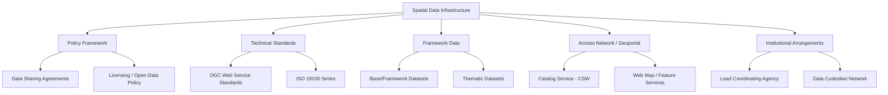
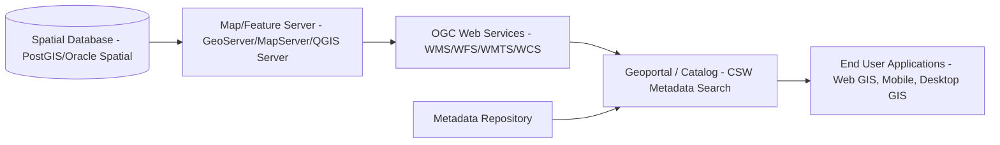
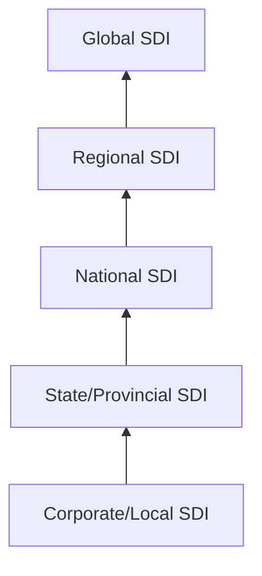

## Spatial Data Infrastructure Concepts

### Overview

A Spatial Data Infrastructure (SDI) is the coordinated framework of technologies, policies, institutional arrangements, and standards that enable the discovery, access, sharing, and use of geospatial data across organizations and jurisdictions. SDIs exist at multiple scales — local, national (e.g., a National Spatial Data Infrastructure/NSDI), regional, and global (e.g., GEOSS, INSPIRE) — and are designed to prevent duplicated data collection, promote interoperability, and support evidence-based decision-making in domains like environmental management, urban planning, and disaster response.

### Foundational Components

**Key Points**

- **Data**: The core geospatial datasets themselves (framework/base data such as elevation, hydrography, transportation, administrative boundaries, and thematic/domain-specific data).
- **Standards**: Technical specifications ensuring interoperability (OGC, ISO/TC 211).
- **Policies**: Governance frameworks defining data sharing rights, licensing, privacy, and custodianship responsibilities.
- **People/Institutions**: The organizational network of data producers, custodians, and users, often coordinated through a lead agency or council.
- **Access Network/Technology**: The technical infrastructure — geoportals, web services, catalogs — that delivers data to end users.

[Inference] Most SDI reference literature (e.g., Rajabifard & Williamson's SDI hierarchy model) treats these five components as interdependent; a weakness in institutional policy commonly undermines technically sound infrastructure, and vice versa.

### The SDI Component Model

### Standards Bodies and Governing Frameworks

#### Open Geospatial Consortium (OGC)

The OGC develops and maintains open, consensus-based standards for geospatial content and services. Core OGC standards relevant to SDI implementation include:

| Standard | Purpose |
| --- | --- |
| WMS (Web Map Service) | Serves georeferenced map images (raster) over HTTP |
| WFS (Web Feature Service) | Serves vector feature geometry and attributes, supports querying/editing |
| WCS (Web Coverage Service) | Serves raster/coverage data (e.g., satellite imagery, DEMs) with subsetting |
| CSW (Catalog Service for the Web) | Enables metadata discovery and search across distributed datasets |
| WMTS (Web Map Tile Service) | Serves pre-rendered cached map tiles for performance |
| GeoPackage | OGC standard container format (SQLite-based) for vector/raster data |
| SensorThings API | Standard for IoT/sensor observation data exchange |
| OGC API - Features | Modern, RESTful/JSON successor to WFS, aligned with OpenAPI |

#### ISO/TC 211

The ISO Technical Committee 211 develops the ISO 19100 series of geographic information standards, including:

- **ISO 19115**: Metadata standard for describing geospatial datasets.
- **ISO 19139**: XML schema implementation of ISO 19115 metadata.
- **ISO 19110**: Feature cataloguing methodology.
- **ISO 19157**: Data quality standards for spatial data.

[Inference] Many national SDI metadata profiles (e.g., FGDC's Content Standard for Digital Geospatial Metadata, or ISO-aligned profiles used in the EU) are built as localized extensions of ISO 19115 rather than fully independent schemas, though profile-specific details should be checked against each jurisdiction's published standard.

### Interoperability and Service Architecture

A typical SDI technical stack layers services to move from raw data storage to discoverable, consumable web services.

**Example**

A national environmental agency publishing a hydrography layer through an SDI would:

1. Store authoritative data in a spatial database (PostGIS).
2. Publish it via GeoServer as both WMS (for visualization) and WFS (for download/editing access).
3. Register descriptive metadata (ISO 19115/19139) in a catalog service (CSW).
4. Expose discovery through a public geoportal, allowing users to search, preview, and download the dataset.

### Metadata and Discovery

Metadata is the mechanism by which SDI users discover whether a relevant dataset exists, assess its fitness for use, and understand licensing terms before acquisition. A metadata record typically documents:

- **Identification information**: Title, abstract, keywords, spatial/temporal extent.
- **Data quality**: Lineage, positional accuracy, completeness (aligned with ISO 19157).
- **Distribution information**: Format, access constraints, service endpoints.
- **Reference system information**: Coordinate reference system (CRS) used.
- **Contact/custodianship information**: Responsible party for updates and corrections.

Catalog services implementing OGC CSW (or its modern successor, OGC API - Records) allow federated search across multiple institutional metadata repositories — a defining characteristic distinguishing an SDI from a single organization's internal GIS.

### Major SDI Implementations (Reference Examples)

**Key Points**

- **INSPIRE (EU)**: A directive-driven SDI across all EU member states, mandating harmonized data specifications across 34 spatial data themes (Annexes I, II, III), with legally binding interoperability requirements.
- **NSDI (USA)**: Coordinated by the Federal Geographic Data Committee (FGDC), built around the concept of "framework data" (geodetic control, orthoimagery, elevation, transportation, hydrography, boundaries, cadastral).
- **GEOSS (Global Earth Observation System of Systems)**: A voluntary global partnership integrating Earth observation data systems for climate, disaster, and ecosystem monitoring.
- **Australian/New Zealand SDI (ANZLIC framework)**: One of the earliest formalized national SDI governance models, influential in academic SDI hierarchy theory.

[Unverified] Specific current compliance status, thematic coverage completeness, or recent legislative amendments for any of the above should be verified against each program's official publications, as SDI governance evolves with policy cycles.

### SDI Maturity and Hierarchy Model

SDI theory commonly describes a hierarchical relationship where local/corporate SDIs feed into state/provincial SDIs, which feed into national SDIs, which in turn contribute to regional and global SDIs.

This "hierarchy of SDIs" model implies data flows and standards harmonization must be designed to function bidirectionally — local data must generalize upward, while national standards must be adoptable at local implementation scale.

### Licensing and Open Data Considerations

- **Open Licensing Frameworks**: Creative Commons (CC-BY, CC0), Open Government Licence (UK), and similar frameworks are commonly adopted to reduce legal friction in SDI data reuse.
- **FAIR Data Principles**: Findable, Accessible, Interoperable, Reusable — increasingly referenced in SDI policy design, particularly for research and environmental data infrastructures.
- **Data Custodianship vs. Ownership**: SDIs typically distinguish between the *custodian* (technical maintainer/publisher) and broader public or governmental *ownership*, which affects update responsibility and liability.

### Coordinate Reference System (CRS) Harmonization

A persistent technical challenge in SDI design is ensuring datasets from different custodians use consistent or well-documented CRSs, since mismatched CRS metadata is a leading cause of silent spatial misalignment errors. SDIs typically mandate:

- A defined national/regional standard CRS for framework data (e.g., ETRS89 in Europe, NAD83 in North America).
- Explicit CRS declaration in metadata and service capabilities documents (e.g., WMS `GetCapabilities` responses listing supported EPSG codes).
- On-the-fly reprojection support at the service layer (GeoServer, MapServer) to allow clients to request data in their preferred CRS.

### Environmental Science Relevance

**Example**

Environmental and earth science applications depend heavily on SDI principles for:

- **Cross-border environmental monitoring**: Watershed or airshed management requiring harmonized data from multiple national agencies (e.g., transboundary river basin authorities).
- **Climate data interoperability**: SensorThings API and WCS standards enabling integration of heterogeneous sensor networks and satellite-derived climate variables.
- **Disaster risk reduction**: SDIs like GEOSS aggregating flood, seismic, and land-cover datasets from multiple national sources into unified hazard assessment pipelines.
- **Biodiversity data sharing**: Infrastructures like GBIF (Global Biodiversity Information Facility) function as domain-specific SDIs, applying the same discovery/metadata/service principles to species occurrence data.

### Common Implementation Challenges

**Key Points**

- **Semantic Interoperability Gaps**: Even with matching technical formats, differing classification schemas (e.g., land-cover taxonomies) between custodians can prevent meaningful data integration.
- **Update Latency and Version Control**: Framework data (e.g., transportation networks) requires defined update cycles and versioning policy to remain authoritative.
- **Sustainability/Funding Governance**: [Inference] SDI initiatives that rely on project-based funding rather than institutionalized budget lines are frequently cited in the literature as being at higher risk of service discontinuation, though specific abandonment rates are program-dependent and not something to state as a fixed statistic.
- **Service Performance at Scale**: High-resolution WMS/WCS services for large-extent datasets require tile caching (WMTS) and CDN strategies to remain performant under concurrent access.

### Related Topics

- OGC Web Service Standards Deep Dive (WMS/WFS/WCS/OGC API - Features)
- ISO 19115/19139 Metadata Standard Implementation
- Geoportal Design and Catalog Service (CSW) Architecture
- Coordinate Reference Systems and On-the-Fly Reprojection
- INSPIRE Directive Data Specifications
- FAIR Data Principles in Environmental Data Management
- Federated Data Discovery and Cross-Agency Interoperability Patterns
- GeoServer/MapServer Service Publishing Architecture