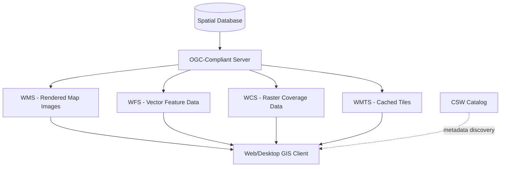

## OGC Standards and Interoperability


### Overview

The Open Geospatial Consortium (OGC) is an international, consensus-based standards organization that develops open, publicly available specifications for geospatial content, services, and data exchange. OGC standards enable interoperability across heterogeneous GIS software, allowing systems from different vendors to publish, discover, query, and exchange spatial data without proprietary lock-in. This domain covers the core OGC service specifications, encoding standards, and the architectural patterns used to compose interoperable geospatial systems.

### OGC Governance and Standards Process

OGC standards are developed through Working Groups composed of member organizations (government agencies, software vendors, academic institutions, and individual contributors). Standards progress through candidate specification, public comment, and formal adoption stages. Two parallel standards families exist:

- **Legacy XML-based standards**: WMS, WFS, WCS, CSW, SOS — mature, XML/SOAP or XML-over-HTTP based, dating largely from the early-to-mid 2000s.
- **Modern OGC API family**: OGC API - Features, OGC API - Coverages, OGC API - Tiles, OGC API - Records, OGC API - Processes — RESTful, JSON-first, OpenAPI-documented successors designed for web-native and developer-friendly integration.

[Inference] The OGC API family is generally positioned by the OGC as the long-term direction for new implementations, though legacy WMS/WFS remain widely deployed in production SDI systems and are not deprecated outright — adoption timelines vary significantly by organization and region.

### Core Service Standards

#### Web Map Service (WMS)

Serves rendered map images (PNG, JPEG, GIF) as raster output, generated server-side from vector or raster source data. WMS is designed for visualization, not analysis or editing.

**Key Operations**:

- `GetCapabilities`: Returns an XML document describing available layers, supported CRSs, and bounding boxes.
- `GetMap`: Returns a rendered map image for a specified layer, bounding box, CRS, size, and style.
- `GetFeatureInfo`: Returns attribute information for a queried pixel location (optional operation).

**Example** — typical `GetMap` request:



```
https://example.org/geoserver/wms?
  SERVICE=WMS&VERSION=1.3.0&REQUEST=GetMap
  &LAYERS=hydrography:rivers
  &BBOX=120.5,14.5,121.0,15.0
  &CRS=EPSG:4326
  &WIDTH=800&HEIGHT=600
  &FORMAT=image/png
```

#### Web Feature Service (WFS)

Serves vector feature data (geometry + attributes) encoded in GML (Geography Markup Language) or, in modern implementations, GeoJSON. Unlike WMS, WFS supports feature-level querying and, with WFS-Transactional (WFS-T), remote editing (insert/update/delete) of features.

**Key Operations**:

- `GetCapabilities`, `DescribeFeatureType` (returns the feature schema), `GetFeature` (returns queried feature data), and `Transaction` (for WFS-T editing).

#### Web Coverage Service (WCS)

Serves raster/coverage data (satellite imagery, digital elevation models, climate grids) with support for spatial, temporal, and range subsetting — allowing clients to request a specific extent, resolution, or band subset rather than downloading an entire dataset.

#### Web Map Tile Service (WMTS)

Serves pre-rendered, cached map tiles at fixed zoom levels and tile grid schemas, analogous to commercial slippy-map tile services. WMTS trades rendering flexibility for significantly higher performance and scalability compared to on-the-fly WMS rendering.

#### Catalog Service for the Web (CSW)

Provides standardized metadata search and discovery across federated data repositories, typically implementing ISO 19115/19139 metadata records queried via filter expressions (OGC Filter Encoding).

#### Sensor Observation Service (SOS) / SensorThings API

SOS (legacy) and SensorThings API (modern, REST/MQTT-based) standardize the exchange of sensor observation data — critical for environmental monitoring networks (weather stations, water quality sensors, air quality monitors) that stream time-series measurements tied to fixed or mobile spatial locations.

### Service Architecture Pattern



### Encoding Standards

**Key Points**

- **GML (Geography Markup Language)**: XML-based encoding for geographic features, the native format historically returned by WFS.
- **GeoJSON**: Lightweight JSON-based geometry/attribute encoding, the de facto standard for web and modern OGC API responses due to native JavaScript compatibility.
- **KML (Keyhole Markup Language)**: XML-based format for geographic visualization, notably used by Google Earth; an OGC standard since 2008.
- **GeoPackage**: SQLite-based container format for both vector and raster data, designed for offline/portable interoperability (see Mobile Geospatial App Development).
- **CityGML**: Specialized encoding for 3D city models, supporting semantic building/infrastructure representation for urban and BIM-GIS integration.
- **Filter Encoding (FES)**: Standardized XML/JSON syntax for expressing spatial and attribute query predicates across WFS, CSW, and other query-capable services.

### The Modern OGC API Family

The OGC API suite re-architects legacy services around REST principles, OpenAPI 3.0 documentation, and JSON as the primary encoding, improving accessibility for web developers unfamiliar with XML/SOAP-style GIS protocols.

| Legacy Standard | Modern OGC API Equivalent |
| --- | --- |
| WFS | OGC API - Features |
| WCS | OGC API - Coverages / OGC API - Maps |
| WMTS | OGC API - Tiles |
| CSW | OGC API - Records |
| WPS (Web Processing Service) | OGC API - Processes |

**Example** — an OGC API - Features request pattern (RESTful, resource-based, contrasted with WFS's parameterized query style):



```
GET https://example.org/api/collections/rivers/items?bbox=120.5,14.5,121.0,15.0&limit=50
```

Response: a GeoJSON `FeatureCollection`, paginated via `limit`/`offset` or link-based pagination — a notable interoperability improvement over WFS's typically single-response, non-paginated `GetFeature` pattern.

[Unverified] The precise feature-parity gap between a given legacy WFS deployment and its OGC API - Features equivalent depends on the specific server software version (GeoServer, pygeoapi, etc.) — implementers should consult the target server's current conformance documentation.

### Web Processing Service (WPS) and OGC API - Processes

WPS/OGC API - Processes standardize how geospatial *analysis* operations (not just data retrieval) are exposed as callable, discoverable web services — e.g., a buffer operation, a watershed delineation algorithm, or a raster classification model — with standardized input/output parameter description, enabling geoprocessing chains across distributed servers.

### Interoperability Testing and Compliance

- **OGC Compliance Testing Program (CITE)**: Provides automated test suites allowing vendors to validate that their service implementations conform to OGC specifications, awarding official "OGC Certified" status.
- **Conformance Classes**: Modern OGC API standards define modular conformance classes (e.g., "Core," "GeoJSON," "CRS by Reference"), allowing servers to implement subsets of functionality while remaining formally interoperable for that subset.

### Common Interoperability Pitfalls

**Key Points**

- **CRS Axis Order Ambiguity**: WMS 1.3.0 and WFS 2.0 adopted the EPSG-defined axis order (which for EPSG:4326 is latitude/longitude), diverging from the longitude/latitude order commonly assumed by earlier WMS 1.1.1 clients — a frequent source of silently flipped/misaligned map output.
- **Version Negotiation Mismatches**: Clients and servers supporting different standard versions (e.g., WFS 1.1.0 vs. 2.0.0) may silently fall back to unexpected schema behavior if version negotiation isn't explicitly handled.
- **Schema/Namespace Drift**: Custom or extended feature schemas served via WFS `DescribeFeatureType` can break generic clients expecting standard core schemas.
- **Coordinate Precision and Datum Mismatch**: Interoperability between servers using different underlying datums without explicit transformation pipelines can introduce systematic positional offsets.

### Environmental Science Application Context

**Example**

OGC standards underpin much of the technical interoperability required for cross-institutional environmental data sharing:

- **Climate/weather data exchange**: WCS and SensorThings API enabling integration of satellite-derived climate grids with ground station sensor networks.
- **Hydrological modeling**: WFS-T enabling collaborative editing of stream network and watershed boundary datasets across multiple agencies.
- **Protected area and biodiversity monitoring**: WMS/WFS combinations serving both cartographic context (protected area boundaries) and queryable species occurrence data through unified geoportals.
- **Disaster response coordination**: OGC API - Processes enabling on-demand flood or wildfire spread modeling as a callable service consumed by multiple emergency response systems.

### Related Topics

- Spatial Data Infrastructure Concepts (governance/policy layer built atop OGC standards)
- GeoServer and MapServer: Publishing OGC-Compliant Services
- GML vs. GeoJSON: Encoding Trade-offs for Interoperable Feature Data
- CRS Axis Order and Coordinate Transformation Pitfalls
- OGC API - Processes and Distributed Geoprocessing Architecture
- SensorThings API for Environmental IoT Networks
- ISO 19115/19139 Metadata Standards (used within CSW/OGC API - Records)