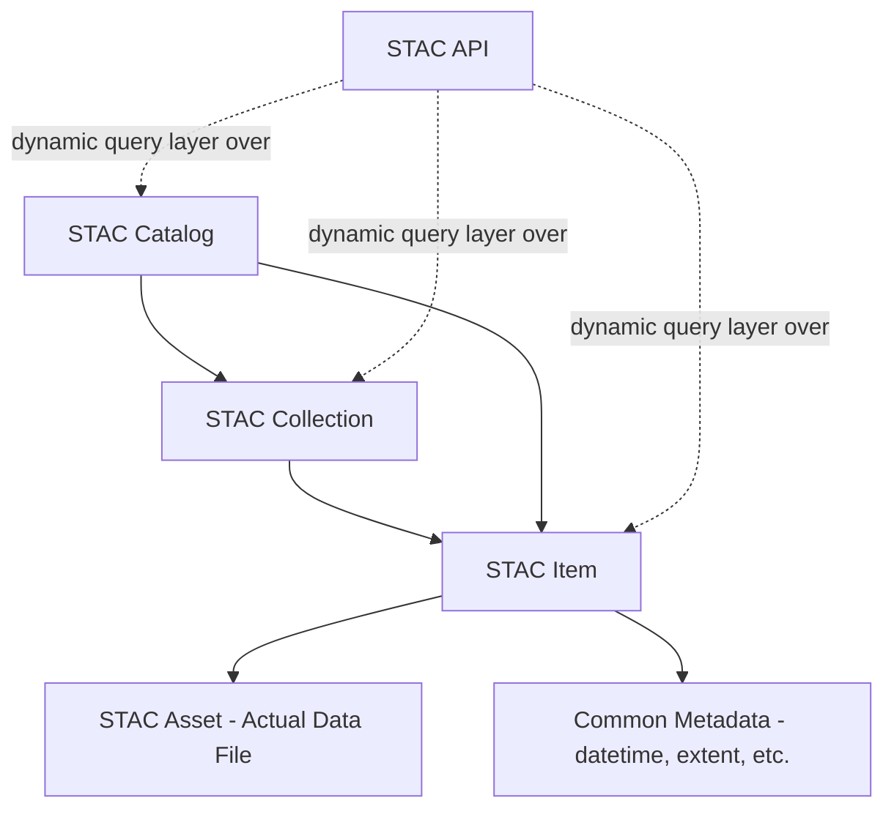
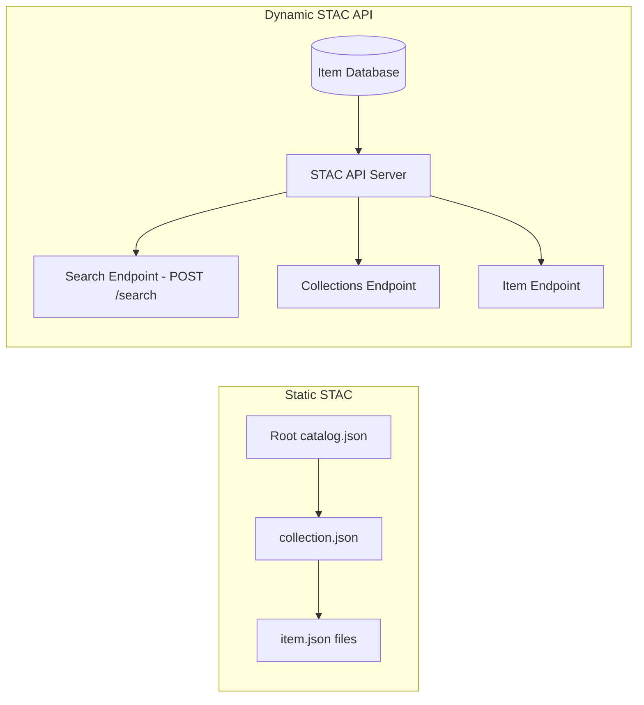
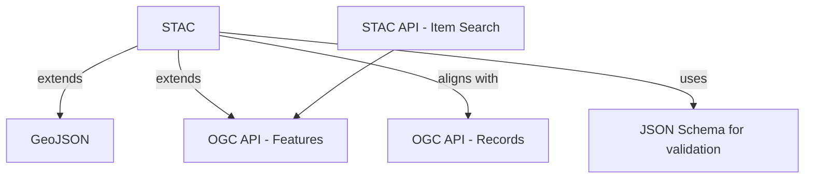
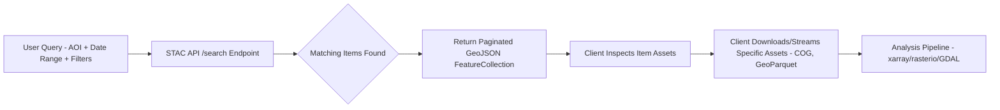

## SpatioTemporal Asset Catalog and Data Discovery


### Overview

The SpatioTemporal Asset Catalog (STAC) is a specification designed to standardize how geospatial asset metadata is structured, published, and queried, enabling Earth observation and other spatiotemporal data (satellite imagery, aerial/drone imagery, SAR, point clouds, LiDAR, DEMs, and derived products like NDVI composites) to be openly discoverable and crawlable across the web. STAC is intentionally designed with a minimal core and flexible extension mechanism to support a broad set of use cases, and provides a standard, well-designed format and API that data providers can adopt instead of building proprietary discovery systems. The core STAC specification is currently at version 1.1.0, the first stable release following the 1.0.0 milestone, and has also been formally adopted as an OGC Community Standard. [GitHub](https://github.com/fredliporace/stac-spec)[GitHub](https://github.com/radiantearth/stac-spec)

### Core STAC Component Model

There are three component specifications that together make up the core SpatioTemporal Asset Catalog specification, and each component can be used alone, but they work best in concert with one another. [Stacspec](https://stacspec.org/en/tutorials/intro-to-stac/)



**Key Points**

- **STAC Item**: The most important object in STAC — simply a GeoJSON Feature with a well-defined set of additional attributes ("foreign members"). Represents a single spatiotemporal asset (e.g., one satellite scene) as a searchable GeoJSON record. [GitHub](https://github.com/radiantearth/stac-spec)
- **STAC Catalog**: Provides structural elements to group Items and Collections into a browsable hierarchy, primarily for discoverability rather than rich metadata. [GitHub](https://github.com/radiantearth/stac-spec)
- **STAC Collection**: Collections are catalogs that add more required metadata and describe a group of related Items — for example, all scenes from a specific satellite mission or sensor. [Ogc](https://docs.ogc.org/cs/25-004/25-004.html)
- **STAC Asset**: A link within an Item pointing to the actual underlying data file (a COG/Cloud Optimized GeoTIFF, a GeoParquet file, a thumbnail, etc.) — the STAC Item itself is metadata that references, but does not contain, the raw data.

### Static Catalogs vs. Dynamic STAC APIs

A STAC catalog can be implemented in a completely "static" manner as a group of hyperlinked Catalog, Collection, and Item URLs, enabling data publishers to expose their data as a browsable set of files. If more complex query abilities are desired, such as spatial or temporal predicates, the STAC API specification can be implemented as a web service interface to query over a group of STAC objects, usually held in a database. [GitHub](https://github.com/radiantearth/stac-spec)



[Inference] Static catalogs are generally favored for smaller, less frequently updated datasets that benefit from simple, serverless hosting (e.g., on object storage), while dynamic STAC APIs are favored for large, frequently updated Earth observation archives requiring complex spatial/temporal/property filtering — though the choice ultimately depends on the specific provider's scale and update cadence.

### STAC API Specification

A STAC API is a dynamic version of a SpatioTemporal Asset Catalog, defining three foundation specifications — STAC API - Core, STAC API - Features, and STAC API - Item Search. The API can be implemented in compliance with the OGC API - Features standard, where STAC API can be thought of as a specialized Features API to search STAC catalogs, with the returned features being STAC Item objects that have common properties, links to their assets, and geometries representing the footprints of the geospatial assets. [GitHub](https://github.com/radiantearth/stac-api-spec)[GitHub](https://github.com/radiantearth/stac-api-spec)

The STAC API extends the OGC API - Features - Part 1: Core with additional web service endpoints and object attributes, meaning any OGC API - Features compliant client has a baseline level of compatibility with a STAC API. [GitHub](https://github.com/radiantearth/stac-spec)

#### Core STAC API Endpoints

| Endpoint | Purpose |
| --- | --- |
| `GET /` | Landing page — links to conformance, collections, search |
| `GET /conformance` | Lists which conformance classes the server implements |
| `GET /collections` | Lists available STAC Collections |
| `GET /collections/{collectionId}` | Returns a single Collection's metadata |
| `GET /collections/{collectionId}/items` | Lists Items within a Collection (OGC API - Features style) |
| `GET/POST /search` | Cross-collection item search with spatial/temporal/property filters |

**Example** — a typical STAC API search request (POST body):

```json
{
  "collections": ["sentinel-2-l2a"],
  "bbox": [120.5, 14.5, 121.0, 15.0],
  "datetime": "2026-01-01T00:00:00Z/2026-03-01T00:00:00Z",
  "query": {
    "eo:cloud_cover": { "lt": 20 }
  },
  "limit": 50
}
```

This queries a Sentinel-2 Level-2A collection within a bounding box, a date range, and a cloud-cover property filter, illustrating how STAC combines spatial, temporal, and arbitrary metadata predicates in a single query.

### STAC Item Structure

A STAC Item is a GeoJSON Feature extended with STAC-specific top-level fields:

```json
{
  "type": "Feature",
  "stac_version": "1.1.0",
  "id": "S2A_MSIL2A_20260115",
  "geometry": { "type": "Polygon", "coordinates": [...] },
  "bbox": [120.5, 14.5, 121.0, 15.0],
  "properties": {
    "datetime": "2026-01-15T02:30:00Z",
    "eo:cloud_cover": 8.2
  },
  "assets": {
    "B04": { "href": "https://.../B04.tif", "type": "image/tiff; application=geotiff; profile=cloud-optimized" },
    "thumbnail": { "href": "https://.../thumb.jpg", "type": "image/jpeg" }
  },
  "links": [
    { "rel": "collection", "href": "./collection.json" },
    { "rel": "parent", "href": "./catalog.json" }
  ],
  "collection": "sentinel-2-l2a"
}
```

**Key Points**

- `properties.datetime` is the mandatory core temporal field; extensions add domain-specific properties (e.g., `eo:cloud_cover`, `sar:instrument_mode`).
- `assets` maps logical band/file names to their actual href locations and MIME types.
- `links` establishes the hierarchical relationship (`parent`, `collection`, `root`, `self`) enabling static catalog crawling.

### The STAC Extension Ecosystem

Extensions describe how STAC can extend the functionality of the core spec or add fields for specific domains, and can be published anywhere, although the preferred location for public extensions is in the GitHub stac-extensions organization. Notable widely-used extensions include: [GitHub](https://github.com/fredliporace/stac-spec)

- **EO (Electro-Optical)**: Adds `eo:bands`, `eo:cloud_cover` for optical imagery.
- **SAR**: Adds radar-specific properties (polarization, instrument mode, looks).
- **Projection (proj)**: Adds native CRS/EPSG code and transform information for an asset.
- **Raster**: Adds per-band statistics and data type information (superseded/unified with `eo:bands` as of the 1.1.0 common band construct).
- **Point Cloud**: Adds LiDAR/point cloud specific density and schema properties.
- **Label**: Adds machine learning training label metadata, supporting STAC's use as an ML training dataset catalog (see also the related "STAC for ML" community pattern).

Version 1.1.0 added a common band construct to unify eo:bands and raster:bands, made Item Asset Definitions part of the core specification, made various additional fields available via the common metadata mechanism, and integrated some alignment with OGC API - Records. [github](https://github.com/radiantearth/stac-spec/releases)

### Relationship to OGC Standards

STAC is deliberately built to reuse and extend existing OGC and web standards rather than reinventing them:



Every part of STAC is JSON, and GeoJSON provides the core geometry fields and features definition; all fields are described in the specifications, with acceptable values defined via JSON Schema, and the released JSON Schemas provide the core testing definitions used in an array of validation tools. [Ogc](https://docs.ogc.org/cs/25-004/25-004.html)

### Data Discovery Workflow



**Example**

A common environmental science workflow using STAC:

1. Query a public STAC API (e.g., Microsoft Planetary Computer, Element84 Earth Search) for Sentinel-2 imagery over a watershed boundary, filtered by date range and cloud cover.
2. Retrieve matching STAC Items as a paginated GeoJSON response.
3. Use the `assets` links to stream only the required spectral bands (via Cloud Optimized GeoTIFF range requests) rather than downloading full scenes.
4. Feed the resulting arrays into an analysis pipeline (e.g., computing NDVI time series) using libraries like `pystac-client`, `stackstac`, or `odc-stac`.

### Common Tooling Ecosystem

**Key Points**

- **PySTAC**: Python library for reading, creating, and manipulating static STAC Catalogs/Collections/Items.
- **pystac-client**: Python client for querying STAC API `/search` endpoints, commonly paired with `stackstac` or `odc-stac` to lazily load matched assets into `xarray`/Dask-backed arrays.
- **stac-fastapi**: A reference/production-grade STAC API server implementation built on FastAPI, commonly backed by PostgreSQL/PostGIS (via the `stac-fastapi-pgstac` backend).
- **STAC Browser**: A generic web UI for browsing and visually exploring any static or dynamic STAC catalog.
- **STAC Validator**: JSON Schema-based validation tooling ensuring Catalogs/Collections/Items conform to the core spec and declared extensions.

[Unverified] Specific current feature support, hosted dataset catalogs, and API conformance levels for any named public STAC API provider (e.g., Microsoft Planetary Computer, Element84 Earth Search, AWS Open Data STAC endpoints) should be checked against that provider's live documentation, as hosted catalogs and available collections change frequently.

### STAC vs. Traditional OGC Catalog Services (CSW)

| Aspect | CSW (Catalog Service for the Web) | STAC |
| --- | --- | --- |
| Encoding | XML (ISO 19115/19139) | JSON/GeoJSON |
| Primary Domain | General geospatial metadata discovery | Spatiotemporal Earth observation assets |
| Query Style | XML Filter Encoding | JSON body / query params, OGC API - Features aligned |
| Static Hosting Support | Limited | Native (hyperlinked static catalog pattern) |
| Adoption Context | Legacy SDI/geoportal infrastructure | Modern cloud-native EO data platforms |

[Inference] STAC has become the dominant discovery standard specifically within the cloud-native Earth observation and remote sensing community, largely because its JSON-native, REST-aligned design integrates more directly with modern data science and cloud object storage workflows than XML-based CSW, though CSW remains prevalent in broader multi-domain SDI/geoportal contexts (see Spatial Data Infrastructure Concepts).

### Environmental Science Application Context

**Example**

STAC-based discovery is now foundational to several environmental monitoring workflows:

- **Deforestation and land-cover change detection**: Querying multi-temporal Sentinel-2/Landsat STAC collections to build cloud-free composite time series for change detection algorithms.
- **Agricultural monitoring**: Filtering STAC Items by `eo:cloud_cover` and phenological date ranges to build crop-growth NDVI/EVI time series.
- **Disaster response**: Rapidly querying newly published SAR or optical STAC Items (e.g., post-flood or post-earthquake acquisitions) via `datetime` and `bbox` filters to identify the most recent usable imagery over an affected area.
- **Machine learning training data catalogs**: Using the Label extension to catalog annotated training datasets (e.g., building footprints, burn scars) alongside their source imagery for reproducible ML pipeline construction.

### Related Topics

- OGC Standards and Interoperability (OGC API - Features foundation underlying STAC API)
- Cloud Optimized GeoTIFF (COG) and GeoParquet as STAC Asset Formats
- Spatial Data Infrastructure Concepts (broader governance/discovery context)
- pystac-client and stackstac: Python-Based STAC Analysis Pipelines
- STAC Extensions Deep Dive (EO, SAR, Point Cloud, Label)
- Cloud-Native Geospatial Data Formats and Access Patterns
- Building a STAC API Server with stac-fastapi and PgSTAC