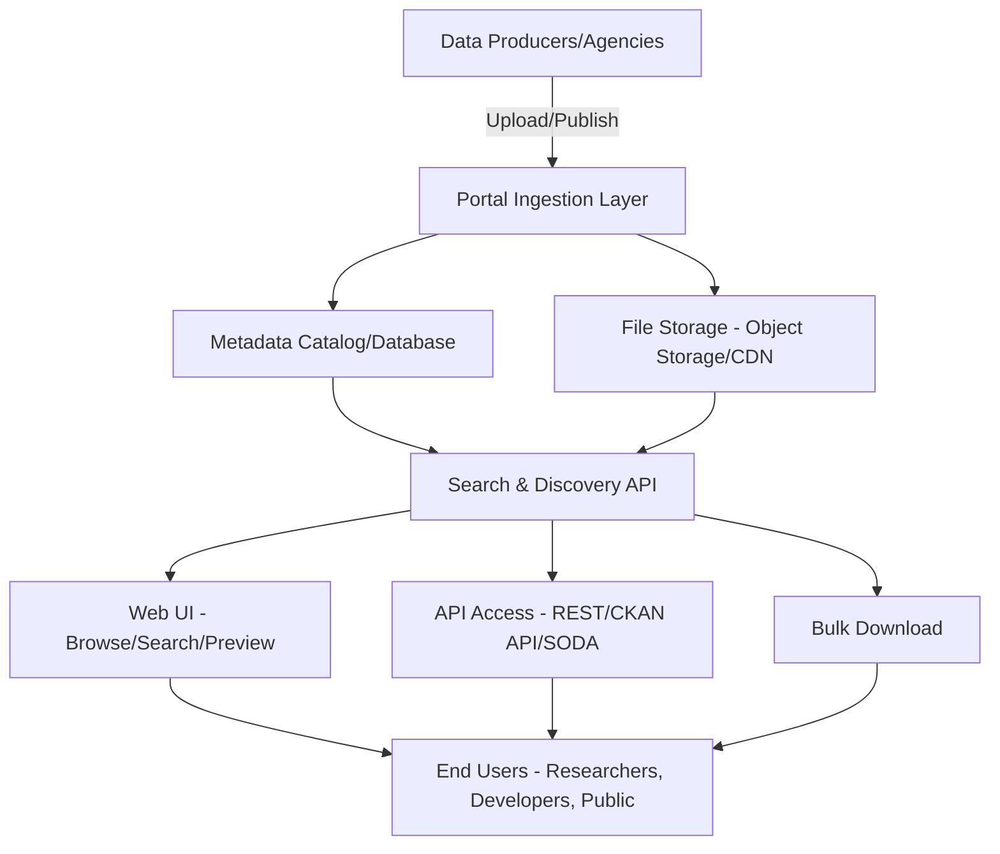
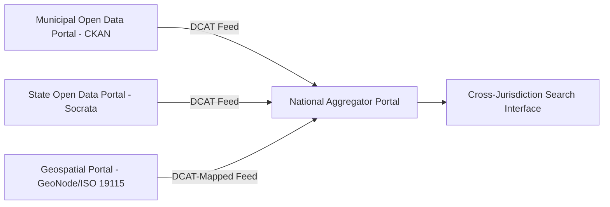

## Open Data Policies and Portals


### Overview

Open Data Policies and Portals encompass the governance frameworks, licensing structures, and technical platforms that enable geospatial and environmental data to be published, discovered, and reused by the public, researchers, and downstream applications with minimal legal and technical friction. Where Spatial Data Infrastructure concepts address the broader institutional and technical architecture of data sharing, this domain focuses specifically on the *policy instruments* (licenses, legislation, open data principles) and the *portal software* (CKAN, Socrata, ArcGIS Open Data, GeoNode) that operationalize open access to geospatial datasets.

### Core Open Data Principles

**Key Points**

- **The Open Definition**: Data is "open" if anyone can freely access, use, modify, and share it for any purpose, subject at most to requirements that preserve provenance and openness (attribution and share-alike).
- **Eight Principles of Open Government Data** (originating from the 2007 Sebastopol meeting): Data should be Complete, Primary (collected at the source, not aggregated), Timely, Accessible, Machine-processable, Non-discriminatory (no registration required), Non-proprietary (no exclusive format lock-in), and License-free (or openly licensed).
- **FAIR Principles**: Findable, Accessible, Interoperable, Reusable — increasingly referenced alongside "open" in research and environmental data contexts, emphasizing that data should be well-described and interoperable even where full public openness isn't appropriate.
- **Open by Default**: A policy stance (adopted by several national/municipal governments) asserting that government-collected data should be published openly unless a specific legal, privacy, or security justification requires restriction — inverting the traditional default of closed access.

### Licensing Frameworks

Licensing is the legal mechanism that converts a published dataset into genuinely reusable open data; without an explicit license, default copyright/database-right protections in many jurisdictions leave reuse legally ambiguous even when data is technically accessible.

| License Family | Key Characteristics |
| --- | --- |
| **Creative Commons (CC0, CC-BY, CC-BY-SA)** | CC0 = public domain dedication (no conditions); CC-BY requires attribution; CC-BY-SA requires attribution + share-alike for derivatives |
| **Open Data Commons (ODC-PDDL, ODC-BY, ODbL)** | Purpose-built for databases specifically (distinct from creative works); ODbL requires share-alike for derived databases |
| **Open Government Licence (OGL)** | Used by UK and some Commonwealth governments; permits copying, adapting, and commercial use with attribution |
| **Government Open Data License variants** | Many national/municipal governments publish custom open licenses closely modeled on CC-BY terms |

[Inference] CC0 and public-domain dedications are generally preferred for maximizing downstream reuse and interoperability across jurisdictions, since attribution-stacking becomes complex when a derived dataset combines many attribution-required sources — though the appropriate license ultimately depends on the publishing institution's specific policy goals and legal context.

### Open Data Portal Architecture



**Key Points**

- **Ingestion Layer**: Handles dataset upload, format validation, and often automated metadata extraction (e.g., reading CRS/extent from a shapefile or GeoTIFF at upload time).
- **Metadata Catalog**: Stores structured, searchable descriptions of each dataset (title, description, tags, license, update frequency, spatial/temporal extent).
- **API Layer**: Exposes programmatic access so datasets can be consumed by applications rather than only downloaded manually — critical for reproducible research and application integration.
- **Preview/Visualization Layer**: Many modern portals render an inline map preview or table preview before download, improving dataset evaluability.

### Major Open Data Portal Platforms

#### CKAN (Comprehensive Knowledge Archive Network)

An open-source data portal platform widely adopted by national and municipal governments (e.g., data.gov, data.gov.uk historically, many EU national portals). Built on Python/Pylons-Flask with a PostgreSQL backend and Solr for search indexing. Provides a REST API (`CKAN Action API`) for programmatic dataset publishing and retrieval, and supports a plugin/extension architecture (including geospatial-specific extensions like `ckanext-spatial` for spatial search and WMS preview).

#### Socrata / Tyler Data & Insights

A commercial open data platform (now part of Tyler Technologies) widely used by US city and state governments, offering the **SODA (Socrata Open Data API)** for programmatic querying with SQL-like filtering, and built-in visualization/dashboard tools.

#### ArcGIS Open Data / ArcGIS Hub

Esri's open data offering, allowing organizations already using ArcGIS Online/Enterprise to expose designated feature layers as public open datasets with minimal additional publishing effort, automatically generating downloadable formats (Shapefile, CSV, GeoJSON, KML) from a single authoritative feature service.

#### GeoNode

An open-source geospatial content management platform combining a spatial data catalog, map viewer/editor, and OGC-compliant service publishing (WMS/WFS via GeoServer) — commonly used for environmental and humanitarian data portals due to its geospatial-first design (versus general-purpose portals like CKAN, which treat spatial data as one dataset type among many).

#### GeoServer / GeoNetwork Combination

A common pattern for dedicated geospatial open data infrastructure pairs GeoNetwork (metadata catalog implementing ISO 19115/CSW) with GeoServer (OGC service publishing), often fronted by a custom or GeoNode-based discovery UI.

### Programmatic Access Patterns

**Example**

CKAN Action API dataset search request:



```
GET https://data.example.gov/api/3/action/package_search?q=watershed+boundary&fq=res_format:GeoJSON
```

Socrata SODA API filtered query:



```
GET https://data.example.gov/resource/xyz1-abcd.json?$where=within_circle(location,14.6,121.0,5000)
```

ArcGIS Hub/Open Data feature layer query (via the underlying ArcGIS REST API):



```
GET https://services.arcgis.com/{org}/arcgis/rest/services/watersheds/FeatureServer/0/query?
  where=1=1&outFields=*&f=geojson
```

These patterns illustrate a common convention: most modern open data portals expose both a human-browsable web UI and a machine-queryable REST endpoint returning structured formats (JSON, GeoJSON, CSV) suitable for direct ingestion into analysis pipelines.

### Governance and Institutional Policy Frameworks

**Key Points**

- **Legislative Mandates**: Some jurisdictions codify open data obligations in law (e.g., the EU's Open Data Directive, formally Directive (EU) 2019/1024, which builds on and recasts the earlier PSI Directive governing reuse of public sector information).
- **Executive/Administrative Policy**: Other jurisdictions implement open data through executive orders or administrative policy rather than binding legislation, which [Inference] generally provides more implementation flexibility but weaker long-term durability across changes in political administration compared to legislated mandates.
- **High-Value Dataset Designations**: Many open data frameworks identify priority "high-value" dataset categories (e.g., geospatial reference data, earth observation, environment, meteorological data) warranting particular publication priority — the EU's Open Data Directive explicitly designates six high-value dataset categories including geospatial and earth observation/environment data.
- **Data Sharing Agreements**: For sensitive or partially restricted datasets, formal inter-agency agreements govern terms of use, often layered beneath a public-facing open data policy for a subset of released data.

### Metadata Standards Within Open Data Portals

Open data portals commonly adopt or map to established metadata schemas to ensure discoverability and interoperability:

- **DCAT (Data Catalog Vocabulary)**: A W3C RDF-based vocabulary widely used as the interoperability layer between open data portals, enabling cross-portal harvesting (a portal can expose a DCAT feed that other catalogs or federal-level aggregator portals ingest).
- **DCAT-US / DCAT-AP (EU)**: Regional/national profiles of DCAT tailored to specific government metadata requirements.
- **ISO 19115/19139**: Used where the portal is geospatially focused (see Spatial Data Infrastructure Concepts and OGC Standards and Interoperability), often alongside or mapped to DCAT for dual compliance.



### Data Quality, Maintenance, and Sustainability Challenges

**Key Points**

- **Dataset Staleness**: A commonly cited weakness of open data portals is inconsistent update frequency — published datasets can silently become outdated if the underlying publishing agency lacks a mandated refresh cycle.
- **Format Fragmentation**: Datasets published in inconsistent or outdated formats (e.g., legacy Shapefile-only exports without a modern GeoJSON/GeoParquet option) increase reuse friction.
- **Broken Link Rot**: Portal reorganizations or platform migrations can invalidate previously published API endpoints and direct download URLs, undermining reproducibility of research that cites specific dataset URLs.
- **Institutional Capacity**: [Inference] Sustained open data quality is frequently linked in practitioner literature to whether an agency has dedicated data stewardship staff and budget rather than only a one-time publication mandate, though the degree of this dependency varies by program and is difficult to state as a universal rule.

### Environmental Science Application Context

**Example**

Open data portals and policies are foundational infrastructure for numerous environmental science workflows:

- **National environmental agencies** publish air quality monitoring station data, water quality records, and protected area boundaries through open portals (often CKAN or Socrata-based), enabling public accountability and third-party analysis.
- **Earth observation open data**: Programs like Copernicus (EU) and Landsat (USGS/NASA) operate dedicated open data policies with STAC-based or portal-based discovery (see SpatioTemporal Asset Catalog and Data Discovery), removing licensing cost as a barrier to large-scale environmental monitoring research.
- **Citizen science and NGO integration**: Open licensing (particularly CC0/CC-BY) allows citizen science platforms and conservation NGOs to legally combine government-published reference data (administrative boundaries, hydrography) with crowd-sourced observation data in unified analyses.
- **Climate policy transparency**: Open publication of greenhouse gas inventory and emissions data, often under high-value dataset mandates, supports independent verification and academic climate research.

### Related Topics

- Spatial Data Infrastructure Concepts (institutional/technical framework underlying open data portals)
- DCAT and Cross-Portal Metadata Harvesting
- SpatioTemporal Asset Catalog and Data Discovery (domain-specific EO open data discovery pattern)
- CKAN Platform Architecture and Extension Development
- Open Government Data Legislation Comparative Frameworks (EU Open Data Directive, national equivalents)
- Data Licensing Selection for Geospatial Datasets (CC0 vs. CC-BY vs. ODbL)
- Reproducibility and Persistent Identifiers (DOIs) for Open Datasets