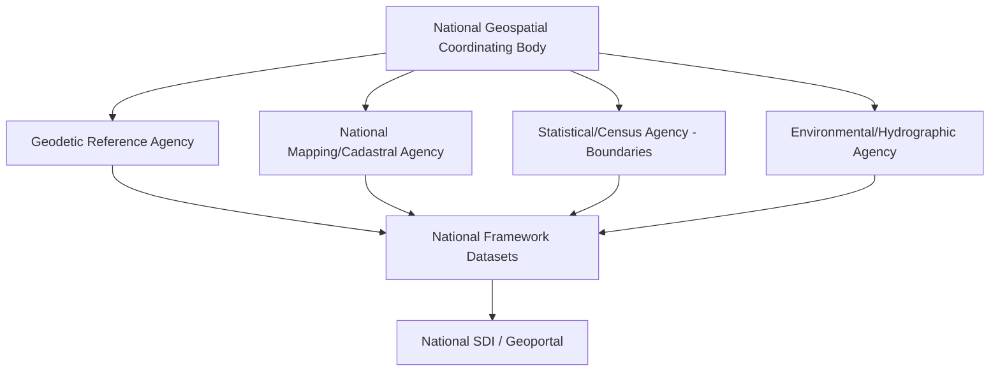
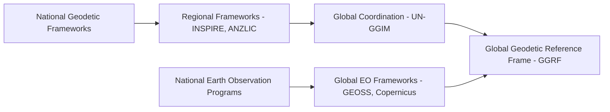

## National and Global Geospatial Frameworks

### Overview

National and Global Geospatial Frameworks are the formalized systems of authoritative reference data, governance structures, and coordination mechanisms that establish a common geospatial foundation within a country or across international boundaries. These frameworks define the standardized "framework data themes" (geodetic control, administrative boundaries, elevation, hydrography, transportation) that all other geospatial applications build upon, and they operationalize the institutional layer of a Spatial Data Infrastructure at national and multinational scale. This domain covers the major reference frameworks, their governing bodies, and the technical/geodetic underpinnings that ensure spatial consistency across jurisdictions.

### The Concept of Framework Data

**Key Points**

- **Framework Data**: A defined set of foundational geospatial datasets considered authoritative reference layers for a jurisdiction, typically including geodetic control, orthoimagery, elevation, hydrography, transportation, governmental units/administrative boundaries, and cadastral (land parcel) information.
- **Fit-for-Purpose Principle**: Framework data is intended to be collected once, to an authoritative standard, and reused across many applications, avoiding costly duplication of base data collection by individual agencies.
- **Custodianship Model**: Each framework data theme typically has a designated lead/custodian agency responsible for maintenance, accuracy standards, and update cycles (e.g., a national mapping agency for topographic base data, a geodetic survey agency for control points).

### National Geospatial Framework Governance Models

#### United States: National Spatial Data Infrastructure (NSDI)

Coordinated by the Federal Geographic Data Committee (FGDC), an interagency committee established to promote coordinated development, use, sharing, and dissemination of geospatial data nationally. The NSDI framework defines seven core framework data themes: geodetic control, orthoimagery, elevation/bathymetry, transportation, hydrography, governmental unit boundaries, and cadastral data. The FGDC maintains the Content Standard for Digital Geospatial Metadata (CSDGM) and increasingly promotes ISO 19115-aligned profiles for metadata interoperability.

#### European Union: INSPIRE Directive

A legally binding directive (Directive 2007/2/EC) establishing an infrastructure for spatial information across all EU member states, structured around 34 spatial data themes organized into three annexes (Annex I: reference data like coordinate systems and administrative units; Annex II: elevation, geology, land cover; Annex III: environmental, statistical, and thematic data). Unlike voluntary coordination frameworks, INSPIRE imposes binding technical interoperability requirements and implementation deadlines on member states.

#### Australia/New Zealand: ANZLIC Framework

The Australia New Zealand Land Information Council coordinates a foundational spatial data framework historically influential in academic SDI hierarchy theory, emphasizing a layered model where local/state datasets feed upward into nationally harmonized framework datasets.

#### Other National Models

[Unverified] Specific current governance structures, lead agencies, and framework theme definitions for jurisdictions beyond those above vary significantly and should be verified against each country's official national mapping/statistics agency publications, as institutional arrangements are periodically restructured.

### Geodetic Reference Frameworks

A geodetic reference framework provides the mathematical and physical foundation ensuring all coordinates within a jurisdiction are consistently defined — without this, framework data from different custodians cannot be reliably overlaid.

**Key Points**

- **Terrestrial Reference Frames**: Global frameworks like ITRF (International Terrestrial Reference Frame) provide the highest-precision global geodetic foundation, realized through continuously tracked geodetic stations (GNSS, VLBI, SLR).
- **Regional/National Realizations**: Most countries adopt a national or regional realization tied to a global frame — e.g., NAD83 (North America, aligned to ITRF at a reference epoch), ETRS89 (Europe, effectively fixed to the stable Eurasian tectonic plate to avoid continuous coordinate drift), GDA2020 (Australia).
- **Plate Motion and Epoch Drift**: [Inference] Regions on tectonically active plates generally require either a dynamic datum (coordinates tied to a specific epoch, requiring periodic realignment) or a plate-fixed regional frame (like ETRS89) to prevent coordinates from drifting relative to fixed infrastructure over time — the specific approach adopted depends on each region's tectonic setting and national geodetic policy.
- **Vertical Datums**: Separate from horizontal reference frames, vertical datums (e.g., NAVD88 in the US, EVRS in Europe) define elevation relative to a specified geoid or mean sea level model, critical for hydrography, flood modeling, and elevation framework data.

### Global Geospatial Coordination Frameworks

#### UN-GGIM (United Nations Committee of Experts on Global Geospatial Information Management)

The principal global intergovernmental mechanism coordinating geospatial information management, promoting the development of national geospatial information management frameworks, and working toward global geodetic reference frame coordination through its Global Geodetic Reference Frame (GGRF) initiative — recognizing that a consistent global geodetic reference is foundational infrastructure for cross-border data integration, disaster response, and sustainable development monitoring.

#### GEOSS (Global Earth Observation System of Systems)

A voluntary partnership coordinated through the Group on Earth Observations (GEO), integrating Earth observation data systems from many countries and space agencies into a common discovery and access infrastructure, focused on societal benefit areas including climate, disaster risk reduction, biodiversity, and water resource management.

#### Copernicus Programme (EU)

The European Union's Earth observation programme, combining the Sentinel satellite constellation with a network of in-situ and modeled data services (atmosphere, marine, land, climate, emergency, security monitoring services), operated under an open and free data policy that has become a major global source of environmental monitoring data.

### Framework Data Theme Comparison

| Theme | US NSDI | INSPIRE (EU) Annex |
| --- | --- | --- |
| Geodetic Control | Core theme | Annex I - Coordinate Reference Systems |
| Administrative/Governmental Boundaries | Core theme | Annex I - Administrative Units |
| Elevation | Core theme | Annex II - Elevation |
| Hydrography | Core theme | Annex I - Hydrography |
| Transportation | Core theme | Annex I - Transport Networks |
| Cadastral/Land Parcels | Core theme | Annex I - Cadastral Parcels |
| Land Cover | Thematic (non-core) | Annex II - Land Cover |
| Environmental Monitoring Facilities | Thematic (non-core) | Annex III |

[Inference] The general pattern across most mature national frameworks is that a smaller "core" set of highly authoritative reference themes (geodesy, boundaries, elevation) is distinguished from a larger set of thematic/domain datasets built atop that core — though the precise theme count, naming, and categorization differ by framework and should be confirmed against each program's current official documentation.

### Technical Interoperability Requirements for Framework Data

- **Standardized CRS Declaration**: Framework datasets must explicitly declare their reference CRS in metadata and service capabilities (see OGC Standards and Interoperability), typically the national standard CRS rather than an arbitrary local projection.
- **Positional Accuracy Standards**: Frameworks typically define minimum accuracy classes (e.g., accuracy tiers for different mapping scales) that custodian agencies must meet and document per dataset.
- **Update/Currency Policies**: Framework themes with high volatility (transportation networks, administrative boundaries after redistricting) require defined maintenance cycles to remain authoritative reference data.
- **Harmonized Feature Catalogs**: Especially under INSPIRE, data specifications define standardized feature types, attributes, and code lists per theme, ensuring semantic (not just geometric) interoperability across member states.

### Common Implementation Challenges

**Key Points**

- **Cross-Border Harmonization**: Adjoining jurisdictions using different national datums, classification schemas, or update cycles can produce visible discontinuities at borders — a persistent challenge for transboundary environmental management (shared watersheds, migratory habitat corridors).
- **Legacy Datum Transition**: Countries transitioning between geodetic reference realizations (e.g., older regional datums to modern ITRF-aligned frames) face long multi-decade periods where legacy and modern coordinate data coexist, requiring careful transformation pipeline management.
- **Framework Data Funding Sustainability**: [Inference] Framework data programs requiring continuous high-cost maintenance (e.g., orthoimagery refresh cycles, geodetic network resurveying) are frequently cited as vulnerable to budget-driven update lapses, though the degree of risk is program- and jurisdiction-specific rather than a fixed pattern.
- **Institutional Coordination Overhead**: Multi-agency custodianship models require sustained inter-agency governance (committees, MOUs) to prevent framework themes from diverging in classification or update practice over time.

### Environmental Science Relevance

**Example**

National and global geospatial frameworks underpin critical environmental science infrastructure:

- **Transboundary watershed management**: Requires harmonized hydrography framework data and consistent geodetic reference across all riparian nations to support unified flood and water-quality modeling.
- **Global climate monitoring**: GEOSS and Copernicus provide the coordinated Earth observation backbone enabling consistent global climate variable tracking (sea surface temperature, vegetation indices, ice extent) across national boundaries.
- **Disaster risk reduction**: UN-GGIM's coordination work on the Global Geodetic Reference Frame directly supports the positional consistency needed for cross-border disaster response mapping (e.g., a flood or earthquake affecting multiple countries requires spatially consistent damage assessment).
- **Protected area and biodiversity corridor mapping**: Relies on harmonized administrative boundary and land-cover framework themes to accurately delineate and monitor ecological corridors crossing jurisdictional lines.

### Related Topics

- Spatial Data Infrastructure Concepts (institutional/technical SDI model underlying national frameworks)
- OGC Standards and Interoperability (technical service layer for framework data publishing)
- Geodetic Reference Systems and Datum Transformation
- INSPIRE Directive Data Specifications Deep Dive
- UN-GGIM and the Global Geodetic Reference Frame (GGRF) Initiative
- Copernicus Programme Architecture and Sentinel Data Access
- Cross-Border Environmental Data Harmonization Case Studies