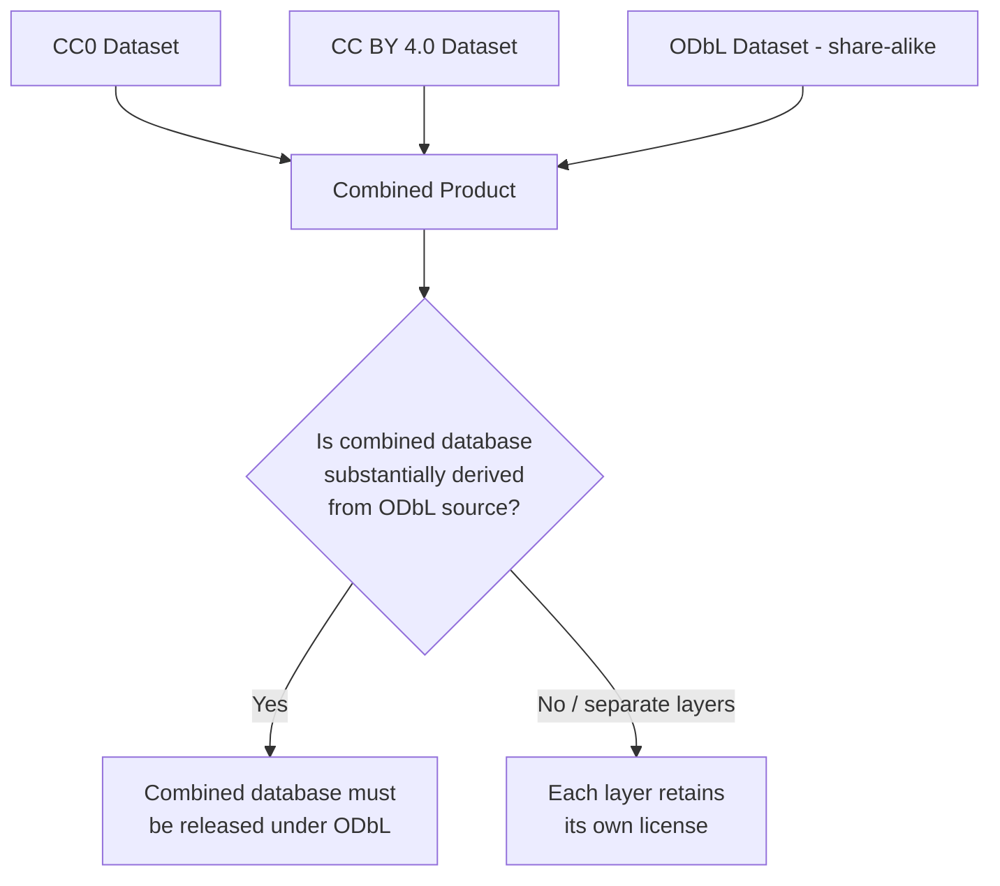
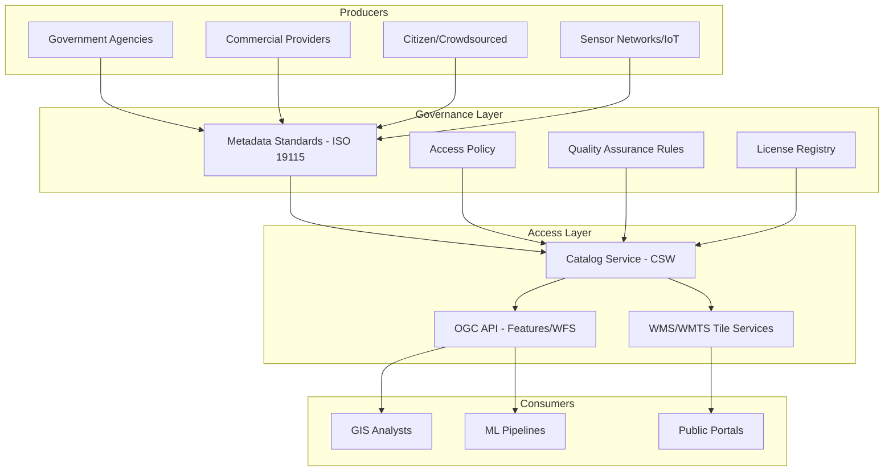

## Data Sharing, Licensing, and Governance


### Overview

Data sharing, licensing, and governance encompass the legal, technical, and organizational frameworks that determine how geospatial data is published, accessed, reused, and maintained across institutional and jurisdictional boundaries. As geospatial datasets increasingly combine multiple sources—government open data, commercial satellite imagery, crowdsourced contributions, and IoT sensor streams—establishing clear rights, responsibilities, and quality assurance mechanisms becomes essential to interoperability, legal compliance, and long-term data sustainability.

**Key Points**

- Licensing determines *legal* permissions for use, modification, and redistribution; governance determines *organizational* processes for data quality, access control, and lifecycle management.
- Geospatial data sharing typically operates through Spatial Data Infrastructures (SDIs) that combine standards (OGC, ISO), catalogs, and web services.
- FAIR (Findable, Accessible, Interoperable, Reusable) principles are the dominant framework guiding modern geospatial data governance.
- License incompatibility (e.g., combining a share-alike dataset with a proprietary one) is a common legal risk in derivative geospatial products.

### Data Licensing Frameworks

#### Common Open License Types

| License | Key Requirement | Commercial Use | Share-Alike | Typical Geospatial Use |
| --- | --- | --- | --- | --- |
| CC0 / Public Domain | None | Yes | No | US federal data (e.g., Landsat, USGS) |
| CC BY 4.0 | Attribution | Yes | No | Many national mapping agencies |
| CC BY-SA 4.0 | Attribution + share-alike | Yes | Yes | OpenStreetMap-derived cartography |
| ODbL (Open Database License) | Attribution + share-alike (database rights) | Yes | Yes | OpenStreetMap raw data |
| ODC-BY | Attribution | Yes | No | Some open government portals |
| Proprietary/Commercial EULA | Case-by-case | Restricted | No | Commercial satellite imagery (Maxar, Planet) |

#### Database Rights vs. Content Rights

Unlike creative works, structured geospatial datasets may be protected under **sui generis database rights** (notably in the EU) separately from copyright on individual data points. The Open Database License (ODbL), used by OpenStreetMap, explicitly addresses this by licensing the *database structure* separately from *individual facts*, since facts (e.g., a coordinate) are generally not copyrightable but the compiled database can be.

**Key Points**

- ODbL's share-alike clause applies to "substantial" extracts or derivative databases—producing a *rendered map* (e.g., a PNG) is generally not considered a database extract, but redistributing the underlying data or a derived database typically is. [Inference: precise thresholds for "substantial" are legally untested in many jurisdictions and should be assessed case by case.]
- Attribution requirements commonly specify exact wording (e.g., "© OpenStreetMap contributors") and must be preserved even in derivative products.

#### License Compatibility and Derivative Works

When combining datasets under different licenses (e.g., a CC BY-SA basemap with a CC0 government layer), the resulting product inherits the most restrictive combination of terms. A common failure mode is producing a commercial product from ODbL-derived OSM data without honoring share-alike obligations for the derived database.



### Spatial Data Infrastructure (SDI) and Governance Models

#### Core SDI Components

An SDI typically consists of:

1. **Data producers** — agencies, sensors, citizen contributors
2. **Metadata catalogs** — discovery layer (e.g., CSW-compliant catalogs, GeoNetwork)
3. **Web services** — access layer (WMS, WFS, WCS, OGC API - Features)
4. **Standards and policies** — governance layer defining schemas, quality rules, update cadence
5. **Governance body** — institutional authority setting access rules and dispute resolution



#### Governance Models by Data Source Type

**Example**

- **Centralized authoritative governance**: A single national mapping agency (e.g., Ordnance Survey, USGS) controls the master dataset; updates flow through formal review. High trust, lower update frequency.
- **Federated governance**: Multiple regional/local authorities maintain their own subsets under shared standards (common in INSPIRE-compliant EU member states), requiring harmonization rules for boundary matching and schema crosswalks.
- **Community/crowdsourced governance**: Decentralized contribution with peer review and automated validation (e.g., OpenStreetMap's changeset review, DWG dispute resolution). Requires robust conflict-resolution and vandalism-detection mechanisms.
- **Hybrid commercial-public governance**: Public agencies license commercial imagery under restricted redistribution terms while publishing derived, non-proprietary products (e.g., cloud-optimized derived indices) openly.

### Metadata Standards for Governance

Metadata is the operational backbone of governance—it records provenance, licensing terms, quality metrics, and update lineage.

| Standard | Scope | Key Elements |
| --- | --- | --- |
| ISO 19115 / 19115-2 | Geographic metadata | Lineage, quality, spatial extent, responsible party |
| Dublin Core | General resource metadata | Title, creator, rights, date |
| DCAT / DCAT-AP | Dataset catalogs (EU) | Distribution, license, access URL |
| STAC (SpatioTemporal Asset Catalog) | Earth observation assets | Collection, item, asset links, license field |

**Example: STAC License Field**

```json
{
  "type": "Feature",
  "stac_version": "1.0.0",
  "id": "sentinel2_20240601_manila",
  "properties": {
    "datetime": "2024-06-01T02:15:00Z",
    "license": "CC-BY-4.0",
    "providers": [
      {"name": "ESA", "roles": ["producer", "licensor"]}
    ]
  }
}
```

### FAIR and CARE Principles

- **FAIR** (Findable, Accessible, Interoperable, Reusable): the dominant technical governance framework, operationalized via persistent identifiers (DOIs), standardized metadata (ISO 19115), machine-readable licenses, and open APIs.
- **CARE** (Collective Benefit, Authority to Control, Responsibility, Ethics): increasingly applied alongside FAIR for Indigenous and community-held geospatial data, emphasizing data sovereignty—particularly relevant to traditional land-use mapping and ancestral territory datasets.

**Key Points**

- FAIR does not mandate "open"—data can be FAIR while access-restricted, provided discovery metadata and access conditions are clearly documented.
- CARE principles are increasingly cited in Indigenous Data Sovereignty frameworks (e.g., by the Global Indigenous Data Alliance) to ensure that communities retain authority over data concerning their lands and cultural heritage. [Unverified: specific institutional adoption varies by country and agency; consult current policy documents for a given jurisdiction.]

### Access Control and Technical Governance Mechanisms

- **Tiered access**: public open layers vs. authenticated layers requiring API keys or institutional credentials (common in commercial imagery platforms with quota-based licensing)
- **OGC API - Features access control**: implemented via OAuth2/API gateways in front of the standard REST endpoints
- **Data versioning and lineage tracking**: using changeset logs (OSM model), Git-based geodata versioning, or STAC catalog versioning to maintain auditability
- **Usage quotas and rate limiting**: enforced at the API gateway layer, often tied to license tier (e.g., Planet Labs' area-based quota system)

**Example: Access-tiered API request pattern**

```python
import requests

headers = {"Authorization": f"Bearer {API_TOKEN}"}
params = {"bbox": "120.9,14.5,121.1,14.7", "datetime": "2024-06-01/2024-06-30"}

response = requests.get(
    "https://api.provider.example/stac/search",
    headers=headers,
    params=params
)
# Response includes per-asset license and usage terms in STAC metadata
```

### Data Quality and Provenance in Governance

Governance frameworks typically mandate documented quality metrics attached to metadata:

- **Positional accuracy** (e.g., RMSE against ground control points)
- **Attribute accuracy** (classification confusion matrices for land-cover products)
- **Completeness** (percentage of expected features present)
- **Logical consistency** (topology validation—no self-intersections, proper polygon closure)
- **Temporal validity** (currency of the dataset relative to real-world state)

ISO 19157 specifically defines geographic data quality principles, providing standardized measures reportable in ISO 19115 metadata records.

### Common Governance Challenges

**Key Points**

- **License stacking conflicts**: combining datasets with incompatible share-alike terms can render a derived product legally unpublishable without renegotiation.
- **Attribution chains**: multi-source mashups (e.g., OSM + government DEM + commercial imagery) require preserving attribution for each component, which becomes unwieldy at scale—addressed by machine-readable license/provenance graphs (e.g., PROV-O).
- **Cross-border data policy**: geospatial data crossing jurisdictions may be subject to differing sovereignty laws (e.g., data localization requirements, export controls on high-resolution imagery under some national security regulations).
- **Long-term stewardship**: open datasets require sustained funding and institutional commitment; link rot and catalog abandonment are recognized risks to reusability. [Inference: the scale of this risk is not universally quantified across all agencies but is widely discussed in digital preservation literature.]

### Practical Workflow for Governance-Compliant Data Sharing

1. Document dataset license explicitly in metadata (machine-readable field, not just prose).
2. Record full provenance/lineage, including any third-party inputs and their licenses.
3. Check license compatibility before merging or redistributing derived products.
4. Publish via standards-compliant service endpoints (OGC API, WMS/WFS, STAC) to maximize interoperability.
5. Apply appropriate access tiering based on license restrictions and sensitivity (e.g., CARE-aligned restrictions for Indigenous data).
6. Attach quality metadata (ISO 19157) so downstream users can assess fitness for purpose.
7. Establish a versioning/changelog mechanism for auditability and reproducibility.

**Related Topics**

- OGC Standards (WMS, WFS, WCS, OGC API Features)
- ISO 19115/19157 Metadata and Quality Standards
- STAC (SpatioTemporal Asset Catalog) Specification
- OpenStreetMap Governance and ODbL in Practice
- INSPIRE Directive and European SDI Federation
- Indigenous Data Sovereignty and CARE Principles
- Data Provenance Graphs (PROV-O) for Multi-Source Fusion
- API Gateway Design for Tiered Geospatial Data Access