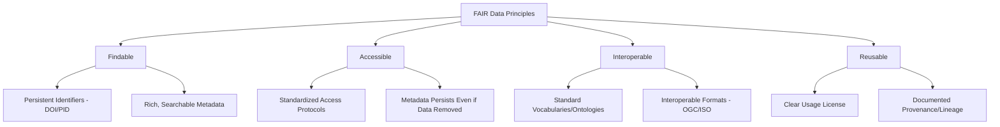
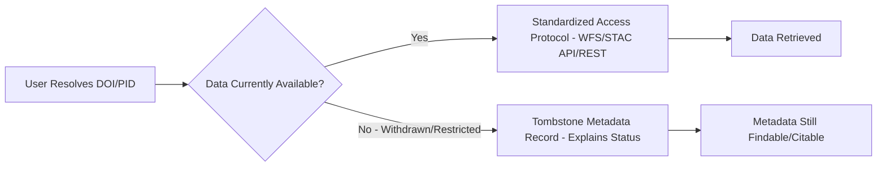
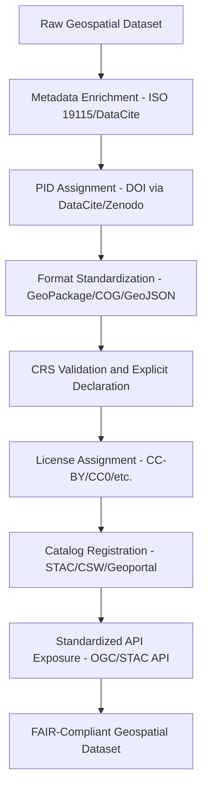

## FAIR Data Principles for Geospatial Data


### Overview

FAIR (Findable, Accessible, Interoperable, Reusable) is a set of guiding principles for scientific data management and stewardship, originally published in 2016 to improve the infrastructure supporting the reuse of scholarly data. Applied to geospatial and environmental data specifically, FAIR principles provide a framework distinct from — but complementary to — open data policy: FAIR data is not necessarily *open* (access restrictions may still apply for privacy, security, or ethical reasons), but it must be well-described, discoverable, and technically reusable by both humans and machines. This domain covers how the four FAIR principles map onto geospatial data practice, including metadata, CRS interoperability, persistent identifiers, and machine-actionable service design.

### The Four FAIR Principles



**Key Points**

- **Findable**: Data and metadata should be assigned globally unique, persistent identifiers, and described with rich metadata that is indexed in a searchable resource.
- **Accessible**: Data should be retrievable by their identifier using a standardized, open, free communications protocol; metadata should remain accessible even when the underlying data is no longer available.
- **Interoperable**: Data should use formal, accessible, shared, and broadly applicable language for knowledge representation, and should use vocabularies that follow FAIR principles themselves, with qualified references to other data.
- **Reusable**: Data should be richly described with accurate and relevant attributes, released with a clear and accessible usage license, and associated with detailed provenance.

[Inference] A common summary distinction in the FAIR literature is that FAIR describes the *technical and descriptive quality* of data stewardship, while "open" describes the *legal accessibility* of the data — meaning data can be highly FAIR while remaining access-restricted (e.g., sensitive endangered species location data described with rich, discoverable metadata but requiring permissioned access).

### Findable: Persistent Identifiers and Discovery Metadata

**Key Points**

- **Persistent Identifiers (PIDs)**: DOIs (Digital Object Identifiers) are the most widely adopted PID scheme for datasets, commonly minted via repositories like Zenodo, DataCite-registered institutional repositories, or domain repositories (e.g., PANGAEA for earth/environmental science data).
- **Rich Discovery Metadata**: For geospatial data specifically, this means populating standardized metadata fields — spatial extent (bounding box or footprint geometry), temporal extent, CRS, lineage, and keyword/thematic classification — following schemas like ISO 19115 or the geospatial-aware DataCite metadata schema extensions.
- **Indexing in Searchable Catalogs**: A dataset with a DOI but no catalog presence is technically identifiable but poorly *findable*; geospatial FAIR practice emphasizes registering data in domain catalogs (e.g., a STAC catalog for Earth observation assets, a CSW-based geoportal, or a DataCite-searchable registry) rather than relying on the PID alone.

**Example**

A FAIR-compliant geospatial dataset citation combines a DOI with spatial/temporal metadata:



```
Dataset: Coastal Erosion Monitoring Points, Batac City, 2020–2026
DOI: 10.xxxx/example.dataset.12345
Spatial Extent: [120.55, 18.05, 120.60, 18.10] (WGS84)
Temporal Extent: 2020-01-01 / 2026-01-01
CRS: EPSG:4326
License: CC-BY 4.0
```

### Accessible: Standardized Retrieval and Metadata Persistence

**Key Points**

- **Standard Protocols**: FAIR accessibility for geospatial data is typically realized through OGC-standard service protocols (WFS, WCS, OGC API - Features) or well-documented REST/STAC APIs (see OGC Standards and Interoperability and SpatioTemporal Asset Catalog and Data Discovery) rather than ad hoc, undocumented download links.
- **Authentication Compatibility**: The Accessible principle explicitly allows for authentication/authorization where necessary — FAIR does not require open access, only that the *access procedure* itself be clearly specified and machine-actionable where possible.
- **Metadata Persistence (Tombstone Records)**: A key but often overlooked FAIR requirement is that metadata should remain accessible even when a dataset is withdrawn, embargoed, or otherwise no longer retrievable — commonly implemented via a "tombstone" metadata record retained at the original persistent identifier, explaining the data's unavailability rather than returning a broken link or 404.



### Interoperable: Standard Formats, Vocabularies, and CRS

**Key Points**

- **Standard Encodings**: GeoJSON, GML, GeoPackage, and Cloud Optimized GeoTIFF are commonly favored for FAIR interoperability over proprietary formats (e.g., legacy vendor-specific binary formats) precisely because open specifications allow any compliant tool to parse them without vendor lock-in.
- **Controlled Vocabularies and Ontologies**: Interoperability at the semantic level requires consistent term usage — e.g., using a standard land-cover classification scheme (such as an established scheme rather than an ad hoc custom taxonomy) so that "forest" in one dataset means the same thing as "forest" in another.
- **CRS Interoperability**: Explicit, standard CRS declaration (EPSG codes) in both data and metadata is a baseline geospatial interoperability requirement — undeclared or ambiguous CRS is one of the most common FAIR violations specific to spatial data, since it silently breaks cross-dataset spatial alignment even when the data itself is technically well-formed.
- **Qualified References**: Where a dataset builds on or relates to other datasets (e.g., a derived flood risk layer built from a DEM and a hydrography layer), FAIR interoperability encourages explicit, machine-readable linkage (via metadata relation fields or linked-data references) rather than only prose description in a readme.

### Reusable: Licensing, Provenance, and Documentation

**Key Points**

- **Clear Usage License**: A FAIR dataset must specify machine-readable licensing terms (see Open Data Policies and Portals for license frameworks like CC-BY, ODbL) — without this, legal reusability remains ambiguous regardless of technical accessibility.
- **Detailed Provenance/Lineage**: Geospatial FAIR practice typically documents data lineage — source imagery/sensor, processing algorithm and version, accuracy assessment methodology — often aligned with ISO 19157 data quality reporting conventions.
- **Domain-Relevant Community Standards**: Reusability is strengthened when data meets the specific conventions expected within its domain community (e.g., CF-conventions for climate/atmospheric NetCDF data, STAC extensions for Earth observation imagery), since domain-specific tooling is built around those conventions.

### FAIR Implementation Architecture for a Geospatial Data Repository



### FAIR Assessment and Maturity Evaluation

**Key Points**

- **FAIR Maturity Indicators**: Various community-developed rubrics assess FAIRness along a graduated scale per principle (e.g., whether metadata is merely human-readable versus machine-actionable), rather than treating FAIR compliance as strictly binary.
- **Automated FAIR Assessment Tools**: Some domain communities have built automated or semi-automated evaluators that check a dataset's landing page, metadata, and access protocol against FAIR criteria. [Unverified] The specific current tools, scoring methodologies, and their applicability to geospatial-specific criteria (CRS declaration, spatial metadata completeness) should be checked against current documentation, as this tooling landscape evolves and geospatial-specific FAIR evaluation is less standardized than generic dataset FAIR evaluation.
- **Common Geospatial FAIR Gaps**: In practice, geospatial datasets most frequently fall short on the Interoperable dimension (ambiguous/undeclared CRS, non-standard attribute naming) and the Reusable dimension (missing or incomplete lineage documentation), even when Findable/Accessible criteria (DOI, working download link) are satisfied.

### Relationship to Open Data and SDI Concepts

| Framework | Primary Focus | Relationship to FAIR |
| --- | --- | --- |
| Open Data Policies | Legal accessibility, licensing, public reuse rights | FAIR's Accessible/Reusable principles overlap but don't require full openness |
| Spatial Data Infrastructure | Institutional/technical coordination for data sharing | Provides the catalog/service infrastructure FAIR Findable/Accessible depend on |
| OGC Standards | Technical interoperability protocols | Directly implements FAIR's Interoperable principle for spatial data |
| STAC | Discovery/cataloging for spatiotemporal assets | A concrete implementation pattern satisfying Findable + Interoperable for EO data |

[Inference] These four frameworks are generally best understood as complementary layers rather than competing standards — an SDI provides the institutional/technical backbone, OGC standards provide the interoperability protocols, STAC provides a domain-specific discovery implementation, and FAIR provides the overarching quality principles that all of the above should be evaluated against, though the precise governance relationship between them varies by implementing organization.

### Environmental Science Application Context

**Example**

FAIR principles are increasingly mandated by research funders and journals for environmental science data:

- **Climate research data**: Funder mandates increasingly require climate model output and observational datasets to be deposited with DOIs in recognized repositories (e.g., domain data centers), with CF-convention-compliant NetCDF metadata satisfying Interoperable/Reusable criteria.
- **Biodiversity occurrence data**: Infrastructures like GBIF operationalize FAIR by assigning persistent identifiers to occurrence records, standardizing on Darwin Core vocabulary for interoperability, and requiring explicit licensing per dataset.
- **Long-term ecological monitoring networks**: Multi-decade field station datasets benefit particularly from FAIR's Accessible/tombstone principle, since research value often depends on long-term data continuity and citability even as underlying storage systems change.
- **Sensitive species/habitat data**: A frequently cited example of FAIR-without-open: precise nesting or occurrence coordinates for endangered species may be described with rich, discoverable metadata (satisfying Findable) while requiring permissioned access or coordinate generalization (limiting full Accessibility) to prevent poaching or disturbance.

### Related Topics

- Spatial Data Infrastructure Concepts (institutional backbone supporting FAIR discovery)
- Open Data Policies and Portals (licensing and legal accessibility layer)
- SpatioTemporal Asset Catalog and Data Discovery (concrete Findable/Interoperable implementation for EO data)
- ISO 19115/19157 Metadata and Data Quality Standards
- Persistent Identifiers and DOI Registration for Datasets (DataCite, Zenodo)
- Data Provenance and Lineage Documentation Practices
- Controlled Vocabularies and Ontologies in Environmental Data (Darwin Core, CF Conventions)