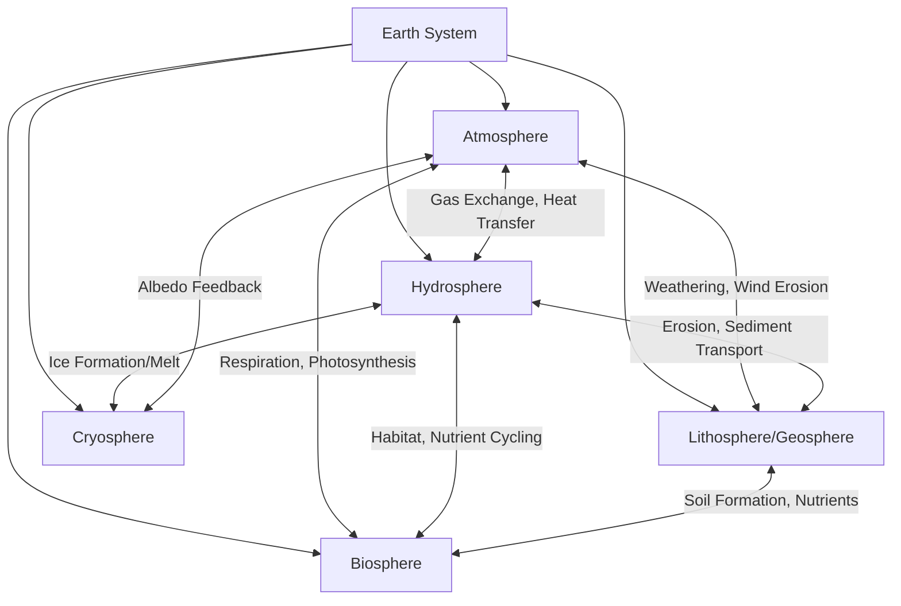
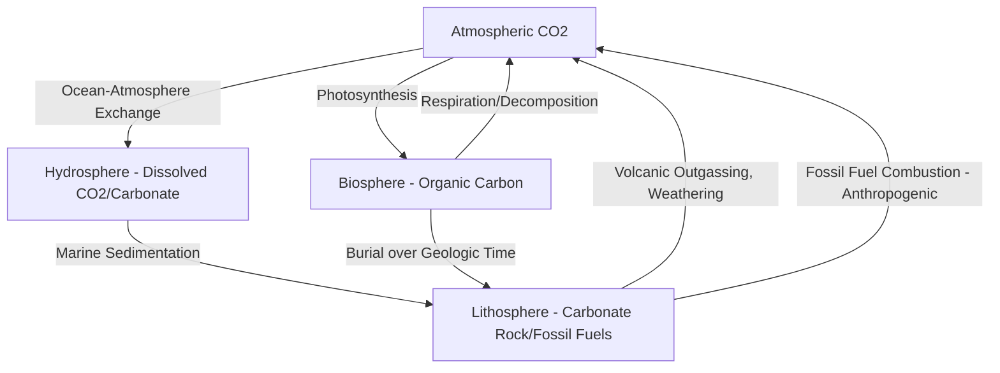

## Earth's Spheres and System Interactions

### Overview

Earth System Science conceptualizes the planet as an integrated system composed of interacting subsystems, or "spheres," rather than as isolated domains studied independently. The four primary spheres — the atmosphere (air), hydrosphere (water), lithosphere/geosphere (solid earth), and biosphere (life) — along with the cryosphere (ice) as a frequently distinguished fifth component, continuously exchange matter and energy through biogeochemical cycles, feedback loops, and coupled physical processes. This systems-level framing underpins environmental science, climate science, and geospatial analysis of Earth processes, since most observable environmental phenomena (climate change, erosion, drought, sea level rise) result from cross-sphere interactions rather than single-sphere behavior alone.

### The Primary Earth Spheres

**Key Points**

- **Atmosphere**: The gaseous envelope surrounding Earth, structured into layers (troposphere, stratosphere, mesosphere, thermosphere) by temperature gradient, and the primary medium for weather, climate regulation, and gas exchange with other spheres.
- **Hydrosphere**: All water on Earth — oceans, rivers, lakes, groundwater, and atmospheric water vapor — engaged in continuous circulation via the hydrologic cycle.
- **Lithosphere/Geosphere**: The solid Earth, including the crust and uppermost mantle, encompassing rock, soil, and the tectonic plate system; the geosphere is sometimes used more broadly to include the deeper mantle and core.
- **Biosphere**: The sum of all living organisms and their interactions with the other spheres, extending from ocean depths to the upper atmosphere wherever life is found.
- **Cryosphere**: The frozen water components of the Earth system — glaciers, ice sheets, sea ice, permafrost, and snow cover — often treated as a distinct sphere given its outsized role in albedo feedback and sea-level dynamics.

### Sphere Interactions and Coupled Processes

#### Atmosphere–Hydrosphere Coupling

The atmosphere and hydrosphere are tightly coupled through the hydrologic cycle: evaporation from oceans and surface water transfers moisture into the atmosphere, which returns to the surface as precipitation. This coupling also governs heat transport — the ocean's high heat capacity moderates atmospheric temperature swings, and ocean-atmosphere interactions drive major climate phenomena such as El Niño-Southern Oscillation (ENSO), which alters global precipitation and temperature patterns through shifts in Pacific sea surface temperature and atmospheric pressure gradients.

#### Atmosphere–Lithosphere Coupling

Atmospheric processes drive physical and chemical weathering of rock (freeze-thaw cycling, wind abrasion, acid rain-driven chemical dissolution), gradually breaking down the lithosphere and contributing to soil formation. Conversely, large-scale lithospheric events — volcanic eruptions — inject aerosols and gases (sulfur dioxide, ash) into the atmosphere, capable of producing measurable short-term global cooling effects by increasing atmospheric albedo.

#### Hydrosphere–Lithosphere Coupling

Water is a primary agent of erosion and sediment transport, continuously reshaping the lithosphere through fluvial, coastal, and glacial processes. Groundwater systems are hosted within lithospheric aquifer formations, and the porosity/permeability of underlying geology directly governs groundwater storage capacity and flow — a key consideration in hydrogeology and watershed modeling.

#### Biosphere Interactions Across Spheres

The biosphere is uniquely positioned as an active modifier of the other spheres rather than a passive recipient of their influence:

- **With the Atmosphere**: Photosynthesis and respiration drive the carbon cycle's biological component, and vegetation transpiration contributes significantly to atmospheric moisture in forested regions.
- **With the Hydrosphere**: Aquatic ecosystems regulate nutrient cycling and water quality; root systems influence infiltration rates and watershed hydrology.
- **With the Lithosphere**: Biological weathering (root action, microbial activity) contributes to soil formation, and long-term biological processes (e.g., carbonate reef formation, fossil fuel formation from ancient organic matter) directly shape the geologic record.

#### Cryosphere Feedback Mechanisms

The cryosphere is central to one of the Earth system's most significant feedback loops: **ice-albedo feedback**. Snow and ice have high albedo (reflectivity), so their presence reflects incoming solar radiation and helps maintain cooler regional temperatures; as warming reduces ice/snow cover, the exposed darker surface (ocean or land) absorbs more solar radiation, accelerating further warming and further ice loss — a positive (self-reinforcing) feedback loop of particular concern in polar amplification of climate change.

### Major Biogeochemical Cycles as Cross-Sphere Integrators

Biogeochemical cycles are the principal mechanism through which matter moves between Earth's spheres, and they provide a quantitative framework for understanding system-level material flux.

**Key Points**

- **Carbon Cycle**: Carbon moves between the atmosphere (CO₂), biosphere (organic carbon via photosynthesis/respiration), hydrosphere (dissolved CO₂ and marine carbonate), and lithosphere (fossil fuels, carbonate rock, long-term geologic sequestration) — with human fossil fuel combustion representing an anthropogenic flux that has substantially altered the cycle's natural balance.
- **Water Cycle (Hydrologic Cycle)**: The continuous movement of water through evaporation, transpiration, condensation, precipitation, infiltration, and runoff, linking atmosphere, hydrosphere, lithosphere (groundwater), and biosphere (transpiration) in a single circulatory system.
- **Nitrogen Cycle**: Involves atmospheric nitrogen fixation (biological and industrial), incorporation into biosphere via plant/microbial uptake, and eventual return to the atmosphere via denitrification — heavily altered by anthropogenic fertilizer production (the Haber-Bosch process), which has roughly doubled the amount of biologically available nitrogen entering the cycle.
- **Phosphorus Cycle**: Distinct from other major cycles in lacking a significant atmospheric gaseous phase; phosphorus moves primarily through weathering of lithospheric rock, uptake by the biosphere, and sedimentary deposition, making it a comparatively slow-cycling and often limiting nutrient in aquatic ecosystems.
- **Sulfur Cycle**: Involves both geologic sources (volcanic outgassing, rock weathering) and biological processes, with atmospheric sulfur compounds playing a role in cloud condensation nuclei formation and, historically, acid rain formation from industrial emissions.

### System Interaction Diagram: The Carbon Cycle Across Spheres

### Feedback Loops: Positive and Negative

**Key Points**

- **Positive (Reinforcing) Feedback**: Amplifies an initial change — ice-albedo feedback (above) and permafrost carbon feedback (thawing permafrost releases stored methane/CO₂, contributing to further warming) are prominent examples in current climate science.
- **Negative (Stabilizing) Feedback**: Counteracts an initial change, tending toward equilibrium — the Stefan-Boltzmann/radiative cooling feedback (a warmer Earth radiates more infrared energy to space, providing a fundamental physical brake on temperature increase) and increased plant growth under elevated CO₂ (CO₂ fertilization effect) partially offsetting atmospheric CO₂ increase are commonly cited examples.
- **Feedback Interactions Are Not Simply Additive**: [Inference] Earth system feedbacks frequently interact nonlinearly with one another (e.g., ice-albedo feedback altering ocean circulation patterns, which in turn affects biosphere productivity) rather than operating as fully independent, summable mechanisms — precise quantification of combined feedback strength remains an active area of climate science research and should be treated as an evolving scientific estimate rather than a fixed figure.

### Timescales of Earth System Processes

Earth system interactions operate across vastly different characteristic timescales, which is critical for understanding which processes are relevant to a given environmental question:

| Process | Approximate Characteristic Timescale |
| --- | --- |
| Atmospheric circulation / weather | Hours to days |
| ENSO cycle | ~2–7 years |
| Seasonal vegetation cycles | Months (annual) |
| Ocean thermohaline circulation | Centuries to millennia |
| Glacial-interglacial cycles | ~100,000 years (Milankovitch-driven) |
| Tectonic plate motion / mountain building | Millions of years |
| Long-term carbon cycle (rock weathering-carbonate) | Hundreds of thousands to millions of years |

[Inference] A frequently emphasized principle in Earth system science pedagogy is that mismatched timescale intuition — applying human-scale (daily/annual) reasoning to processes that naturally operate over geologic timescales, or vice versa — is a common source of public and even student misunderstanding of phenomena like climate change or landscape evolution; specific timescale figures above are characteristic orders of magnitude rather than precise bounds.

### Geospatial Relevance: Modeling Cross-Sphere Interactions

**Example**

Geospatial and remote sensing techniques are central to observing and modeling Earth system interactions at scale:

- **Coupled atmosphere-ocean models** integrate satellite-derived sea surface temperature, atmospheric reanalysis data, and in-situ buoy networks to forecast phenomena like ENSO.
- **Cryosphere monitoring** uses satellite altimetry and passive microwave imagery (e.g., tracking sea ice extent) to quantify ice-albedo feedback strength over time.
- **Land surface-atmosphere flux modeling** combines vegetation index time series (NDVI/EVI from optical satellite imagery) with atmospheric carbon flux tower networks to estimate biosphere-atmosphere carbon exchange at regional to continental scale.
- **Integrated watershed modeling** links precipitation (atmosphere), soil/groundwater properties (lithosphere), and land cover (biosphere) within a single GIS-based hydrologic model to predict runoff, flooding, and water resource availability.

### Related Topics

- Biogeochemical Cycling and GIS-Based Flux Modeling
- Remote Sensing of the Cryosphere (Satellite Altimetry, Passive Microwave)
- Climate Feedback Mechanisms and Earth System Models (ESMs)
- Hydrologic Cycle Modeling and Watershed Delineation
- Plate Tectonics and Landscape Evolution
- ENSO and Ocean-Atmosphere Teleconnections
- Carbon Cycle Remote Sensing (Flux Towers, Satellite CO2 Monitoring)