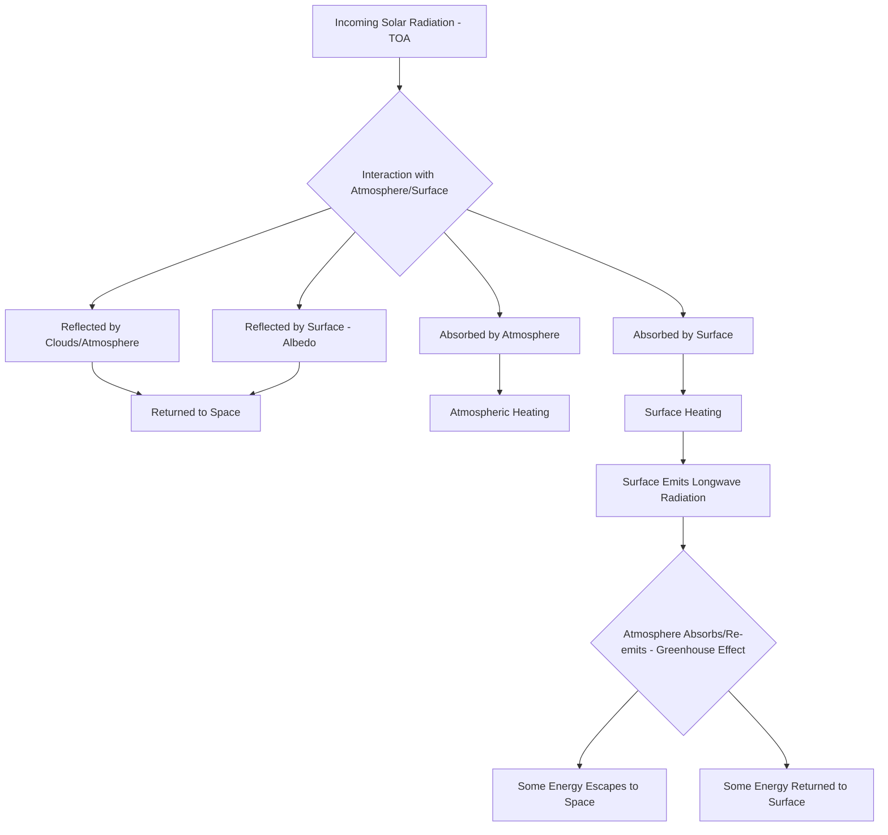
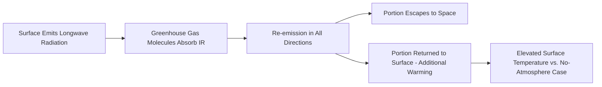

## Global Energy Balance

### Overview

The Global Energy Balance describes the equilibrium between incoming solar (shortwave) radiation absorbed by the Earth system and outgoing longwave (infrared) radiation emitted back to space, which together govern Earth's overall thermal state and climate. This balance is not static at every point in space and time — it varies by latitude, season, surface type, and atmospheric composition — but at the planetary scale, over sufficiently long time periods, incoming and outgoing energy must approximately balance for global mean temperature to remain stable. Understanding this balance, including the greenhouse effect and radiative forcing, is foundational to climate science, remote sensing of radiation budgets, and interpreting anthropogenic climate change.

### The Fundamental Energy Balance Equation

At the top of the atmosphere (TOA), Earth's energy balance can be conceptually expressed as:

$$E_{in} = E_{out}$$

where $E_{in}$ is absorbed solar radiation and $E_{out}$ is emitted longwave (thermal infrared) radiation. When these are equal, the planet is in radiative equilibrium and global mean temperature remains stable; an imbalance (more commonly expressed as positive radiative forcing when $E_{in} > E_{out}$) drives warming or cooling until a new equilibrium is approached.

### Incoming Solar Radiation and Its Fate

**Key Points**

- **Solar Constant**: The average solar irradiance received at the top of Earth's atmosphere, oriented perpendicular to the sun's rays, is approximately 1361 W/m² (measured at mean Earth-Sun distance); dividing by 4 (accounting for Earth's spherical geometry intercepting a disk of sunlight but radiating from a full sphere) yields an average TOA insolation of roughly 340 W/m².
- **Planetary Albedo**: Earth reflects approximately 29-31% of incoming solar radiation back to space (from clouds, ice, aerosols, and land/ocean surfaces), with the specific figure varying somewhat by measurement period and methodology; this reflected fraction plays no role in surface heating.
- **Absorbed Solar Radiation**: The remaining ~69-71% of incoming solar radiation is absorbed by the atmosphere and surface, driving the heating that must be balanced by outgoing longwave emission for equilibrium.

[Inference] Commonly cited textbook energy balance diagrams (following the influential Kiehl-Trenberth style budget) present specific numerical breakdowns (e.g., precise W/m² values for each flux pathway); these values represent best estimates from a specific observational/modeling synthesis and are periodically revised as satellite radiation budget measurements improve, so exact figures should be treated as illustrative rather than fixed constants.

### The Greenhouse Effect

The greenhouse effect is the process by which certain atmospheric gases (greenhouse gases) absorb outgoing longwave radiation emitted by Earth's surface and re-radiate a portion of it back toward the surface, raising the planet's effective surface temperature above what would result from a purely radiative balance without an atmosphere.

**Key Points**

- **Greenhouse Gases**: Water vapor (the largest natural contributor by mass/effect), carbon dioxide (CO₂), methane (CH₄), nitrous oxide (N₂O), and various synthetic halocarbons all absorb specific infrared wavelength bands corresponding to their molecular vibrational/rotational modes.
- **Natural vs. Enhanced Greenhouse Effect**: The natural greenhouse effect keeps Earth's average surface temperature habitable (roughly 33°C warmer than the theoretical equilibrium temperature of an atmosphere-less Earth); the "enhanced" greenhouse effect refers specifically to additional warming driven by anthropogenic increases in greenhouse gas concentrations since industrialization.
- **Radiative Forcing**: A quantitative measure (in W/m²) of the change in net energy balance at the top of the atmosphere caused by a specific factor (e.g., a given increase in atmospheric CO₂ concentration), used as the standard metric for comparing the relative climate impact of different forcing agents (greenhouse gases, aerosols, solar variability, land-use change).

### Latitudinal Energy Imbalance and Poleward Transport

Because Earth is a sphere, incoming solar radiation is not evenly distributed by latitude — the tropics receive a net surplus of absorbed solar energy relative to outgoing longwave emission, while polar regions experience a net deficit. This latitudinal imbalance, rather than being resolved locally, drives large-scale poleward energy transport through both atmospheric circulation (Hadley, Ferrel, and polar cells; mid-latitude storm systems) and oceanic circulation (thermohaline circulation, western boundary currents like the Gulf Stream).

**Key Points**

- **Tropical Energy Surplus**: High sun angle and consistent year-round insolation produce a persistent radiative surplus in equatorial regions.
- **Polar Energy Deficit**: Low sun angle, extended periods of darkness (polar night), and high surface albedo (ice/snow) produce a persistent radiative deficit at high latitudes.
- **Ocean and Atmospheric Heat Transport**: [Inference] The relative contribution of oceanic versus atmospheric heat transport to closing this latitudinal imbalance varies by latitude band — atmospheric transport is generally considered dominant at higher latitudes while ocean currents contribute substantially in lower-to-mid latitudes — though precise partitioning is an active area of climate research and estimates vary across studies.

### Surface Energy Balance at Local/Regional Scale

Distinct from the planetary TOA balance, the surface energy balance describes energy exchange at Earth's surface, relevant to land surface modeling, agriculture, and urban climate studies:

$$R_n = H + LE + G$$

where $R_n$ is net radiation at the surface, $H$ is sensible heat flux (direct air heating), $LE$ is latent heat flux (energy consumed by evapotranspiration), and $G$ is ground heat flux (energy conducted into/out of the soil).

**Example**

This surface energy partitioning has direct environmental science applications:

- Over a well-vegetated, moist surface, a large fraction of net radiation is consumed as latent heat (evapotranspiration), moderating surface temperature.
- Over a dry, bare, or urbanized surface, a larger fraction converts to sensible heat, contributing to phenomena like the urban heat island effect, where impervious surfaces and reduced vegetation shift the local energy partition toward $H$ at the expense of $LE$.

### Remote Sensing of the Radiation Budget

**Key Points**

- **Satellite Radiation Budget Instruments**: Dedicated satellite missions and instruments (e.g., broadband radiometers measuring both shortwave reflected and longwave emitted radiation at TOA) provide the primary observational basis for quantifying the global energy balance and detecting long-term trends in Earth's energy imbalance.
- **Albedo Mapping**: Multispectral satellite imagery is used to derive surface albedo maps, critical inputs for both climate models and surface energy balance calculations at regional scale.
- **Land Surface Temperature (LST) Retrieval**: Thermal infrared satellite bands allow estimation of surface temperature and, combined with vegetation indices, support modeled estimates of the surface energy balance components (sensible/latent heat partitioning) across large areas without in-situ instrumentation.
- **Earth's Energy Imbalance (EEI) Monitoring**: [Unverified] Specific current best-estimate magnitudes of Earth's top-of-atmosphere energy imbalance (the small but climatologically significant net positive imbalance driving ongoing warming) are actively revised as satellite records lengthen and calibration improves, so current figures should be checked against up-to-date climate science literature rather than treated as fixed.

### Anthropogenic Perturbation of the Energy Balance

**Key Points**

- **Greenhouse Gas Increase**: Anthropogenic emissions of CO₂, CH₄, N₂O, and other greenhouse gases increase atmospheric absorption of outgoing longwave radiation, producing positive radiative forcing and driving the observed global energy imbalance associated with contemporary climate change.
- **Aerosol Effects**: Anthropogenic aerosols (sulfate aerosols from fossil fuel/industrial combustion) generally exert a net negative (cooling) radiative forcing by increasing atmospheric/cloud reflectivity, partially offsetting greenhouse gas warming — though aerosol forcing carries comparatively larger scientific uncertainty than well-mixed greenhouse gas forcing.
- **Land-Use Change**: Deforestation, urbanization, and agricultural expansion alter surface albedo and the surface energy balance partitioning (shifting the sensible/latent heat balance), contributing localized and cumulative global forcing effects distinct from greenhouse gas forcing.
- **Net Effect**: The current scientific consensus attributes observed global energy imbalance and associated warming predominantly to anthropogenic greenhouse gas forcing, partially offset by aerosol cooling, though quantifying the precise net radiative forcing budget remains subject to ongoing refinement as observational records and climate models improve.

### Geospatial and GIS Application Context

**Example**

Global energy balance concepts are operationalized in geospatial workflows including:

- **Climate model output visualization**: Mapping spatial patterns of TOA radiation imbalance, surface temperature anomaly, and radiative forcing from global climate model (GCM) output using GIS/raster analysis tools.
- **Urban heat island mapping**: Combining thermal remote sensing (land surface temperature) with land-cover classification to map spatial variation in surface energy balance partitioning across urban landscapes.
- **Agricultural evapotranspiration modeling**: GIS-integrated surface energy balance models (e.g., using satellite-derived NDVI and land surface temperature) to estimate crop water use and irrigation requirements at field to regional scale.
- **Solar resource assessment**: Mapping spatial variation in surface-absorbed solar radiation, informed by terrain (slope/aspect shading via digital elevation models) and atmospheric attenuation, to support renewable energy site suitability analysis.

### Related Topics

- Earth's Spheres and System Interactions (broader Earth system context for energy/matter exchange)
- Radiative Forcing and Climate Sensitivity
- Remote Sensing of Land Surface Temperature and Albedo
- Urban Heat Island Analysis Using GIS and Thermal Imagery
- Evapotranspiration Modeling and Surface Energy Balance Algorithms
- Atmospheric and Oceanic Circulation Patterns
- Climate Model (GCM) Output Processing and Geospatial Visualization