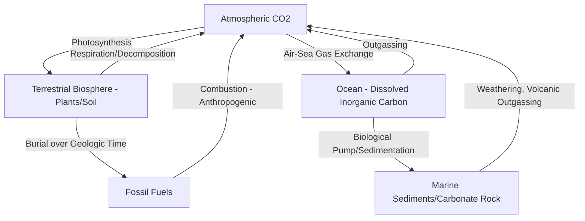
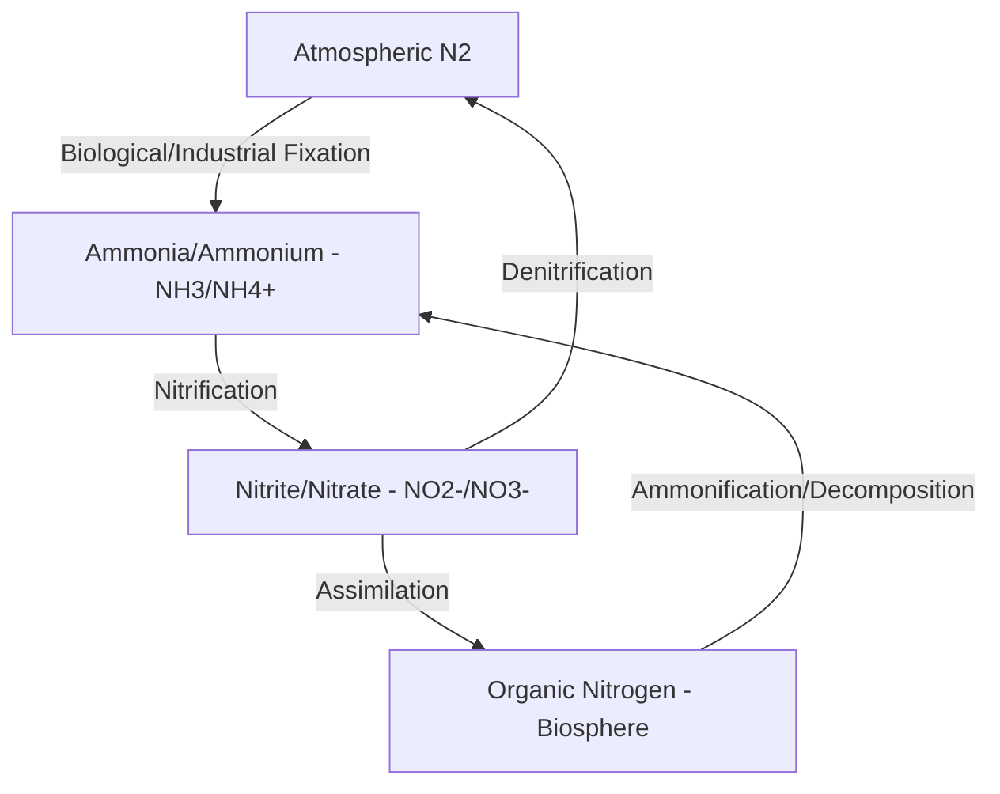

## Biogeochemical Cycles

### Overview

Biogeochemical cycles describe the pathways through which chemical elements and compounds essential to life move through the biotic (biological) and abiotic (geological, atmospheric, hydrological) components of the Earth system. The term itself reflects this integration: "bio" (living organisms), "geo" (rocks, soil, atmosphere, water), and "chemical" (the compounds and elements being cycled). These cycles operate as closed or near-closed systems at the planetary scale — matter is conserved and continuously redistributed among reservoirs (pools) via fluxes (transfer rates) — and they represent the mechanistic detail underlying the cross-sphere interactions introduced in Earth's Spheres and System Interactions.

### Core Concepts: Reservoirs, Fluxes, and Residence Time

**Key Points**

- **Reservoir (Pool)**: A location where a chemical element is stored for a period of time (e.g., atmospheric CO₂, ocean dissolved carbon, soil organic carbon, fossil fuel deposits).
- **Flux**: The rate of transfer of an element between reservoirs, typically expressed as mass per unit time (e.g., gigatons of carbon per year).
- **Residence Time**: The average time a unit of an element spends in a given reservoir before moving to another, calculated as reservoir size divided by flux rate; residence times vary enormously across cycles and reservoirs — from days (atmospheric water vapor) to millions of years (carbon locked in sedimentary rock).
- **Source vs. Sink**: A source releases an element into a given reservoir (or the broader system), while a sink removes/stores it; a given reservoir can function as either depending on the net direction of flux (e.g., forests can act as a net carbon sink during regrowth or a net source during deforestation/fire).
- **Steady State vs. Perturbation**: A cycle is in steady state when reservoir sizes remain roughly constant over the timescale of interest (fluxes in and out of each reservoir are balanced); anthropogenic activity has perturbed several major biogeochemical cycles away from their pre-industrial steady state, most notably carbon and nitrogen.

### The Carbon Cycle

**Key Points**

- **Major Reservoirs**: Atmosphere (CO₂), terrestrial biosphere (vegetation and soil organic carbon), ocean (dissolved inorganic and organic carbon, marine biota), and the lithosphere (fossil fuels, carbonate rock, kerogen) — with the lithospheric reservoir being by far the largest but exchanging carbon on geologic rather than annual timescales under natural conditions.
- **Fast vs. Slow Carbon Cycle**: The "fast" carbon cycle (photosynthesis/respiration, ocean-atmosphere gas exchange) operates on timescales of days to centuries; the "slow" carbon cycle (rock weathering, volcanic outgassing, sedimentary burial) operates on timescales of thousands to millions of years and normally acts as the long-term thermostat regulating atmospheric CO₂ over geologic time.
- **Anthropogenic Perturbation**: Fossil fuel combustion and land-use change extract carbon from slow-cycle reservoirs (fossil fuels) and introduce it into the fast cycle at a rate far exceeding natural slow-cycle removal processes, driving the observed rise in atmospheric CO₂ concentration since industrialization.
- **Ocean Carbon Uptake and Acidification**: The ocean absorbs a substantial share of anthropogenic CO₂ emissions annually; dissolved CO₂ reacts with seawater to form carbonic acid, lowering ocean pH — a process termed ocean acidification, with documented impacts on calcifying marine organisms (corals, shellfish, some plankton).

### The Nitrogen Cycle

Nitrogen is the most abundant gas in the atmosphere (as N₂), but this form is largely biologically unavailable due to the strong triple bond between nitrogen atoms; the nitrogen cycle is therefore centrally concerned with the conversion between biologically inert and biologically available (reactive) nitrogen forms.

**Key Points**

- **Nitrogen Fixation**: The conversion of atmospheric N₂ into biologically usable forms (ammonia), accomplished naturally by symbiotic and free-living nitrogen-fixing bacteria (notably in legume root nodules), by lightning-driven atmospheric fixation, and anthropogenically via the Haber-Bosch industrial process for synthetic fertilizer production.
- **Nitrification**: Microbial conversion of ammonia/ammonium to nitrite and then nitrate, forms readily taken up by plants.
- **Assimilation**: Uptake of nitrate/ammonium by plants and subsequent incorporation into organic compounds (amino acids, proteins, nucleic acids), entering the food web.
- **Ammonification (Mineralization)**: Decomposition of organic nitrogen in dead organisms and waste back into ammonium by decomposer organisms.
- **Denitrification**: Microbial conversion of nitrate back to atmospheric N₂ (or intermediate gases like N₂O), typically occurring in low-oxygen (anaerobic) environments such as waterlogged soils and sediments, completing the cycle.
- **Anthropogenic Nitrogen Perturbation**: Industrial fixation via the Haber-Bosch process has roughly doubled the amount of reactive nitrogen entering the biosphere compared to pre-industrial natural fixation rates, driving agricultural productivity gains but also contributing to eutrophication of water bodies, nitrous oxide emissions (a potent greenhouse gas), and altered terrestrial ecosystem nutrient balances.

### The Phosphorus Cycle

The phosphorus cycle is distinguished from carbon and nitrogen by the near-total absence of a significant atmospheric gas phase — phosphorus moves primarily through the lithosphere, hydrosphere, and biosphere via weathering, dissolution, uptake, and sedimentary deposition, making it an inherently slower-cycling element.

**Key Points**

- **Primary Source**: Weathering of phosphate-bearing rock (apatite) releases phosphate ions into soil and water, the principal natural entry point into the biologically active portion of the cycle.
- **Biological Uptake**: Plants and algae assimilate dissolved phosphate directly; phosphorus moves through food webs via consumption and is returned to soil/water through decomposition.
- **Limiting Nutrient Role**: Because phosphorus lacks an atmospheric reservoir and weathering rates are slow, it frequently functions as the limiting nutrient in freshwater aquatic ecosystems — meaning phosphorus availability, rather than other nutrients, most directly constrains primary productivity, making it a key management target for controlling eutrophication.
- **Anthropogenic Perturbation**: Mining of phosphate rock for fertilizer production and subsequent agricultural runoff has substantially accelerated phosphorus flux into aquatic systems, a leading driver of cultural eutrophication and associated harmful algal blooms in lakes, rivers, and coastal waters.

### The Sulfur Cycle

**Key Points**

- **Natural Sources**: Volcanic outgassing, weathering of sulfur-bearing rock, and biological processes (marine phytoplankton produce dimethyl sulfide, a significant natural source of atmospheric sulfur compounds) contribute to the natural sulfur cycle.
- **Atmospheric Role**: Sulfur compounds in the atmosphere can act as cloud condensation nuclei, influencing cloud formation and, through this pathway, exerting a cooling influence on climate distinct from greenhouse gas warming.
- **Anthropogenic Perturbation**: Industrial combustion of sulfur-containing fossil fuels historically released large quantities of sulfur dioxide, contributing to acid rain formation (sulfuric acid) in industrialized regions; many jurisdictions have since implemented emissions controls substantially reducing this specific impact pathway, though [Unverified] current regional emission trends and remaining acid deposition impacts vary by location and should be checked against current air quality monitoring data.

### The Water (Hydrologic) Cycle as a Biogeochemical Transport Medium

While often treated as a distinct physical cycle, the hydrologic cycle functions as the primary transport medium for several biogeochemical cycles — dissolved nutrients (nitrate, phosphate), carbon (dissolved inorganic/organic carbon), and other compounds move through watersheds via the same evaporation-precipitation-runoff-infiltration pathways that define water circulation, linking terrestrial biogeochemistry directly to downstream aquatic and marine systems.

### Comparative Summary of Major Cycles

| Cycle | Primary Reservoir | Atmospheric Phase? | Dominant Anthropogenic Perturbation |
| --- | --- | --- | --- |
| Carbon | Lithosphere (long-term) / Ocean | Yes (CO₂) | Fossil fuel combustion, deforestation |
| Nitrogen | Atmosphere | Yes (N₂, N₂O) | Haber-Bosch fixation, fertilizer runoff |
| Phosphorus | Lithosphere (rock) | No (negligible) | Mining, fertilizer runoff |
| Sulfur | Lithosphere / Ocean | Yes (SO₂, DMS) | Fossil fuel combustion (historically) |

### Geospatial and Remote Sensing Applications

**Example**

Biogeochemical cycle monitoring is heavily dependent on geospatial data integration:

- **Carbon flux mapping**: Combining satellite-derived vegetation indices (NDVI/EVI), land cover classification, and eddy covariance flux tower networks within a GIS to model spatially distributed terrestrial carbon uptake and release.
- **Nutrient loading and watershed modeling**: GIS-based watershed delineation combined with land-use data (agricultural fertilizer application rates) to model nitrogen and phosphorus runoff loading into downstream water bodies, supporting eutrophication risk assessment.
- **Ocean color remote sensing**: Satellite ocean color imagery used to estimate chlorophyll concentration as a proxy for phytoplankton biomass, informing marine carbon and nutrient cycle assessments at basin to global scale.
- **Precision agriculture nutrient management**: Field-scale mapping of soil nutrient status (often combining remote sensing with in-situ soil sampling) to optimize fertilizer application, reducing excess nitrogen/phosphorus flux into the broader biogeochemical system.

### Related Topics

- Earth's Spheres and System Interactions (broader cross-sphere context for cycling)
- Global Energy Balance (energy dimension complementing matter cycling)
- Carbon Flux Modeling and Remote Sensing of Vegetation Indices
- Watershed-Scale Nutrient Loading and Eutrophication Modeling
- Ocean Acidification and Marine Carbon Chemistry
- Precision Agriculture and Soil Nutrient Mapping
- Anthropogenic Biogeochemical Cycle Perturbation and Planetary Boundaries