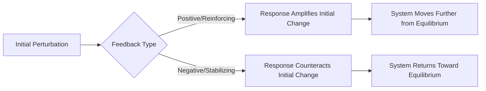

## Earth System Feedback Loops

### Overview

Earth system feedback loops are processes in which an initial change in some component of the climate or Earth system triggers a chain of effects that ultimately act back on the original change, either amplifying it (positive/reinforcing feedback) or dampening it (negative/stabilizing feedback). Feedback loops are the central mechanism determining how the Earth system responds to a given forcing (such as increased greenhouse gas concentration or a change in solar output), and they are why the eventual magnitude of climate change from a given forcing is substantially larger — or, in a purely negative-feedback-dominated system, substantially smaller — than the initial radiative forcing alone would produce. This topic builds directly on the cross-sphere interactions and energy balance concepts introduced earlier in this chapter, focusing specifically on the feedback mechanisms that determine climate sensitivity.

### Positive vs. Negative Feedback: Core Distinction

**Key Points**

- **Positive (Reinforcing) Feedback**: The response to an initial change acts in the same direction as that change, amplifying it further — importantly, "positive" here describes the *direction* of reinforcement, not a value judgment that the outcome is beneficial.
- **Negative (Stabilizing) Feedback**: The response to an initial change acts to counteract or dampen it, pushing the system back toward its prior state — these feedbacks are essential for overall climate system stability and are why Earth's climate has not historically run away in either direction despite various forcings.
- **Feedback Strength and Climate Sensitivity**: The net balance of all positive and negative feedbacks operating simultaneously determines a system property called climate sensitivity — the amount of warming that results from a given radiative forcing (e.g., a doubling of atmospheric CO₂) after feedbacks are accounted for, distinct from the smaller warming that would result from the forcing alone with no feedbacks.

### Major Positive (Reinforcing) Feedback Mechanisms

#### Water Vapor Feedback

Warmer air holds more water vapor (following the Clausius-Clapeyron relationship), and since water vapor is itself a potent greenhouse gas, initial warming increases atmospheric water vapor content, which traps additional outgoing longwave radiation, driving further warming. This is widely regarded in climate science as the single largest positive feedback in the climate system, substantially amplifying the initial warming from CO₂ forcing alone.

#### Ice-Albedo Feedback

As introduced in Earth's Spheres and System Interactions, warming reduces snow and ice cover; because ice/snow has high albedo (reflectivity) and the exposed ocean or land surface beneath has lower albedo, this reduces the fraction of incoming solar radiation reflected back to space, increasing absorbed solar energy and driving further warming and further ice loss. This feedback is a major contributor to polar amplification — the observed pattern of Arctic and, to a lesser extent, Antarctic regions warming faster than the global average.

#### Permafrost Carbon Feedback

Warming thaws permafrost (permanently frozen ground in high-latitude regions), which contains large stores of organic carbon accumulated over thousands of years; thawed organic matter becomes available for microbial decomposition, releasing CO₂ and methane (a more potent though shorter-lived greenhouse gas) into the atmosphere, contributing to further warming and further permafrost thaw.

#### Cloud Feedback

Changes in cloud cover, altitude, and type in response to warming can either amplify or dampen warming depending on the specific cloud response — low-altitude clouds generally have a net cooling effect (high reflectivity, modest greenhouse trapping), while high-altitude clouds generally have a net warming effect (strong greenhouse trapping, lower reflectivity contribution). [Unverified] The net sign and magnitude of the overall global cloud feedback remains one of the largest sources of uncertainty in climate sensitivity estimates across climate models, and specific current best-estimate values should be checked against up-to-date climate science literature rather than treated as settled.

#### Forest Dieback / Vegetation Feedback

In some regions, warming and associated drought stress can drive forest dieback or increased wildfire frequency, releasing stored carbon and reducing the land carbon sink capacity — a feedback of particular concern for large forested carbon reservoirs, where [Inference] sustained large-scale dieback is often discussed as a potential regional tipping point in the climate literature, though the precise threshold conditions and likelihood remain areas of active scientific investigation rather than settled fact.

### Major Negative (Stabilizing) Feedback Mechanisms

#### Planck (Radiative Cooling) Feedback

As a surface or atmosphere warms, it emits more outgoing longwave radiation, following the Stefan-Boltzmann relationship (radiated energy scales with the fourth power of temperature). This provides a fundamental, universal negative feedback present in any warming scenario — it is the basic physical mechanism that prevents runaway warming from continuing indefinitely and is sometimes treated as the reference feedback against which other feedbacks' relative strength is compared.

$$E = \sigma T^4$$

where $E$ is emitted radiative flux, $\sigma$ is the Stefan-Boltzmann constant, and $T$ is absolute temperature — illustrating that emitted energy increases sharply as temperature rises, providing an increasingly strong restoring force.

#### Lapse Rate Feedback

Changes in the vertical temperature profile of the atmosphere in response to warming affect how efficiently the atmosphere radiates heat to space; in the tropics in particular, the upper troposphere is expected to warm more than the surface, which — through favoring more efficient longwave emission to space — generally acts as a negative feedback that partially offsets the water vapor feedback discussed above.

#### CO₂ Fertilization / Terrestrial Carbon Sink Feedback

Elevated atmospheric CO₂ concentration can enhance photosynthetic rates in many plant species (the CO₂ fertilization effect), potentially increasing carbon uptake by vegetation and partially offsetting atmospheric CO₂ increase. [Inference] This feedback's effectiveness is widely understood in the ecological and climate literature to be constrained by other limiting factors (nutrient availability, water stress, temperature extremes), meaning its magnitude as a negative feedback is generally considered partial and non-uniform across ecosystems rather than a simple linear offset — specific quantification varies across studies and ecosystem types.

#### Weathering Feedback (Long-Timescale)

Over geologic timescales, warmer temperatures and increased precipitation generally accelerate the chemical weathering of silicate rock, a process that consumes atmospheric CO₂ and ultimately sequesters carbon in carbonate sediments; this negative feedback operates on timescales of tens of thousands to millions of years and is considered part of the "slow" carbon cycle's role in regulating atmospheric CO₂ over geologic time, far too slow to meaningfully offset the rate of contemporary anthropogenic CO₂ increase.

### Comparative Summary Table

| Feedback | Type | Approximate Relative Strength | Primary Sphere(s) Involved |
| --- | --- | --- | --- |
| Water Vapor | Positive | Large | Atmosphere/Hydrosphere |
| Ice-Albedo | Positive | Moderate (regionally strong) | Cryosphere/Atmosphere |
| Permafrost Carbon | Positive | Emerging/growing concern | Cryosphere/Lithosphere/Atmosphere |
| Cloud (net) | Uncertain sign, likely net positive per most current estimates | Highly uncertain | Atmosphere/Hydrosphere |
| Planck (Radiative Cooling) | Negative | Large (dominant stabilizing term) | Atmosphere |
| Lapse Rate | Negative | Moderate | Atmosphere |
| CO₂ Fertilization | Negative (partial) | Moderate, constrained | Biosphere/Atmosphere |
| Silicate Weathering | Negative | Small on human timescales, large on geologic timescales | Lithosphere/Atmosphere |

[Unverified] The specific quantitative strength values (typically expressed in W/m² per °C in the climate science literature) for each feedback are actively refined through ongoing climate model intercomparison efforts; current best estimates should be sourced from up-to-date peer-reviewed synthesis assessments rather than treated as fixed figures.

### Feedback Loop Interactions and Tipping Points

**Key Points**

- **Nonlinear Interactions**: Feedbacks frequently interact with one another rather than operating additively in isolation — for example, ice-albedo feedback-driven Arctic warming can influence atmospheric circulation patterns, which in turn affects vegetation feedback dynamics at lower latitudes.
- **Tipping Points**: A tipping point refers to a threshold beyond which a system transitions to a qualitatively different state, often through the activation of a strong, potentially difficult-to-reverse positive feedback loop (commonly discussed examples in the climate literature include large-scale ice sheet collapse, Atlantic meridional overturning circulation weakening, and permafrost carbon release). [Inference] The precise threshold conditions, timing, and reversibility of potential tipping points remain areas of significant scientific uncertainty and active research rather than settled quantitative predictions, and specific claims about individual tipping elements should be checked against current assessment literature.
- **Hysteresis**: Some feedback-driven system transitions exhibit hysteresis, meaning that once a threshold is crossed, simply reversing the original forcing (e.g., reducing atmospheric CO₂ back to a prior level) may not be sufficient to return the system to its original state without overshooting significantly past the original threshold in the opposite direction.

### Geospatial and Remote Sensing Relevance

**Example**

Monitoring and quantifying Earth system feedback loops relies heavily on geospatial and remote sensing techniques:

- **Ice-albedo feedback monitoring**: Satellite-derived sea ice extent and surface albedo time series (passive microwave and optical imagery) provide the primary observational record for quantifying polar amplification and ice-albedo feedback strength.
- **Permafrost feedback tracking**: Remote sensing of land surface temperature, freeze-thaw state, and, increasingly, satellite-based atmospheric methane concentration retrievals support regional-scale permafrost carbon feedback assessment.
- **Vegetation/carbon sink feedback**: Long-term satellite vegetation index (NDVI/EVI) records combined with atmospheric CO₂ monitoring networks help assess terrestrial carbon sink trends and potential vegetation feedback shifts (e.g., regional greening or browning trends).
- **Cloud feedback observation**: Satellite-based cloud property retrievals (cloud fraction, altitude, optical thickness) feed into observational constraints used to evaluate and improve cloud feedback representation in climate models.

### Related Topics

- Earth's Spheres and System Interactions (foundational cross-sphere coupling context)
- Global Energy Balance (radiative forcing and equilibrium framework feedbacks act upon)
- Biogeochemical Cycles (carbon cycle feedback mechanisms in detail)
- Climate Sensitivity and Earth System Models (ESMs)
- Remote Sensing of the Cryosphere and Polar Amplification
- Climate Tipping Points and Hysteresis in Earth System Dynamics
- Permafrost Monitoring via Satellite Remote Sensing