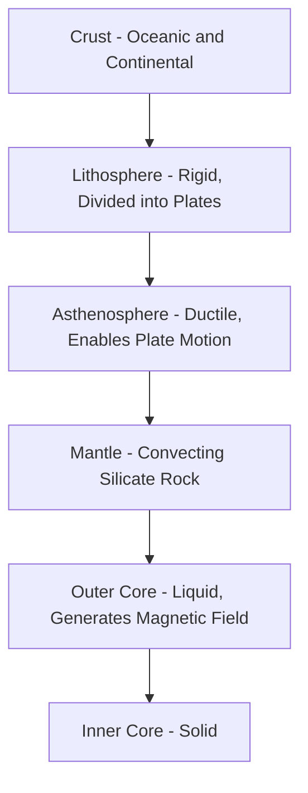
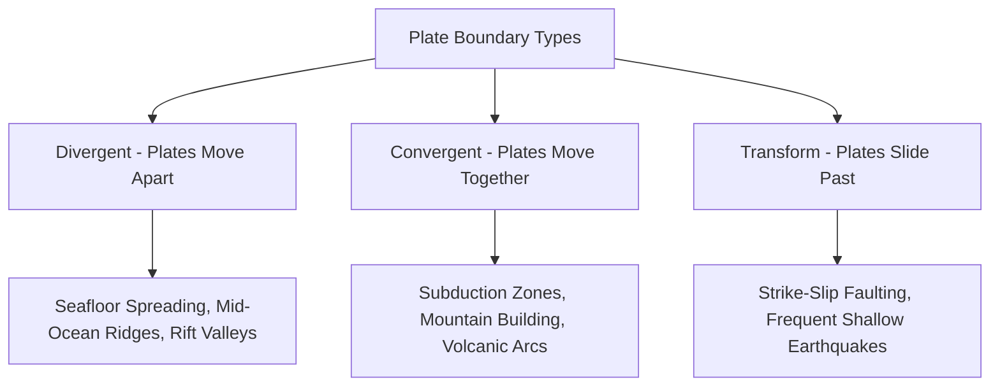
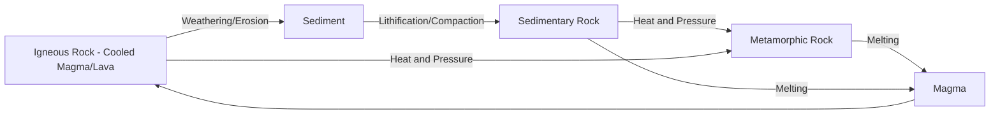

## Plate Tectonics and Geological Processes

### Overview

Plate tectonics is the unifying theory of geology describing Earth's lithosphere as divided into a mosaic of rigid plates that move relative to one another atop the underlying, more ductile asthenosphere. This large-scale motion drives nearly all major geological processes observed at Earth's surface — mountain building, volcanism, earthquakes, ocean basin formation, and long-term topographic evolution — and represents the primary mechanism by which the lithosphere, as one of Earth's core spheres, is continuously reshaped over geologic time. Plate tectonics also governs the slow-cycle biogeochemical processes (rock weathering, volcanic outgassing) that regulate atmospheric composition over million-year timescales, linking this topic directly to the broader Earth system framework introduced earlier in this chapter.

### The Structure of Earth's Interior

**Key Points**

- **Crust**: The outermost, thinnest layer, differentiated into oceanic crust (thinner, denser, basaltic composition) and continental crust (thicker, less dense, granitic composition).
- **Lithosphere**: The rigid outer shell comprising the crust and the uppermost, rigid portion of the mantle; this is the layer divided into tectonic plates.
- **Asthenosphere**: The ductile, partially molten layer of the upper mantle beneath the lithosphere, over which tectonic plates move; its lower viscosity allows plastic flow that accommodates plate motion.
- **Mantle**: The thick layer between crust and core, composed of hot, slowly convecting silicate rock, extending from the base of the lithosphere to the core-mantle boundary.
- **Core**: The innermost layer, differentiated into a liquid outer core (generating Earth's magnetic field through convective motion of molten iron/nickel) and a solid inner core.

### Plate Boundary Types

Tectonic plates interact along three fundamental boundary types, each associated with characteristic geological processes.

#### Divergent Boundaries

Plates move apart, allowing magma to rise from the mantle and create new lithosphere. Oceanic divergent boundaries produce mid-ocean ridges and drive seafloor spreading, the process by which new oceanic crust is continuously generated and pushed outward symmetrically from the ridge axis. Continental divergent boundaries produce rift valleys, which over sufficient geologic time can evolve into new ocean basins as continental crust thins and eventually separates.

#### Convergent Boundaries

Plates move toward one another, and the geological outcome depends on the crust types involved:

- **Oceanic-Continental Convergence**: The denser oceanic plate subducts beneath the less dense continental plate, forming a subduction zone characterized by deep ocean trenches, volcanic arcs (from partial melting of the subducting slab and overlying mantle wedge), and strong earthquake activity.
- **Oceanic-Oceanic Convergence**: One oceanic plate subducts beneath the other, producing island arc volcanic chains and deep trenches.
- **Continental-Continental Convergence**: Neither plate readily subducts due to similar (low) density, resulting in crustal thickening and major mountain building (orogeny) through folding, faulting, and uplift.

#### Transform Boundaries

Plates slide horizontally past one another without significant creation or destruction of lithosphere; friction along these boundaries commonly produces frequent, often shallow earthquakes as accumulated stress is periodically released.

### Driving Mechanisms of Plate Motion

**Key Points**

- **Mantle Convection**: Heat from Earth's interior drives large-scale convective flow in the mantle, historically considered the primary driving force dragging overlying plates via basal traction.
- **Slab Pull**: The sinking, denser subducting oceanic slab at convergent boundaries exerts a pulling force on the trailing plate — widely regarded in current plate tectonics research as a dominant driving mechanism for many plates, particularly those with extensive subduction zone boundaries.
- **Ridge Push**: The elevated topography of mid-ocean ridges, combined with the outward-sloping density structure of newly formed lithosphere as it cools and thickens away from the ridge, contributes a gravitational push force away from the ridge axis.
- **Relative Contribution Debate**: [Inference] While slab pull is often characterized in modern geodynamics literature as the more significant driving force compared to ridge push or basal mantle drag for most plates, the precise relative contribution of each mechanism varies by specific plate and remains an area of ongoing geodynamic research rather than a single settled ratio applicable to all plates.

### Evidence for Plate Tectonics

**Key Points**

- **Paleomagnetism and Seafloor Magnetic Striping**: Symmetric, mirrored patterns of magnetic polarity reversal recorded in oceanic crust on either side of mid-ocean ridges provide direct evidence of seafloor spreading and allow reconstruction of past plate positions and spreading rates.
- **Fossil and Rock Correlation Across Continents**: Matching fossil assemblages and rock sequences on now widely separated continents (a key line of evidence originally cited by Alfred Wegener in the early continental drift hypothesis) support the historical existence of joined landmasses.
- **Earthquake and Volcano Distribution**: The global distribution of earthquakes and volcanoes is strongly concentrated along plate boundaries (notably the Pacific "Ring of Fire"), consistent with boundary-driven tectonic and magmatic activity rather than random distribution.
- **GPS/Geodetic Measurement**: Modern satellite geodesy (continuous GNSS station networks) directly measures present-day plate motion rates, typically on the order of a few centimeters per year — comparable to the rate of human fingernail growth — providing direct, ongoing confirmation of plate motion consistent with geologically reconstructed rates.

### Geological Hazards Associated with Plate Boundaries

**Key Points**

- **Earthquakes**: Concentrated along all three boundary types but with distinct characteristic depth and magnitude patterns — subduction zones can generate the largest-magnitude earthquakes due to the large rupture area of the shallow-dipping plate interface, while transform boundaries typically produce shallower, moderate-magnitude events.
- **Volcanism**: Concentrated at divergent boundaries (effusive, basaltic volcanism), convergent subduction zones (typically more explosive, silica-rich volcanism due to magma composition and gas content), and at intraplate hotspots (volcanic activity from a stationary mantle plume beneath a moving plate, producing volcanic island chains such as progressively older, extinct volcanic islands trailing away from an active hotspot).
- **Tsunamis**: Large subduction zone earthquakes that produce significant vertical seafloor displacement are a primary generation mechanism for ocean-basin-scale tsunamis.
- **Landslides and Mass Wasting**: Tectonically active, steep terrain (common near convergent boundaries and actively uplifting mountain ranges) is disproportionately prone to seismically triggered and rainfall-triggered landslides.

### Geological Processes Beyond Plate Boundaries: Weathering, Erosion, and the Rock Cycle

While plate tectonics governs large-scale crustal structure and boundary processes, surface geological processes continuously modify landscape form at all locations, whether near active boundaries or in stable interior regions.

**Key Points**

- **The Rock Cycle**: A conceptual framework describing the continuous transformation among igneous, sedimentary, and metamorphic rock types through processes including weathering, erosion, lithification, melting, and cooling — providing a slow but continuous material recycling pathway linking surface and subsurface geological processes.
- **Weathering**: The in-place physical breakdown (mechanical weathering — freeze-thaw, thermal expansion/contraction, root action) and chemical alteration (chemical weathering — dissolution, oxidation, hydrolysis) of rock at or near Earth's surface, the essential first step producing transportable sediment and contributing to soil formation.
- **Erosion and Deposition**: The transport of weathered material by water, wind, ice, or gravity, and its eventual deposition in a new location — the primary agent by which surface topography is continuously sculpted independent of tectonic uplift, and the counterbalancing process that, over geologic time, works against tectonic mountain-building to shape landscape evolution.
- **Isostasy**: The gravitational equilibrium between the lithosphere and underlying asthenosphere, whereby crust of different thickness/density "floats" at different elevations (analogous to varying-density blocks floating in a fluid); erosional unloading or glacial ice loading/unloading can trigger isostatic adjustment (uplift or subsidence) over time as the crust responds to changed surface mass.

### Geospatial Applications in Tectonics and Geological Hazard Analysis

**Example**

Geospatial techniques are central to modern tectonic and geohazard research:

- **InSAR (Interferometric Synthetic Aperture Radar)**: Satellite-based technique measuring millimeter-to-centimeter scale ground surface deformation over time, widely used to monitor volcanic inflation/deflation, fault creep, and post-seismic deformation.
- **GNSS Geodetic Networks**: Continuous GPS/GNSS station networks provide direct, high-precision measurement of present-day plate motion and localized crustal strain accumulation, informing earthquake hazard assessment.
- **Digital Elevation Model (DEM) Analysis**: High-resolution topographic data (from LiDAR or satellite stereo imagery) supports fault scarp mapping, landslide susceptibility modeling, and quantitative geomorphic analysis of tectonically driven landscape evolution.
- **Seismic Hazard Mapping**: GIS-based integration of historical earthquake catalogs, known fault locations, and ground-shaking amplification factors (influenced by local geology/soil type) to produce probabilistic seismic hazard maps used in building code and land-use planning decisions.
- **Volcanic Hazard Zonation**: Combining DEM-based flow-path modeling (lahars, pyroclastic flows, lava flows) with historical eruption records to delineate hazard zones around active volcanic centers.

### Related Topics

- Earth's Spheres and System Interactions (lithosphere's role in the broader Earth system)
- Biogeochemical Cycles (slow carbon cycle's dependence on tectonic/weathering processes)
- InSAR and Geodetic Monitoring of Crustal Deformation
- Seismic and Volcanic Hazard Mapping Using GIS
- Landslide Susceptibility Modeling
- Geomorphology and Landscape Evolution Analysis
- Digital Elevation Models and Terrain Analysis Techniques