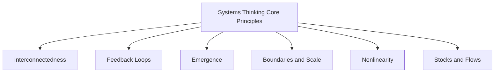
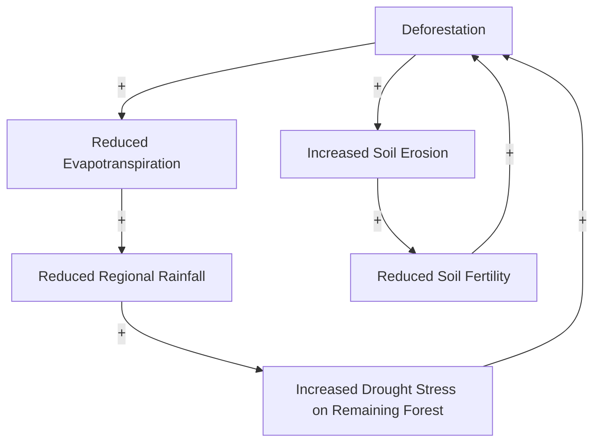

## Systems Thinking in Environmental Science

### Overview

Systems thinking is an analytical approach that examines environmental phenomena as products of interconnected components, feedback relationships, and emergent behaviors, rather than as isolated cause-and-effect chains. Where the preceding topics in this chapter examined specific Earth system components (spheres, energy balance, biogeochemical cycles, feedback loops, tectonics) individually, systems thinking provides the integrative conceptual and methodological framework for reasoning about how these components interact as a whole — and for recognizing when reductionist, single-variable analysis is insufficient to explain or predict environmental outcomes. This framework underpins environmental modeling, ecosystem management, sustainability science, and increasingly, geospatial approaches to representing coupled human-natural systems.

### Core Principles of Systems Thinking

**Key Points**

- **Interconnectedness**: Components of a system affect and are affected by other components, often across sphere boundaries (as established in Earth's Spheres and System Interactions) — meaning a change introduced at one point in a system rarely remains isolated to that point.
- **Feedback Loops**: As detailed in Earth System Feedback Loops, reinforcing and balancing feedback mechanisms determine whether a system amplifies or dampens an initial perturbation, and systems thinking treats identifying these loops as a primary analytical task.
- **Emergence**: System-level behaviors and properties can arise from component interactions that are not directly predictable from studying any single component in isolation — ecosystem resilience, for example, emerges from the interaction of many species and processes rather than being a property of any one species.
- **Boundaries and Scale**: Every systems analysis requires explicit definition of system boundaries (what is included versus treated as external input/output) and the spatial/temporal scale of analysis, since the same phenomenon can appear stable at one scale and highly dynamic at another.
- **Nonlinearity**: Many environmental system relationships are nonlinear — outputs are not proportional to inputs — meaning incremental changes can produce disproportionately small or large responses depending on the system's current state relative to thresholds.
- **Stocks and Flows**: A foundational systems dynamics concept distinguishing stocks (accumulated quantities at a point in time, e.g., atmospheric CO₂ concentration, forest biomass) from flows (rates of change into or out of a stock, e.g., annual emissions, annual growth) — mirroring the reservoir/flux framework introduced in Biogeochemical Cycles.

### Reductionist vs. Systems Approaches

| Aspect | Reductionist Approach | Systems Approach |
| --- | --- | --- |
| Focus | Isolated variables and direct causal chains | Interactions, feedback, and context among variables |
| Typical Method | Controlled single-variable experiments | Integrated modeling, network/flow analysis |
| Strength | Precise mechanistic understanding of a specific process | Captures indirect effects, feedback, and emergent behavior |
| Limitation | May miss indirect/delayed effects and cross-system interactions | Can be more complex to parameterize, validate, and communicate |
| Example Application | Measuring a single pollutant's toxicity threshold in a species | Modeling how that pollutant's release cascades through food webs, hydrology, and human exposure pathways |

[Inference] Most contemporary environmental science practice treats these two approaches as complementary rather than competing — reductionist methods typically supply the quantitative mechanistic relationships (e.g., specific reaction rates, dose-response curves) that are then assembled into a systems-level model, rather than systems thinking replacing detailed mechanistic study.

### Causal Loop Diagrams

A core tool in systems thinking is the causal loop diagram (CLD), which visually represents the direction and polarity (reinforcing or balancing) of causal relationships between system variables, making implicit feedback structures explicit and communicable.

In this illustrative example, deforestation reduces evapotranspiration, which can reduce regional rainfall, which increases drought stress on remaining forest, promoting further deforestation pressure or dieback — a reinforcing feedback loop. A parallel loop through erosion and reduced soil fertility can similarly reinforce further land clearing pressure. [Inference] This type of diagram illustrates the general structural pattern of self-reinforcing environmental degradation loops commonly discussed in land-use and deforestation literature; the specific strength, thresholds, and applicability of any such loop depend heavily on the particular region, forest type, and socioeconomic drivers involved, and should not be treated as a universally quantified mechanism.

### Systems Boundaries and Scale Dependence

**Key Points**

- **Spatial Scale**: A system analyzed at a small spatial scale (a single wetland) may appear to behave very differently than the same phenomenon analyzed at a larger scale (an entire watershed or airshed), since larger-scale analysis captures cross-boundary flows invisible at the smaller scale.
- **Temporal Scale**: As emphasized in the timescales discussion under Earth's Spheres and System Interactions, a system's apparent stability or volatility often depends heavily on the observation timeframe — a coastline may appear stable over a human observational period (years) while undergoing significant change over geologic timescales (millennia).
- **Open vs. Closed System Framing**: Most environmental systems are more accurately modeled as open systems (exchanging matter and/or energy across their defined boundary with surrounding systems) rather than closed systems, meaning boundary definition is inherently a modeling choice that affects which interactions are treated as internal (part of the feedback structure) versus external (exogenous inputs).
- **Nested Systems (Hierarchy Theory)**: Environmental systems are commonly understood as nested hierarchies — an individual organism exists within a population, within a community, within an ecosystem, within a landscape — with each level exhibiting emergent properties not fully reducible to the level below it.

### Resilience, Thresholds, and Regime Shifts

**Key Points**

- **Resilience**: In systems ecology, resilience refers to a system's capacity to absorb disturbance and reorganize while retaining essentially the same function, structure, and feedbacks — distinct from simple stability, since a resilient system can undergo substantial short-term change while still returning to its characteristic state.
- **Thresholds and Tipping Points**: As introduced in Earth System Feedback Loops, systems thinking emphasizes that many environmental systems do not respond gradually and reversibly to increasing pressure but instead can cross thresholds beyond which a qualitatively different, often self-reinforcing system state becomes dominant.
- **Regime Shifts**: A large, abrupt, and often persistent change in the structure and function of a system, frequently associated with crossing a threshold and the activation of a new set of dominant feedback loops (a commonly cited ecological example being a lake shifting from a clear-water, macrophyte-dominated state to a turbid, algae-dominated state following nutrient loading beyond a critical threshold). [Inference] The specific threshold conditions and reversibility of any given regime shift are generally treated in the ecological literature as system- and case-specific, requiring empirical study of the particular system rather than assumed from general theory alone.

### Coupled Human-Natural Systems

A central development in applied environmental systems thinking is the explicit integration of human social, economic, and institutional dynamics as system components interacting with biophysical processes, rather than treating human activity solely as an external driver acting upon a separate "natural" system.

**Key Points**

- **Coupled Human-Natural Systems (CHANS) / Social-Ecological Systems (SES)**: Frameworks explicitly modeling the bidirectional feedback between human decision-making (land use, resource extraction, policy) and biophysical system response (ecosystem services, environmental degradation, resource scarcity feedback).
- **Ecosystem Services Framing**: Conceptualizing the benefits humans derive from ecosystem functioning (provisioning, regulating, supporting, and cultural services) as a systems-thinking bridge connecting biophysical system state to human wellbeing and subsequent decision-making.
- **Adaptive Management**: A systems-informed management approach treating environmental management interventions as iterative experiments — monitoring system response and adjusting management action accordingly — explicitly acknowledging uncertainty and the likelihood of unanticipated feedback effects rather than assuming a single, static optimal management prescription.

### Systems Thinking Tools and Methods

**Key Points**

- **System Dynamics Modeling**: Quantitative simulation modeling using stocks, flows, and feedback loops (often implemented in dedicated system dynamics software) to project system behavior over time under different scenarios.
- **Agent-Based Modeling (ABM)**: Simulates individual agents (organisms, households, firms) following behavioral rules, allowing emergent system-level patterns to arise from the bottom-up interaction of many individual agents — particularly useful for coupled human-natural systems where heterogeneous individual decision-making matters.
- **Network Analysis**: Represents system components as nodes and their interactions/dependencies as edges, useful for analyzing structural properties like connectivity, centrality, and vulnerability to cascading failure within ecological or infrastructure networks.
- **Bayesian Networks and Causal Inference Methods**: Increasingly used to formally represent probabilistic causal relationships among system variables, supporting structured reasoning about environmental system behavior under uncertainty.

### Geospatial Applications of Systems Thinking

**Example**

Geospatial technology provides essential infrastructure for operationalizing systems thinking in environmental science, since most system components and interactions are inherently spatially distributed:

- **Integrated watershed models**: Couple GIS-based hydrologic, land-use, and water quality sub-models within a single spatial framework, explicitly representing feedback between upstream land management decisions and downstream water resource outcomes.
- **Land-use change and ecosystem service modeling**: GIS-integrated systems models (e.g., linking land-use change scenarios to spatially explicit ecosystem service value estimates) to support coupled human-natural systems analysis at landscape scale.
- **Agent-based land-use models**: Spatially explicit ABMs simulating individual landowner or farmer decision-making across a landscape, capturing emergent regional land-use patterns from heterogeneous individual behavior.
- **Network-based habitat connectivity analysis**: GIS-based network analysis representing habitat patches as nodes and dispersal corridors as edges, supporting systems-level assessment of landscape connectivity resilience to fragmentation.
- **Climate-land-water nexus modeling**: Integrated geospatial frameworks explicitly linking climate system feedback (see Earth System Feedback Loops), land-cover change, and water resource systems to support cross-sectoral environmental planning.

### Related Topics

- Earth's Spheres and System Interactions (foundational cross-sphere systems framework)
- Earth System Feedback Loops (feedback mechanics underlying systems behavior)
- Biogeochemical Cycles (stock-and-flow framework applied to specific elements)
- Coupled Human-Natural Systems and Social-Ecological Resilience
- System Dynamics and Agent-Based Modeling for Environmental Applications
- Ecosystem Services Assessment and Mapping
- Landscape Connectivity and Network Analysis in Conservation Planning