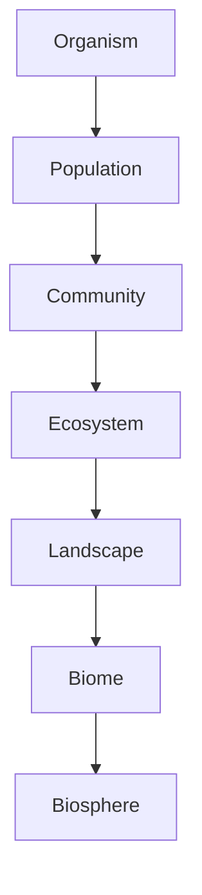
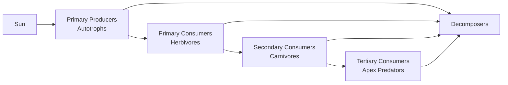

## Principles of Ecology

### Overview

Ecology is the scientific study of interactions among organisms and between organisms and their physical environment. As a foundational discipline for geospatial and environmental science, ecology provides the conceptual framework—energy flow, population dynamics, community structure, and ecosystem processes—that geospatial tools (remote sensing, spatial modeling, GIS-based habitat analysis) are used to measure, monitor, and predict. This section covers the core organizing principles of ecology at the organism, population, community, ecosystem, and biosphere levels.

**Key Points**

- Ecology operates across a hierarchy of biological organization: organism → population → community → ecosystem → biome → biosphere.
- Core unifying concepts include energy flow, nutrient cycling, population regulation, and niche theory.
- Spatial heterogeneity and scale dependency are central to modern ecological theory (landscape ecology), directly motivating the use of GIS and remote sensing in ecological research.

### Levels of Ecological Organization

- **Organism**: an individual living entity, studied through physiological and behavioral ecology (e.g., thermoregulation, foraging behavior).
- **Population**: a group of individuals of the same species occupying a defined area, characterized by density, birth/death rates, age structure, and spatial distribution pattern.
- **Community**: all populations of different species co-occurring and interacting in a given area.
- **Ecosystem**: a community plus its abiotic environment (soil, water, atmosphere), linked through energy flow and nutrient cycling.
- **Landscape**: a spatially heterogeneous mosaic of interacting ecosystems, the primary scale of landscape ecology.
- **Biome**: a large-scale ecological zone characterized by dominant vegetation and climate (e.g., tropical rainforest, tundra).
- **Biosphere**: the global sum of all ecosystems.

### Population Ecology

#### Population Growth Models

**Exponential growth** occurs under unlimited resources:

$$\frac{dN}{dt} = rN$$

where $N$ is population size and $r$ is the intrinsic growth rate.

**Logistic growth** incorporates carrying capacity $K$, the maximum population size an environment can sustain:

$$\frac{dN}{dt} = rN\left(1 - \frac{N}{K}\right)$$

**Key Points**

- Real populations rarely follow pure exponential growth indefinitely; density-dependent factors (competition, disease, predation) slow growth as $N$ approaches $K$.
- Density-independent factors (weather extremes, catastrophic events) affect population size regardless of density.

#### Population Distribution Patterns

| Pattern | Description | Typical Cause |
| --- | --- | --- |
| Clumped | Individuals aggregated in patches | Resource patchiness, social behavior |
| Uniform | Evenly spaced individuals | Territoriality, competition for resources |
| Random | No discernible pattern | Absence of strong social or resource interactions |

These spatial patterns are quantifiable using point pattern analysis (e.g., Ripley's K-function), a direct link between classical population ecology and spatial statistics used in GIS.

#### Life History Strategies

- **r-selected species**: high reproductive rate, short lifespan, minimal parental investment, thrive in unstable/disturbed environments (e.g., many insects, weeds).
- **K-selected species**: low reproductive rate, long lifespan, high parental investment, thrive near carrying capacity in stable environments (e.g., large mammals).

### Community Ecology

#### Species Interactions

| Interaction | Effect on Species A | Effect on Species B |
| --- | --- | --- |
| Competition | Negative | Negative |
| Predation | Positive | Negative |
| Parasitism | Positive | Negative |
| Mutualism | Positive | Positive |
| Commensalism | Positive | Neutral |
| Amensalism | Negative | Neutral |

#### Niche Theory

The **ecological niche** describes the full set of biotic and abiotic conditions and resources a species requires to persist (the "n-dimensional hypervolume," per G. Evelyn Hutchinson's formalization). The **competitive exclusion principle** states that two species with identical niches cannot coexist indefinitely; one will outcompete the other or niche differentiation will occur.

- **Fundamental niche**: the full range of conditions a species could theoretically occupy in the absence of competitors.
- **Realized niche**: the actual range occupied once competition and biotic interactions are accounted for.

This distinction is directly operationalized in species distribution modeling (SDM), where remote-sensing-derived environmental layers (temperature, precipitation, NDVI) are used to model realized niches from occurrence data (e.g., MaxEnt, random forest SDMs).

#### Community Structure and Succession

- **Species richness**: number of species present.
- **Species diversity**: incorporates richness and evenness (relative abundance), commonly quantified via the Shannon-Wiener index:

$$H' = -\sum_{i=1}^{S} p_i \ln p_i$$

where $p_i$ is the proportional abundance of species $i$.

- **Ecological succession**: the directional change in community composition over time following disturbance.
  - **Primary succession**: begins on newly exposed substrate with no prior soil (e.g., volcanic rock, glacial retreat).
  - **Secondary succession**: occurs after disturbance where soil remains (e.g., post-fire, post-agricultural abandonment).

Remote sensing time-series (e.g., Landsat-derived NDVI trajectories) are widely used to detect and characterize succession stages across landscapes.

### Ecosystem Ecology

#### Energy Flow

Energy enters ecosystems primarily through photosynthesis and flows unidirectionally through trophic levels, with substantial loss (as heat, via the second law of thermodynamics) at each transfer—commonly approximated by the **10% rule** (only ~10% of energy is transferred to the next trophic level).

- **Gross Primary Productivity (GPP)**: total energy fixed by autotrophs via photosynthesis.
- **Net Primary Productivity (NPP)**: GPP minus energy lost to plant respiration; represents energy available to consumers.

$$NPP = GPP - R_a$$

where $R_a$ is autotrophic respiration. NPP is a key variable estimated at global scale using satellite-derived vegetation indices (e.g., MODIS NPP products, NDVI/EVI-based light use efficiency models).

#### Biogeochemical Cycling

Nutrients cycle between biotic and abiotic pools, unlike energy which flows unidirectionally:

- **Carbon cycle**: photosynthesis/respiration exchange between atmosphere, biosphere, and lithosphere; central to climate modeling and carbon flux mapping.
- **Nitrogen cycle**: fixation, nitrification, denitrification—largely microbially mediated.
- **Phosphorus cycle**: primarily sedimentary, lacking a significant atmospheric phase, often a limiting nutrient in aquatic systems.
- **Water (hydrologic) cycle**: evaporation, transpiration, precipitation, runoff—directly monitored via remote sensing (evapotranspiration products, soil moisture satellites).

### Landscape Ecology and Spatial Heterogeneity

Landscape ecology extends classical ecological principles explicitly to spatial pattern and scale, forming the direct conceptual bridge to GIS and remote sensing applications.

**Key Points**

- **Patch-corridor-matrix model**: landscapes are conceptualized as patches (habitat units) embedded in a matrix (background land cover), connected or isolated by corridors.
- **Fragmentation**: the breaking apart of continuous habitat into smaller, isolated patches, quantified via landscape metrics (patch size, edge density, connectivity indices) commonly computed with tools like FRAGSTATS.
- **Edge effects**: altered abiotic/biotic conditions near patch boundaries (e.g., increased light, wind, predation pressure), which can be mapped and quantified using buffer analysis in GIS.
- **Scale dependency**: ecological patterns and processes observed at one spatial or temporal scale may not hold at another—directly analogous to the Modifiable Areal Unit Problem in spatial analysis.

### Applied Link to Geospatial Methods

**Example**

| Ecological Concept | Geospatial Method Commonly Used |
| --- | --- |
| Species distribution / niche | MaxEnt, random forest SDM using climate/NDVI layers |
| Primary productivity | MODIS NPP/GPP products, light-use-efficiency models |
| Habitat fragmentation | Landscape metrics (FRAGSTATS) from classified land cover |
| Population density mapping | Kernel density estimation from occurrence/telemetry data |
| Succession/disturbance tracking | Landsat time-series NDVI trajectory analysis |
| Connectivity/corridor modeling | Least-cost path and circuit theory (Circuitscape) |

### Practical Workflow Summary

1. Define the level of ecological organization relevant to the research question (population, community, ecosystem, landscape).
2. Select the appropriate quantitative framework (growth models, diversity indices, energy flow calculations).
3. Identify spatial and temporal scale-appropriate to the process being studied, accounting for scale dependency.
4. Link field/theoretical ecological variables to remotely sensed or spatially modeled proxies where direct measurement is impractical.
5. Validate spatial ecological models against independent field observations to assess transferability.

**Related Topics**

- Species Distribution Modeling (SDM)
- Landscape Connectivity and Circuit Theory
- Remote Sensing of Vegetation Indices (NDVI, EVI)
- Biodiversity Metrics and Spatial Diversity Indices
- Habitat Fragmentation Analysis with FRAGSTATS
- Carbon and Nitrogen Cycle Modeling
- Disturbance Ecology and Time-Series Change Detection
- Trophic Cascade Modeling in Spatial Food Webs