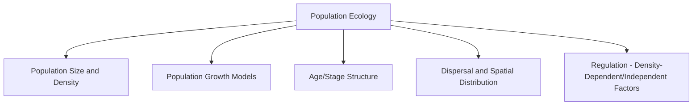
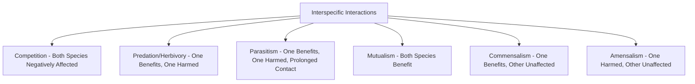

## Population and Community Ecology

### Overview

Population and community ecology examines how groups of organisms interact with one another and their environment at two related but distinct levels of biological organization: the population (individuals of a single species occupying a given area) and the community (all populations of different species co-occurring and interacting within a given area). This chapter transitions from the abiotic Earth system framework of the previous chapter to the biotic organization of the biosphere itself, providing the ecological foundation for understanding biodiversity patterns, ecosystem function, conservation planning, and the species-level dynamics that geospatial habitat and species distribution modeling seek to represent.

### Population Ecology Fundamentals

**Key Points**

- **Population Size and Density**: The total number of individuals of a species in a defined area (size) or the number per unit area/volume (density) — foundational metrics for nearly all population-level analysis.
- **Spatial Distribution Patterns**: Individuals within a population may be distributed in a clumped (aggregated, often due to resource patchiness or social behavior), uniform (regular spacing, often due to territoriality or competition), or random (independent of neighbor location, relatively uncommon in nature) pattern.
- **Age/Stage Structure**: The distribution of individuals across age classes or life-history stages, commonly visualized as a population pyramid; structure strongly influences a population's growth trajectory, since reproductive potential is concentrated in specific age/stage classes.
- **Dispersal**: The movement of individuals into (immigration) or out of (emigration) a population, distinct from within-population movement; dispersal connects otherwise spatially separated populations and underlies metapopulation dynamics.

### Population Growth Models

#### Exponential Growth

Describes growth under unlimited resources, where the population growth rate is proportional to current population size:

$$\frac{dN}{dt} = rN$$

where $N$ is population size, $t$ is time, and $r$ is the intrinsic rate of increase (per capita growth rate). This produces a characteristic J-shaped growth curve and is generally treated in ecological theory as an idealized case rarely sustained over long periods in nature due to resource limitation, though it can approximate short-term dynamics in newly colonized or resource-abundant environments.

#### Logistic Growth

Incorporates a carrying capacity ($K$), the maximum population size an environment can sustainably support given its resource base, producing growth that slows as population approaches $K$:

$$\frac{dN}{dt} = rN\left(1 - \frac{N}{K}\right)$$

This produces a characteristic S-shaped (sigmoid) growth curve. [Inference] The logistic model is widely used as a foundational teaching and conceptual tool in population ecology, though real populations frequently deviate from its assumptions (constant $K$, no time lags, no age structure effects) — more complex models incorporating these factors are commonly used in applied wildlife and fisheries management contexts.

### Density-Dependent and Density-Independent Regulation

**Key Points**

- **Density-Dependent Factors**: Regulatory factors whose effect on population growth rate intensifies as population density increases — competition for resources, predation (where predators focus effort on abundant prey), and disease transmission (which spreads more readily at higher density) are common examples, and these factors are generally understood to be central to producing logistic-type, carrying-capacity-bounded population dynamics.
- **Density-Independent Factors**: Regulatory factors whose effect on population growth rate does not depend on current population density — severe weather events, natural disasters, and some forms of habitat destruction are common examples, capable of causing significant population reduction regardless of how crowded or sparse the population currently is.
- **Interaction of Both Factor Types**: [Inference] Most real-world population dynamics are shaped by a combination of density-dependent and density-independent factors operating simultaneously, rather than being cleanly attributable to one category alone, making disentangling their relative contribution a common empirical challenge in population ecology research.

### Life History Strategies

**Key Points**

- **r-selected vs. K-selected Strategies**: A classical framework contrasting species adapted to exploit unstable or unpredictable environments through rapid reproduction and high offspring number with low individual investment (r-selected, e.g., many insects, weedy plants) versus species adapted to stable, resource-limited environments through fewer offspring with greater individual parental investment (K-selected, e.g., large mammals, many long-lived trees). [Inference] This r/K framework is widely taught as an introductory conceptual model but is frequently noted in contemporary ecological literature as an oversimplification of a more continuous, multidimensional trade-off space (often examined instead through more detailed life-history trait frameworks); it remains useful as a starting heuristic rather than a strict binary classification.
- **Semelparity vs. Iteroparity**: Distinguishes species that reproduce once in their lifetime, typically investing heavily in that single reproductive event (semelparous, e.g., Pacific salmon, many annual plants) from species that reproduce multiple times across their lifespan (iteroparous, e.g., most birds and mammals).

### Community Ecology Fundamentals

**Key Points**

- **Community**: The assemblage of populations of different species co-occurring and interacting within a defined area, characterized by species composition, relative abundance, and the network of interspecific interactions among its constituent populations.
- **Species Richness and Diversity**: Species richness is simply the count of distinct species present; species diversity indices (incorporating both richness and the evenness of relative abundance across species) provide a more nuanced single-value measure of community structure commonly used in ecological comparison and monitoring.
- **Community Structure**: Encompasses the relative abundance distribution of species (some communities are dominated by a few abundant species with many rare species; others are more even), trophic structure (the arrangement of feeding relationships), and spatial/vertical structuring (e.g., forest canopy stratification).

### Interspecific Interaction Types

**Key Points**

- **Competition**: Occurs when species require the same limited resource; interspecific competition can be direct (interference competition, active exclusion) or indirect (exploitation competition, resource depletion), and can lead to competitive exclusion (one species locally eliminating the other) or resource partitioning/niche differentiation as a coexistence outcome.
- **Predation and Herbivory**: A consumer-resource interaction benefiting the consumer at the direct expense of the consumed individual; predator-prey population dynamics can produce characteristic cyclical oscillations under certain conditions (a classical example widely discussed in ecological theory being reciprocal predator-prey population cycles), though [Inference] such clean cyclical dynamics are more commonly documented in specific well-studied systems than assumed to be universal across all predator-prey pairs.
- **Parasitism**: A prolonged, intimate interaction in which the parasite derives resources from a host, typically without immediately killing it (distinguishing parasitism from predation), with effects ranging from minor to substantially detrimental to host fitness.
- **Mutualism**: A reciprocally beneficial interaction, ranging from obligate (each species cannot persist without the other, e.g., many pollinator-plant relationships) to facultative (beneficial but not strictly required for either species' survival).
- **Commensalism and Amensalism**: Comparatively less commonly emphasized categories describing asymmetric interactions where one species is unaffected while the other is either benefited (commensalism) or harmed (amensalism).

### The Niche Concept

**Key Points**

- **Fundamental Niche**: The full range of environmental conditions and resources a species could theoretically occupy and use in the absence of biotic interactions (competition, predation) — essentially the species' physiological tolerance envelope.
- **Realized Niche**: The actual range of conditions and resources a species occupies in practice, typically narrower than the fundamental niche due to the constraining effects of competition, predation, and other biotic interactions with co-occurring species.
- **Niche Differentiation**: The process by which competing species evolve or behaviorally shift to use different subsets of a shared resource space, reducing direct competitive overlap and enabling coexistence — a central concept explaining how ecologically similar species can persist together within the same community.
- **Relevance to Species Distribution Modeling**: [Inference] The fundamental/realized niche distinction is directly relevant to interpreting species distribution models built from geospatial environmental data, since models trained on occurrence data typically estimate something closer to the realized niche (constrained by actual biotic interactions and dispersal limitations present at the time of observation) rather than the full fundamental niche.

### Trophic Structure and Food Webs

**Key Points**

- **Trophic Levels**: The hierarchical feeding position of organisms within a community — primary producers (autotrophs, typically photosynthetic organisms), primary consumers (herbivores), secondary and higher-order consumers (carnivores/omnivores), and decomposers (which process dead organic matter across all trophic levels).
- **Food Chains vs. Food Webs**: A food chain represents a single linear feeding pathway, while a food web represents the full, typically much more complex network of feeding interactions within a community — food webs are generally considered a more ecologically realistic representation, since most consumers feed at multiple trophic levels or on multiple prey species.
- **Trophic Cascades**: Indirect effects that propagate through multiple trophic levels, where a change at one trophic level (e.g., removal or reintroduction of a top predator) produces cascading effects on lower trophic levels — a widely cited example in ecological literature being predator-driven trophic cascades affecting herbivore populations and, subsequently, vegetation structure, though [Unverified] the specific magnitude and universality of any individual cited trophic cascade case study is often debated in the primary ecological literature and should be checked against current research rather than treated as a settled, simple causal chain.
- **Keystone Species**: A species whose impact on community structure is disproportionately large relative to its abundance or biomass — removal of a keystone species can trigger substantial community reorganization, distinguishing it conceptually from a merely dominant or abundant species.

### Community Assembly and Succession

**Key Points**

- **Primary Succession**: Community development on newly exposed substrate with no pre-existing soil or biological legacy (e.g., following volcanic lava flow cooling or glacial retreat), typically beginning with pioneer species capable of colonizing bare substrate.
- **Secondary Succession**: Community development following a disturbance that removes existing vegetation/community but leaves soil and some biological legacy intact (e.g., following fire, agricultural abandonment, or windthrow), generally proceeding more rapidly than primary succession due to the retained soil resource base.
- **Climax Community Concept**: A historically influential concept proposing that succession proceeds toward a stable, self-perpetuating end-state community determined by regional climate; [Inference] this classical climax model has been substantially revised in contemporary ecology toward a view emphasizing that many communities exist in a dynamic, disturbance-mediated mosaic of successional states rather than converging on a single deterministic endpoint, though the degree to which any given ecosystem approaches a recognizable "climax" state remains debated and system-specific.

### Geospatial Applications in Population and Community Ecology

**Example**

Geospatial and remote sensing methods are extensively used to study and monitor population and community-level ecological patterns:

- **Species distribution modeling (SDM)**: Combines species occurrence records with spatially continuous environmental covariates (climate, topography, land cover) to estimate a species' realized niche and predict its potential geographic distribution.
- **Habitat suitability and connectivity mapping**: GIS-based analysis integrating land cover, terrain, and known species habitat requirements to map suitable habitat patches and model landscape connectivity for dispersal (directly relevant to metapopulation dynamics).
- **Remote sensing of vegetation community structure**: Multispectral and LiDAR remote sensing used to characterize vegetation community composition, canopy structure, and successional stage across large landscapes without exhaustive field survey.
- **Population density and abundance mapping**: Combining field survey data (mark-recapture, distance sampling) with spatial covariates to produce continuous population density surface maps, supporting wildlife management and conservation planning.
- **Trophic and food web spatial analysis**: Increasingly, spatially explicit predator-prey and food web models integrate GIS-derived landscape structure to examine how habitat fragmentation and connectivity influence trophic interaction strength and cascade propagation.

### Related Topics

- Systems Thinking in Environmental Science (broader systems context for ecological interactions)
- Species Distribution Modeling and Habitat Suitability Analysis
- Landscape Connectivity and Network Analysis in Conservation Planning
- Remote Sensing of Vegetation Structure and Land Cover Classification
- Metapopulation Dynamics and Dispersal Modeling
- Trophic Cascades and Food Web Analysis
- Ecological Succession and Disturbance Ecology