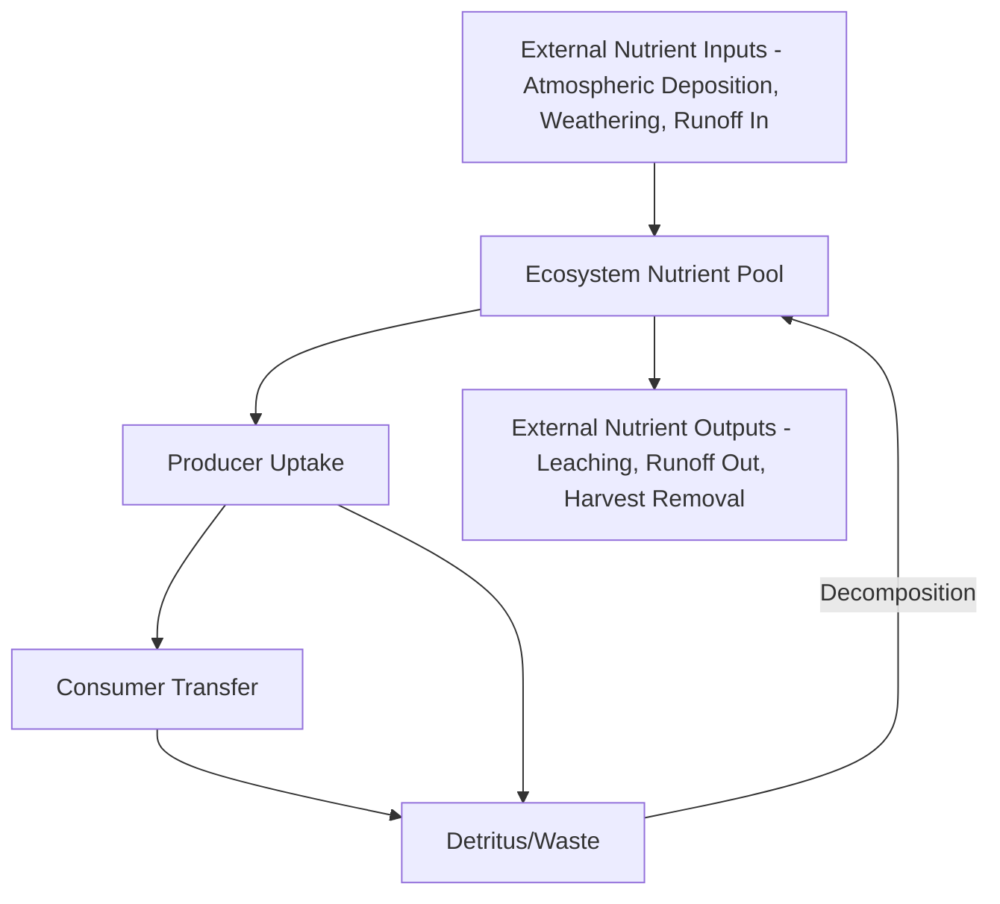

## Ecosystem Structure and Function

### Overview

Ecosystem structure and function examines ecosystems as integrated units combining the biotic community (introduced in Population and Community Ecology) with the abiotic environment (physical and chemical conditions), connected through energy flow and matter cycling. Where community ecology emphasizes species interactions, ecosystem ecology shifts focus to the flows of energy and nutrients that link biotic and abiotic components — treating the ecosystem itself as the fundamental unit of analysis. This framework directly extends the biogeochemical cycling and systems thinking concepts from the previous chapter, applying them at the scale of a defined ecological unit, and provides the conceptual foundation for ecosystem services assessment, landscape ecology, and ecosystem-based geospatial monitoring.

### Defining Ecosystem Structure

**Key Points**

- **Ecosystem Definition**: A community of organisms interacting with each other and with their physical/chemical environment, functioning together as a unit through energy flow and nutrient cycling; ecosystem boundaries are often somewhat arbitrarily defined by the observer for practical analysis, since matter and energy flows rarely respect sharp natural boundaries.
- **Biotic Components**: Producers (autotrophs), consumers (heterotrophs across multiple trophic levels), and decomposers/detritivores, mirroring the trophic structure introduced in community ecology but now analyzed specifically for their role in ecosystem-level energy and matter processing.
- **Abiotic Components**: Climate, soil/substrate characteristics, water availability, light, and nutrient availability — the physical and chemical template within which biotic processes occur and which biotic activity, in turn, can modify (e.g., vegetation influencing local microclimate and soil development).
- **Structural Complexity**: Vertical structure (e.g., forest canopy stratification, aquatic water column zonation) and horizontal spatial heterogeneity (patchiness in vegetation, soil, or resource distribution) both influence ecosystem function, including habitat availability, microclimate variation, and the pathways available for energy and nutrient flow.

### Energy Flow Through Ecosystems

**Key Points**

- **Gross Primary Production (GPP)**: The total rate of energy captured via photosynthesis by primary producers within an ecosystem, representing the total energy input to the biotic system before any losses.
- **Net Primary Production (NPP)**: GPP minus the energy producers use for their own respiration; NPP represents the energy actually available to support consumer (heterotrophic) biomass and is a commonly used metric for comparing ecosystem productivity.
- **Secondary Production**: The rate of biomass accumulation by heterotrophic consumers, derived from consuming producer or other consumer biomass.
- **The Ten Percent Rule (Trophic Efficiency)**: A widely cited approximation that roughly 10% of energy is transferred from one trophic level to the next, with the remainder lost primarily as metabolic heat through respiration; [Inference] this figure is a commonly used pedagogical approximation and actual trophic transfer efficiency varies substantially across ecosystem types and specific trophic transitions, so it should be treated as an order-of-magnitude heuristic rather than a precise universal constant.
- **Energy Flow Is Unidirectional**: Unlike matter, which cycles and is reused (see Biogeochemical Cycles), energy flows through an ecosystem in one direction — from solar input through trophic levels and ultimately dissipated as heat — meaning ecosystems require continuous energy input (overwhelmingly solar, with a comparatively minor contribution from chemosynthesis in specific environments such as deep-sea hydrothermal vent communities) to sustain their trophic structure.

### Ecological Pyramids

Ecological pyramids provide a visual and quantitative representation of how a given quantity changes across trophic levels:

| Pyramid Type | What It Represents | Typical Shape |
| --- | --- | --- |
| Pyramid of Numbers | Count of individual organisms at each trophic level | Usually upright, but can be inverted (e.g., many herbivorous insects supported by few large trees) |
| Pyramid of Biomass | Total mass of organisms at each trophic level | Usually upright in terrestrial systems; can be inverted in some aquatic systems (e.g., phytoplankton with rapid turnover supporting larger standing zooplankton biomass) |
| Pyramid of Energy | Rate of energy flow through each trophic level | Always upright, since energy transfer efficiency between levels is always less than 100% (a direct consequence of the second law of thermodynamics) |

[Inference] The pyramid of energy is generally emphasized in ecological theory as the most fundamentally reliable of the three, since it reflects a thermodynamic constraint rather than a snapshot count or standing stock that can be distorted by differing organism turnover rates or measurement timing.

### Nutrient Cycling Within Ecosystems

Building directly on the global biogeochemical cycles covered previously, ecosystem ecology examines nutrient cycling at the scale of an individual ecosystem, distinguishing internal cycling from cross-boundary inputs and outputs.

**Key Points**

- **Internal (Within-Ecosystem) Cycling**: The recurring movement of nutrients among producers, consumers, decomposers, and the local abiotic nutrient pool (soil, sediment, water) without leaving the defined ecosystem boundary.
- **Nutrient Inputs**: Atmospheric deposition, geological weathering of parent material, and inflow from adjacent ecosystems (e.g., upstream nutrient transport into a downstream aquatic ecosystem) all represent external additions to an ecosystem's nutrient budget.
- **Nutrient Outputs**: Leaching, erosion/runoff, and, in managed ecosystems, harvest removal all represent nutrient losses from the ecosystem, and the balance between inputs and outputs over time determines whether an ecosystem's nutrient capital is increasing, stable, or depleting.
- **Decomposition Rate as a Controlling Process**: The rate at which decomposers break down organic matter and release nutrients back into available form is a major determinant of overall nutrient cycling speed within an ecosystem, strongly influenced by temperature, moisture, and the chemical composition (e.g., lignin content) of the organic material being decomposed.

### Ecosystem Types and Biomes

**Key Points**

- **Terrestrial Biomes**: Large-scale terrestrial ecosystem classifications determined primarily by climate (temperature and precipitation regime) — examples include tropical rainforest, temperate deciduous forest, grassland/savanna, desert, and tundra, each characterized by distinctive vegetation structure and adapted biotic communities.
- **Aquatic Ecosystems**: Broadly divided into freshwater (lakes, rivers, wetlands) and marine (coastal, open ocean, deep sea) systems, further differentiated by factors including salinity, light penetration, water movement, and depth.
- **Biome Classification Frameworks**: [Inference] Multiple biome classification schemes exist in the ecological literature (varying in the number and boundary criteria of recognized biome categories), and the specific scheme used often depends on the discipline or application context, so a stated biome count or exact boundary criteria should be understood as scheme-dependent rather than a single universal standard.
- **Ecotones**: Transition zones between adjacent ecosystem types or biomes, often characterized by a blend of species from both adjoining systems plus some edge-specialist species, and frequently exhibiting elevated structural complexity and biodiversity relative to the adjoining core ecosystem types (an "edge effect").

### Ecosystem Function and Services

**Key Points**

- **Provisioning Services**: Direct material outputs ecosystems provide, such as food, fresh water, timber, and genetic resources.
- **Regulating Services**: Ecosystem processes that regulate environmental conditions relevant to human wellbeing, such as climate regulation (carbon sequestration), water purification, flood mitigation, and pollination.
- **Supporting Services**: Underlying ecological processes necessary for the production of other services, such as nutrient cycling, soil formation, and primary production — these services support the other categories rather than providing direct human benefit themselves.
- **Cultural Services**: Non-material benefits including recreation, aesthetic value, and spiritual/cultural significance derived from ecosystems.
- **Ecosystem Function vs. Ecosystem Service**: A conceptual distinction in the literature between ecosystem function (an ecological process occurring regardless of human valuation, e.g., nutrient cycling occurring in an ecosystem with no human observers) and ecosystem service (the subset of ecosystem functions that humans derive value from) — this distinction matters for how ecosystem assessments are framed and communicated.

### Ecosystem Resilience and Disturbance

**Key Points**

- **Disturbance Regimes**: Ecosystems are shaped by characteristic patterns of periodic disturbance (fire, flooding, windthrow, disease outbreak, herbivory pulses), and many ecosystem types are understood in contemporary ecology as fundamentally disturbance-dependent, meaning their characteristic structure and composition depend on a recurring disturbance regime rather than representing a static undisturbed state (extending the succession discussion from Population and Community Ecology).
- **Resistance vs. Resilience**: Resistance describes an ecosystem's capacity to remain relatively unchanged despite a disturbance, while resilience (as introduced in Systems Thinking in Environmental Science) describes its capacity to recover its characteristic structure and function following disturbance — these are related but distinct properties, and an ecosystem can be low in resistance but high in resilience, or vice versa.
- **Alternative Stable States**: Some ecosystems, following sufficiently severe disturbance or gradual pressure, can shift to a persistently different structural/functional state rather than returning to the pre-disturbance condition — directly connecting to the regime shift and threshold concepts introduced in the systems thinking discussion.

### Geospatial and Remote Sensing Applications

**Example**

Ecosystem structure and function assessment relies extensively on geospatial and remote sensing methods, since direct field measurement of energy flow and nutrient cycling across large areas is impractical:

- **Net Primary Production Estimation**: Satellite-derived vegetation indices (NDVI, EVI) combined with light-use efficiency models are widely used to estimate spatially continuous NPP across landscapes, regions, and globally, supporting carbon cycle and ecosystem productivity assessment.
- **Ecosystem Structure Characterization via LiDAR**: Airborne and satellite LiDAR provide direct three-dimensional measurement of vegetation canopy structure (height, layering, gap structure), supporting structural complexity assessment relevant to habitat quality and carbon stock estimation.
- **Biome and Land Cover Mapping**: Multispectral satellite classification is the primary method for mapping biome and ecosystem type distribution at regional to global scale, and time-series classification supports monitoring ecosystem type transitions (e.g., deforestation-driven biome boundary shifts).
- **Ecosystem Service Mapping and Valuation**: GIS-integrated models combining land cover, hydrology, and biophysical process models to spatially map and, in some frameworks, economically value specific ecosystem services (carbon storage, water yield, habitat provision) across a landscape.
- **Disturbance and Resilience Monitoring**: Satellite time-series analysis (e.g., detecting fire scars, post-disturbance vegetation recovery trajectories) supports empirical assessment of ecosystem resistance and resilience properties across large spatial extents and multi-decadal time periods.

### Related Topics

- Population and Community Ecology (biotic component foundation for ecosystem structure)
- Biogeochemical Cycles (global-scale nutrient cycling context for ecosystem-level cycling)
- Systems Thinking in Environmental Science (resilience, feedback, and threshold concepts)
- Net Primary Production Estimation via Remote Sensing
- LiDAR-Based Forest Structure and Biomass Assessment
- Ecosystem Services Mapping and Valuation Methods
- Land Cover Classification and Biome Mapping
- Disturbance Ecology and Post-Fire Recovery Monitoring