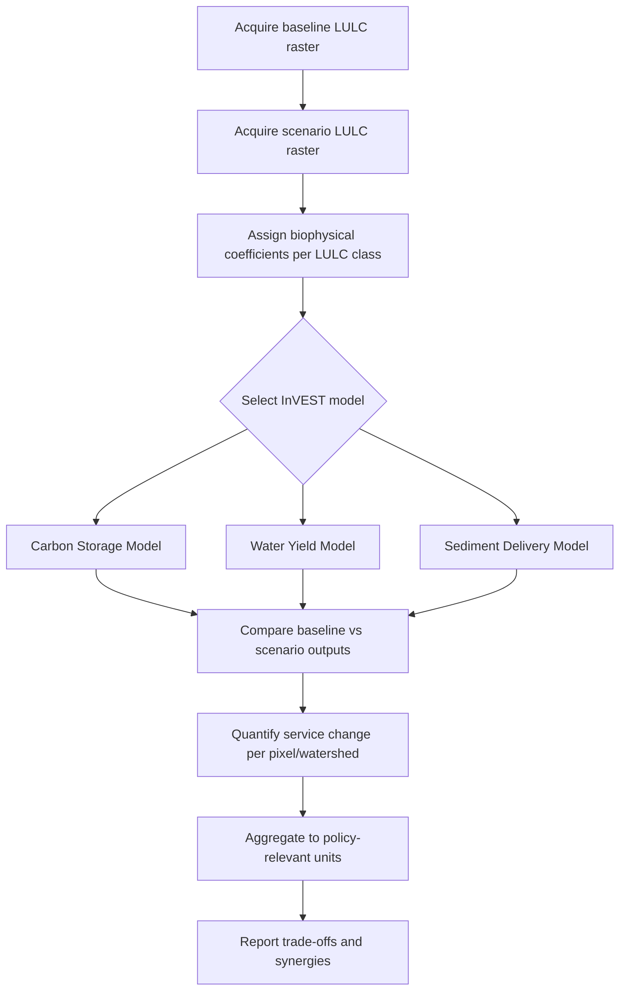

## Ecosystem Services

### Definition and Conceptual Framework

Ecosystem services are the benefits that human populations derive, directly or indirectly, from ecosystem functions and processes. The concept formalizes the linkage between the structure and function of natural systems (biodiversity, biogeochemical cycling, energy flow) and human welfare, providing an economic and policy vocabulary for what were previously treated as unpriced externalities.

The dominant classification framework originates from the Millennium Ecosystem Assessment (MEA, 2005), which grouped services into four categories:

- **Provisioning services**: Material or energy outputs extracted directly from ecosystems (food, fresh water, timber, fiber, genetic resources, biochemicals, fuelwood)
- **Regulating services**: Benefits from the regulation of ecosystem processes (climate regulation, flood control, disease regulation, water purification, pollination, carbon sequestration)
- **Cultural services**: Nonmaterial benefits (recreation, aesthetic value, spiritual enrichment, education, sense of place)
- **Supporting services**: Processes necessary for the production of all other services (nutrient cycling, soil formation, primary production, habitat provision)

A later refinement, The Economics of Ecosystems and Biodiversity (TEEB, 2010) and the Common International Classification of Ecosystem Services (CICES), collapses supporting services into the other three categories to avoid double-counting, since supporting services are intermediate processes rather than final benefits. CICES structures services hierarchically (Section → Division → Group → Class) to standardize accounting across studies.

### Underlying Ecological Basis

Ecosystem services emerge from ecosystem structure (species composition, trophic architecture, spatial configuration) and ecosystem function (energy flow, nutrient cycling, disturbance regimes). The relationship is not always linear:

$$ES = f(B, F, S)$$

where $ES$ is the service flow, $B$ is biodiversity (compositional and functional), $F$ is ecosystem function, and $S$ represents spatial/landscape configuration. This relationship is typically nonlinear and threshold-dependent — services can decline abruptly once a functional or structural threshold is crossed, rather than degrading proportionally with biodiversity loss.

Key mechanistic pathways:

- **Biodiversity–function relationships**: Functional redundancy among species provides insurance against service loss when individual species decline (the "insurance hypothesis"). Response diversity (variation in how species react to disturbance) stabilizes service delivery under environmental variability.
- **Trophic cascades**: Removal of keystone predators can restructure entire service bundles (e.g., sea otter loss → urchin barrens → kelp forest collapse → loss of coastal carbon sequestration and fisheries habitat)
- **Landscape connectivity**: Many regulating services (pollination, pest control, water regulation) depend on spatial arrangement, not just total habitat area — fragmentation can degrade services even when aggregate habitat area is preserved

### Service Bundles, Trade-offs, and Synergies

Ecosystem services rarely occur in isolation; they interact as **bundles** — sets of services that recur together across a landscape due to shared underlying drivers.

- **Trade-offs**: Increasing one service reduces another (e.g., converting forest to cropland increases provisioning of food but decreases carbon sequestration, water regulation, and habitat services). Trade-offs can be:
  - Spatial (service produced in one location, consumed in another — e.g., upstream watershed protection benefiting downstream users)
  - Temporal (short-term provisioning gains vs. long-term regulating service losses)
  - Reversible vs. irreversible (soil formation is essentially non-renewable on human timescales)
- **Synergies**: Positive correlations, often from a shared driver (e.g., forest restoration jointly increasing carbon storage, biodiversity habitat, and water quality)

Land-use intensification gradients typically show a monotonic trade-off between provisioning services and regulating/cultural services, a pattern well-documented in agricultural intensification studies.

### Valuation Methods

Because most ecosystem services are not transacted in markets, valuation requires non-market economic techniques:

| Method | Approach | Typical Application |
| --- | --- | --- |
| Market Price Method | Uses observed market prices for directly traded services | Timber, fisheries, crops |
| Replacement Cost | Cost to replace the service with a built alternative | Wetland flood control vs. engineered levees |
| Avoided Damage Cost | Value inferred from damages prevented | Coastal wetlands buffering storm surge |
| Travel Cost Method | Infers recreational value from travel expenditure to a site | Park and protected area visitation |
| Hedonic Pricing | Decomposes property value differentials attributable to environmental amenities | Proximity to urban green space, air quality |
| Contingent Valuation | Survey-based willingness-to-pay elicitation | Existence value, cultural/spiritual services |
| Choice Experiments | Stated-preference method using attribute trade-offs | Multi-attribute service bundles |
| Benefit Transfer | Applies valuation estimates from existing studies to a new site | Rapid regional/global assessments |

**[Inference]** Benefit transfer, while widely used for large-scale assessments such as Costanza et al.'s global ecosystem service valuation estimates, carries substantial uncertainty when transferred across biophysical and socioeconomic contexts that differ significantly from the original study site.

### Geospatial Modeling of Ecosystem Services

Ecosystem service assessment relies heavily on GIS-based biophysical modeling to spatially quantify service supply, demand, and flow.

**InVEST (Integrated Valuation of Ecosystem Services and Tradeoffs)**, developed by the Natural Capital Project (Stanford, University of Minnesota, TNC, WWF), is the most widely used open-source toolset. Core InVEST models relevant to this domain include:

- **Carbon Storage and Sequestration**: Uses land-use/land-cover (LULC) maps combined with carbon pool estimates (aboveground biomass, belowground biomass, soil, dead organic matter) per LULC class
- **Water Yield**: Implements a Budyko-based annual water balance:

$$Y_x = \left(1 - \frac{AET_x}{P_x}\right) \cdot P_x$$

where $Y_x$ is water yield at pixel $x$, $AET_x$ is actual evapotranspiration, and $P_x$ is precipitation.

- **Sediment Delivery Ratio (SDR)**: Combines the Revised Universal Soil Loss Equation (RUSLE) with a connectivity index to route sediment from source pixels to the stream network
- **Nutrient Delivery Ratio (NDR)**: Analogous to SDR but for nitrogen/phosphorus export
- **Habitat Quality**: Combines LULC data with threat layers (roads, agriculture, urban proximity) to produce a habitat degradation and quality index
- **Pollination**: Models pollinator abundance based on nesting habitat and floral resource availability within species-specific foraging ranges
- **Coastal Vulnerability / Blue Carbon**: Assesses coastal protection services from habitats like mangroves, seagrass, and coral reefs

**[Unverified]** Specific parameter defaults and required input formats change across InVEST versions; consult the current InVEST User Guide for the model version in use.

Other geospatial tools in this space:

- **ARIES (Artificial Intelligence for Environment & Sustainability)**: Bayesian network-based service flow modeling
- **Google Earth Engine (GEE)**: Used for deriving the LULC, NDVI, and land-cover change time series that feed InVEST and other biophysical models at scale
- **SolVES (Social Values for Ecosystem Services)**: Spatially models cultural/perceived values using public participation GIS (PPGIS) data

### Workflow: Land-Use Change Impact on Ecosystem Services

### Practical Example: Watershed Carbon and Water Yield Assessment

A typical geospatial workflow for assessing land-use conversion impacts:

1. Obtain LULC classification rasters (e.g., from Sentinel-2 or Landsat classification, or existing products like ESA WorldCover) for two time periods
2. Build a biophysical lookup table assigning carbon pool densities (Mg C/ha) to each LULC class, sourced from IPCC Tier 1 defaults or local field inventories
3. Run the InVEST Carbon model on both LULC rasters
4. Compute the pixel-wise difference to identify carbon loss/gain hotspots:

$$\Delta C = C_{scenario} - C_{baseline}$$

5. Repeat with the Water Yield model using precipitation (e.g., WorldClim/CHIRPS) and PET (potential evapotranspiration) rasters, and root-restricting layer depth
6. Aggregate results by watershed boundary (delineated via a DEM-derived flow accumulation network) to report changes in Mg C and $m^3$/year of water yield per subbasin

**[Inference]** Since InVEST models are typically calibrated to annual or long-term average conditions, they are generally more suited to strategic/scenario comparison than to prediction of specific event-driven service losses (e.g., a single storm's sediment pulse).

### Payments for Ecosystem Services (PES) and Policy Instruments

- **PES schemes**: Conditional transfers to landowners for maintaining or enhancing service provision (e.g., Costa Rica's Pagos por Servicios Ambientales program, watershed protection payments)
- **REDD+ (Reducing Emissions from Deforestation and Forest Degradation)**: Carbon-focused PES mechanism under UNFCCC, requiring MRV (measurement, reporting, verification) systems often built on remote sensing forest cover change detection
- **Biodiversity/wetland banking**: Market-based offset mechanisms requiring "no net loss" accounting, common in U.S. Clean Water Act Section 404 permitting
- **Natural Capital Accounting**: System of Environmental-Economic Accounting (SEEA), a UN statistical standard integrating ecosystem extent, condition, and service accounts into national accounting frameworks alongside GDP

### Ecosystem Disservices

Not all ecosystem outputs are beneficial; **ecosystem disservices** are negative effects on human well-being generated by ecosystems (e.g., crop damage from wildlife, vector-borne disease habitat, allergenic pollen, wildfire risk from fuel accumulation). Comprehensive ecosystem service assessments increasingly net disservices against services rather than treating the ledger as one-directional.

### Common Pitfalls in Ecosystem Service Assessment

- Double-counting supporting services alongside the final services they underpin
- Treating spatially transferred benefit-transfer values as site-specific without sensitivity analysis
- Ignoring the beneficiary side (service demand) and mapping supply alone, which conflates ecological potential with realized human benefit
- Static assessment of inherently dynamic, threshold-sensitive systems, obscuring nonlinear collapse risk
- Aggregating monetary valuations across incommensurable service types without acknowledging methodological inconsistency between methods (e.g., summing contingent valuation and market price estimates)

### SVG Diagram: MEA Ecosystem Service Categories (svg_diagram)

<svg xmlns="http://www.w3.org/2000/svg" viewBox="0 0 760 460">
<text x="380" y="30" font-family="Arial, sans-serif" font-size="20" font-weight="bold" text-anchor="middle" fill="#1a1a1a">Ecosystem Service Categories (svg_diagram)</text>
<rect x="290" y="200" width="180" height="70" rx="8" fill="#4a7c59" stroke="#2d4a35" stroke-width="2" />
<text x="380" y="230" font-family="Arial, sans-serif" font-size="15" font-weight="bold" text-anchor="middle" fill="#ffffff">Supporting</text>
<text x="380" y="250" font-family="Arial, sans-serif" font-size="11" text-anchor="middle" fill="#e8f0e8">Nutrient cycling, soil formation,</text>
<text x="380" y="263" font-family="Arial, sans-serif" font-size="11" text-anchor="middle" fill="#e8f0e8">primary production</text>
<rect x="50" y="60" width="180" height="90" rx="8" fill="#c9622a" stroke="#8f451d" stroke-width="2" />
<text x="140" y="90" font-family="Arial, sans-serif" font-size="15" font-weight="bold" text-anchor="middle" fill="#ffffff">Provisioning</text>
<text x="140" y="112" font-family="Arial, sans-serif" font-size="11" text-anchor="middle" fill="#fbe6d9">Food, fresh water,</text>
<text x="140" y="126" font-family="Arial, sans-serif" font-size="11" text-anchor="middle" fill="#fbe6d9">timber, fiber,</text>
<text x="140" y="140" font-family="Arial, sans-serif" font-size="11" text-anchor="middle" fill="#fbe6d9">genetic resources</text>
<rect x="530" y="60" width="180" height="90" rx="8" fill="#2a6f97" stroke="#1c4a66" stroke-width="2" />
<text x="620" y="90" font-family="Arial, sans-serif" font-size="15" font-weight="bold" text-anchor="middle" fill="#ffffff">Regulating</text>
<text x="620" y="112" font-family="Arial, sans-serif" font-size="11" text-anchor="middle" fill="#d9ecf7">Climate regulation,</text>
<text x="620" y="126" font-family="Arial, sans-serif" font-size="11" text-anchor="middle" fill="#d9ecf7">flood control,</text>
<text x="620" y="140" font-family="Arial, sans-serif" font-size="11" text-anchor="middle" fill="#d9ecf7">pollination</text>
<rect x="290" y="360" width="180" height="90" rx="8" fill="#8e5ba6" stroke="#5f3a72" stroke-width="2" />
<text x="380" y="390" font-family="Arial, sans-serif" font-size="15" font-weight="bold" text-anchor="middle" fill="#ffffff">Cultural</text>
<text x="380" y="412" font-family="Arial, sans-serif" font-size="11" text-anchor="middle" fill="#efe3f3">Recreation, aesthetic value,</text>
<text x="380" y="426" font-family="Arial, sans-serif" font-size="11" text-anchor="middle" fill="#efe3f3">spiritual enrichment</text>
<line x1="290" y1="220" x2="230" y2="140" stroke="#555555" stroke-width="2" />
<line x1="470" y1="220" x2="530" y2="140" stroke="#555555" stroke-width="2" />
<line x1="380" y1="200" x2="380" y2="360" stroke="#555555" stroke-width="2" />

<text x="380" y="330" font-family="Arial, sans-serif" font-size="11" font-style="italic" text-anchor="middle" fill="`#444444`">underpins all final services</text>

</svg>

### Related Topics

- Biodiversity–ecosystem function (BEF) theory and functional redundancy
- Landscape ecology and connectivity modeling
- InVEST model parameterization and calibration workflows
- Remote sensing–based land-use/land-cover classification (Sentinel-2, Landsat, GEE)
- Payments for Ecosystem Services (PES) program design and MRV systems
- Natural capital accounting (SEEA-EA)
- Trophic cascade theory and keystone species dynamics
- Wetland and blue carbon ecosystem valuation
- Watershed delineation and hydrological modeling (DEM-based flow routing)
- Resilience theory and ecological thresholds/tipping points