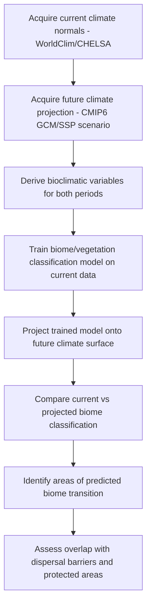

## Biomes and Ecological Zonation

### Definition and Conceptual Framework

A **biome** is a large-scale ecological unit characterized by a distinctive vegetation structure and animal community, shaped primarily by regional climate (temperature and precipitation regimes) rather than taxonomic composition — convergent biomes on different continents (e.g., temperate grasslands in North America and Eurasian steppe) share structural and functional characteristics despite having largely different species pools. **Ecological zonation** refers to the spatial patterning of ecological communities along environmental gradients, operating at scales ranging from centimeters (intertidal zonation) to thousands of kilometers (latitudinal biome bands).

Biomes are distinguished from **ecosystems** (localized, functionally-bounded systems of interacting organisms and their abiotic environment) and from **ecoregions** (finer-grained biogeographic units nested within biomes, defined by distinct species assemblages, e.g., WWF's Terrestrial Ecoregions of the World). The hierarchy typically runs:

$$\text{Biosphere} \rightarrow \text{Biome} \rightarrow \text{Ecoregion} \rightarrow \text{Ecosystem} \rightarrow \text{Community} \rightarrow \text{Population}$$

### Climatic Determinants of Biome Distribution

Biome boundaries correlate strongly with two primary climatic variables: mean annual temperature (MAT) and mean annual precipitation (MAP), along with their seasonal distribution.

**Whittaker biome classification** plots biomes on a two-axis climate diagram (temperature vs. precipitation), producing overlapping envelopes rather than sharp boundaries — reflecting that biome identity is probabilistically, not deterministically, linked to climate.

**Köppen-Geiger climate classification** is the most widely used quantitative system, using threshold-based rules on temperature and precipitation to assign five primary groups:

| Group | Descriptor | Approx. Biome Correspondence |
| --- | --- | --- |
| A | Tropical | Tropical rainforest, tropical savanna |
| B | Arid | Desert, semi-arid shrubland/steppe |
| C | Temperate | Mediterranean, temperate forest |
| D | Continental | Boreal forest (taiga), temperate deciduous forest |
| E | Polar | Tundra, ice cap |

**Holdridge life zone system** uses biotemperature, precipitation, and a potential evapotranspiration ratio (PET/precipitation) on a triangular grid, more explicitly linking classification to physiological limits on plant growth.

### Major Terrestrial Biomes

- **Tropical rainforest**: High MAT (>20°C), high MAP (>2000 mm/yr, aseasonal), highest terrestrial biodiversity and net primary productivity (NPP); nutrient cycling dominated by rapid decomposition with nutrients stored in biomass rather than soil
- **Tropical savanna**: Seasonal precipitation with a pronounced dry season; fire and herbivory maintain a grass-dominated understory with scattered trees; fire return interval is a key structuring disturbance
- **Desert**: MAP typically <250 mm/yr; vegetation adapted via CAM/C4 photosynthesis, succulence, or drought-deciduousness; classified further by temperature regime (hot desert vs. cold desert, e.g., Sahara vs. Gobi)
- **Temperate grassland/steppe**: MAP intermediate (250–800 mm/yr), insufficient to support closed forest canopy under the local disturbance regime (fire, grazing); deep, organic-rich Mollisol soils
- **Mediterranean shrubland (chaparral/fynbos/matorral)**: Winter-wet, summer-dry precipitation regime; sclerophyllous, fire-adapted vegetation; occurs in five widely separated regions (California, Chile, Mediterranean Basin, South African Cape, Southwest Australia) as a classic case of convergent evolution
- **Temperate deciduous forest**: Moderate MAT with cold-season dormancy; leaf abscission as an adaptation to seasonal water/light limitation
- **Temperate rainforest**: High, aseasonal precipitation in temperate latitudes (e.g., Pacific Northwest, Valdivian forest); often dominated by long-lived conifers
- **Boreal forest (taiga)**: Cold MAT, low evapotranspiration; coniferous-dominated (Picea, Pinus, Abies); underlain frequently by permafrost, constraining nutrient cycling and rooting depth
- **Tundra**: Short growing season, permafrost-limited rooting depth, low-stature vegetation (graminoids, mosses, lichens, dwarf shrubs); further divided into Arctic and alpine tundra

### Aquatic and Marine Biome Analogs

Aquatic systems are zoned primarily by light penetration, depth, salinity, and nutrient availability rather than temperature/precipitation:

- **Freshwater**: Lentic (lakes, ponds) vs. lotic (rivers, streams) systems, further zoned vertically in lakes into epilimnion, thermocline (metalimnion), and hypolimnion based on thermal stratification
- **Marine**: Zoned by depth into photic (euphotic) zone, mesopelagic (twilight) zone, and aphotic (bathypelagic, abyssal, hadal) zones; horizontally into neritic (over continental shelf) vs. oceanic zones
- **Estuarine/coastal**: Salinity gradient-driven zonation (mangroves, salt marshes, seagrass beds)
- **Coral reef**: Analogous to tropical rainforest in productivity and biodiversity, constrained to warm, shallow, low-turbidity, low-nutrient waters within the photic zone

### Vertical and Latitudinal Zonation

- **Altitudinal zonation**: Mountain ecosystems replicate latitudinal biome sequences over short vertical distances due to the adiabatic lapse rate (~6.5°C/km), producing montane forest → subalpine → alpine tundra → nival zones; the elevational analog of the tropical-to-polar latitudinal gradient
- **Latitudinal biome gradient**: Correlates with insolation and the global atmospheric circulation cells (Hadley, Ferrel, Polar), which set the large-scale precipitation belts (e.g., ITCZ-driven tropical rainfall, subtropical high-pressure deserts around 30°N/S)
- **Intertidal zonation**: A commonly cited fine-scale zonation example, structured by tidal exposure duration and desiccation/thermal stress gradients (supralittoral, eulittoral, sublittoral zones), with community boundaries often set by a combination of physical stress tolerance (upper limits) and biotic interactions such as competition and predation (lower limits) — the classic Connell (1961) barnacle zonation model

### Biome Shift and Climate Change Dynamics

**[Inference]** Because biome boundaries are fundamentally climate-envelope phenomena, anthropogenic climate change is expected to drive geographic range shifts (poleward and upslope) in biome boundaries, though the rate of vegetation community turnover characteristically lags climate change due to the longevity of dominant tree species and dispersal limitation — a phenomenon termed "climatic disequilibrium" or vegetation lag.

Key mechanisms of biome transition under climate/land-use stress:

- **Woody encroachment**: Grassland/savanna conversion to shrubland under fire suppression and CO2 fertilization effects on woody plant growth
- **Boreal-tundra treeline shift**: Documented poleward and upslope advance of treeline under warming, though constrained by permafrost thaw dynamics and local disturbance
- **Biome-scale tipping points**: Amazon rainforest dieback risk under compounding deforestation and reduced dry-season precipitation is a widely studied potential large-scale, potentially self-reinforcing regime shift

### Geospatial Methods for Biome and Zonation Mapping

- **Remote sensing classification**: Land cover/biome mapping typically uses multispectral or hyperspectral satellite imagery (Landsat, Sentinel-2, MODIS) with vegetation indices such as NDVI:

$$NDVI = \frac{NIR - Red}{NIR + Red}$$

used as a proxy for vegetation greenness/productivity, and often combined with land surface temperature and precipitation layers in supervised classification algorithms (random forest, support vector machines) to map biome or land-cover class

- **Bioclimatic modeling**: WorldClim and CHELSA provide gridded historical and projected climate surfaces (the standard 19 "bioclimatic variables," e.g., BIO1 = annual mean temperature, BIO12 = annual precipitation) used as predictors in species distribution and biome envelope models
- **Species distribution modeling (SDM) / niche modeling**: Algorithms such as MaxEnt project climate envelopes onto geographic space to model current and future biome-scale suitability
- **DEM-derived zonation**: Digital elevation models are used to derive elevation, slope, and aspect layers for altitudinal zonation mapping in montane terrain
- **Ecoregion datasets**: WWF Terrestrial Ecoregions of the World (Olson et al.) and Resolve Ecoregions 2017 provide vector-based global ecoregion/biome boundary datasets widely used as base layers in conservation planning GIS

### Workflow: Mapping Biome Shift Risk Under a Climate Scenario

### Practical Example: Classifying Biome Boundaries from Climate Grids

A simplified rule-based approach to approximate Köppen-Geiger-style biome classification from gridded climate data:

1. Obtain monthly temperature and precipitation rasters (e.g., WorldClim 30-arcsecond resolution)
2. Compute derived variables: mean annual temperature (MAT), mean annual precipitation (MAP), and precipitation seasonality
3. Apply threshold-based classification logic per pixel, for example:
   - If MAT > 18°C and MAP > 1500 mm and precipitation seasonality is low → tropical rainforest
   - If MAP < 250 mm regardless of MAT → desert
   - If MAT < 0°C for the coldest month and MAT > 10°C for the warmest month → continental/boreal
4. Output a classified raster with one biome class per pixel
5. Validate against an established reference dataset (e.g., Köppen-Geiger global maps by Beck et al., 2018) using a confusion matrix and overall accuracy/kappa statistic

**[Inference]** Threshold-based classification schemes like this simplified example are useful for pedagogical or coarse-scale purposes, but production-grade biome mapping typically incorporates soil, disturbance regime, and biotic factors beyond climate alone, since climate envelopes are necessary but not always sufficient predictors of realized vegetation type (edaphic and disturbance-driven exceptions are common, e.g., fire-maintained grasslands within climatically forest-suitable zones).

### SVG Diagram: Whittaker Biome Climate Diagram (svg_diagram)

<svg xmlns="http://www.w3.org/2000/svg" viewBox="0 0 700 480">
<text x="350" y="28" font-family="Arial, sans-serif" font-size="18" font-weight="bold" text-anchor="middle" fill="#1a1a1a">Whittaker Biome Climate Diagram (svg_diagram)</text>
<line x1="80" y1="420" x2="80" y2="60" stroke="#333333" stroke-width="2" />
<line x1="80" y1="420" x2="620" y2="420" stroke="#333333" stroke-width="2" />

<text x="40" y="65" font-family="Arial, sans-serif" font-size="12" text-anchor="middle" fill="`#333333`">30°C</text>

<text x="40" y="240" font-family="Arial, sans-serif" font-size="12" text-anchor="middle" fill="`#333333`">15°C</text>

<text x="40" y="415" font-family="Arial, sans-serif" font-size="12" text-anchor="middle" fill="`#333333`">-5°C</text>

<text x="20" y="240" font-family="Arial, sans-serif" font-size="13" text-anchor="middle" fill="`#333333`" transform="rotate(-90 20 240)">Mean Annual Temperature</text>

<text x="80" y="440" font-family="Arial, sans-serif" font-size="12" text-anchor="middle" fill="`#333333`">0</text>

<text x="350" y="440" font-family="Arial, sans-serif" font-size="12" text-anchor="middle" fill="`#333333`">200 cm</text>

<text x="620" y="440" font-family="Arial, sans-serif" font-size="12" text-anchor="middle" fill="`#333333`">400 cm</text>

<text x="350" y="460" font-family="Arial, sans-serif" font-size="13" text-anchor="middle" fill="`#333333`">Mean Annual Precipitation</text>

<ellipse cx="500" cy="100" rx="100" ry="55" fill="#2d6a2d" opacity="0.55" />
<text x="500" y="105" font-family="Arial, sans-serif" font-size="12" font-weight="bold" text-anchor="middle" fill="#ffffff">Tropical Rainforest</text>
<ellipse cx="470" cy="200" rx="100" ry="50" fill="#8fae3c" opacity="0.55" />
<text x="470" y="205" font-family="Arial, sans-serif" font-size="12" font-weight="bold" text-anchor="middle" fill="#1a1a1a">Savanna</text>
<ellipse cx="150" cy="130" rx="80" ry="50" fill="#c9622a" opacity="0.55" />
<text x="150" y="135" font-family="Arial, sans-serif" font-size="11" font-weight="bold" text-anchor="middle" fill="#ffffff">Desert</text>
<ellipse cx="300" cy="220" rx="90" ry="45" fill="#d4a017" opacity="0.55" />
<text x="300" y="225" font-family="Arial, sans-serif" font-size="11" font-weight="bold" text-anchor="middle" fill="#1a1a1a">Temperate Grassland</text>
<ellipse cx="400" cy="280" rx="90" ry="50" fill="#4a7c59" opacity="0.55" />
<text x="400" y="285" font-family="Arial, sans-serif" font-size="11" font-weight="bold" text-anchor="middle" fill="#ffffff">Temperate Forest</text>
<ellipse cx="250" cy="330" rx="90" ry="45" fill="#2a6f97" opacity="0.55" />
<text x="250" y="335" font-family="Arial, sans-serif" font-size="11" font-weight="bold" text-anchor="middle" fill="#ffffff">Boreal Forest</text>
<ellipse cx="150" cy="390" rx="80" ry="40" fill="#7a8fa6" opacity="0.55" />
<text x="150" y="395" font-family="Arial, sans-serif" font-size="11" font-weight="bold" text-anchor="middle" fill="#ffffff">Tundra</text>
</svg>

### Related Topics

- Biogeography and island biogeography theory
- Köppen-Geiger and Holdridge climate classification systems in detail
- Species distribution modeling (MaxEnt, ensemble SDMs)
- Biome-scale tipping points and regime shifts (Amazon dieback, Arctic tundra-boreal transition)
- Ecotone dynamics and edge effects
- WWF ecoregion and Global 200 conservation prioritization frameworks
- Vegetation lag and disequilibrium dynamics under rapid climate change
- Altitudinal treeline dynamics and alpine ecology
- Remote sensing vegetation indices (NDVI, EVI, LAI) for biome monitoring
- Paleoecological reconstruction of biome shifts (pollen records, biome models like BIOME4)