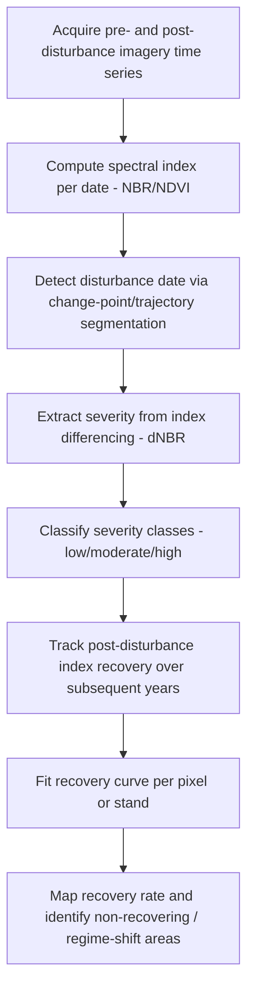

## Succession and Disturbance Ecology

### Definition and Conceptual Framework

**Ecological succession** is the process by which the species composition and structure of a community change over time following a disturbance or the creation of new substrate. **Disturbance ecology** studies the discrete events (fire, windthrow, flooding, disease outbreak, volcanic activity, anthropogenic land-use change) that alter community structure, resource availability, or the physical environment, and the ecological responses they trigger. The two fields are tightly coupled: disturbance is the initiating condition, and succession is the trajectory of recovery or reorganization that follows.

Succession is classically divided into:

- **Primary succession**: Occurs on newly exposed substrate lacking soil or a residual biological legacy (e.g., volcanic lava flows, glacial retreat forefields, newly formed sand dunes). Community establishment begins with pioneer organisms capable of colonizing bare mineral substrate.
- **Secondary succession**: Occurs on substrate where soil and often a seed bank or root/rhizome legacy remain following disturbance (e.g., post-fire, post-agricultural abandonment, post-windthrow). Recovery is typically faster than primary succession due to the retained biological legacy.

### Classical Successional Theory

**Clements' relay floristics (organismic concept, 1916)**: Proposed succession as a deterministic, unidirectional sequence of discrete community stages (seral stages) culminating in a single stable **climax community** determined by regional climate, with the community likened to a superorganism undergoing development analogous to ontogeny.

**Gleason's individualistic concept (1926)**: Countered Clements by arguing that species respond independently to the environment according to their own tolerances and dispersal abilities, such that community assemblages are contingent, non-deterministic associations rather than tightly co-evolved superorganisms. This view underlies the modern consensus and gradient analysis/ordination approaches to community ecology.

**Connell and Slatyer's mechanistic models (1977)** identify three non-mutually-exclusive mechanisms by which early colonists influence subsequent species establishment:

- **Facilitation**: Early species modify the environment in ways that make it more suitable for later species (e.g., nitrogen-fixing pioneer plants enriching soil for later successional species)
- **Tolerance**: Later species can establish regardless of earlier species' presence, but grow slowly and eventually outcompete pioneers due to greater tolerance of resource-limited conditions
- **Inhibition**: Early colonists actively resist replacement (via resource pre-emption, allelopathy, or physical occupation), with replacement occurring only when the early occupant is damaged or dies (e.g., via disturbance or senescence)

### Succession Trajectory Models

$$\text{Community state at time } t = f(\text{initial floristics/propagule pool}, \text{site conditions}, \text{disturbance history}, \text{dispersal})$$

**Egler's Initial Floristic Composition (IFC) model**: Proposes that most species present throughout succession are already present as propagules (seeds, rootstocks) at the outset, with successional change driven largely by differential growth rates and longevities rather than sequential invasion — contrasted with the Relay Floristic model where species arrive sequentially over time.

**Alternative stable states theory**: Recognizes that a given site may converge on more than one persistent community configuration depending on initial conditions or disturbance history, with transitions between states sometimes exhibiting hysteresis (the path back differs from the path that produced the shift) — relevant to rangeland degradation, coral reef phase shifts (coral-dominated to algae-dominated), and shallow lake eutrophication (clear-water to turbid states).

### Disturbance Regime Characterization

A disturbance regime is characterized by several quantifiable parameters:

- **Frequency / return interval**: Average time between successive disturbance events at a given location
- **Intensity**: Physical force or energy released by the disturbance event (e.g., fire temperature, wind speed)
- **Severity**: Magnitude of ecological effect/impact on the biological community (distinct from intensity — a high-intensity fire in a fire-adapted system may produce low ecological severity)
- **Extent/size**: Spatial area affected
- **Predictability/seasonality**: Regularity of timing
- **Synergism**: Interaction effects between multiple disturbance types (e.g., drought predisposing forest to insect outbreak and subsequent fire)

**Intermediate Disturbance Hypothesis (IDH)** (Connell, 1978): Proposes that species diversity is maximized at intermediate levels of disturbance frequency/intensity, since low disturbance allows competitive exclusion by dominant species, while high disturbance permits only the most disturbance-tolerant species to persist, producing a unimodal (hump-shaped) diversity-disturbance relationship. **[Inference]** The IDH's generality has been increasingly questioned in the ecological literature; empirical support is mixed and appears highly context- and system-dependent, and it is now more often treated as one hypothesis among several rather than a universal law.

### Fire Ecology

Fire is among the most extensively studied disturbance agents:

- **Fire regime**: Characterized by frequency, seasonality, intensity, severity, and spatial pattern
- **Fire adaptation traits**: Serotiny (cone/fruit opening triggered by heat, e.g., Pinus contorta, many Proteaceae), thick bark (fire resistance in mature trees, e.g., Sequoiadendron), resprouting from lignotubers or root crowns (common in Mediterranean shrublands and eucalypt forests), fire-stimulated germination (smoke- or heat-cued seed dormancy release)
- **Fire suppression legacy effects**: Decades of fire exclusion in historically fire-adapted systems (e.g., western U.S. dry conifer forests) has led to fuel accumulation and altered stand structure, increasing risk of uncharacteristically severe crown fires — a widely documented management concern
- **Pyrogeography**: The geospatial study of fire regime drivers and patterns, integrating climate, fuel, ignition sources, and topography

### Geospatial and Remote Sensing Methods in Disturbance Ecology

- **Change detection**: Comparing multi-temporal satellite imagery (Landsat time series, Sentinel-2) to detect land cover/vegetation disturbance, using indices such as the Normalized Burn Ratio (NBR):

$$NBR = \frac{NIR - SWIR}{NIR + SWIR}$$

with the differenced NBR (dNBR = $NBR_{pre-fire} - NBR_{post-fire}$) commonly used to classify burn severity classes

- **LandTrendr and Vegetation Change Tracker (VCT)**: Algorithms that segment Landsat time series into temporal trajectories to detect abrupt disturbance events and subsequent recovery trends
- **LiDAR-based structural monitoring**: Used to quantify canopy height, vertical structure, and fuel load changes pre/post-disturbance, informing forest recovery trajectory assessment
- **Time-series NDVI trajectory analysis**: Used to characterize the successional recovery curve following disturbance, often fit to asymptotic or logistic recovery models:

$$NDVI(t) = NDVI_{max} - (NDVI_{max} - NDVI_{0}) \cdot e^{-kt}$$

where $k$ is a recovery rate constant, $NDVI_0$ is post-disturbance greenness, and $NDVI_{max}$ is the pre-disturbance or asymptotic recovery value

- **MODIS Burned Area Product (MCD64A1)** and **VIIRS active fire products**: Standard global datasets for fire disturbance mapping and monitoring at coarse-to-moderate resolution

### Workflow: Post-Disturbance Recovery Trajectory Mapping

### Practical Example: Burn Severity and Recovery Assessment

1. Acquire a pre-fire and immediate post-fire Landsat or Sentinel-2 scene (cloud-free, similar phenological date)
2. Compute NBR for both scenes using near-infrared and shortwave-infrared bands
3. Calculate dNBR = pre-fire NBR − post-fire NBR
4. Classify severity using established USGS/FIRMON thresholds (approximate, sensor-dependent):
   - Unburned: dNBR < 0.1
   - Low severity: 0.1–0.27
   - Moderate severity: 0.27–0.66
   - High severity: > 0.66
5. Acquire an annual post-fire image time series (e.g., 10+ years) and recompute NDVI or NBR annually for burned pixels
6. Fit a recovery curve (e.g., asymptotic exponential) per pixel or management unit to estimate recovery rate constant $k$ and time-to-recovery threshold
7. Cross-reference slow-recovering or non-recovering areas with topography, soil, and post-fire management (e.g., salvage logging, replanting) to identify factors associated with delayed recovery or potential vegetation-type conversion

**[Inference]** dNBR threshold values are sensor- and ecosystem-dependent; thresholds developed for one biome or sensor combination often require local recalibration against field-based Composite Burn Index (CBI) plots before being applied elsewhere.

### Anthropogenic Disturbance and Novel Ecosystems

- **Land-use disturbance**: Agricultural abandonment, clear-cut logging, and urbanization initiate secondary succession trajectories that may differ substantially from natural disturbance-driven succession due to soil compaction, invasive species propagule pressure, and altered seed banks
- **Novel ecosystems**: Communities with species compositions and/or functions without historical precedent, often resulting from a combination of altered disturbance regimes, climate change, and species introductions — challenging the traditional concept of restoring toward a single historical climax reference state
- **Restoration ecology linkage**: Succession theory directly informs restoration approaches — facilitation-based restoration deliberately introduces early-successional "nurse" species to modify site conditions for later-successional target species

### Common Pitfalls and Analytical Considerations

- Assuming a single deterministic climax endpoint (Clementsian framing) where alternative stable states or contingent, path-dependent outcomes are more empirically supported in many systems
- Conflating disturbance intensity (physical force) with severity (ecological impact) — these are distinct axes and can diverge substantially
- Applying global severity thresholds (e.g., dNBR classes) without local field-based calibration
- Overlooking disturbance interactions and compounding effects (e.g., drought-bark beetle-fire interactions) when modeling single-disturbance-type recovery trajectories
- Ignoring spatial legacy effects (surviving biological legacies, unburned patches) that strongly influence secondary succession rate and trajectory heterogeneity within a disturbed area

### Related Topics

- Alternative stable states and regime shift theory
- Fire regime classification and pyrogeography
- Landscape ecology: patch dynamics and shifting mosaic steady state
- Remote sensing time-series analysis (LandTrendr, BFAST, Continuous Change Detection)
- Restoration ecology and facilitation-based restoration design
- Invasive species dynamics in post-disturbance systems
- Forest stand dynamics and gap-phase regeneration
- Soil development and primary succession chronosequences (e.g., glacial forefield studies)
- Climate change interactions with disturbance regime shifts (fire, drought, insect outbreaks)
- Resilience and recovery rate as ecological indicators