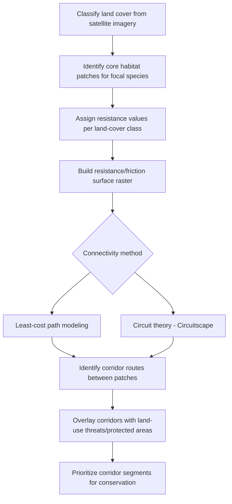

## Landscape Ecology Principles

### Definition and Conceptual Framework

**Landscape ecology** studies the reciprocal relationship between spatial pattern and ecological process at scales typically spanning hundreds of meters to hundreds of kilometers — explicitly incorporating spatial heterogeneity as a driver of ecological dynamics rather than treating it as noise to be averaged out, as in classical non-spatial ecology. The field integrates geography's spatial-analytical tradition with ecology's process-based tradition.

A **landscape** is formally defined as a spatially heterogeneous area composed of interacting ecosystems, characterized at a scale relevant to the process or organism under study — meaning "landscape" is scale-relative rather than a fixed spatial extent (a landscape for a soil microbe operates at a vastly different scale than for a migratory bird).

### The Patch-Corridor-Matrix Model

The foundational spatial framework in landscape ecology (Forman and Godron) decomposes landscape structure into three element types:

- **Patch**: A relatively homogeneous, non-linear area that differs from its surroundings (e.g., a forest fragment, a wetland, a field)
- **Corridor**: A linear or elongated landscape element connecting patches, facilitating or constraining movement (e.g., riparian buffers, hedgerows, road verges — though roads themselves function as barriers/corridors depending on the organism)
- **Matrix**: The dominant, most extensive and connected landscape element type surrounding patches and corridors, generally exerting the greatest control over landscape dynamics and often the least hospitable for interior-dependent species

This model has been extended and critiqued: real landscapes often exhibit continuous or gradient-based heterogeneity rather than the discrete, categorical mosaics the patch-matrix model assumes — the **gradient model** provides an alternative conceptualization for landscapes without sharp boundaries (e.g., an elevation or moisture gradient).

### Landscape Structure Metrics

Landscape structure is quantified across three organizational levels: patch level, class level (aggregated across all patches of a given type), and landscape level (aggregated across all patch types).

Key metric categories:

- **Composition metrics**: Describe the variety and abundance of patch types without reference to spatial arrangement (e.g., percentage of landscape in each class, Shannon Diversity Index of patch types)
- **Configuration metrics**: Describe spatial arrangement:
  - **Patch density**: Number of patches per unit area
  - **Mean patch size**: Average area per patch
  - **Edge density**: Total edge length per unit area — a proxy for fragmentation and edge effect exposure
  - **Shape index / fractal dimension**: Quantifies patch shape complexity relative to a simple form (e.g., a circle or square) of equal area
  - **Nearest-neighbor distance**: Mean distance between patches of the same class, relevant to dispersal and connectivity
  - **Contagion index**: Measures the degree of clumping/aggregation of patch types across the landscape
  - **Interspersion and Juxtaposition Index (IJI)**: Measures the degree to which patch types are interspersed with other types

$$\text{Shannon Diversity Index (SHDI)} = -\sum_{i=1}^{m} p_i \ln(p_i)$$

where $p_i$ is the proportion of the landscape occupied by patch type $i$.

**FRAGSTATS** is the standard software historically used for computing these metrics from categorical raster/vector landscape data; equivalent functionality is now widely available via the R packages `landscapemetrics` and `SDMTools`, and Python libraries such as `pylandstats`.

### Fragmentation vs. Habitat Loss

A key conceptual distinction, formalized by Fahrig (2003, and later work distinguishing fragmentation "per se"):

- **Habitat loss**: Reduction in the total area of a given habitat type — generally has consistently negative effects on biodiversity
- **Habitat fragmentation (per se)**: The breaking apart of habitat into more, smaller, more isolated patches, independent of total habitat amount — empirical evidence for fragmentation per se effects (isolated from area loss) is considerably more mixed and context-dependent than for habitat loss

**[Inference]** This distinction has been a significant point of ongoing debate in the landscape ecology literature (notably the "fragmentation debate" following Fahrig's 2003 and 2017 reviews); results appear to depend strongly on taxon, spatial scale, and the specific metric of fragmentation used, so generalized statements about fragmentation effects should be treated cautiously.

### Edge Effects

Patch edges differ microclimatically and biotically from patch interiors due to altered light, wind, temperature, and moisture regimes at the boundary with the matrix or an adjacent patch type.

- **Edge effect depth**: The distance into a patch over which edge-influenced conditions are measurably different from interior conditions; varies by variable measured (microclimate vs. vegetation structure vs. species presence) and by matrix contrast (a hard edge, e.g., forest-to-pavement, produces stronger effects than a soft edge, e.g., forest-to-shrubland)
- **Core area**: The area of a patch remaining after edge-affected zones are excluded — core area typically declines disproportionately faster than total patch area as patches are subdivided, since edge:area ratio increases as patch size decreases (for simple patch shapes, perimeter scales with the square root of area while edge zone width remains roughly constant)
- Edge effects can have positive or negative net biodiversity impact depending on taxon — "edge species" may benefit from edge habitat while area-sensitive interior specialists decline

### Connectivity and Corridors

- **Structural connectivity**: Physical/spatial adjacency or proximity of habitat patches, measurable directly from landscape pattern
- **Functional connectivity**: The degree to which the landscape actually facilitates or impedes movement/gene flow for a specific organism, dependent on that organism's movement behavior and perception of the matrix — the same landscape can be functionally connected for one species and fragmented for another
- **Least-cost path / resistance surface modeling**: Represents landscape permeability as a friction/resistance grid parameterized per land-cover class (or continuous covariate), used to model likely movement corridors between core habitat areas
- **Circuit theory (Circuitscape)**: Models connectivity using electrical circuit theory, treating the landscape as a resistive surface and modeling multiple potential pathways simultaneously (analogous to current flow) rather than a single optimal path, better capturing redundancy in possible movement routes
- **Graph-theoretic connectivity metrics**: Represent the landscape as a network of patches (nodes) connected by edges weighted by distance or resistance, enabling metrics such as the Probability of Connectivity (PC) index and Integral Index of Connectivity (IIC)

### Spatial Scale: Grain, Extent, and the MAUP

- **Grain**: The finest spatial resolution of the data or observation (e.g., pixel size in a raster)
- **Extent**: The total spatial area encompassed by the study/dataset
- **Scale dependence**: Landscape pattern-process relationships are frequently scale-dependent — a metric or relationship significant at one grain/extent combination may not hold, or may reverse, at another
- **Modifiable Areal Unit Problem (MAUP)**: A well-established methodological artifact in spatial analysis whereby statistical results (correlations, aggregated values) can vary systematically depending on how spatial units are defined or aggregated, independent of the underlying ecological pattern — relevant whenever landscape metrics are computed at arbitrarily defined boundaries (e.g., political or watershed units)

### Metapopulation and Source-Sink Dynamics in Landscape Context

Landscape structure directly determines metapopulation persistence:

$$\frac{dp}{dt} = cp(1-p) - ep$$

the classic Levins metapopulation model, where $p$ is the proportion of occupied patches, $c$ is the colonization rate coefficient (dependent on patch connectivity), and $e$ is the local extinction rate coefficient (dependent on patch size/quality). Landscape configuration directly parameterizes both $c$ (via connectivity/isolation) and $e$ (via patch size and edge exposure).

**Source-sink dynamics**: Patches classified as sources (net positive population growth, exporting individuals) versus sinks (net negative growth, sustained only by immigration) — landscape spatial arrangement determines the source-to-sink dispersal flux and thus regional persistence.

### Geospatial Methods and Tools

- **Land-cover classification**: Supervised/unsupervised classification of satellite imagery (Landsat, Sentinel-2) into categorical land-cover/land-use rasters as the base input for landscape metric computation
- **Object-based image analysis (OBIA)**: Segments imagery into meaningful patch objects prior to classification, often producing more ecologically realistic patch boundaries than pixel-based classification
- **FRAGSTATS / `landscapemetrics` (R) / `pylandstats` (Python)**: Standard tools for computing patch, class, and landscape-level structure metrics from categorical raster data
- **Circuitscape / `Julia Circuitscape.jl`**: Connectivity modeling via circuit theory
- **Linkage Mapper (ArcGIS toolbox)**: Least-cost corridor modeling between core habitat areas
- **Graphab**: Graph-theoretic connectivity analysis software

### Workflow: Connectivity Assessment for a Focal Species

### Practical Example: Fragmentation Metric Computation

1. Obtain a classified land-cover raster (e.g., 30 m resolution, forest/non-forest binary or multi-class)
2. Load the raster into a landscape metrics tool (e.g., R's `landscapemetrics` package, using `lsm_c_*` functions for class-level metrics)
3. Compute class-level metrics for the forest class: number of patches, mean patch size, edge density, and the aggregation index
4. Compute landscape-level Shannon Diversity Index if multiple land-cover classes are present
5. Repeat the analysis for two time periods (e.g., land cover from 2000 and 2024) using the same classification scheme and spatial extent
6. Compare metric values between periods to quantify the fragmentation trajectory: e.g., an increase in patch count combined with a decrease in mean patch size and increase in edge density indicates progressive fragmentation
7. **[Inference]** Interpret changes cautiously with respect to the MAUP and grain sensitivity — results can differ if the underlying classification resolution or extent changes between the two time periods being compared, so consistent methodology across time steps is important for valid trend interpretation

### Common Pitfalls

- Applying landscape metrics computed at one grain/extent to inferences at a different scale without validating scale-dependence
- Treating structural connectivity (spatial proximity) as equivalent to functional connectivity (actual organismal movement) without species-specific validation
- Conflating habitat loss effects with fragmentation-per-se effects when interpreting landscape change impacts on biodiversity
- Ignoring temporal legacy effects — current species distributions may reflect past, not current, landscape configuration ("extinction debt" and "immigration credit")
- Applying resistance surface values based on expert opinion without ground-truthing against telemetry or genetic connectivity data where available

### Related Topics

- Metapopulation theory and extinction debt
- Circuit theory and graph-theoretic connectivity modeling (Circuitscape, Graphab)
- Object-based image analysis (OBIA) for patch delineation
- Modifiable Areal Unit Problem (MAUP) and spatial statistics
- Habitat fragmentation debate (Fahrig 2003/2017)
- Corridor design and conservation prioritization (systematic conservation planning)
- Scale dependence and hierarchy theory in ecology
- Land-use change modeling and cellular automata (e.g., CLUE-S, Dyna-CLUE)
- Edge effect microclimatology
- Remote sensing time-series for land-cover change detection