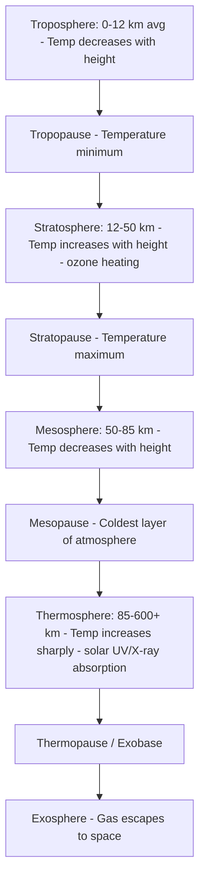
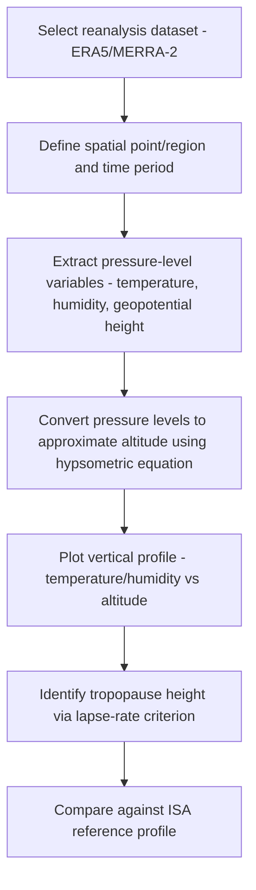

## Atmospheric Composition and Structure

### Definition and Conceptual Framework

The atmosphere is the gaseous envelope surrounding Earth, retained by gravity and structured into distinct vertical layers based on temperature gradient behavior. Its **composition** refers to the constituent gases and particulates, while its **structure** refers to the vertical stratification of temperature, pressure, density, and composition with altitude. These two properties are interdependent: compositional variation with height (e.g., ozone concentration) directly drives the thermal structure that defines atmospheric layers.

### Bulk Composition

Dry air composition by volume near the surface (well-mixed within the homosphere, see below):

| Gas | Symbol | Approx. Volume Fraction |
| --- | --- | --- |
| Nitrogen | $N_2$ | 78.08% |
| Oxygen | $O_2$ | 20.95% |
| Argon | $Ar$ | 0.93% |
| Carbon dioxide | $CO_2$ | ~0.042% (420 ppm, rising) |
| Neon, Helium, Methane, Krypton, Hydrogen | — | trace (ppm to ppb levels) |
| Water vapor | $H_2O$ | Highly variable (0–4%, concentrated in troposphere) |
| Ozone | $O_3$ | Trace, concentrated in stratosphere (ppm levels) |

**[Inference]** The 420 ppm CO2 figure reflects approximate recent (2020s) global mean atmospheric concentration and should be treated as an approximate, time-varying value rather than a fixed constant, since atmospheric CO2 continues to rise measurably year over year (documented by continuous monitoring records such as the Mauna Loa Observatory Keeling Curve).

Water vapor and ozone are the two most spatially and temporally variable major constituents, and both play outsized roles in radiative processes relative to their small volumetric abundance.

### Homosphere vs. Heterosphere

- **Homosphere** (surface to ~100 km, encompassing troposphere, stratosphere, and mesosphere): Turbulent mixing dominates over molecular diffusion, keeping the relative proportions of major gases (N2, O2, Ar) essentially constant with height (aside from water vapor and ozone, which vary due to sources/sinks and photochemistry rather than mixing)
- **Heterosphere** (above ~100 km, the turbopause boundary): Molecular diffusion dominates over turbulent mixing; gases separate by molecular weight (gravitational diffusive separation), so composition varies substantially with altitude — atomic oxygen, helium, and hydrogen become progressively more dominant at increasing altitude

### Vertical Thermal Structure

Atmospheric layers are defined by the sign and magnitude of the temperature lapse rate (rate of temperature change with height), which in turn reflects the dominant local energy absorption/radiation mechanism:

- **Troposphere** (surface to ~8 km at poles, ~17–18 km at the equator, averaging ~12 km): Contains ~75–80% of total atmospheric mass and essentially all weather phenomena and water vapor; heated primarily from below by longwave radiation emitted from the Earth's surface, producing the characteristic negative lapse rate. The **environmental lapse rate** averages approximately 6.5°C/km, distinct from the dry adiabatic lapse rate (~9.8°C/km) and moist/saturated adiabatic lapse rate (~4–7°C/km, variable with temperature and moisture content), the distinction being central to atmospheric stability analysis
- **Tropopause**: The boundary marking the transition to isothermal or inverted lapse rate conditions; altitude varies with latitude and season (higher and colder at the equator, lower and warmer at the poles)
- **Stratosphere** (~12–50 km): Temperature increases with height due to direct absorption of solar ultraviolet radiation by the **ozone layer** (concentrated roughly 15–35 km, within the stratosphere); this positive lapse rate produces a highly stable, stratified layer that strongly suppresses vertical mixing (hence the name) — the reason strong convective weather systems generally do not penetrate far into the stratosphere
- **Stratopause**: Temperature maximum near 50 km, coincident with peak ozone heating efficiency
- **Mesosphere** (~50–85 km): Temperature decreases with height again as ozone concentration and heating diminish; the coldest part of the atmosphere occurs at the mesopause (~85 km), reaching temperatures as low as approximately -90°C, cold enough for noctilucent clouds (polar mesospheric clouds) to form from ice crystals
- **Thermosphere** (~85–600+ km): Temperature rises sharply (potentially to 1000°C+ during high solar activity) due to absorption of high-energy solar UV and X-ray radiation by atomic oxygen and nitrogen; despite the high kinetic temperature, air density is so low that this "heat" would not be perceptibly warm to an object due to minimal molecular collision frequency — a common conceptual distinction between temperature and heat content at these densities
- **Exosphere** (above ~600 km, no sharp upper boundary): The outermost layer where the atmosphere gradually transitions to interplanetary space; gas molecules can achieve escape velocity and are lost to space, particularly lighter species (hydrogen, helium)

### Functionally-Defined Layers (Overlapping with Thermal Layers)

- **Ozone layer**: A functional (compositional) layer within the stratosphere, not a distinct thermal layer, defined by peak ozone concentration; critically absorbs UV-B and UV-C radiation, protecting surface biota from mutagenic radiation
- **Ionosphere** (~60–1000 km, overlapping the upper mesosphere through thermosphere and into the exosphere): A functionally-defined region where solar radiation ionizes atmospheric gases, producing free electrons and ions; subdivided into D, E, and F layers based on ionization density and altitude, critical for radio wave propagation (HF radio reflection off the F layer enables long-distance communication)
- **Planetary boundary layer (PBL)**: The lowest portion of the troposphere (typically a few hundred meters to ~2 km, varying diurnally) directly influenced by surface friction, heat, and moisture fluxes; exhibits strong diurnal cycling (well-mixed convective boundary layer during daytime heating, stable nocturnal boundary layer with a shallow surface inversion at night) — of central importance to air quality modeling and near-surface pollutant dispersion

### Pressure-Density Structure

Atmospheric pressure and density decrease approximately exponentially with altitude, following the hydrostatic equation combined with the ideal gas law, yielding the **barometric formula**:

$$P(z) = P_0 \exp\left(-\frac{z}{H}\right)$$

where $P_0$ is sea-level pressure, $z$ is altitude, and $H$ is the **scale height** (the altitude increase over which pressure drops by a factor of $1/e$), approximately 7–8.5 km for Earth's lower atmosphere, though $H$ itself varies with temperature:

$$H = \frac{RT}{Mg}$$

where $R$ is the universal gas constant, $T$ is temperature, $M$ is mean molar mass of air, and $g$ is gravitational acceleration. Roughly 50% of atmospheric mass lies below ~5.5 km, and 99% lies below ~30 km — meaning the atmosphere is disproportionately concentrated near the surface despite lacking a sharp upper boundary.

### The Standard Atmosphere

The **International Standard Atmosphere (ISA)** is an idealized, static reference model of pressure, temperature, and density as a function of altitude, used extensively in aviation, aerospace, and atmospheric model calibration. It assumes a fixed sea-level temperature (15°C), pressure (1013.25 hPa), and a defined set of layer-specific lapse rates — real atmospheric profiles deviate from the ISA due to latitude, season, weather systems, and diurnal effects, so the ISA functions as a normalization reference rather than a forecast tool.

### Geospatial and Remote Sensing Methods for Atmospheric Structure

- **Radiosondes**: Balloon-borne instrument packages providing high-vertical-resolution in-situ profiles of temperature, humidity, and pressure; the historical backbone of upper-air observation networks
- **Satellite sounders**: Instruments such as AIRS (Atmospheric Infrared Sounder) and hyperspectral IR/microwave sounders (e.g., IASI, CrIS) retrieve vertical temperature and humidity profiles from top-of-atmosphere radiance measurements via inversion algorithms
- **GPS Radio Occultation (GPS-RO)**: Satellite-to-satellite radio signal bending is used to derive high-vertical-resolution temperature and density profiles, particularly valuable in the upper troposphere/lower stratosphere (UTLS)
- **Lidar (e.g., CALIPSO)**: Active remote sensing providing vertical profiles of aerosols and cloud layers with fine vertical resolution
- **Reanalysis products (ERA5, MERRA-2)**: Combine historical observations with numerical weather prediction models via data assimilation to produce spatially and temporally complete gridded 3D atmospheric structure datasets, widely used in atmospheric and climate research as a practical alternative to sparse direct observations
- **Column-integrated remote sensing (e.g., OMI, TROPOMI)**: Satellite instruments retrieving total column concentrations of trace gases (ozone, NO2, SO2) via solar backscatter spectroscopy, used for atmospheric composition monitoring at the column rather than fully resolved vertical-profile level

### Workflow: Deriving a Vertical Atmospheric Profile from Reanalysis Data

### Practical Example: Estimating Tropopause Height from a Temperature Profile

1. Obtain a vertical temperature profile at standard pressure levels (e.g., from an ERA5 reanalysis extraction or a radiosonde sounding) for a given location and time
2. Convert pressure levels to geopotential height using the hypsometric equation:

$$\Delta z = \frac{R\bar{T}}{g} \ln\left(\frac{P_1}{P_2}\right)$$

3. Compute the lapse rate between adjacent levels: $\Gamma = -\frac{dT}{dz}$
4. Apply the WMO thermal tropopause definition: the lowest level at which the lapse rate decreases to ≤2°C/km, and the average lapse rate between this level and any level within the next 2 km above does not exceed 2°C/km
5. Record the identified tropopause altitude and compare against the ISA reference (~11 km) and expected latitudinal/seasonal variation (higher over the tropics, lower over the poles, and higher in local summer than local winter)
6. **[Inference]** Automated tropopause detection algorithms can occasionally return spurious short-lived "multiple tropopauses" (common near jet streams and tropopause folds) that may require additional smoothing or expert judgment to interpret physically.

### Common Pitfalls

- Confusing high thermospheric kinetic temperature with the sensation of heat, ignoring the extremely low air density and molecular collision frequency at that altitude
- Treating the ISA as a real, forecastable atmospheric state rather than a static engineering reference
- Assuming uniform mixing ratios for water vapor or ozone the way N2/O2/Ar are uniformly mixed within the homosphere
- Conflating the ozone layer (a compositional feature) with the stratosphere (a thermally-defined layer) — the ozone layer lies within, but is not synonymous with, the stratosphere
- Using surface-level composition percentages without accounting for water vapor's high spatial/temporal variability, which affects "wet" vs "dry" air composition fraction reporting

### Related Topics

- Atmospheric stability and lapse rate analysis (dry/moist adiabatic processes)
- Radiative transfer and the greenhouse effect
- Stratospheric ozone chemistry and the ozone hole (Antarctic polar vortex chemistry)
- Planetary boundary layer dynamics and air quality modeling
- Numerical weather prediction and reanalysis systems (ERA5, MERRA-2)
- GPS radio occultation and satellite remote sensing of atmospheric profiles
- Ionospheric physics and space weather
- Atmospheric general circulation (Hadley, Ferrel, Polar cells)
- Aerosol-cloud interactions and lidar remote sensing
- Climate change attribution via long-term atmospheric composition monitoring (Keeling Curve)