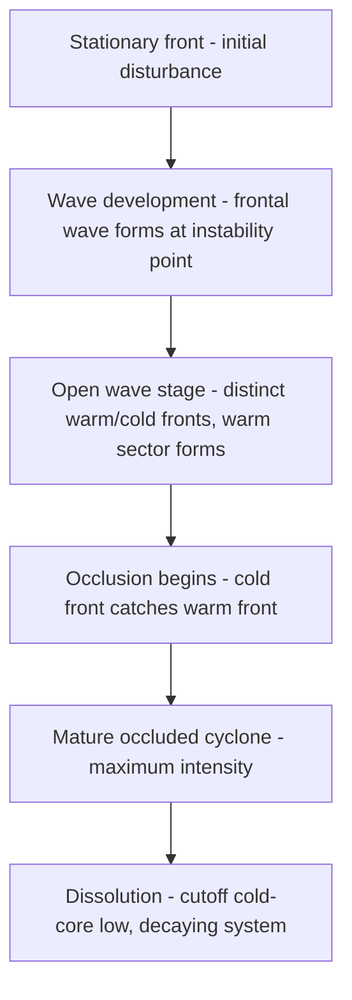
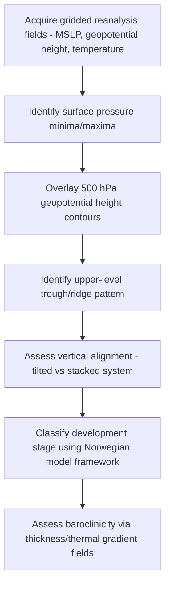

## Weather Systems and Processes

### Definition and Conceptual Framework

Weather refers to the short-term (minutes to weeks) state of the atmosphere at a given place and time, characterized by temperature, pressure, humidity, wind, and precipitation. Weather systems are organized, coherent atmospheric structures — ranging from meso-scale thunderstorm cells to synoptic-scale cyclones spanning thousands of kilometers — that develop, propagate, and dissipate according to identifiable dynamical and thermodynamic processes. Weather is distinguished from **climate**, which describes the statistical distribution of weather conditions over multi-decadal timescales; weather systems are the individual realizations that, aggregated over time, constitute climate.

### Atmospheric Motion Fundamentals

Weather system dynamics are governed by the equations of motion applied to a rotating, stratified fluid. Key governing forces:

- **Pressure gradient force (PGF)**: Drives air from high to low pressure, proportional to the horizontal pressure gradient
- **Coriolis force**: An apparent force arising from Earth's rotation, deflecting moving air to the right in the Northern Hemisphere and left in the Southern Hemisphere, proportional to wind speed and the sine of latitude (zero at the equator, maximum at the poles):

$$f = 2\Omega \sin(\phi)$$

where $\Omega$ is Earth's angular velocity and $\phi$ is latitude

- **Centripetal/centrifugal effects**: Relevant for curved flow around low- and high-pressure centers
- **Friction**: Dominant near the surface within the planetary boundary layer, reducing wind speed and altering the wind's angle relative to isobars

The balance of PGF and Coriolis force in the absence of friction and curvature produces **geostrophic wind**, blowing parallel to isobars; the addition of curvature effects produces **gradient wind** balance, relevant to flow around cyclones and anticyclones.

### Air Masses and Fronts

An **air mass** is a large body of air with relatively uniform temperature and humidity characteristics, acquired through prolonged residence over a source region (e.g., continental polar, maritime tropical). Air mass classification uses a two-letter (sometimes three-letter) code denoting moisture source (c = continental, m = maritime) and thermal source region (P = polar, T = tropical, A = arctic, E = equatorial).

A **front** is the transition zone between two air masses of differing density/temperature:

- **Cold front**: Cold air mass advancing into and displacing warmer air; characterized by steep frontal slope, narrow band of intense weather, and a wind shift, often marked by convective/cumuliform cloud development
- **Warm front**: Warm air mass advancing over retreating cooler air; shallower slope, wider precipitation shield, typically stratiform cloud sequences (ahead of the surface front: cirrus → cirrostratus → altostratus → nimbostratus)
- **Occluded front**: Forms when a faster-moving cold front overtakes a warm front, lifting the warm air mass entirely off the surface; classified as cold-type or warm-type occlusion depending on the relative temperature of the air masses involved
- **Stationary front**: A front with minimal net movement, often producing prolonged precipitation along the boundary

### The Norwegian Cyclone Model and Extratropical Cyclones

**Extratropical cyclones** (mid-latitude cyclones) form along the polar front, the boundary between polar and subtropical air masses, and are the primary weather-producing systems of the mid-latitudes.

The classical **Norwegian cyclone model** (Bjerknes and Solberg, 1922) describes a life cycle:

Modern understanding, refined by **quasi-geostrophic theory** and **baroclinic instability theory**, explains cyclogenesis as arising from the release of potential energy stored in horizontal temperature gradients (baroclinicity) along the jet stream, with the jet stream's divergence/convergence pattern (linked to upper-level features like jet streaks and vorticity advection) providing the dynamical forcing for surface pressure falls.

- **Baroclinic instability**: The fundamental energy source for mid-latitude cyclogenesis; occurs where sloped isentropic surfaces (representing horizontal temperature gradients combined with vertical wind shear) allow potential energy to convert to kinetic energy as air parcels exchange position
- **Jet streams**: Fast-flowing, narrow air currents near the tropopause (polar jet and subtropical jet), whose position and structure (jet streaks, upper-level divergence patterns) strongly influence surface cyclone development and track

### Tropical Cyclones

Tropical cyclones form and are sustained by fundamentally different thermodynamics than extratropical systems — they are **warm-core** systems driven by latent heat release from organized deep convection over warm ocean water, in contrast to the **cold-core**, baroclinically-driven extratropical cyclone.

Formation requirements (necessary but not sufficient conditions):

- Sea surface temperature typically ≥ 26.5°C to a depth of at least ~50 m
- Sufficient Coriolis force (generally requiring latitude > ~5° from the equator)
- Low vertical wind shear (strong shear disrupts the vertical alignment of convection needed for warm-core development)
- Pre-existing disturbance/area of organized convection
- Mid-tropospheric moisture (dry air intrusion suppresses convection)

Structure: **eye** (calm, subsiding, clear center), **eyewall** (ring of most intense convection and winds surrounding the eye), and **rainbands** (spiraling bands of convective precipitation extending outward). Intensification is thermodynamically approximated by treating the storm as a Carnot heat engine operating between the warm sea surface and the cold upper troposphere, providing a theoretical maximum potential intensity constraint.

Classification by maximum sustained wind speed uses regionally distinct scales (e.g., Saffir-Simpson Hurricane Wind Scale in the Atlantic/East Pacific basins, categories 1–5).

### Convective Storms

- **Air-mass (single-cell) thunderstorms**: Short-lived (30–60 min), driven by localized surface heating, following the classic three-stage life cycle: cumulus (growth) → mature (heaviest precipitation, downdraft/updraft coexist) → dissipating (downdraft dominates, cutting off the storm's own updraft moisture supply)
- **Multicell clusters and multicell lines**: Groups of storms in various life-cycle stages, with new cell development often triggered along the outflow boundary (gust front) of preceding cells
- **Supercell thunderstorms**: Characterized by a persistent, rotating updraft (**mesocyclone**), typically forming under strong vertical wind shear combined with sufficient instability (CAPE); the primary producers of significant tornadoes, very large hail, and damaging straight-line winds
- **Squall lines / Mesoscale Convective Systems (MCS)**: Organized linear or clustered convective systems, often with a leading convective line and trailing stratiform precipitation region; can produce derecho wind events under favorable organization

Key convective indices:

$$CAPE = \int_{z_{LFC}}^{z_{EL}} g \left(\frac{T_{v,parcel} - T_{v,env}}{T_{v,env}}\right) dz$$

**Convective Available Potential Energy (CAPE)** quantifies the buoyant energy available to a rising parcel between the level of free convection (LFC) and equilibrium level (EL); higher CAPE indicates greater potential updraft intensity, though realization depends on a triggering mechanism (lift) actually initiating convection.

**Convective Inhibition (CIN)** quantifies the negative buoyancy (energy barrier) a parcel must overcome before reaching the LFC — high CIN can suppress storm initiation even with high CAPE ("capped" environments), sometimes leading to a delayed but more violent outbreak of storms once the cap erodes.

### Precipitation Processes

- **Bergeron-Findeisen (ice crystal) process**: Ice crystals grow at the expense of surrounding supercooled liquid droplets due to the lower saturation vapor pressure over ice relative to liquid water at the same sub-freezing temperature, the dominant precipitation-initiation mechanism in mixed-phase clouds in mid-to-high latitudes
- **Collision-coalescence process**: Warm-cloud process (no ice phase involved) in which larger droplets fall faster and collide with/absorb smaller droplets, dominant in tropical/warm-cloud precipitation
- **Orographic precipitation**: Enhanced precipitation on the windward side of topographic barriers due to forced ascent and adiabatic cooling, with a corresponding rain shadow effect on the leeward side

### Geospatial and Remote Sensing Methods

- **Weather radar (Doppler, dual-polarization)**: Detects precipitation intensity, motion (via Doppler velocity), and hydrometeor type/shape (via dual-pol variables like differential reflectivity), foundational for short-term nowcasting and severe weather warning operations
- **Geostationary satellite imagery (e.g., GOES-R series, Himawari)**: Provides continuous visible, infrared, and water vapor channel imagery for tracking cloud pattern evolution, cyclone structure, and convective initiation at sub-hourly temporal resolution
- **Numerical Weather Prediction (NWP) models**: Grid-based dynamical models (e.g., GFS, ECMWF IFS, HRRR) solving discretized primitive equations of atmospheric motion, initialized via data assimilation of observational networks (radiosondes, surface stations, satellites, aircraft) to produce forecast fields
- **Reanalysis datasets (ERA5, MERRA-2)**: Used retrospectively to analyze historical weather system structure and evolution with spatially/temporally complete gridded fields
- **GIS-based severe weather verification**: Overlaying radar-derived storm tracks, warning polygons, and storm damage reports for post-event analysis and forecast verification workflows

### Workflow: Synoptic-Scale System Analysis from Reanalysis Data

### Practical Example: Identifying Cyclogenesis Potential from Gridded Data

1. Obtain gridded reanalysis or NWP model output fields: mean sea-level pressure (MSLP), 500 hPa geopotential height, and 1000-500 hPa thickness (a proxy for mean tropospheric temperature)
2. Identify a surface pressure trough or closed low, and locate the corresponding upper-level (500 hPa) trough
3. Assess the horizontal offset between the surface low and the upper-level trough axis — a surface low positioned beneath or downstream (east) of the upper trough axis, particularly beneath the region of upper-level diffluence/positive vorticity advection ahead of the trough, is associated with favorable conditions for intensification
4. Overlay the thickness field to assess baroclinicity — tightly packed thickness contours indicate a strong horizontal temperature gradient (baroclinic zone), the energy source for extratropical development
5. Track MSLP minimum over successive time steps to compute a deepening rate (hPa per 24 hr); a drop of ≥24 hPa in 24 hr (latitude-adjusted, per the Sanders and Gyakum criterion) is the conventional threshold for "bomb cyclogenesis" (explosive intensification)
6. **[Inference]** While this vertical-tilt diagnostic is a standard synoptic heuristic taught in operational meteorology, actual intensification also depends on diabatic processes (latent heat release, surface fluxes) not captured by dry dynamical analysis alone, so purely kinematic assessment provides necessary but not complete predictive information.

### Common Pitfalls

- Conflating tropical and extratropical cyclones as the same phenomenon — their energy sources (latent heat/warm-core vs. baroclinic/cold-core) and structural characteristics are fundamentally different
- Assuming high CAPE alone predicts severe convection without accounting for CIN (capping) and the presence of a lifting trigger
- Treating the Norwegian cyclone model as a literal universal description rather than a conceptual/pedagogical simplification of more complex, model- and case-dependent baroclinic development
- Overlooking friction's role in near-surface wind direction (cross-isobaric flow into low pressure) when applying pure geostrophic/gradient wind balance reasoning at the surface
- Using instantaneous satellite/radar snapshots without considering the temporal evolution needed to correctly classify a system's life-cycle stage

### Related Topics

- Atmospheric stability and convective indices (CAPE, CIN, lifted index)
- Jet stream dynamics and upper-level divergence patterns
- Tropical cyclone genesis, intensification, and potential intensity theory
- Numerical weather prediction and data assimilation methods
- Radar meteorology and dual-polarization hydrometeor classification
- Mesoscale convective system organization and derecho dynamics
- Orographic effects on precipitation and rain shadow formation
- Climate change influences on storm frequency/intensity trends
- Severe weather forecasting and warning verification methods
- Quasi-geostrophic theory and baroclinic instability