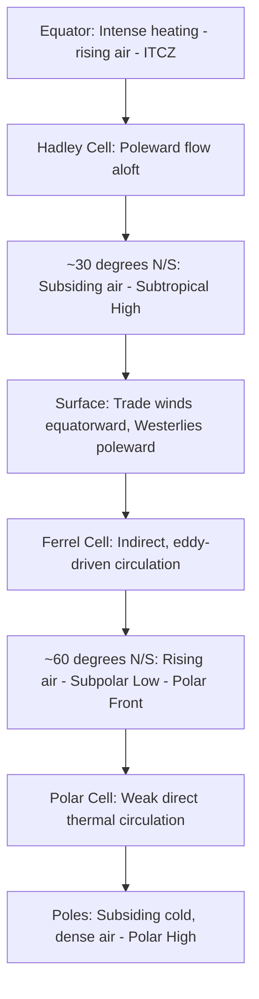
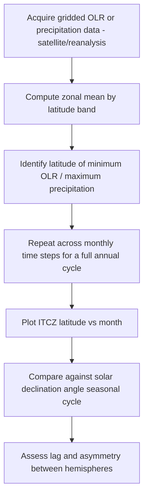

## Atmospheric Circulation Patterns

### Definition and Conceptual Framework

Atmospheric circulation refers to the large-scale movement of air that redistributes energy (heat) and momentum across the planet, arising fundamentally from the differential solar heating between the tropics and poles combined with the effects of Earth's rotation. Circulation is organized hierarchically by spatial scale: **planetary-scale** (global circulation cells, jet streams), **synoptic-scale** (cyclones, anticyclones, thousands of km), **meso-scale** (sea breezes, thunderstorm complexes, 1–1000 km), and **micro-scale** (turbulent eddies, meters). This entry focuses on planetary and large-scale circulation.

### The Fundamental Driver: Differential Heating

Incoming solar radiation per unit area is greatest at the equator (where the sun angle is closest to perpendicular) and least at the poles, creating a persistent equator-to-pole temperature and pressure gradient. If Earth were non-rotating, this would drive a single direct thermal circulation cell per hemisphere (rising air at the equator, sinking at the poles) — the **single-cell model**. Earth's rotation, however, breaks this single cell into three distinct cells per hemisphere via the Coriolis effect and the resulting instability of the direct thermal circulation at large distances from the equator.

### The Three-Cell Model

- **Hadley Cell** (~0–30°): A thermally direct cell — warm, moist air rises at the **Intertropical Convergence Zone (ITCZ)**, where the trade winds of both hemispheres converge, producing the equatorial belt of persistent convection and heavy rainfall. Air diverges poleward aloft, cools, and subsides around 30°N/S, forming the **subtropical high-pressure belt** (associated with the world's major hot desert regions, e.g., Sahara, Arabian, Sonoran deserts — the descending, adiabatically warming and drying air suppresses cloud formation and precipitation). Surface return flow forms the **trade winds** (northeasterly in the NH, southeasterly in the SH, per the Coriolis deflection)
- **Ferrel Cell** (~30–60°): A thermally indirect cell, driven not by direct thermal buoyancy but by the net effect of transient eddies (mid-latitude cyclones and anticyclones) transporting heat and momentum poleward; surface flow is westerly (the **prevailing westerlies**), reflecting geostrophic balance in the pressure pattern between the subtropical high and subpolar low
- **Polar Cell** (~60–90°): A weak, thermally direct cell — air sinks over the cold, high-pressure poles and flows equatorward at the surface, deflected into the **polar easterlies**, before rising at approximately 60°N/S along the **polar front**, the boundary between cold polar air and warmer mid-latitude air, where much extratropical cyclogenesis is initiated (see prior entry on Weather Systems)

### Semi-Permanent Pressure Systems

The three-cell model's zonally-averaged pattern is, in reality, broken into discrete semi-permanent pressure centers (action centers) due to land-ocean thermal contrasts and topography:

- **Subtropical highs**: e.g., the Azores/Bermuda High (Atlantic), the North Pacific High/Hawaiian High, the South Pacific and South Atlantic Highs — quasi-stationary anticyclones whose position and strength strongly modulate regional climate (e.g., Mediterranean summer dry season, West Coast marine layer/upwelling patterns)
- **Subpolar lows**: e.g., the Icelandic Low and Aleutian Low — regions of frequent cyclogenesis and storm track convergence
- **Monsoonal thermal lows/highs**: Seasonal reversals driven by differential land-ocean heat capacity (see below)

### Jet Streams

Jet streams are fast-moving, narrow ribbons of high-speed westerly wind concentrated near the tropopause, forming where strong horizontal temperature gradients (and correspondingly strong vertical wind shear, per the thermal wind relationship) are maximized:

$$\frac{\partial \vec{v}_g}{\partial z} \propto -\nabla_p T \times \hat{k}$$

the **thermal wind relation**, linking vertical wind shear to the horizontal temperature gradient.

- **Polar jet stream**: Located near the polar front (~50–60°N/S, variable), associated with the boundary between polar and mid-latitude air masses; highly variable in position and intensity, strongly influencing mid-latitude storm tracks
- **Subtropical jet stream**: Located near the poleward edge of the Hadley cell (~30°N/S), associated with the strong temperature gradient at the boundary of the tropical and mid-latitude troposphere; generally more consistent in position than the polar jet

Jet stream meandering (Rossby wave patterns) governs much of mid-latitude weather variability — amplified, slow-moving (blocked) wave patterns are associated with persistent weather extremes (prolonged heat waves, cold outbreaks, or flooding events).

### Rossby Waves

**Rossby waves** (planetary waves) are large-scale meanders in the jet stream and upper-tropospheric flow, arising from the conservation of potential vorticity as air parcels move poleward or equatorward (changing the planetary vorticity component, requiring compensating changes in relative vorticity — i.e., curvature). Their propagation speed relative to the mean flow is inversely related to wavelength, meaning long waves move slower (or can become stationary/retrograde) relative to short waves — a key factor in atmospheric blocking pattern persistence.

### Monsoon Circulation

**Monsoons** are large-scale seasonal wind reversals driven primarily by differential heating/cooling of continents versus oceans (land has lower heat capacity, heating and cooling faster than adjacent ocean surfaces):

- **Summer monsoon**: The continental interior heats faster than the ocean, creating a thermal low over land that draws in moist oceanic air, producing the characteristic wet season (e.g., the South Asian/Indian summer monsoon, driven substantially by heating over the Tibetan Plateau and the northward migration of the ITCZ)
- **Winter monsoon**: The continent cools faster than the ocean, reversing the pressure gradient and producing dry, offshore-flowing continental air
- Major monsoon systems: South Asian, East Asian, West African, North American (Southwest US), and Australian monsoon systems, each with distinct regional driving mechanisms alongside the shared land-sea thermal contrast principle

### Ocean-Atmosphere Coupled Modes: ENSO and Beyond

Atmospheric circulation is strongly coupled to ocean surface temperature patterns, with the **El Niño–Southern Oscillation (ENSO)** being the dominant interannual mode of coupled variability:

- **Walker Circulation**: The zonal (east-west) overturning circulation across the tropical Pacific under normal ("neutral") conditions — rising air over the warm western Pacific (Indonesia/Australia region) and sinking air over the cooler eastern Pacific (near South America), linked by upper-level easterly flow and lower-level trade winds (surface flow east to west)
- **El Niño phase**: Weakening of trade winds allows warm water to shift eastward, weakening or reversing the Walker Circulation, shifting the primary convective/rainfall region eastward into the central/eastern Pacific — associated globally with characteristic (though probabilistic, not deterministic) teleconnection patterns, e.g., a more active/eastward-shifted subtropical jet affecting North American winter storm tracks
- **La Niña phase**: An intensification of the normal pattern — stronger trade winds, enhanced Walker circulation, cooler eastern Pacific waters
- **Southern Oscillation Index (SOI)**: A standardized pressure difference index (typically Tahiti minus Darwin sea-level pressure) used to track the atmospheric component of ENSO
- Other coupled/teleconnection modes: the **North Atlantic Oscillation (NAO)**, **Pacific Decadal Oscillation (PDO)**, **Madden-Julian Oscillation (MJO)** — the latter being a sub-seasonal (30–60 day) eastward-propagating pulse of tropical convection distinct from ENSO's interannual timescale

**[Inference]** ENSO teleconnection impacts on regional weather are best understood as shifts in the probability distribution of outcomes (e.g., increased likelihood of a wetter or drier season) rather than deterministic causation of specific events, since other circulation modes and internal atmospheric variability can reinforce or override the ENSO-associated signal in any individual season.

### Geospatial and Remote Sensing Methods

- **Scatterometry (e.g., ASCAT, historically QuikSCAT)**: Satellite-based ocean surface wind vector retrieval via radar backscatter, used to map trade wind fields, monsoon flow, and cyclone wind structure
- **Reanalysis products (ERA5, MERRA-2, NCEP/NCAR)**: Provide gridded historical wind, pressure, and geopotential height fields at multiple pressure levels, the standard dataset for diagnosing circulation cell boundaries, jet stream position, and teleconnection indices
- **Sea surface temperature (SST) satellite products (e.g., NOAA OISST, MODIS SST)**: Used in conjunction with atmospheric fields to diagnose ENSO state and ocean-atmosphere coupling
- **Outgoing Longwave Radiation (OLR) satellite data**: A proxy for deep convective activity (low OLR indicates high, cold cloud tops from deep convection), commonly used to track ITCZ position, monsoon onset, and MJO phase progression
- **Potential vorticity (PV) diagnostics**: Derived from reanalysis wind and temperature fields to identify Rossby wave breaking, jet stream structure, and stratosphere-troposphere exchange events

### Workflow: Diagnosing ITCZ Position and Seasonal Migration

### Practical Example: Computing a Simple Zonal Wind Climatology

1. Obtain gridded reanalysis zonal wind ($u$-component) data at a representative upper-tropospheric pressure level (e.g., 200 hPa, near jet stream level) for a multi-decadal period
2. Compute the time-mean (climatological) zonal wind field for each calendar month
3. For a given month, plot zonal wind as a function of latitude (averaged across all longitudes) to visualize the subtropical and polar jet cores as local maxima in the latitude profile
4. Identify jet core latitude and maximum wind speed for each month, and tabulate the seasonal migration (jets typically shift equatorward and strengthen in the respective hemisphere's winter, when the pole-to-equator temperature gradient is steepest)
5. Overlay a specific ENSO index (e.g., ONI) to assess correlation between El Niño/La Niña phases and subtropical jet position/strength anomalies in a chosen region
6. **[Inference]** Correlations derived from this type of composite analysis indicate statistical association, not proof of the causal mechanism in any individual season, and results are sensitive to the reanalysis product and time period selected due to differences in observational data assimilated across different eras.

### Common Pitfalls

- Treating the three-cell model as a literal, continuous zonal band structure rather than a time- and zonally-averaged simplification substantially modified by continents, oceans, and transient eddies in practice
- Confusing the polar jet (associated with the polar front, highly variable) with the subtropical jet (associated with the Hadley cell edge, more consistent) when discussing upper-level wind features
- Attributing a single weather event directly and deterministically to ENSO phase without acknowledging the probabilistic nature of teleconnections
- Conflating the Walker Circulation (zonal, tropical Pacific-specific overturning) with the Hadley Cell (meridional, global-average overturning) — they are distinct, though related, circulation features
- Assuming monsoon onset/withdrawal dates are fixed calendar dates rather than dynamically-defined, interannually variable transitions

### Related Topics

- ENSO dynamics, prediction, and coupled ocean-atmosphere models
- Rossby wave dynamics and atmospheric blocking
- Jet stream variability and mid-latitude storm track dynamics
- Monsoon dynamics and regional monsoon system comparison
- Madden-Julian Oscillation and sub-seasonal-to-seasonal (S2S) prediction
- Thermal wind balance and geostrophic/gradient wind theory
- Teleconnection patterns (NAO, PDO, PNA)
- Stratosphere-troposphere exchange and the polar vortex
- Paleoclimatic reconstruction of past circulation regimes
- General circulation models (GCMs) and climate model dynamical cores