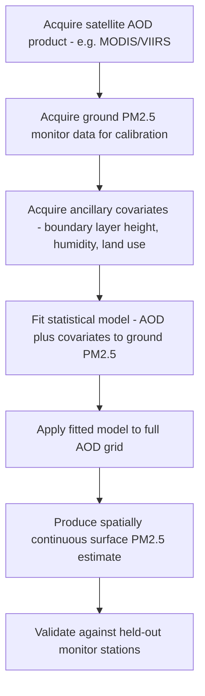

## Air Quality Fundamentals

### Definition and Conceptual Framework

Air quality refers to the concentration and composition of pollutants in ambient air relative to levels considered safe or acceptable for human health and environmental protection. The field integrates atmospheric chemistry (pollutant formation and transformation), atmospheric physics (transport, dispersion, deposition), and exposure science (health effects, regulatory thresholds). Air quality is fundamentally a function of **emissions** (source strength), **meteorology** (dispersion/transport conditions), and **chemistry** (formation, transformation, and removal of pollutants in the atmosphere).

### Criteria Air Pollutants

Most regulatory frameworks (e.g., the U.S. EPA National Ambient Air Quality Standards, NAAQS) are organized around a set of criteria pollutants:

| Pollutant | Primary Sources | Key Health/Environmental Concern |
| --- | --- | --- |
| $PM_{2.5}$ (fine particulate matter, ≤2.5 μm) | Combustion (vehicles, power plants, wildfire), secondary formation | Deep lung/cardiovascular penetration; strongest health-effect evidence among criteria pollutants |
| $PM_{10}$ (coarse particulate matter, ≤10 μm) | Dust, construction, agriculture, combustion | Upper respiratory irritation |
| Ozone ($O_3$, ground-level/tropospheric) | Secondary pollutant — photochemically formed | Respiratory irritant, crop/vegetation damage |
| Nitrogen dioxide ($NO_2$) | Combustion (vehicles, power plants) | Respiratory irritant, ozone/PM precursor |
| Sulfur dioxide ($SO_2$) | Fossil fuel combustion (especially coal), industrial processes | Respiratory irritant, acid deposition precursor |
| Carbon monoxide ($CO$) | Incomplete combustion (vehicles, heating) | Reduces blood oxygen-carrying capacity |
| Lead ($Pb$) | Industrial sources, historically leaded gasoline | Neurotoxicant, especially in children |

**[Inference]** Regulatory standard values (concentration thresholds, averaging periods) differ by jurisdiction and are periodically revised based on updated health-effects evidence, so specific numeric NAAQS or WHO guideline values should be verified against the current standard in effect for the relevant jurisdiction rather than treated as fixed.

### Primary vs. Secondary Pollutants

- **Primary pollutants**: Emitted directly from a source (e.g., $SO_2$, $CO$, primary $PM$, $NO$)
- **Secondary pollutants**: Formed through atmospheric chemical reactions among precursor species (e.g., ground-level ozone forms from $NO_x$ and volatile organic compounds, VOCs, in the presence of sunlight; secondary organic aerosol, SOA, and secondary inorganic aerosol, e.g., ammonium sulfate/nitrate, contribute substantially to $PM_{2.5}$ mass in many regions)

### Photochemical Smog and Ozone Formation

Ground-level ozone formation is a nonlinear photochemical process involving $NO_x$ (NO + $NO_2$) and VOC precursors under sunlight:

$$NO_2 + h\nu \rightarrow NO + O$$

$$O + O_2 + M \rightarrow O_3 + M$$

This simple cycle alone reaches a photostationary steady state without net ozone accumulation; net ozone buildup occurs when VOC oxidation (via reaction with the hydroxyl radical, OH) generates peroxy radicals ($RO_2$, $HO_2$) that convert NO to $NO_2$ without consuming ozone, effectively bypassing the ozone-destroying reaction with NO and allowing ozone to accumulate.

Ozone production is characterized as **VOC-limited** or **$NO_x$-limited** depending on the relative abundance of precursors:

- **VOC-limited regime** (typically high $NO_x$/VOC ratio, e.g., urban cores): Ozone production is most sensitive to VOC reductions; $NO_x$ reductions can sometimes increase local ozone (the "$NO_x$ disbenefit" or ozone titration effect, particularly relevant near strong $NO_x$ sources where fresh NO scavenges ozone directly)
- **$NO_x$-limited regime** (typically low $NO_x$/VOC ratio, e.g., downwind/rural areas): Ozone production is most sensitive to $NO_x$ reductions

This regime-dependence is a central complication in ozone control policy — **[Inference]** emissions control strategies effective in one regime can be ineffective or counterproductive in the other, making local/regional photochemical modeling generally necessary to design effective ozone reduction strategies rather than relying on a single generalized control approach.

### Particulate Matter Characteristics

$PM$ is characterized by size fraction (aerodynamic diameter), which determines both atmospheric residence time/transport distance and respiratory deposition depth:

- $PM_{10}$: Deposits in the upper respiratory tract (nasal passages, throat)
- $PM_{2.5}$: Penetrates to the alveolar region of the lungs; the size fraction most consistently associated with cardiovascular and respiratory mortality in epidemiological studies
- Ultrafine particles ($PM_{0.1}$, <100 nm): Emerging area of research concern due to potential for translocation beyond the respiratory system; measurement and regulatory frameworks are less standardized than for $PM_{2.5}$/$PM_{10}$

$PM$ composition varies by source: combustion-derived black carbon/elemental carbon, secondary sulfate/nitrate/ammonium, organic carbon (primary and secondary), crustal/mineral dust, and sea salt.

### Dispersion Meteorology

Pollutant dispersion is governed by atmospheric stability, wind, and boundary layer structure:

- **Atmospheric stability classes** (e.g., Pasquill-Gifford categories A–F, from very unstable to very stable): Determine plume dispersion characteristics — unstable conditions (strong daytime heating) promote vertical mixing and dilution, while stable conditions (nocturnal inversions) suppress vertical mixing, trapping pollutants near the surface
- **Temperature inversions**: A layer where temperature increases with height (opposite the normal tropospheric lapse rate), acting as a lid that suppresses vertical dispersion — radiative inversions (nocturnal, radiative cooling-driven) and subsidence inversions (associated with high-pressure systems) are both associated with air quality episodes, since pollutants accumulate beneath the inversion layer
- **Mixing height/boundary layer depth**: The vertical extent of active mixing; a shallow mixing height concentrates the same emission mass into a smaller volume, elevating surface concentrations
- **Gaussian plume model**: A foundational (though simplified) dispersion model assuming a Gaussian concentration distribution in the crosswind and vertical directions downwind of a point source:

$$C(x,y,z) = \frac{Q}{2\pi u \sigma_y \sigma_z} \exp\left(-\frac{y^2}{2\sigma_y^2}\right)\left[\exp\left(-\frac{(z-H)^2}{2\sigma_z^2}\right) + \exp\left(-\frac{(z+H)^2}{2\sigma_z^2}\right)\right]$$

where $Q$ is emission rate, $u$ is wind speed, $\sigma_y$ and $\sigma_z$ are the horizontal and vertical dispersion coefficients (functions of downwind distance and stability class), and $H$ is effective stack height (the second exponential term representing ground reflection)

### Regional and Long-Range Transport

- **Transboundary pollution**: Pollutants (particularly ozone, $PM_{2.5}$, and their precursors) can be transported hundreds to thousands of kilometers, complicating attribution and single-jurisdiction regulatory control (e.g., transpacific transport of Asian dust and pollution to North America, European transboundary $SO_2$/acid rain issues historically)
- **Wildfire smoke transport**: Increasingly significant contributor to regional/continental $PM_{2.5}$ episodes, transportable at both boundary-layer and free-tropospheric levels depending on plume injection height
- **Stratospheric-tropospheric ozone exchange**: A natural (non-anthropogenic) contributor to surface ozone in some conditions, distinct from photochemically-produced tropospheric ozone

### Geospatial and Remote Sensing Methods

- **Ground-based monitoring networks**: Reference-grade regulatory monitors (e.g., U.S. EPA AQS network, providing the gold-standard but spatially sparse point measurements) supplemented increasingly by low-cost sensor networks (e.g., PurpleAir), which offer high spatial density but require calibration correction against reference monitors due to sensor-specific biases (e.g., humidity artifacts in optical PM sensors)
- **Satellite column retrievals**: Instruments such as **TROPOMI** (Sentinel-5P), **OMI** (Aura), and **GEMS** (geostationary, East Asia) retrieve tropospheric column concentrations of $NO_2$, $SO_2$, formaldehyde (a VOC/ozone precursor proxy), and aerosol optical depth (AOD) via solar backscatter spectroscopy
- **Aerosol Optical Depth (AOD)**: A column-integrated satellite-derived measure of aerosol loading, statistically related to (but not equivalent to) ground-level $PM_{2.5}$ concentration; the AOD-to-surface-$PM_{2.5}$ relationship depends on the vertical aerosol profile, humidity (hygroscopic growth), and aerosol composition, requiring calibration/statistical modeling (e.g., using boundary layer height as a scaling covariate) to convert AOD into surface concentration estimates
- **Chemical transport models (CTMs)**: Models such as CMAQ (Community Multiscale Air Quality), CAMx, and GEOS-Chem numerically simulate emissions, transport, chemistry, and deposition to produce 3D gridded pollutant concentration fields, used both for regulatory attainment demonstration and source attribution
- **Land-use regression (LUR) models**: Statistical models predicting spatial pollutant concentration patterns (typically for urban-scale mapping) using land-use, traffic, and geographic covariates as predictors, calibrated against monitoring data
- **HYSPLIT (Hybrid Single-Particle Lagrangian Integrated Trajectory model)**: Widely used for back-trajectory analysis (source attribution) and forward dispersion/plume transport modeling (e.g., wildfire smoke or volcanic ash plume forecasting)

### Workflow: Estimating Surface PM2.5 from Satellite AOD

### Practical Example: Diagnosing a Wintertime PM2.5 Episode

1. Obtain hourly $PM_{2.5}$ monitor data for the episode period and identify the timing and magnitude of the concentration spike
2. Obtain concurrent meteorological data: surface and upper-air temperature profiles (to check for a temperature inversion), wind speed, and mixing height estimates (from reanalysis or a local sounding)
3. Confirm the presence of a surface-based temperature inversion by plotting the vertical temperature profile — a positive lapse rate (temperature increasing with height) near the surface indicates a trapping inversion
4. Cross-reference wind speed — persistently low wind speed (commonly below a few m/s) combined with the inversion indicates minimal ventilation/dilution
5. Identify likely emission sources active during the episode (e.g., residential wood/heating combustion, vehicle emissions during the morning/evening commute) that would accumulate under these suppressed-dispersion conditions
6. Optionally run a back-trajectory analysis (e.g., HYSPLIT) to assess whether transported pollution from an upwind source region contributed to the episode versus purely local accumulation
7. **[Inference]** Distinguishing the relative contribution of local accumulation versus regional transport in a specific episode typically requires either chemical transport modeling or source-apportionment analysis (e.g., using chemical speciation data), since meteorological diagnosis alone (inversion + low wind) is consistent with, but doesn't uniquely prove, a purely local-source explanation.

### Common Pitfalls

- Treating AOD as a direct proxy for surface $PM_{2.5}$ without accounting for vertical profile and humidity effects on the AOD-PM2.5 relationship
- Applying a single emissions control strategy (VOC vs. $NO_x$ reduction) without first determining the local ozone formation regime, given the possibility of a $NO_x$ disbenefit
- Conflating primary and secondary pollutant sources when performing source attribution, since secondary pollutant formation depends on regional precursor mixing and photochemistry, not just the nearest emission source
- Relying on uncalibrated low-cost sensor networks for regulatory-grade or health-effect research applications without bias correction against reference-grade monitors
- Assuming stagnant/inversion-driven episodes are solely a local emissions problem without considering possible long-range transport contributions

### Related Topics

- Photochemical ozone modeling and $NO_x$/VOC sensitivity analysis
- Chemical transport models (CMAQ, GEOS-Chem, CAMx)
- Satellite atmospheric composition remote sensing (TROPOMI, OMI, GEMS)
- Environmental health epidemiology and exposure assessment
- Wildfire smoke transport and forecasting (HYSPLIT, smoke forecast systems)
- Low-cost air quality sensor networks and calibration methods
- Land-use regression modeling for urban air pollution mapping
- Acid deposition and long-range transboundary pollution
- Indoor air quality and infiltration dynamics
- Environmental justice and disparities in air pollution exposure