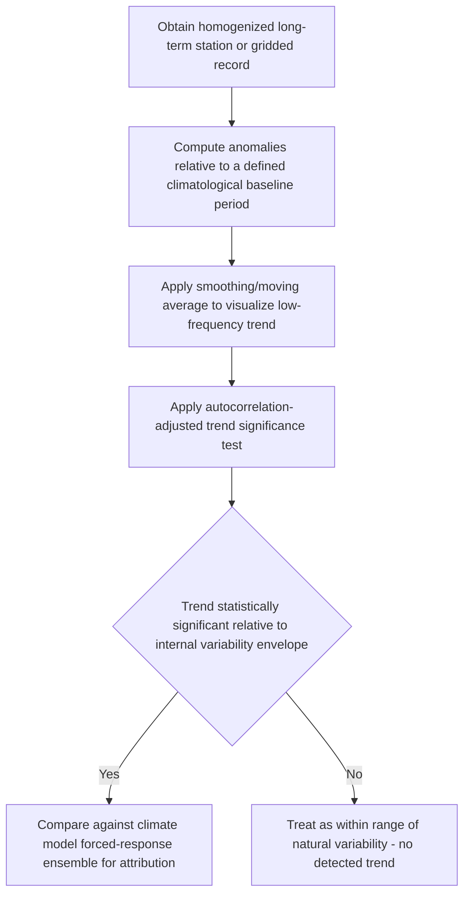

## Climate Versus Weather Distinctions

### Definition and Conceptual Framework

**Weather** is the instantaneous or short-term (minutes to a few weeks) state of the atmosphere at a specific place and time, described by variables such as temperature, precipitation, humidity, wind, and cloud cover. **Climate** is the statistical description of weather over an extended period, conventionally a minimum of 30 years per World Meteorological Organization (WMO) convention, encompassing not just mean conditions but the full distribution — variability, extremes, and higher-order statistical moments. The often-cited aphorism "climate is what you expect, weather is what you get" captures the core distinction: climate describes the probability distribution from which individual weather events are drawn as samples.

### The Boundary Value vs. Initial Value Problem

A foundational conceptual distinction in atmospheric predictability theory (articulated formally by Lorenz) is that weather forecasting and climate projection are fundamentally different mathematical problems:

- **Weather prediction as an initial value problem**: Given the current atmospheric state (initial conditions) as precisely as possible, the forecast integrates the governing equations forward in time. Predictability is fundamentally limited by sensitive dependence on initial conditions (chaos theory) — small errors in the initial state amplify over time, imposing a practical predictability limit on deterministic weather forecasting, generally understood to be on the order of about two weeks for the atmosphere's current observational and modeling capabilities, though this is a statement about current predictive skill under prevailing atmospheric dynamics rather than an immutable physical constant
- **Climate projection as a boundary value problem**: Rather than depending sensitively on the exact initial atmospheric state, climate projections depend on the boundary conditions and forcing that constrain the statistical behavior of the system over long timescales — solar radiation input, atmospheric composition (greenhouse gas concentrations), land surface properties, and ocean heat content/circulation. A climate projection does not attempt to predict the weather on a specific future date; it estimates how the statistical distribution of possible weather states will shift given specified changes in these boundary conditions

This distinction explains an frequently-misunderstood point: the inherent unpredictability of weather beyond roughly two weeks does not imply that long-term climate projection is similarly unconstrained, because the two rely on different sources of predictive skill (initial-condition memory vs. boundary-condition forcing response).

### Temporal and Spatial Scale Hierarchy

| Scale | Approx. Timescale | Governing Processes |
| --- | --- | --- |
| Weather | Minutes to ~2 weeks | Synoptic/mesoscale dynamics, initial-condition dependent |
| Sub-seasonal to seasonal (S2S) | 2 weeks to a season | MJO, ENSO state, soil moisture/land memory, slowly-varying boundary influences |
| Interannual climate variability | 1–10 years | ENSO, other coupled ocean-atmosphere modes |
| Decadal/multidecadal variability | 10–30+ years | PDO, AMO, internal ocean circulation variability |
| Climate (climatological normal) | ≥30 years (WMO convention) | Radiative forcing, external forcing, long-term mean state |
| Paleoclimate | Centuries to millions of years | Orbital forcing (Milankovitch cycles), tectonics, long-term carbon cycle |

**Climate variability** refers to fluctuations around the long-term mean state that occur even without any change in external forcing (internal/natural variability, e.g., ENSO cycling), while **climate change** refers to a statistically significant, persistent shift in the mean state or distribution of climate variables, whether from natural forcing (volcanic eruptions, solar cycles, orbital variation) or anthropogenic forcing (greenhouse gas emissions, land-use change, aerosols).

### Statistical Framing: Climate as a Probability Distribution

$$P(\text{weather outcome}) = f(\text{climate state})$$

A useful conceptual model treats climate as defining a probability distribution of possible weather outcomes at a given location and season; a shift in climate (e.g., a warming trend) shifts this distribution — commonly illustrated as a shift in the mean of a temperature distribution, which disproportionately increases the frequency of extreme high-temperature events at the upper tail relative to the proportional shift in the mean, due to the nonlinear relationship between a distributional shift and tail-probability change. **Climate extremes** are typically defined relative to a historical reference distribution (e.g., temperatures exceeding a given percentile threshold of the historical record), meaning what counts as "extreme" is itself a climatological, distribution-relative concept rather than a fixed absolute value.

### Distinguishing Signal from Noise: Attribution

**Climate variability (noise)** must be statistically distinguished from a **climate change signal** using time-series and detection-attribution methods:

- **Climatological normal/baseline**: A defined reference period (commonly a rolling 30-year window, e.g., 1991–2020 in current WMO practice) against which anomalies are computed
- **Anomaly**: The departure of an observed value from the climatological normal for that location and time of year — anomalies, not raw values, are the standard unit of climate analysis, since they remove the large seasonal/geographic cycle to isolate the variability/trend signal of interest
- **Detection**: Establishing that an observed change is statistically distinguishable from internal variability (i.e., unlikely to have occurred by chance alone given the historical variability envelope)
- **Attribution**: Establishing the relative contribution of specific forcing mechanisms (anthropogenic greenhouse gases, aerosols, land use, natural forcing) to a detected change, typically via comparison of observations against ensembles of climate model simulations run with and without specific forcings included
- **Event attribution**: A more recent methodological development that attempts to quantify how a specific extreme weather event's probability or intensity was altered by climate change, typically expressed as a change in return period or a "fraction of attributable risk," using large ensembles of model simulations under factual vs. counterfactual (pre-industrial-like) forcing scenarios

**[Inference]** Event attribution results are probabilistic and model-dependent conclusions rather than deterministic proof that a specific event "was caused by" climate change in a strict causal sense; results can vary meaningfully depending on the model ensemble, forcing scenario, and statistical methodology used, so results are generally reported as likelihood ratios or probability shifts rather than binary causal claims.

### A Practical Illustration: Loaded Dice Analogy

A widely used pedagogical analogy frames climate change as "loading the dice" — the underlying random process (weather) retains its full range of possible outcomes, but the probabilities of different outcomes shift. A cold winter day or a single unusually cool summer remains entirely possible under a warming climate, in the same way that rolling loaded dice can still occasionally produce a low number; a single data point (or even a single anomalous season) is not, by itself, sufficient evidence either for or against a longer-term climate trend, since both represent single draws from a variable distribution.

### Geospatial and Analytical Methods for Distinguishing Weather from Climate Signals

- **Long-term homogenized station records and gridded climate datasets** (e.g., GHCN, Berkeley Earth, HadCRUT): Used to construct climatological normals and long-term trend analysis, with homogenization correcting for non-climatic artifacts (station relocation, instrument changes, urbanization/heat island effects) that could otherwise be mistaken for a genuine climate signal
- **Reanalysis products (ERA5, MERRA-2, NCEP/NCAR)**: Provide spatially/temporally complete gridded historical fields for anomaly computation and trend analysis, valuable for regions with sparse direct observation
- **Climate model ensembles (CMIP6)**: Multiple model simulations run under identical or varied forcing scenarios are used to characterize the envelope of internal variability versus the forced response signal — a detected trend that falls well outside the spread of a large ensemble's internal variability is more confidently attributed to external forcing
- **Trend detection statistical methods**: Mann-Kendall trend test (non-parametric, robust to non-normal distributions common in climate data), linear regression with autocorrelation-adjusted significance testing (since climate time series often exhibit temporal autocorrelation that inflates naive significance estimates if unaddressed), and moving-average/low-pass filtering to separate short-term variability from longer-term trend components
- **Return period / extreme value analysis**: Using statistical distributions (e.g., Generalized Extreme Value distribution) fit to historical extremes to estimate how the frequency of a given magnitude event (e.g., a "100-year flood") may be shifting under a changing climate baseline

### Workflow: Distinguishing a Trend from Natural Variability at a Station

### Practical Example: Computing and Interpreting a Temperature Anomaly Trend

1. Obtain a long-term (multi-decadal), quality-controlled monthly temperature record for a station or grid cell
2. Define a climatological baseline period (e.g., 1991–2020) and compute the monthly climatological mean for each calendar month across that baseline
3. Compute monthly anomalies for the full record: anomaly = observed value − climatological mean for that calendar month
4. Aggregate to an annual mean anomaly series to reduce seasonal noise
5. Apply a linear trend fit, but adjust the significance test for autocorrelation (e.g., using an effective sample size correction, since consecutive annual anomalies are not fully statistically independent)
6. Compare the magnitude and confidence interval of the fitted trend against the standard deviation of detrended residuals (a proxy for the magnitude of natural year-to-year variability) to assess whether the trend is large relative to background noise
7. **[Inference]** A statistically significant trend at a single station provides local, not necessarily regional or global, evidence of change; robust climate change signal detection typically requires spatial aggregation across many stations/grid points and/or comparison with independent lines of evidence (e.g., ocean heat content, sea level, cryosphere indicators) rather than reliance on a single-location time series.

### Common Pitfalls

- Citing a single cold spell, snowstorm, or unusually mild season as evidence for or against a long-term climate trend, conflating a single weather realization with the underlying climate distribution
- Treating the ~2-week weather predictability limit as implying climate projections decades into the future are equally uncertain, without recognizing the boundary-value vs. initial-value problem distinction
- Computing anomalies against an outdated or inconsistent baseline period across different analyses, producing artificially inflated or deflated apparent trends when compared
- Applying standard linear regression significance tests to autocorrelated climate time series without adjustment, which understates the true uncertainty and can produce spuriously significant trends
- Interpreting single-event attribution results as deterministic causal proof rather than probabilistic risk-ratio statements

### Related Topics

- Climate model ensembles and CMIP6 experimental design
- Extreme event attribution methodology
- Climatological normals and WMO baseline period conventions
- Chaos theory and atmospheric predictability limits (Lorenz)
- Homogenization of long-term climate station records
- ENSO and other internal climate variability modes
- Extreme value theory and return period estimation
- Paleoclimate proxies and orbital (Milankovitch) forcing
- Detection and attribution science (IPCC AR6 methodology)
- Urban heat island effects on station-based climate records