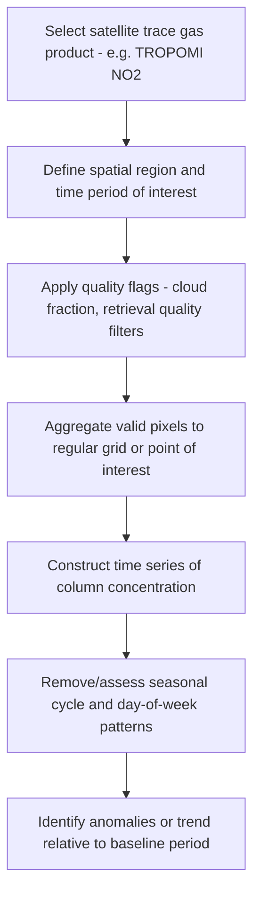

## Remote Sensing of Atmospheric Variables

### Definition and Conceptual Framework

Remote sensing of atmospheric variables refers to the measurement of atmospheric properties (temperature, humidity, wind, composition, aerosols, clouds) without direct physical contact, using the interaction of electromagnetic radiation with the atmosphere. Measurements are classified along two primary axes: **passive vs. active** sensing (whether the instrument measures naturally occurring radiation or emits its own signal and measures the return), and **platform** (ground-based, airborne, or satellite-based, the latter further divided into polar-orbiting/sun-synchronous and geostationary orbits).

### Passive vs. Active Remote Sensing

- **Passive sensors**: Measure naturally occurring radiation — reflected solar radiation (visible/near-infrared), emitted terrestrial/atmospheric thermal radiation (infrared, microwave), or scattered radiation. Examples: radiometers, spectrometers, sounders
- **Active sensors**: Emit a signal (radar pulse, laser pulse, radio signal) and measure the characteristics of the returned/scattered signal (time delay, frequency shift, intensity). Examples: weather radar, lidar, GPS radio occultation

Active sensors generally provide more direct, higher-resolution vertical profiling (e.g., precise range-gating in lidar/radar), while passive sensors often provide broader spatial/temporal coverage at typically coarser vertical resolution (since passive retrievals from top-of-atmosphere radiance require solving an ill-posed inversion problem to recover a vertical profile).

### Orbital Configurations

- **Geostationary orbit** (~35,786 km altitude, equatorial, matching Earth's rotation period): Provides continuous observation of a fixed Earth-facing hemisphere, enabling high temporal resolution (minutes) essential for tracking rapidly evolving phenomena (convective storm development, cyclone motion) — examples: GOES-R series (Americas), Himawari (East Asia/Western Pacific), Meteosat (Europe/Africa/Indian Ocean), GEMS (geostationary air quality, East Asia)
- **Polar/sun-synchronous orbit** (~700–850 km altitude, near-polar inclination, fixed local solar time crossing): Provides global coverage with typically 1–2 overpasses per day at a given location, at generally higher spatial resolution than geostationary platforms due to lower orbital altitude — examples: Terra/Aqua (MODIS), Suomi-NPP/JPSS (VIIRS), Sentinel-5P (TROPOMI), CALIPSO
- **Low Earth Orbit (LEO) constellations**: Used for GPS radio occultation missions (e.g., COSMIC/COSMIC-2), providing globally distributed but spatially/temporally irregular sampling based on satellite-to-satellite geometry

### Passive Sounding: Temperature and Humidity Profiles

**Atmospheric sounders** retrieve vertical temperature and humidity profiles by measuring emitted radiance across multiple spectral channels, each sensitive to emission from a different atmospheric layer due to varying gas absorption/emission optical depth:

$$I(\nu) = \int_0^\infty B[\nu, T(z)] \frac{d\tau(\nu, z)}{dz} dz$$

the **radiative transfer equation** underlying sounding retrievals (simplified, clear-sky form), where $I(\nu)$ is the observed radiance at wavenumber $\nu$, $B$ is the Planck blackbody function, $T(z)$ is temperature at height $z$, and $\tau$ is optical depth. Each spectral channel's **weighting function** (the vertical derivative of transmittance) peaks at a different altitude, and combining many channels allows a vertical profile to be statistically retrieved via inversion techniques (e.g., optimal estimation methods).

- **Hyperspectral infrared sounders** (e.g., AIRS on Aqua, IASI on MetOp, CrIS on Suomi-NPP/JPSS): Thousands of narrow spectral channels in the infrared, primarily sensitive to $CO_2$ absorption bands (for temperature, since $CO_2$ is well-mixed) and water vapor bands (for humidity); limited by cloud contamination, since infrared radiation from below cloud top is blocked
- **Microwave sounders** (e.g., AMSU, ATMS): Sensitive to oxygen absorption bands (temperature) and water vapor lines (humidity); microwave radiation penetrates non-precipitating clouds, providing valuable all-weather (cloud-independent, though still limited in precipitating conditions) sounding capability that complements infrared sounders

### GPS Radio Occultation

**GPS-RO** exploits the bending of GPS satellite radio signals as they pass through the atmosphere's refractive index gradient (dominated by density, and thus temperature/pressure/humidity) en route to a receiver on a low-Earth-orbit satellite. The bending angle as a function of tangent height is inverted (via the Abel transform) to recover a vertical refractivity profile, which is further processed into temperature and (with independent moisture information) humidity profiles.

**[Inference]** GPS-RO is particularly valued for climate-quality monitoring because it is self-calibrating (deriving from a precise atomic-clock-referenced time delay measurement rather than requiring instrument radiometric calibration), giving it high long-term stability especially valuable in the upper troposphere/lower stratosphere (UTLS) region, though its vertical resolution and coverage in the lower troposphere are comparatively limited by super-refraction effects near the moist boundary layer.

### Wind Remote Sensing

- **Atmospheric Motion Vectors (AMVs)**: Derived by tracking the displacement of identifiable cloud or water vapor features across successive geostationary satellite images, yielding wind vectors at an altitude inferred from the cloud-top temperature or water vapor channel weighting function
- **Scatterometry** (e.g., ASCAT): Active microwave radar measuring the roughness of the ocean surface (via Bragg scattering from wind-driven capillary waves), from which near-surface ocean wind speed and direction are retrieved — the primary source of global ocean surface wind vector data
- **Doppler weather radar**: Measures the frequency shift (Doppler shift) of the returned signal from precipitation/aerosol targets to derive the radial component of wind velocity along the radar beam
- **Doppler lidar**: Analogous laser-based technique for clear-air wind profiling, used at both ground-based and (increasingly) satellite platforms (e.g., ESA's Aeolus mission, a demonstration of direct-detection Doppler wind lidar from space)

### Active Sensing of Clouds, Precipitation, and Aerosols

- **Weather radar** (ground-based, e.g., NEXRAD network; spaceborne, e.g., GPM's Dual-frequency Precipitation Radar): Measures reflectivity (proportional to hydrometeor size/concentration) and, in dual-polarization systems, additional variables (differential reflectivity, correlation coefficient) enabling hydrometeor type classification (rain, hail, snow, mixed phase)
- **Cloud radar** (e.g., CloudSat's Cloud Profiling Radar): Shorter-wavelength radar optimized for detecting non-precipitating cloud particles, which are too small to detect effectively with conventional weather radar wavelengths
- **Lidar** (e.g., CALIPSO's CALIOP instrument): Provides high-vertical-resolution profiles of cloud and aerosol layers, including aerosol type classification (via depolarization ratio and backscatter/extinction characteristics) and cloud-top/base height
- **Passive aerosol retrieval** (e.g., MODIS, VIIRS Aerosol Optical Depth products): Derives column-integrated aerosol loading from the spectral and angular characteristics of reflected solar radiation, requiring assumptions about aerosol type and surface reflectance to invert

### Trace Gas and Composition Retrievals

- **UV/Visible backscatter spectrometers** (e.g., OMI, TROPOMI, GOME-2): Retrieve column concentrations of ozone, $NO_2$, $SO_2$, formaldehyde, and other trace gases from the spectral absorption signature in backscattered solar UV/visible radiation using differential optical absorption spectroscopy (DOAS) techniques
- **Solar occultation and limb sounding** (e.g., historically SAGE, ACE-FTS): Measure trace gas profiles by observing solar radiation attenuation through the atmospheric limb during satellite sunrise/sunset, providing high vertical resolution in the stratosphere particularly valuable for ozone profile and stratospheric trace gas monitoring
- **Greenhouse gas column monitoring** (e.g., OCO-2/OCO-3 for $CO_2$, GOSAT for $CO_2$/$CH_4$): Retrieve column-averaged dry-air mole fractions via high-precision near-infrared spectroscopy of reflected sunlight, used to constrain surface carbon flux estimates through inverse modeling

### Ground-Based Remote Sensing

- **Radiosondes**: In-situ (not strictly remote sensing, but the standard vertical-profile reference/validation dataset) balloon-borne measurements of temperature, humidity, pressure, and (via GPS tracking) wind
- **Ground-based microwave radiometers**: Retrieve boundary-layer temperature and humidity profiles from ground-level upward-looking passive microwave measurements
- **Ceilometers and cloud radars**: Ground-based active sensors for continuous cloud-base height and vertical cloud structure monitoring
- **Sun photometers** (e.g., the AERONET global network): Ground-based passive instruments measuring direct solar and sky radiance to retrieve column AOD and aerosol size distribution, serving as the primary validation reference for satellite AOD products

### Data Assimilation: Integrating Remote Sensing into Models

Remote sensing observations are integrated into numerical weather prediction and reanalysis systems via **data assimilation**, which statistically combines observations with a short-range model forecast (the "background" or "first guess") weighted by their respective uncertainties to produce an optimal analysis state:

$$x_a = x_b + K(y - H(x_b))$$

the core data assimilation update equation, where $x_a$ is the analysis state, $x_b$ is the background forecast, $y$ is the observation vector, $H$ is the observation operator (mapping model state to observation space, e.g., simulating satellite radiance from model temperature/humidity), and $K$ is the Kalman gain (weighting based on relative observation and background error covariances). Satellite radiances (rather than pre-retrieved profiles) are frequently assimilated directly ("radiance assimilation"), letting the assimilation system's own error covariance structure perform the profile inversion implicitly and consistently with the full model state, generally yielding better-constrained analyses than assimilating independently retrieved profiles.

### Workflow: Deriving a Trace Gas Column Time Series

### Practical Example: Validating Satellite AOD Against Ground Truth

1. Obtain a satellite AOD product (e.g., MODIS Dark Target/Deep Blue combined product) for a study region and time period
2. Obtain co-located AERONET sun photometer AOD measurements for the same period, applying a spatial (e.g., within a defined radius of the station) and temporal (e.g., within a defined time window of satellite overpass) matching criterion
3. Compute standard validation statistics: correlation coefficient, root-mean-square error (RMSE), and bias (mean satellite AOD − mean AERONET AOD)
4. Assess whether the satellite retrieval falls within its stated expected error envelope (satellite AOD products typically publish an expected error range, e.g., of the general form ±(a + b×AOD), reflecting the retrieval's error growing with aerosol loading)
5. Stratify validation results by surface type (bright desert/urban surfaces are historically more challenging for AOD retrieval than dark vegetated surfaces, due to reduced contrast between surface and atmospheric signal) and by season, since retrieval performance is frequently surface- and condition-dependent
6. **[Inference]** A validation exercise limited to a small number of AERONET stations, while a standard methodological approach given the sparseness of ground reference networks, provides only regionally representative validation and may not capture retrieval performance in under-sampled surface types or regions without a nearby reference station.

### Common Pitfalls

- Treating passive infrared sounder profiles as reliable in cloudy conditions, when infrared retrievals are fundamentally limited by cloud opacity blocking radiation from below cloud top
- Assuming satellite-derived AOD and ground-level $PM_{2.5}$ are interchangeable without accounting for vertical profile, humidity, and aerosol composition effects on their relationship
- Comparing atmospheric motion vector "winds" directly with in-situ point wind measurements without accounting for the fact that AMVs represent a feature-tracked displacement at an inferred (not directly measured) height, introducing height-assignment uncertainty
- Neglecting quality flags/cloud-screening in trace gas or AOD retrieval products, which can substantially bias results if low-quality retrievals are included uncritically
- Assuming a single remote sensing technique provides comprehensive atmospheric characterization, when in practice complementary passive/active and multi-platform observations are generally needed to resolve the full vertical/temporal/compositional atmospheric state

### Related Topics

- Radiative transfer theory and retrieval inversion methods (optimal estimation)
- Data assimilation methods (variational, ensemble Kalman filter) in NWP
- GPS radio occultation mission design (COSMIC/COSMIC-2)
- Satellite aerosol and trace gas retrieval algorithms (DOAS, Dark Target/Deep Blue)
- Doppler radar and dual-polarization hydrometeor classification
- AERONET and ground-based validation networks
- Geostationary vs. polar-orbiting satellite mission design trade-offs
- Greenhouse gas monitoring from space (OCO-2/3, GOSAT) and inverse flux modeling
- Cloud and precipitation radar/lidar synergy (A-Train satellite constellation heritage)
- Numerical weather prediction observation impact studies