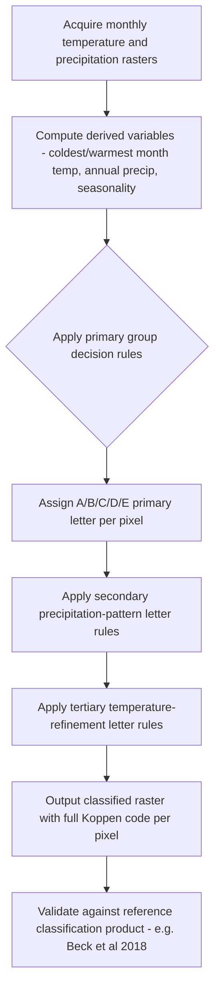

## Climate Classification Systems

### Definition and Conceptual Framework

Climate classification systems are systematic frameworks for categorizing Earth's regional climates into discrete types based on quantifiable variables — primarily temperature and precipitation patterns — enabling comparison, mapping, and communication of climate characteristics across regions. Classification approaches vary in their underlying philosophy: **empirical/genetic** systems classify climates based on observed statistical patterns and threshold rules (e.g., Köppen), while **genetic/causal** systems classify based on the atmospheric circulation mechanisms that produce a given climate (e.g., air mass-based systems). Most classification systems used in physical geography and geospatial science are empirical, since they can be operationalized directly from station or gridded data without requiring independent knowledge of the driving circulation.

### The Köppen-Geiger System

The **Köppen climate classification** (Wladimir Köppen, first published 1900, later revised by Geiger and others as Köppen-Geiger) is the most widely used climate classification system globally, largely due to its purely quantitative, threshold-based definitions that make it straightforward to apply consistently to gridded temperature and precipitation data.

The system uses a hierarchical letter-coding scheme:

**Primary groups (first letter)**:

| Letter | Group | General Criterion |
| --- | --- | --- |
| A | Tropical | Coldest month mean temperature ≥ 18°C |
| B | Arid | Precipitation-based aridity threshold (function of temperature and seasonality) exceeded |
| C | Temperate | Coldest month mean between -3°C and 18°C (thresholds vary by scheme version), with at least one month > 10°C |
| D | Continental | Coldest month mean < -3°C (varies by version), with at least one month > 10°C |
| E | Polar | Warmest month mean < 10°C |

**Second letter** (typically precipitation pattern): e.g., f (no dry season), w (dry winter), s (dry summer), m (monsoon) for A-type climates; W (desert) or S (steppe) for B-type

**Third letter** (typically temperature refinement): e.g., a (hot summer, warmest month > 22°C), b (warm summer), c (cold summer), d (very cold winter) for C/D climates; h (hot, arid) or k (cold, arid) for B climates

Example codes: **Af** (tropical rainforest, no dry season), **BWh** (hot desert), **Cfa** (humid subtropical), **Cfb** (oceanic/temperate maritime), **Dfb** (warm-summer humid continental), **ET** (tundra), **EF** (ice cap).

**[Inference]** Specific numeric thresholds in the Köppen-Geiger system have been revised across different published versions (original Köppen, Köppen-Geiger, and various modern updates such as Kottek et al. 2006 and Beck et al. 2018); analyses should specify which version's thresholds were applied, since boundary classifications can shift meaningfully between versions.

### The Thornthwaite System

The **Thornthwaite classification** (1948) improves on Köppen's purely empirical thresholds by incorporating a physically-based **potential evapotranspiration (PET)** estimate, allowing computation of a water balance (precipitation minus PET) rather than relying on precipitation alone:

$$\text{Moisture Index} = \frac{100 \times S - 60 \times D}{PET}$$

where $S$ is the seasonal water surplus and $D$ is the seasonal water deficit relative to PET. This produces a **moisture regime classification** (e.g., perhumid, humid, subhumid, semi-arid, arid) that is more directly tied to plant-available moisture and agricultural/hydrological application than Köppen's simpler precipitation thresholds, at the cost of requiring more input data (PET estimation methods themselves vary and introduce additional methodological choices).

### The Holdridge Life Zone System

The **Holdridge life zone classification** (1947, revised 1967) uses three axes on a triangular diagram: **biotemperature** (a temperature index that excludes below-freezing periods, since plant growth is assumed to cease below 0°C), **mean annual precipitation**, and a derived **potential evapotranspiration ratio** (PET/precipitation), which serves as a humidity province indicator. This system is explicitly designed to align classification boundaries with vegetation/ecosystem (biome) boundaries, making it particularly popular in ecological and biogeographic applications rather than purely climatological ones — see the Biomes and Ecological Zonation entry for its application to vegetation mapping.

### Genetic (Circulation-Based) Classification Approaches

- **Air mass climatology (Bergeron/Strahler classification)**: Classifies climates according to the dominant air masses and frontal zones influencing a region (e.g., continental polar-dominated, maritime tropical-dominated, or transitional frontal-zone climates) — more explicitly tied to the causal atmospheric circulation mechanism than Köppen's purely statistical approach, but comparatively less standardized/quantitative and thus less commonly used for automated gridded mapping
- **Synoptic classification systems**: Classify climate/weather regimes based on characteristic large-scale circulation patterns (e.g., Lamb Weather Types for the British Isles, Grosswetterlagen for Central Europe) — regionally specific systems tying local climate to specific synoptic circulation configurations

### Bioclimatic Variable-Based Classification (Modern Ecological/Modeling Use)

Modern species distribution modeling and biome mapping commonly use continuous **bioclimatic variables** rather than discrete categorical classes, derived from monthly temperature and precipitation:

- The standard **WorldClim/CHELSA 19 bioclimatic variables** (BIO1–BIO19) capture annual means, seasonality, and extremes (e.g., BIO1 = annual mean temperature, BIO5 = max temperature of warmest month, BIO12 = annual precipitation, BIO15 = precipitation seasonality/coefficient of variation)
- These variables serve as continuous predictors in statistical/machine-learning climate envelope models rather than assigning a discrete class label, offering finer discriminating power for ecological applications at the cost of the intuitive, communicable simplicity of a categorical system like Köppen

### Aridity Indices

Several standalone aridity/dryness indices exist independent of full classification systems, often used as inputs to broader systems or as standalone drought/desertification indicators:

- **UNEP Aridity Index**: $AI = P / PET$ (precipitation over potential evapotranspiration), with UNEP-defined thresholds delineating hyper-arid, arid, semi-arid, and dry sub-humid zones — widely used in desertification and land degradation assessment (e.g., UNCCD reporting)
- **De Martonne Aridity Index**: A simpler index using only temperature and precipitation: $I = P / (T + 10)$, historically popular due to minimal data requirements

### Geospatial Implementation and Mapping

- **Gridded climate classification products**: Beck et al. (2018) produced a widely used high-resolution (~1 km) global Köppen-Geiger classification derived from WorldClim climate data, now a standard reference dataset for climate-zone-stratified analyses in remote sensing and ecological studies
- **Automated classification workflows**: Applying Köppen or Thornthwaite classification to gridded climate data (e.g., WorldClim, CHELSA, or climate model output) is typically implemented as a rule-based pixel classification, iterating through the hierarchical letter-code decision logic per grid cell using monthly temperature and precipitation rasters
- **Climate zone shift mapping**: Comparing classified maps derived from historical vs. future/projected climate data (e.g., CMIP6 scenario output) to visualize projected geographic shifts in climate zone boundaries — a common climate communication and impact-assessment product, though subject to the same downscaling and model-uncertainty caveats as any climate projection application
- **R/Python implementations**: The R package `kgc` and various Python scripts implement automated Köppen-Geiger classification from gridded input data; QGIS/ArcGIS raster calculator workflows can also implement the rule-based logic directly

### Workflow: Automated Köppen-Geiger Classification from Gridded Climate Data

### Practical Example: Classifying a Region's Köppen Type from Station Data

1. Obtain monthly mean temperature and monthly total precipitation normals for a station (e.g., from a 30-year climatological record)
2. Identify the coldest month mean temperature and warmest month mean temperature
3. Apply the primary group test hierarchy in the conventional order (test B/aridity first using the appropriate aridity threshold formula, since an otherwise "temperate" location can still be classified as arid if the precipitation threshold is not met; then test A, C, D, E based on temperature thresholds)
4. If classified as A, C, or D, determine the precipitation-pattern second letter by comparing wet-season vs. dry-season precipitation totals against the defined seasonal thresholds
5. Determine the temperature-refinement third letter using warmest/coldest month thresholds (e.g., distinguishing Cfa from Cfb using the 22°C warmest-month threshold)
6. Assign the final three-letter code (e.g., Cfa) and compare against the location's known regional climate description as a sanity check
7. **[Inference]** Manual station-based classification can occasionally disagree with gridded product classifications (e.g., Beck et al. 2018) for the same nominal location due to differences in the underlying climate normal period, interpolation methodology, and precise threshold version used — such discrepancies are a normal consequence of methodological choices rather than necessarily indicating an error in either source.

### Common Pitfalls

- Treating Köppen classification boundaries as sharp, static lines rather than a categorical simplification of continuous underlying climate gradients — actual transitions are gradual, and shifts of a location between adjacent classes over time can occur from natural interannual variability, not just genuine long-term climate change
- Using inconsistent Köppen threshold versions when comparing classification results across studies without acknowledging the version difference
- Assuming Köppen classification (based purely on temperature/precipitation) directly determines biome or vegetation type — while correlated, Köppen zones and Holdridge life zones/biomes are not perfectly interchangeable, since Köppen does not explicitly incorporate PET-derived moisture availability the way Thornthwaite/Holdridge do
- Applying station-based classification results to a broad surrounding region without accounting for local topographic/microclimatic variation not captured by a single point measurement
- Conflating a "climate classification shift" in a projected future map with a claim about specific weather-scale predictability at that location

### Related Topics

- Biomes and ecological zonation (Whittaker, Holdridge applications)
- Potential evapotranspiration estimation methods (Penman-Monteith, Thornthwaite, Hargreaves)
- Bioclimatic variables and species distribution modeling
- Aridity indices and desertification/land degradation assessment (UNCCD)
- CMIP6 climate projections and downscaling methods
- Gridded climate datasets (WorldClim, CHELSA, ERA5)
- Synoptic weather typing and circulation-based classification (Lamb Weather Types)
- Climate zone shift mapping under future emission scenarios
- Agroclimatic classification for crop suitability modeling
- Paleoclimate classification and biome reconstruction