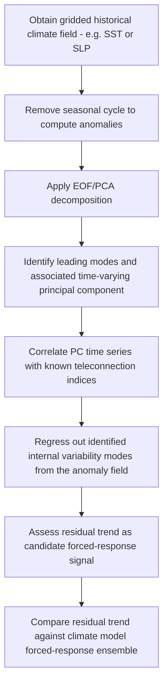

## Climate Drivers and Variability

### Definition and Conceptual Framework

Climate drivers are the physical mechanisms that determine Earth's climate state and its variations over time, operating across a hierarchy of timescales from sub-annual to multi-million-year. **Climate variability** refers to fluctuations around a mean climate state, distinguishing between **internal (unforced) variability** — arising from the chaotic, nonlinear internal dynamics of the coupled ocean-atmosphere-land-ice system even absent any change in external forcing — and **externally forced variability**, driven by changes in factors external to the internal climate system's dynamics (solar output, volcanic aerosols, orbital configuration, greenhouse gas concentrations, land-use change). Both categories can act on similar timescales, which is a central complication in detection and attribution science (see the Climate Versus Weather Distinctions entry).

### The Climate Forcing Framework

Climate forcings are conventionally quantified in terms of **radiative forcing** — the net change in energy balance (in W/m²) at the top of the atmosphere resulting from a given driver, relative to a reference (typically pre-industrial) state:

$$\Delta T \approx \lambda \cdot \Delta F$$

where $\Delta T$ is the equilibrium temperature response, $\Delta F$ is the radiative forcing, and $\lambda$ is the climate sensitivity parameter (itself dependent on feedback processes). This simplified linear framework provides a common metric for comparing the relative influence of very different physical mechanisms (solar variation, volcanic aerosols, greenhouse gases) on the same energy-balance basis.

### External Forcing Mechanisms

**Solar variability**: Total solar irradiance (TSI) varies on an approximately 11-year sunspot cycle (with an amplitude of roughly 0.1% of TSI, a comparatively small direct radiative forcing relative to anthropogenic greenhouse gas forcing over the industrial era) and on longer, less regular multi-decadal to centennial timescales (e.g., the Maunder Minimum, a period of suppressed solar activity coincident with, though not proven to solely cause, the coldest portion of the "Little Ice Age").

**Volcanic forcing**: Large explosive volcanic eruptions injecting sulfate aerosol precursors into the stratosphere (e.g., Mount Pinatubo, 1991) produce a transient (typically 1–3 year) global cooling effect by increasing stratospheric aerosol optical depth and reflecting incoming solar radiation — a well-documented natural experiment used to validate climate model radiative and dynamical response.

**Orbital (Milankovitch) forcing**: Cyclical variations in Earth's orbital parameters redistribute (rather than substantially change the global total of) incoming solar radiation by latitude and season, operating on multi-millennial timescales:

- **Eccentricity**: Variation in orbital ellipticity, ~100,000 and ~405,000 year cycles
- **Obliquity**: Variation in axial tilt (~22.1°–24.5°), ~41,000 year cycle, primarily affecting the strength of the seasonal cycle and high-latitude insolation
- **Precession**: Wobble in the orientation of the rotation axis, ~19,000–23,000 year cycle, determining which hemisphere experiences perihelion during its respective summer

Milankovitch cycles are the principal accepted pacemaker of Pleistocene glacial-interglacial cycles, though the full climate response (particularly the strong ~100,000-year eccentricity-paced glacial cycles seen over roughly the past 800,000 years, despite eccentricity's own forcing being comparatively weak) requires amplifying internal feedback mechanisms (ice-albedo feedback, greenhouse gas feedbacks recorded in ice cores) rather than direct orbital forcing alone — a topic of ongoing paleoclimate research (the "100,000-year problem").

**Anthropogenic forcing**: Greenhouse gas emissions (CO2, CH4, N2O, halocarbons), land-use/land-cover change (altering surface albedo and evapotranspiration), and aerosol emissions (both a direct radiative effect and an indirect effect via cloud microphysics modification) constitute the dominant forcing driving the observed industrial-era climate trend, per current scientific assessment (e.g., IPCC AR6).

### Internal (Unforced) Variability: Coupled Ocean-Atmosphere Modes

$$\text{Observed variability} = \text{Forced response} + \text{Internal variability}$$

**El Niño–Southern Oscillation (ENSO)**: The dominant mode of interannual coupled ocean-atmosphere variability, involving the Walker Circulation and tropical Pacific sea surface temperature anomalies (see the Atmospheric Circulation Patterns entry for mechanistic detail). ENSO operates on an irregular 2–7 year period and produces significant, well-documented global temperature and precipitation teleconnections.

**Pacific Decadal Oscillation (PDO)** and **Interdecadal Pacific Oscillation (IPO)**: Longer-period (multi-decadal) patterns of North/broader Pacific sea surface temperature variability, spatially resembling an ENSO-like pattern but evolving on a slower timescale; can modulate the background state upon which ENSO events are superimposed.

**Atlantic Multidecadal Oscillation/Variability (AMO/AMV)**: A multi-decadal (~60–70 year, though the periodicity and even the degree to which it represents a genuine internal oscillation versus a response to varying external aerosol forcing has been debated in the literature) pattern of North Atlantic sea surface temperature variability, associated with Atlantic hurricane activity variability and North American/European climate impacts.

**North Atlantic Oscillation (NAO)** and **Arctic Oscillation (AO)**: Atmospheric pressure dipole patterns (Icelandic Low vs. Azores High for NAO; a broader Arctic-midlatitude pressure seesaw for AO) operating on sub-seasonal to interannual timescales, strongly influencing North Atlantic/European winter weather and storm track position.

**Madden-Julian Oscillation (MJO)**: An eastward-propagating pulse of enhanced and suppressed tropical convection with a 30–60 day period, distinct from ENSO's much longer interannual timescale; a leading source of sub-seasonal predictability and known to modulate tropical cyclone genesis likelihood and extratropical weather via teleconnection.

**[Inference]** Distinguishing genuine multi-decadal internal oscillations (such as the AMO) from a slowly-evolving forced response (e.g., to time-varying anthropogenic aerosol emissions) is an area of active scientific investigation rather than fully settled, since the instrumental record is not long enough, relative to the proposed oscillation period, to statistically distinguish a small number of oscillation cycles from a forced trend with high confidence using observations alone; climate model large ensembles are typically used to help address this attribution ambiguity.

### Climate Feedback Mechanisms

Feedbacks amplify or dampen the direct temperature response to a given forcing:

- **Water vapor feedback**: Warming increases atmospheric water-holding capacity (per the Clausius-Clapeyron relation), and since water vapor is itself a greenhouse gas, this amplifies the initial warming — the single largest positive feedback in the climate system per current scientific understanding
- **Ice-albedo feedback**: Warming reduces ice/snow cover, lowering surface albedo (since ice/snow reflects more solar radiation than exposed ocean/land), increasing absorbed solar radiation and further warming — particularly pronounced in high-latitude/polar regions, contributing to the well-documented phenomenon of Arctic amplification (greater observed and projected warming in the Arctic relative to the global mean)
- **Cloud feedback**: The net effect of cloud changes on climate sensitivity, involving competing effects (cloud altitude, cloud type, and cloud fraction changes can each act as positive or negative feedbacks); historically the largest source of inter-model spread in climate sensitivity estimates
- **Lapse rate feedback**: Changes in the vertical temperature profile's response to warming (generally a modest negative feedback in the tropics due to enhanced upper-tropospheric warming relative to the surface, following moist adiabatic constraints)
- **Carbon cycle feedbacks**: Changes in the efficiency of natural carbon sinks (ocean and land) under a warming climate, potentially including permafrost carbon release — generally assessed as a net positive (amplifying) feedback, though with substantial quantitative uncertainty

### Geospatial and Data Methods for Analyzing Climate Drivers

- **Paleoclimate proxy networks**: Ice cores (trapped gas bubbles for past atmospheric composition, isotopic ratios for temperature), tree rings (dendroclimatology), corals, speleothems, and marine/lake sediment cores provide indirect, spatially distributed evidence of past climate variability extending beyond the instrumental record, used to reconstruct forcing-response relationships over paleoclimate timescales
- **Climate model large ensembles**: Running the same climate model many times with minutely perturbed initial conditions under identical forcing generates an ensemble that samples the model's internal variability, allowing statistical separation of the forced response (the ensemble mean) from internal variability (the ensemble spread) — a standard modern tool for detection/attribution and driver analysis
- **Teleconnection indices**: Standardized indices (e.g., Oceanic Niño Index/ONI for ENSO, NAO index, PDO index, AMO index) computed from gridded SST/pressure reanalysis data, used as predictors in statistical regression/composite analyses relating a driver's phase to regional climate impacts
- **Spectral/wavelet analysis**: Used to identify dominant periodicities in climate time series (e.g., confirming the ENSO 2–7 year band or exploring evidence for decadal oscillation periodicity), while being mindful that red-noise (autocorrelated) climate time series can produce apparent spectral peaks that require careful significance testing against an appropriate null model
- **Empirical Orthogonal Function (EOF) analysis**: A statistical technique (equivalent to Principal Component Analysis applied to spatiotemporal climate fields) used to objectively identify the dominant spatial patterns of variability in a gridded climate dataset and their corresponding time-varying amplitude, foundational to the empirical derivation of teleconnection patterns like the PDO and NAO

### Workflow: Isolating a Forced Trend from Internal Variability Using an EOF/Composite Approach

### Practical Example: Assessing ENSO's Contribution to a Regional Temperature Trend

1. Obtain a regional temperature anomaly time series (e.g., seasonal mean) and a standard ENSO index (e.g., ONI) for the same period
2. Perform a linear regression of the regional temperature anomaly against the ENSO index to estimate the ENSO-associated temperature sensitivity coefficient
3. Use the fitted regression to compute an "ENSO-adjusted" temperature series by subtracting the estimated ENSO contribution from the raw anomaly series at each time step
4. Re-compute the long-term linear trend on both the raw and ENSO-adjusted series
5. Compare the two trend estimates — a substantial reduction in trend magnitude (or improved trend statistical significance) after ENSO adjustment indicates that a portion of the apparent trend/variability was attributable to ENSO phase distribution over the study period rather than a genuine secular forced trend
6. **[Inference]** This type of single-predictor regression adjustment is a standard, but simplified, first-pass approach; a more complete analysis would need to jointly account for multiple overlapping internal variability modes (e.g., ENSO, PDO, and any relevant regional pattern simultaneously) since these modes are not fully independent and single-predictor removal can leave residual internal variability signal in the "adjusted" series.

### Common Pitfalls

- Attributing a multi-decadal temperature trend entirely to a single internal variability mode (e.g., PDO) without considering the concurrent forced-response contribution, or vice versa
- Treating Milankovitch orbital forcing as sufficient on its own (without invoking amplifying feedbacks) to explain the full magnitude of observed glacial-interglacial temperature swings
- Confusing radiative forcing (an externally imposed energy imbalance) with climate feedback (an internal response that amplifies or dampens the forced response) — these are distinct, though related, concepts in the forcing-response-feedback framework
- Interpreting a short-period apparent cycle in a climate time series as a genuine physical oscillation without testing significance against an appropriate autocorrelated (red) noise null hypothesis
- Assuming all internal variability modes (ENSO, PDO, AMO, NAO) are independent of one another when in practice several exhibit some degree of statistical covariance and mutual modulation

### Related Topics

- ENSO dynamics and the Walker Circulation
- Climate sensitivity and feedback quantification (IPCC AR6 assessment)
- Paleoclimate proxy reconstruction methods (ice cores, dendroclimatology)
- Milankovitch cycle theory and the glacial-interglacial "100,000-year problem"
- Climate model large ensembles and detection/attribution methodology
- Empirical Orthogonal Function (EOF) analysis and teleconnection pattern derivation
- Volcanic forcing and stratospheric aerosol injection (natural analog to geoengineering proposals)
- Arctic amplification mechanisms
- Carbon cycle feedbacks and permafrost carbon release
- Solar cycle variability and total solar irradiance reconstruction