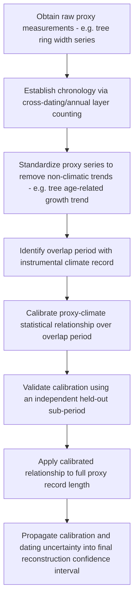

## Paleoclimatology and Climate Proxies

### Definition and Conceptual Framework

**Paleoclimatology** is the study of past climate states and variability extending beyond the instrumental observational record (which spans roughly the last 150–170 years at best, and far less in most regions), using indirect physical, chemical, or biological evidence preserved in natural archives. Because direct measurement is impossible for pre-instrumental periods, paleoclimatology relies on **climate proxies** — measurable physical or biological quantities that respond systematically to climate variables (temperature, precipitation, atmospheric composition) in a way that can be statistically or physically calibrated to reconstruct past conditions.

The fundamental logical structure of proxy-based reconstruction:

$$\text{Proxy signal} = f(\text{climate variable}) + \text{non-climatic noise} + \text{measurement uncertainty}$$

Reconstructing past climate requires (1) understanding and validating the physical/biological mechanism linking the proxy to the climate variable of interest, (2) establishing a reliable chronology (dating the proxy record), and (3) statistically calibrating the proxy-climate relationship, typically against the shorter overlapping instrumental period, then applying that calibration to the proxy's full time range.

### Major Proxy Archive Types

**Ice cores**: Extracted from polar ice sheets (Antarctica, Greenland) and high-altitude glaciers, providing among the highest-resolution and longest (up to ~800,000 years, Antarctic EPICA Dome C core) continuous paleoclimate records available.

- **Stable isotope ratios** ($\delta^{18}O$, $\delta D$) in the ice itself serve as a temperature proxy, since the fractionation of heavier vs. lighter water isotopes during evaporation/condensation is temperature-dependent (isotopically lighter water preferentially evaporates and precipitates out first as air masses cool and travel poleward, progressively depleting the remaining vapor in heavier isotopes — a relationship calibrated against modern spatial isotope-temperature gradients)
- **Trapped air bubbles** provide direct physical samples of ancient atmospheric composition (CO2, CH4, N2O concentrations), the only paleoclimate proxy offering a direct rather than inferred measurement of a climate-relevant atmospheric constituent
- **Dust and volcanic ash (tephra) layers** record atmospheric circulation intensity and volcanic eruption chronology, the latter useful for cross-dating between ice cores from different locations

**Tree rings (dendroclimatology)**: Annual growth rings vary in width and wood density in response to the locally limiting climate factor (temperature, moisture, or both, depending on species and site), providing exactly-dated (via cross-dating of ring-width patterns between overlapping living and dead specimens) annual-resolution records typically extending several centuries to a few millennia, with some long chronologies (e.g., bristlecone pine) extending beyond 8,000 years using overlapping dead wood.

**Corals**: Annual growth bands (analogous to tree rings) combined with geochemical proxies (e.g., Sr/Ca ratio as a sea surface temperature proxy, $\delta^{18}O$ as a combined temperature/salinity proxy) provide tropical/subtropical sea surface temperature and hydrological records, typically extending centuries.

**Speleothems (cave formations — stalagmites/stalactites)**: $\delta^{18}O$ and trace element ratios record regional precipitation amount/source and temperature; can be precisely dated using uranium-thorium radiometric dating, providing well-constrained chronologies extending tens of thousands to hundreds of thousands of years in some records.

**Marine and lake sediment cores**: Accumulate continuously over long timescales (millions of years for some deep marine sequences), containing:

- **Foraminifera shell chemistry** ($\delta^{18}O$, Mg/Ca ratios): The $\delta^{18}O$ signal in marine sediment cores reflects a combination of ocean temperature and global ice volume (since ice sheets preferentially lock up isotopically light water, enriching the ocean in heavy isotopes during glacial periods) — Mg/Ca ratios provide an independent temperature proxy that, combined with $\delta^{18}O$, allows the temperature and ice-volume components to be statistically disentangled
- **Pollen assemblages**: Reflect past vegetation composition, which can be related to past temperature/precipitation regimes via modern pollen-vegetation-climate calibration relationships
- **Sediment grain size and composition**: Reflects past depositional energy/wind strength and provenance

**Boreholes**: Subsurface temperature-depth profiles retain a damped, smoothed signature of past surface temperature changes propagating downward via thermal diffusion, usable to reconstruct centennial-scale temperature trends, though with progressively reduced temporal resolution with depth/age due to diffusive smoothing.

**Historical documentary records**: Non-instrumental but directly human-recorded observations (harvest dates, phenological records, ship logs, diaries describing frost/flood/drought events) provide qualitative-to-semi-quantitative regional climate information, particularly valuable for the last several centuries in regions with long documentary traditions.

### Dating Methods

Establishing an accurate chronology is as critical to proxy reconstruction as the proxy-climate relationship itself:

- **Radiocarbon ($^{14}C$) dating**: Effective for organic material up to ~50,000 years, based on the known decay rate of radioactive carbon-14, requiring calibration against independently-dated records (e.g., tree rings, corals) to correct for past variations in atmospheric $^{14}C$ production
- **Uranium-series dating** (e.g., U-Th): Used for carbonate materials (speleothems, corals), effective from centuries to several hundred thousand years
- **Annual layer counting**: Direct counting of visually or geochemically distinguishable annual layers (ice core annual layers, varved lake sediments, tree rings, coral bands) — provides precise chronology where annual layering is preserved and identifiable, though cumulative counting errors can grow with record length and depth
- **Orbital tuning**: Aligning a sediment or ice core record's cyclical variability to the independently, astronomically-calculated Milankovitch orbital forcing cycles, used for very long marine sediment records where direct dating methods are unavailable or insufficiently precise
- **Tephrochronology**: Using geochemically fingerprinted volcanic ash layers of known age (from independently dated eruptions) as time-synchronous marker horizons across multiple proxy archives

### Proxy Calibration and Uncertainty

Every proxy record carries several categories of uncertainty that must be explicitly propagated through any resulting reconstruction:

- **Calibration uncertainty**: Uncertainty in the statistical relationship between the proxy and the target climate variable, typically estimated from the overlap period with instrumental data
- **Dating uncertainty**: Chronological error, which can translate into significant reconstructed-value uncertainty for rapidly-changing climate periods
- **Non-climatic noise**: Proxy signals can be influenced by non-climatic factors (e.g., tree growth affected by insect outbreaks, disease, or stand competition, not just climate — addressed via standardization and cross-dating procedures in dendroclimatology)
- **Multi-proxy networks and reconstruction methods**: Because any single proxy carries substantial uncertainty and often reflects a mix of climate signal and local/non-climatic noise, robust large-scale (e.g., hemispheric or global) temperature reconstructions typically combine many proxy records via statistical methods (e.g., composite-plus-scale, regularized regression, or more sophisticated data-assimilation-like approaches) that exploit the fact that genuine large-scale climate signal should be coherent across many independent proxies, while non-climatic noise should be less spatially coherent

**[Inference]** Multi-proxy hemispheric/global temperature reconstructions (in the tradition of, though methodologically evolved substantially since, the original "hockey stick" studies of the late 1990s) have been subject to considerable methodological scrutiny and refinement regarding statistical methods, proxy selection, and uncertainty quantification; current-generation reconstructions incorporating expanded proxy networks and improved statistical methods should be consulted over older studies for the most robust available estimates, and uncertainty ranges (rather than a single central estimate) are the scientifically appropriate way to report and interpret these reconstructions.

### Key Paleoclimate Findings and Applications

- **Pleistocene glacial-interglacial cycles**: Ice core and marine sediment $\delta^{18}O$ records document approximately 100,000-year paced glacial cycles over roughly the past 800,000 years, paced by (though not fully explained by the direct forcing magnitude of) Milankovitch orbital variations, with atmospheric CO2 and CH4 (from ice core trapped air) co-varying with the temperature signal — a key line of evidence for greenhouse gas-temperature feedback linkage
- **Holocene climate variability**: The present interglacial period (~11,700 years to present) exhibits documented multi-centennial variability (e.g., the Medieval Climate Anomaly/Medieval Warm Period, the Little Ice Age), understood as regionally variable and not necessarily globally synchronous or of uniform magnitude across all proxy records — a point of ongoing paleoclimate research regarding the spatial coherence of these historical episodes
- **Paleoclimate constraints on climate sensitivity**: Past climate states with independently reconstructed forcing (e.g., the Last Glacial Maximum, or the Pliocene warm period with elevated CO2) provide an empirical constraint on equilibrium climate sensitivity, complementing (and providing an independent check on) estimates derived from instrumental-era observations and climate model physics
- **Abrupt climate change events**: Paleoclimate records document past abrupt transitions (e.g., the Younger Dryas cold reversal, Dansgaard-Oeschger and Heinrich events during the last glacial period), generally attributed to threshold-crossing changes in ocean circulation (e.g., Atlantic Meridional Overturning Circulation disruption from glacial meltwater input) — informing present-day concern about potential abrupt transitions/tipping points under continued anthropogenic forcing

### Geospatial and Data Methods

- **Proxy database compilation and synthesis**: Databases such as the NOAA World Data Service for Paleoclimatology and the PAGES (Past Global Changes) network's multi-proxy compilations (e.g., PAGES 2k) aggregate and standardize proxy records globally, supporting large-scale multi-proxy reconstruction efforts
- **Spatial interpolation/reconstruction fields**: Techniques such as regularized expectation-maximization (RegEM) or analog methods are used to produce spatially-resolved (rather than single time-series) paleoclimate reconstruction fields from irregularly-distributed proxy networks
- **Age-depth modeling software** (e.g., Bacon, OxCal): Statistical software packages used to construct probabilistic age-depth models from radiometric dates within a sediment/ice core, propagating dating uncertainty through the derived chronology
- **Proxy System Models (PSMs)**: Forward models that simulate the proxy response given a hypothesized climate history and known proxy-formation physics/biology, used to test proxy interpretation and facilitate more rigorous statistical comparison between climate model simulations and proxy observations (as opposed to inverting the proxy directly to a climate estimate)

### Workflow: Building a Calibrated Temperature Reconstruction from a Single Proxy Record

### Practical Example: Calibrating a Tree-Ring Temperature Reconstruction

1. Obtain a standardized tree-ring width chronology (ring-width index, already de-trended to remove age-related biological growth trends via standard dendrochronological procedures) for a temperature-sensitive site (e.g., a high-elevation or high-latitude treeline location where temperature, not moisture, is the primary growth-limiting factor)
2. Obtain an instrumental temperature record for the same region, overlapping with the most recent portion of the tree-ring record
3. Split the overlap period into a calibration sub-period and an independent verification sub-period
4. Fit a linear (or otherwise justified) regression model relating ring-width index to instrumental temperature using the calibration sub-period only
5. Apply the fitted model to the verification sub-period's ring-width data and compare predicted vs. observed instrumental temperature to assess out-of-sample skill (e.g., using a reduction of error or coefficient of efficiency statistic, standard verification metrics in dendroclimatology)
6. If verification skill is adequate, apply the calibrated regression to the full pre-instrumental portion of the tree-ring record to produce the reconstructed temperature series, with confidence intervals derived from the calibration regression's residual uncertainty
7. **[Inference]** A single-site reconstruction of this type reflects local/regional climate conditions and carries the specific non-climatic noise sources and sensitivity limitations of that one proxy and location; robust larger-scale (e.g., hemispheric) temperature reconstructions require combining many independent, geographically distributed proxy records rather than relying on any single site's calibrated series.

### Common Pitfalls

- Extrapolating a proxy-climate calibration relationship (fitted over the modern instrumental overlap period) into past conditions substantially outside the range of variability observed during that calibration period, without acknowledging the added uncertainty of such extrapolation
- Treating a single proxy record as globally representative rather than recognizing its inherently local-to-regional climate signal
- Ignoring or inadequately propagating dating uncertainty when interpreting the timing (not just the magnitude) of past climate transitions
- Conflating $\delta^{18}O$ signals in marine sediments (which reflect a mix of temperature and global ice volume) with a pure local temperature signal, without independent information (e.g., paired Mg/Ca data) to separate these components
- Treating older, methodologically superseded multi-proxy reconstructions as equally authoritative as more recent studies incorporating expanded proxy networks and refined statistical methods

### Related Topics

- Milankovitch orbital forcing and glacial-interglacial cycle pacing
- Isotope geochemistry and fractionation processes ($\delta^{18}O$, $\delta D$, Mg/Ca)
- Dendrochronology methods and cross-dating procedures
- Abrupt climate change and Atlantic Meridional Overturning Circulation (AMOC) dynamics
- Multi-proxy reconstruction statistical methods (RegEM, composite-plus-scale)
- Radiometric dating techniques (radiocarbon, U-Th series)
- Equilibrium climate sensitivity constraints from paleoclimate data
- PAGES 2k and global paleoclimate proxy database initiatives
- Holocene climate variability and the Medieval Climate Anomaly/Little Ice Age debate
- Proxy System Models and forward-modeling approaches to proxy interpretation