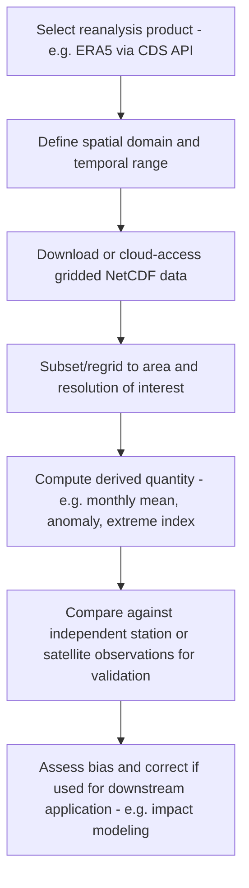

## Climate Data and Reanalysis Products

### Definition and Conceptual Framework

Climate data and reanalysis products constitute the observational and model-based datasets underpinning climate research, monitoring, and application development. **Observational climate data** consists of direct or remotely-sensed measurements from ground stations, ships, buoys, radiosondes, and satellites. **Reanalysis** is a specific data product type generated by using a fixed (frozen) numerical weather prediction model and data assimilation system to reprocess the entire historical observational record consistently, producing spatially and temporally complete, physically-consistent gridded fields of atmospheric (and often oceanic/land) state variables across the full analysis period.

### Why Reanalysis Exists: The Sparse-Observation Problem

Direct observations of the atmosphere are spatially and temporally sparse and heterogeneous — station density varies enormously by region, satellite coverage and instrument types have changed dramatically over the observational era, and many variables (e.g., 3D wind fields at all pressure levels globally) are never directly and completely observed anywhere. Reanalysis addresses this by using **data assimilation** (see the Remote Sensing of Atmospheric Variables entry for the underlying mathematical framework) to optimally blend available observations with a physically-consistent numerical model forecast, filling observational gaps in a manner constrained by the full three-dimensional dynamical and physical equations governing atmospheric behavior — producing a complete gridded field even where no observation directly exists at a given point.

$$x_a = x_b + K(y - H(x_b))$$

As in the general data assimilation framework, the reanalysis at each time step optimally combines the short-range model forecast ($x_b$) with all available contemporaneous observations ($y$), weighted by their respective error characteristics.

### Key Distinction: Reanalysis vs. Operational Forecast vs. Climate Model Projection

- **Operational NWP**: Uses the current, continuously-updated model and assimilation system to produce forecasts from the present state forward in time; the model version changes over the operational record, making long-term historical operational archives internally inhomogeneous and unsuitable for climate trend analysis
- **Reanalysis**: Uses a single, fixed model and assimilation system version applied consistently across the entire historical period, explicitly designed to minimize (though not eliminate) artificial discontinuities from model/assimilation changes, making it far more suitable than raw operational archives for climate variability and trend analysis
- **Climate model projection (e.g., CMIP6 GCM runs)**: Free-running simulations not constrained by observations at all (beyond initial/boundary conditions and specified forcing scenarios) — used to project future climate under specified emission scenarios, fundamentally distinct in purpose and methodology from reanalysis, which reconstructs the observed historical state

### Major Reanalysis Products

**ERA5** (ECMWF Reanalysis v5): The current-generation global atmospheric reanalysis produced by the European Centre for Medium-Range Weather Forecasts, providing hourly data at approximately 31 km horizontal resolution and 137 vertical levels, spanning from 1940 to near-real-time. ERA5 is widely regarded as the highest spatial/temporal resolution global reanalysis currently available for general research and application use, and includes an ensemble component (ERA5 ensemble of data assimilations, EDA) providing an estimate of analysis uncertainty.

**MERRA-2** (Modern-Era Retrospective analysis for Research and Applications, Version 2): Produced by NASA's Global Modeling and Assimilation Office (GMAO), notable for explicitly assimilating aerosol observations alongside meteorological data, making it a commonly-used dataset for aerosol/air quality-related atmospheric research in addition to general meteorological analysis.

**NCEP/NCAR Reanalysis** (and successor NCEP-DOE Reanalysis 2, and CFSR/CFSv2): Among the earliest (initial version dating to the 1990s) and longest-running reanalysis efforts; coarser spatial resolution than current-generation products like ERA5, but historically significant and still used for very long-term (multi-decadal) comparative studies given its extended record length in some configurations.

**JRA-55/JRA-3Q**: Produced by the Japan Meteorological Agency, providing an independent reanalysis lineage useful for inter-reanalysis comparison and uncertainty assessment.

**Regional reanalyses**: Higher-resolution reanalyses covering specific regions (e.g., NARR for North America, various European regional reanalyses), offering finer spatial detail than global products at the cost of geographic coverage, often valuable for local-scale impact studies where global reanalysis resolution is insufficient.

**[Inference]** Different reanalysis products can show meaningfully different results for certain variables and regions (especially precipitation, which reanalysis represents less reliably than temperature or pressure since precipitation is more strongly model-parameterization-dependent and less directly/densely observed than temperature); comparing results across multiple reanalysis products, rather than relying on a single product, is generally advisable when a study's conclusions are sensitive to the specific dataset used.

### Reanalysis Limitations and Known Issues

- **Non-stationarity from observing system changes**: Even with a fixed model, changes in the volume, type, and quality of assimilated observations over time (e.g., the onset of the satellite era in the late 1970s, changes in satellite instrument types) can introduce artificial variability or trend artifacts in reanalysis output — a well-recognized limitation particularly relevant to any study using reanalysis for long-term trend detection, especially for variables in poorly-observed regions (e.g., the pre-satellite-era Southern Hemisphere and polar regions)
- **Model-dependent (parameterized) variables**: Variables directly constrained by frequent, dense, accurate observations (e.g., temperature and geopotential height, well-observed by radiosondes and satellite sounders) are generally reproduced with high reanalysis fidelity; variables that are sparsely observed and/or strongly dependent on model physics parameterization (e.g., precipitation, surface fluxes, boundary-layer processes) carry substantially greater uncertainty and are less directly "observationally constrained" than commonly assumed by non-specialist users
- **Reanalysis is not a substitute for direct observation where high accuracy is essential**: For applications requiring the highest possible accuracy at a specific point (e.g., detailed local climate trend attribution), a well-maintained, homogenized local station record is generally preferable to reanalysis grid-point extraction, since reanalysis represents a grid-cell-average, model-mediated estimate rather than the point observation itself

### Station-Based and Gridded Observational Datasets (Non-Reanalysis)

- **GHCN (Global Historical Climatology Network)**: A widely-used compilation of quality-controlled and homogenized long-term station temperature and precipitation records, foundational to many global temperature record compilations
- **Berkeley Earth**: An independent global temperature reconstruction using a distinct statistical methodology (kriging-based spatial interpolation) from a very large station network, developed partly as an independent cross-check on other global temperature compilations
- **HadCRUT (Met Office Hadley Centre/CRU)**: A widely-cited global mean surface temperature dataset combining land station data (CRUTEM) and sea surface temperature data (HadSST)
- **CRU TS (Climatic Research Unit Time-Series)**: A gridded (interpolated from station data) global land climate dataset, providing monthly temperature, precipitation, and other variables at relatively coarse (0.5°) resolution
- **Gridded satellite-based precipitation products** (e.g., CHIRPS, TRMM/GPM-derived products, PERSIANN): Combine satellite estimates (often calibrated/bias-corrected against available rain gauge data) to provide spatially complete precipitation estimates particularly valuable in regions with sparse rain gauge networks

**Bioclimatic/interpolated surface products** (WorldClim, CHELSA): Distinct from reanalysis, these products spatially interpolate station climatological normals (WorldClim) or apply a reanalysis-informed downscaling/bias-correction methodology (CHELSA) to produce high-resolution (down to ~1 km or finer) gridded climatological (multi-year average) surfaces, rather than time-varying analysis fields — suited to applications needing fine spatial detail in the long-term average climate rather than a temporally-resolved historical record.

### Geospatial Access and Processing Workflows

- **Data access**: ERA5 is distributed via the Copernicus Climate Data Store (CDS) API; MERRA-2 via NASA's GES DISC; most major reanalysis and gridded observational products are also accessible via cloud-based analysis-ready formats (e.g., Google Earth Engine, AWS/Microsoft Planetary Computer public datasets), reducing the need for local download and storage of very large gridded archives
- **Common file formats**: NetCDF (Network Common Data Form) is the standard format for gridded climate/reanalysis data, with the CF (Climate and Forecast) metadata conventions specifying standardized variable naming, units, and coordinate system metadata to support interoperable analysis tooling
- **Standard analysis libraries**: Python's `xarray` (built on NetCDF/CF conventions) combined with `dask` (for out-of-core/parallel processing of large gridded datasets) is a widely-used modern workflow for reanalysis data manipulation; `cdo` (Climate Data Operators) and `NCO` (NetCDF Operators) provide command-line tools for common gridded climate data operations (regridding, temporal aggregation, unit conversion)
- **Regridding/interpolation**: Comparing datasets on different native grids (e.g., a regional model output grid vs. ERA5's grid) requires regridding, commonly performed via bilinear, conservative, or nearest-neighbor interpolation methods depending on the variable type (e.g., conservative regridding is generally preferred for flux-like or precipitation variables to preserve area-integrated totals)

### Workflow: Extracting and Validating a Regional Climate Variable from Reanalysis

### Practical Example: Validating ERA5 Precipitation Against Station Data

1. Select a study region and time period, and extract ERA5 total precipitation for the corresponding grid cells covering that region
2. Obtain independent, quality-controlled station precipitation records for gauges located within or near the study region for the same period
3. Aggregate both datasets to a common temporal resolution (e.g., monthly totals) to reduce noise from sub-daily/daily representativeness mismatches between a point gauge and a grid-cell average
4. Compute standard validation statistics: bias (mean reanalysis − mean station), correlation coefficient, and root-mean-square error, ideally computed separately by season given that reanalysis precipitation skill often varies seasonally (e.g., typically better representing large-scale stratiform winter precipitation than localized convective summer precipitation)
5. Assess results in the context of known reanalysis precipitation limitations — a systematic wet or dry bias, if identified, may need to be corrected (e.g., via a quantile-mapping bias-correction method) before using the reanalysis product as an input to downstream applications such as hydrological modeling
6. **[Inference]** Reanalysis precipitation validation results are generally region- and reanalysis-product-specific; performance in one climate regime (e.g., mid-latitude stratiform-dominated precipitation) does not necessarily generalize to another (e.g., tropical convective or orographically-complex terrain), so validation should ideally be performed for the specific region and application of interest rather than assumed from studies conducted elsewhere.

### Common Pitfalls

- Using raw operational NWP archives (rather than a proper reanalysis product) for climate trend analysis, introducing spurious discontinuities from historical model version changes
- Treating all reanalysis variables as equally reliable, without distinguishing well-observed/directly-constrained variables (temperature, pressure) from poorly-observed/heavily-parameterized variables (precipitation, surface fluxes)
- Extracting a single reanalysis grid-cell value and treating it as equivalent to a point station observation, without accounting for the grid-cell spatial averaging effect, particularly significant in areas of high topographic or land-cover heterogeneity
- Comparing pre- and post-satellite-era reanalysis periods for a long-term trend without acknowledging the well-documented risk of observing-system-change artifacts around that transition
- Confusing reanalysis (an observationally-constrained historical reconstruction) with a climate model projection (a free-running future scenario simulation) — the two serve fundamentally different purposes and cannot be used interchangeably

### Related Topics

- Data assimilation methods (variational, ensemble Kalman filter) underlying reanalysis production
- NetCDF/CF conventions and Python xarray-based climate data workflows
- Satellite-based precipitation estimation and bias correction (CHIRPS, GPM/TRMM)
- Homogenization of long-term station climate records (GHCN, Berkeley Earth methodology)
- Regridding and interpolation methods for gridded climate data
- CMIP6 climate model projections and their distinction from reanalysis
- Cloud-based geospatial data platforms (Google Earth Engine, Planetary Computer) for climate data access
- Bias correction and downscaling methods for climate impact modeling
- Reanalysis uncertainty and inter-product comparison studies
- Extreme value/index computation from gridded reanalysis data (e.g., ETCCDI climate indices)