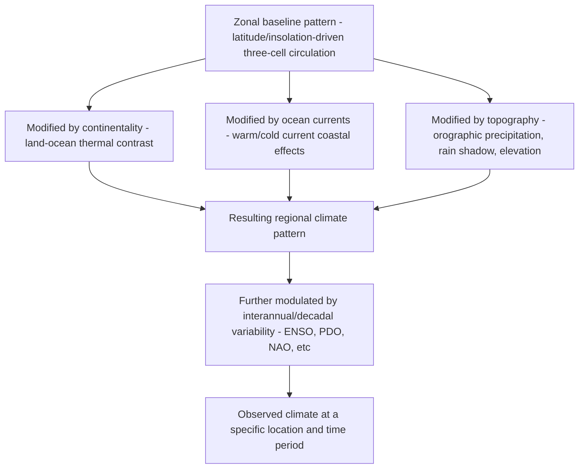
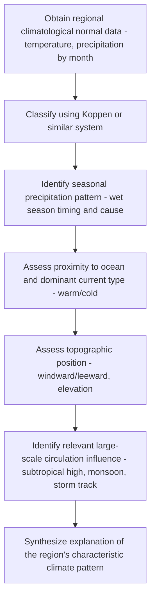

## Regional and Global Climate Patterns

### Definition and Conceptual Framework

Regional and global climate patterns describe the characteristic, recurring spatial organization of climate variables (temperature, precipitation, pressure, wind) across Earth's surface, arising from the interaction of the general circulation (see the Atmospheric Circulation Patterns entry), ocean-atmosphere coupling, land-sea distribution, topography, and land surface properties. This entry synthesizes how the underlying circulation and thermodynamic mechanisms already covered (Hadley/Ferrel/Polar cells, monsoons, ENSO) combine and interact with regional geographic factors to produce the observed mosaic of Earth's climate patterns, and how these patterns are characterized, monitored, and analyzed at regional-to-global scale.

### Zonal (Latitudinal) Pattern Organization

At the broadest scale, climate is organized zonally (by latitude) due to the primary control of solar insolation and the associated three-cell circulation structure:

- **Equatorial belt** (~0–10°): Persistently high temperature and, where the ITCZ resides, high precipitation, producing the tropical rainforest climate zone
- **Subtropical belt** (~15–30°): Dominated by subsiding, stable air beneath the subtropical high-pressure belt, producing the world's major desert zones on the western sides of continents in particular (reinforced by cool, upwelling-influenced ocean currents, see below)
- **Mid-latitude belt** (~30–60°): Dominated by the transient, baroclinically-driven weather systems of the Ferrel cell/polar front region, producing variable, often precipitation-abundant climates with strong seasonal contrast in continental interiors
- **Polar belt** (~60–90°): Persistently low insolation and temperature, producing tundra and ice-cap climates

This zonal pattern is substantially modified by the following factors, producing the actual observed (non-purely-zonal) global climate map.

### Continentality and the Land-Ocean Thermal Contrast

Water has a much higher heat capacity than land, causing oceans to warm and cool more slowly than adjacent land masses. This produces **continentality** effects:

- **Maritime climates**: Coastal/oceanic locations experience moderated seasonal temperature range (smaller difference between summer and winter means) due to the ocean's thermal buffering influence, along with generally higher humidity and cloud cover
- **Continental climates**: Interior landmass locations, particularly at mid-to-high latitudes far from oceanic moderation, experience much larger annual temperature ranges (hot summers, cold winters) — the classic humid continental (Köppen D-type) climate pattern of interior North America and Eurasia
- This land-ocean thermal contrast is also the fundamental driver of monsoon circulation (see the Atmospheric Circulation Patterns entry)

### Ocean Currents and Climate Modification

Ocean surface currents redistribute heat meridionally and substantially modify coastal climate patterns beyond what latitude/insolation alone would predict:

- **Warm currents** (e.g., the Gulf Stream/North Atlantic Drift, the Kuroshio Current): Transport warm tropical/subtropical water poleward along the western boundaries of ocean basins and then across to the eastern boundaries at higher latitudes, substantially warming adjacent coastal climates (e.g., Western Europe's markedly milder winter climate relative to other regions at similar latitude, commonly and largely attributed to North Atlantic Drift influence combined with prevailing westerly wind transport of this oceanic heat onshore)
- **Cold currents and coastal upwelling** (e.g., the California, Humboldt/Peru, Canary, and Benguela currents): Cool, nutrient-rich upwelled water along eastern ocean boundaries suppresses local evaporation and atmospheric convection, reinforcing the aridity of adjacent subtropical coastal deserts (e.g., the Atacama and Namib deserts, among the driest places on Earth, situated along cold-current coastlines) and often producing characteristic coastal fog rather than rainfall
- **Thermohaline circulation / Atlantic Meridional Overturning Circulation (AMOC)**: The global-scale, density-driven (temperature and salinity) deep ocean circulation that transports heat between ocean basins on multi-decadal to millennial timescales; AMOC weakening or disruption is a documented mechanism behind past abrupt climate change events (see the Paleoclimatology entry) and is an area of ongoing research regarding potential future change under continued warming

### Topographic and Orographic Effects

- **Orographic precipitation and rain shadow**: Mountain ranges force air to rise on the windward side (adiabatic cooling, cloud formation, precipitation) and descend on the leeward side (adiabatic warming, drying), producing sharp precipitation gradients over short horizontal distances (e.g., the Pacific Northwest's wet windward vs. dry leeward/rain-shadow regions, or the Himalayas' role in enabling both the intense monsoon rainfall on the southern flank and the arid Tibetan Plateau/Central Asian interior)
- **Elevation-driven temperature zonation**: As discussed in the Biomes entry, altitude produces a temperature decline analogous to the latitudinal gradient (via the adiabatic lapse rate), such that high-elevation tropical locations can host climates resembling much higher-latitude conditions at low elevation
- **Katabatic and valley/mountain breeze circulations**: Local-to-regional topographically-forced wind patterns that modify near-surface climate at finer spatial scales than the synoptic/planetary patterns discussed above

### Named Regional Climate Pattern Archetypes

- **Mediterranean climate** (Köppen Csa/Csb): Winter-wet, summer-dry pattern arising from the seasonal migration of the subtropical high (dominant, suppressing precipitation, in summer) and the polar front/mid-latitude storm track (shifting equatorward and bringing precipitation in winter) — occurs in five geographically separated regions (Mediterranean Basin, California, central Chile, South African Cape, southwestern Australia) as a function of their shared position on the western side of continents at similar subtropical-to-mid-latitude transition zones
- **Humid subtropical climate** (Köppen Cfa): Found on the eastern sides of continents at similar latitude to Mediterranean climates, but without the pronounced summer dry season, since eastern continental margins at this latitude are typically influenced by onshore flow around the western flank of the subtropical high (bringing moisture) rather than the offshore/subsiding flow experienced on western margins
- **Monsoon climates**: Seasonal precipitation reversal driven by land-sea thermal contrast (detailed in the Atmospheric Circulation Patterns entry)
- **Steppe/semi-arid climates**: Transitional zones between full desert and more humid climate types, often located in continental interiors far from moisture sources or in the transitional latitude/circulation zones between the subtropical high and mid-latitude storm track influence

### Global Climate Pattern Visualization: The Zonal-to-Regional Modification Framework

### Global Climate Pattern Datasets and Metrics

- **Köppen-Geiger classified global maps**: The standard categorical representation of global climate pattern distribution (see the Climate Classification Systems entry), commonly derived from gridded climatological normal datasets such as WorldClim or CRU TS
- **Climatological normal maps**: Direct gridded representations of long-term mean temperature, precipitation, and derived variables (growing season length, aridity index, heating/cooling degree days) by month or season, typically derived from station interpolation (CRU TS, WorldClim) or reanalysis climatology (ERA5 climate normals)
- **Global Precipitation Climatology Project (GPCP) and similar merged products**: Combine satellite and gauge data to produce a long-term, spatially complete global precipitation climatology, useful for characterizing the global distribution of the ITCZ, monsoon regions, and subtropical dry zones
- **Climate pattern indices for regional characterization**: Beyond the teleconnection indices already discussed (ENSO, NAO, PDO), region-specific climate pattern metrics (e.g., monsoon onset/withdrawal date indices, aridity indices, growing degree days) are used to characterize and monitor regional climate pattern behavior in an application-relevant way

### Workflow: Characterizing a Region's Climate Pattern Drivers

### Practical Example: Explaining a Regional Precipitation Seasonality Pattern

1. Obtain monthly climatological precipitation and temperature normals for the region of interest (e.g., from WorldClim or a national meteorological service climate normal dataset)
2. Plot the monthly precipitation and temperature climatology (a "climograph") to visually identify the seasonal pattern — e.g., a pronounced summer precipitation maximum, a pronounced summer precipitation minimum, or a relatively uniform distribution across the year
3. Determine the region's latitude and continental position (western vs. eastern continental margin, interior vs. coastal)
4. Cross-reference the region's position relative to the seasonal migration of the ITCZ, the subtropical high-pressure belt, and the mid-latitude storm track to identify the primary circulation feature responsible for the observed wet/dry season timing
5. If coastal, identify the adjacent ocean current type (warm or cold) and assess its likely contribution to temperature moderation or precipitation suppression/enhancement
6. If near significant topography, assess windward/leeward position relative to prevailing wind direction for potential orographic precipitation or rain-shadow influence
7. Synthesize these factors into an integrated explanation of the observed climate pattern, and **[Inference]** note that most real-world regional climates reflect the superposition of multiple contributing mechanisms (e.g., both continentality and storm-track position) rather than a single dominant cause, so attributing an observed pattern to just one mechanism in isolation is often an oversimplification unless supported by more detailed circulation/moisture-source analysis (e.g., back-trajectory or moisture-tracking studies).

### Common Pitfalls

- Attributing a regional climate pattern purely to latitude while ignoring substantial continentality, ocean current, or topographic modification effects
- Assuming Mediterranean-type climates only occur in the Mediterranean Basin itself, overlooking the mechanistically analogous occurrences on other continents' west coasts at similar latitude
- Confusing a warm ocean current's climate-moderating influence with a claim that ocean currents are the sole or primary determinant of a region's climate, when circulation pattern position (e.g., storm track, subtropical high) is typically at least as important
- Treating a single climatological normal map as representative of year-to-year conditions, without acknowledging the substantial interannual variability (e.g., from ENSO or other modes) superimposed on the long-term mean pattern
- Overlooking the western vs. eastern continental margin asymmetry (dry-summer Mediterranean-type west coasts vs. wet-summer humid subtropical east coasts at comparable subtropical latitude) as a predictable consequence of the subtropical high's asymmetric flow pattern

### Related Topics

- Atmospheric circulation patterns (Hadley/Ferrel/Polar cells, jet streams, monsoons)
- Ocean current systems and thermohaline circulation (AMOC)
- Orographic precipitation and rain shadow effects
- Köppen-Geiger and other climate classification systems
- ENSO and other teleconnection modes affecting regional pattern variability
- Coastal upwelling and eastern boundary current ecosystems
- Climatological normal datasets and their construction (WorldClim, CRU TS)
- Continentality indices and land-ocean thermal contrast quantification
- Regional climate modeling and dynamical downscaling
- Moisture tracking and atmospheric river research