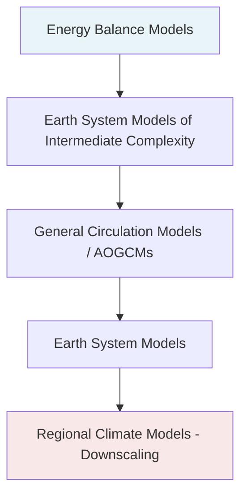
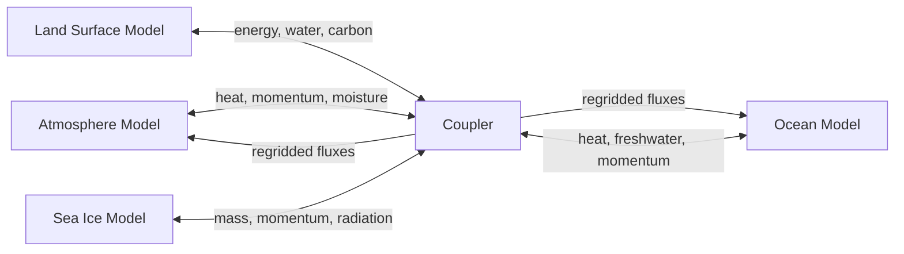
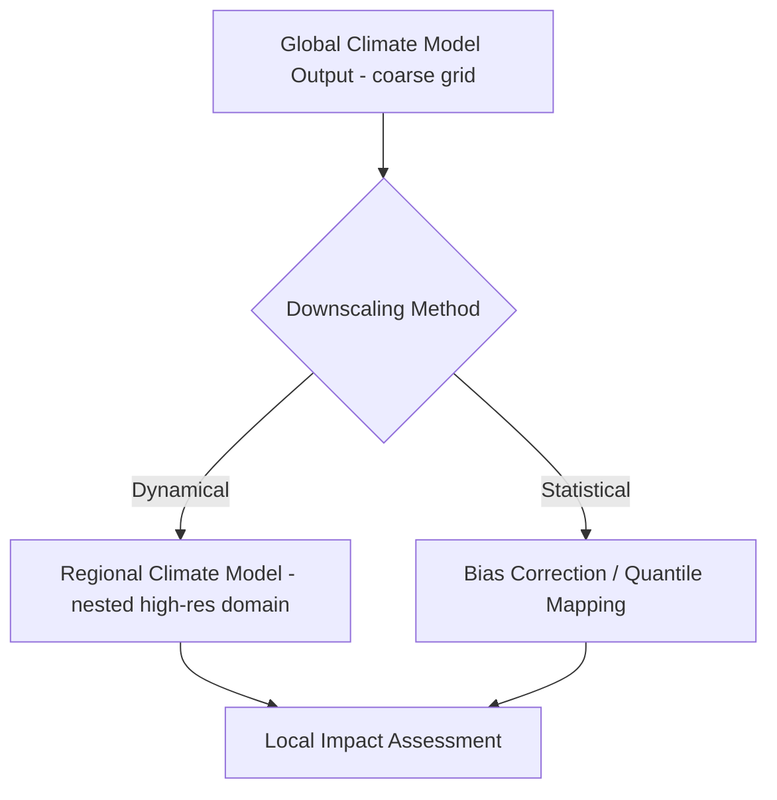

## Climate Modeling Fundamentals


### Overview

Climate modeling is the practice of representing the Earth's climate system—atmosphere, ocean, land surface, cryosphere, and biosphere—as a set of mathematical equations solved numerically to simulate past, present, and future climate states. Climate models translate physical laws (conservation of momentum, energy, and mass) into discretized computational forms that can be executed on high-performance computing systems, producing projections of temperature, precipitation, circulation patterns, and other climate variables across timescales ranging from seasons to centuries.

### Core Physical Foundations

**Governing Equations**

Climate models are built on the primitive equations, a simplified form of the Navier-Stokes equations adapted for a rotating, stratified fluid on a sphere. These include:

- Conservation of momentum (accounting for Coriolis force, pressure gradient force, and friction)
- Conservation of mass (continuity equation)
- Conservation of energy (thermodynamic equation, including radiative and latent heat terms)
- Conservation of water substance (moisture budget, phase changes)
- Equation of state (relating pressure, density, and temperature)

The momentum equation in the horizontal, for example, is commonly expressed as:

$$\frac{D\vec{v}}{Dt} = -\frac{1}{\rho}\nabla p - f\hat{k}\times\vec{v} + \vec{F}$$

where $\vec{v}$ is horizontal velocity, $\rho$ is air density, $p$ is pressure, $f$ is the Coriolis parameter, and $\vec{F}$ represents frictional/turbulent forcing.

**Radiative Transfer**

Climate models must solve for the balance of incoming shortwave (solar) radiation and outgoing longwave (terrestrial) radiation. The global energy balance at the top of the atmosphere is approximated by:

$$(1-\alpha)\frac{S_0}{4} = \sigma T_e^4$$

where $\alpha$ is planetary albedo, $S_0$ is the solar constant, $\sigma$ is the Stefan-Boltzmann constant, and $T_e$ is the effective emission temperature. Radiative transfer schemes solve this balance layer-by-layer through the atmosphere, accounting for absorption, emission, and scattering by gases, aerosols, and clouds.

### Model Hierarchy

Climate models exist along a spectrum of complexity, each suited to different scientific questions:

**Energy Balance Models (EBMs)**

The simplest class, representing Earth's climate as zero-dimensional (global average) or one-dimensional (latitudinal) energy budgets. Useful for conceptual understanding and rapid sensitivity experiments.

**Earth System Models of Intermediate Complexity (EMICs)**

Reduced-resolution or simplified-physics models (e.g., coarse-grid ocean-atmosphere models) that allow long integrations (millennia) for paleoclimate studies or large ensemble experiments.

**General Circulation Models (GCMs) / Atmosphere-Ocean GCMs (AOGCMs)**

Three-dimensional models that resolve fluid dynamics on a global grid, coupling atmosphere and ocean components. These form the backbone of modern climate projection (e.g., CMIP-class models).

**Earth System Models (ESMs)**

AOGCMs extended with biogeochemical cycles—carbon cycle, dynamic vegetation, atmospheric chemistry, ice sheets—enabling simulation of feedbacks between physical climate and biosphere/chemistry.

**Regional Climate Models (RCMs)**

High-resolution, limited-domain models nested within GCM output (dynamical downscaling) to resolve local terrain, coastlines, and mesoscale processes.



### Model Components and Coupling

**Atmospheric Component**

Solves the primitive equations on either a latitude-longitude grid, a reduced Gaussian grid, or a spectral representation (spherical harmonics). Handles dynamics (advection, waves), radiation, convection, and cloud microphysics.

**Ocean Component**

Solves analogous primitive equations for ocean circulation, typically using depth or density (isopycnal) as the vertical coordinate. Governs heat and freshwater transport, thermohaline circulation, and sea surface temperature evolution.

**Land Surface Component**

Represents soil moisture, vegetation, snow cover, and surface energy/water fluxes. Modern land models (e.g., CLM, JULES) include dynamic vegetation and carbon allocation schemes.

**Sea Ice Component**

Simulates ice formation, melt, thickness distribution, and dynamics (drift under wind/ocean stress), critical for polar amplification feedbacks.

**Coupler**

A software layer that regrids and exchanges fluxes (heat, momentum, freshwater, carbon) between components at each coupling timestep, ensuring conservation across interfaces. The Community Earth System Model (CESM) coupler and OASIS are widely used examples.



### Discretization and Numerical Methods

**Spatial Discretization**

- **Grid-point methods**: Finite-difference or finite-volume schemes on a structured latitude-longitude grid; simple but suffer from the "pole problem" (grid convergence at poles requiring filtering).
- **Spectral methods**: Represent fields as sums of spherical harmonics; avoid pole singularities and offer high accuracy for smooth fields, historically dominant in GCM dynamical cores (e.g., older ECMWF IFS, NCAR CAM spectral dynamical core).
- **Finite-volume cubed-sphere / icosahedral grids**: Modern approaches (e.g., FV3 used in GFDL/NOAA models, MPAS unstructured mesh) that avoid pole issues and scale efficiently on massively parallel architectures.

**Temporal Discretization**

Time integration typically uses semi-implicit or split-explicit schemes to handle fast-moving gravity waves without requiring prohibitively small timesteps, balancing numerical stability (governed by the Courant-Friedrichs-Lewy, or CFL, condition) against computational cost.

$$C = \frac{u\Delta t}{\Delta x} \leq C_{max}$$

**Vertical Coordinates**

Common choices include pressure ($p$), sigma ($\sigma = p/p_s$), hybrid sigma-pressure, and isentropic (potential temperature) coordinates, each with tradeoffs in representing terrain-following flow versus stratospheric dynamics.

### Parameterization of Subgrid Processes

Because model grid cells (typically tens to hundreds of kilometers) cannot resolve processes occurring at smaller scales, climate models rely on parameterizations—simplified statistical or physical representations of subgrid phenomena:

- **Cumulus convection**: Schemes (e.g., Zhang-McFarlane, Tiedtke) represent the collective effect of individual thunderstorms/convective cells too small to resolve.
- **Cloud microphysics**: Governs formation, growth, and precipitation of cloud droplets and ice crystals, directly affecting radiative feedbacks.
- **Boundary layer turbulence**: Represents vertical mixing of heat, moisture, and momentum near the surface (e.g., K-theory closures, TKE-based schemes).
- **Gravity wave drag**: Accounts for momentum deposition from unresolved orographic and non-orographic gravity waves, important for stratospheric circulation.
- **Land surface exchange**: Parameterizes evapotranspiration, surface roughness, and albedo feedbacks.

Parameterization uncertainty is widely regarded as the largest source of structural disagreement between different climate models' sensitivity estimates. [Inference] This is because, unlike resolved dynamics constrained directly by physical laws, parameterizations depend on tunable coefficients calibrated against limited observational or high-resolution simulation data.

### Climate Sensitivity and Feedbacks

**Equilibrium Climate Sensitivity (ECS)** is defined as the equilibrium global mean surface temperature increase following a doubling of atmospheric CO₂ concentration. It is estimated via:

$$\Delta T_{eq} = \lambda \cdot \Delta F$$

where $\Delta F$ is the radiative forcing (approximately 3.7 W/m² for CO₂ doubling) and $\lambda$ is the climate feedback parameter (K per W/m²), itself the sum of individual feedback contributions:

$$\lambda^{-1} = \lambda_{Planck}^{-1} + \lambda_{WV}^{-1} + \lambda_{LR}^{-1} + \lambda_{albedo}^{-1} + \lambda_{cloud}^{-1}$$

**Key Feedbacks:**

- **Planck feedback**: The basic stabilizing response—warmer surfaces emit more longwave radiation (always negative/stabilizing).
- **Water vapor feedback**: Warmer air holds more moisture (Clausius-Clapeyron relation), amplifying warming (positive feedback).
- **Lapse rate feedback**: Changes in the vertical temperature profile alter outgoing longwave radiation.
- **Ice-albedo feedback**: Melting snow/ice reduces surface reflectivity, increasing absorbed solar radiation (positive feedback).
- **Cloud feedback**: The most uncertain component; changes in cloud height, cover, and optical properties can either amplify or dampen warming depending on cloud type and altitude.

**Transient Climate Response (TCR)** measures the temperature change at the time of CO₂ doubling under a gradual 1%/year increase scenario, typically lower than ECS because it excludes slow ocean heat uptake equilibration.

### Model Calibration, Tuning, and Validation

Climate models undergo a tuning process to ensure top-of-atmosphere energy balance and reasonable representation of the historical climatological mean state, adjusting uncertain parameters (e.g., cloud microphysics constants, convective entrainment rates) within physically plausible ranges.

**Validation approaches:**

- **Hindcasting**: Running the model over historical periods and comparing against observational records (reanalysis datasets such as ERA5, satellite observations).
- **Perfect model experiments**: Using one model's output as "truth" to test another model's or method's skill.
- **Paleoclimate benchmarking**: Testing model response against reconstructed past climates (e.g., Last Glacial Maximum, mid-Holocene) via the Paleoclimate Modelling Intercomparison Project (PMIP).
- **Out-of-sample skill scores**: Metrics such as root-mean-square error (RMSE), pattern correlation, and Taylor diagrams comparing simulated versus observed spatial fields.

### Model Intercomparison Projects (MIPs)

**CMIP (Coupled Model Intercomparison Project)** coordinates standardized experiments across dozens of international modeling centers, providing the multi-model ensembles underlying IPCC Assessment Reports. CMIP6, the most recent completed phase, introduced Shared Socioeconomic Pathways (SSPs) combined with Representative Concentration Pathways (RCPs) to define forcing scenarios (e.g., SSP2-4.5, SSP5-8.5). [Unverified] The specific scenario matrix and participating model list for a CMIP7 phase should be confirmed against current WCRP documentation, as coordination details evolve.

Multi-model ensembles are used to quantify structural uncertainty—the spread across models using different numerical methods and parameterizations—as distinct from **initial condition ensembles**, which quantify internal variability by perturbing starting conditions within a single model.

### Scenario Design and Forcing

Climate projections require prescribed or interactively simulated external forcings:

- **Greenhouse gas concentrations**: CO₂, CH₄, N₂O, halocarbons, typically prescribed from emission scenario pathways.
- **Aerosol loading**: Sulfate, black carbon, and organic aerosols affecting both direct radiative forcing and cloud microphysics (indirect effects).
- **Land use change**: Deforestation, urbanization, and agricultural expansion altering surface albedo and carbon fluxes.
- **Solar variability and volcanic forcing**: Included in historical simulations; volcanic aerosol injections cause characteristic short-term cooling pulses (e.g., post-Pinatubo 1991).

### Downscaling Techniques

Because GCM resolution (typically 50–250 km) cannot resolve local topography or fine-scale processes relevant to regional impact studies, downscaling methods bridge this gap:

**Dynamical Downscaling**: Nesting a higher-resolution RCM within GCM boundary conditions, physically resolving mesoscale processes (e.g., WRF, RegCM) but computationally expensive.

**Statistical Downscaling**: Establishing empirical relationships between large-scale GCM predictors and local-scale observed variables (e.g., quantile mapping, bias correction, analog methods), computationally cheap but assumes stationarity of statistical relationships under future climate change.



### Computational Infrastructure

Climate models are among the most computationally demanding scientific applications, typically requiring:

- **High-performance computing (HPC) clusters** with thousands of CPU cores, using domain decomposition (MPI parallelization) across the spatial grid.
- **I/O and storage systems** capable of handling petabyte-scale output, often using self-describing formats like NetCDF/HDF5 following CF (Climate and Forecast) metadata conventions.
- **Workflow and coupling frameworks** such as ESMF (Earth System Modeling Framework) to standardize component interoperability.
- Increasing exploration of **GPU acceleration** and **machine learning emulators** (e.g., neural network parameterizations, hybrid physics-ML models) to reduce computational cost, an active area of research. [Speculation] The degree to which ML-based parameterizations will replace traditional physical schemes in operational climate models over the coming decade remains an open research question, as concerns about physical consistency and extrapolation beyond training data persist.

### Example: Simplified Energy Balance Model in Python

```python
import numpy as np

# Zero-dimensional energy balance model
sigma = 5.67e-8      # Stefan-Boltzmann constant (W/m^2/K^4)
S0 = 1361            # Solar constant (W/m^2)
albedo = 0.3         # Planetary albedo

def equilibrium_temp(S0, albedo, sigma):
    """Compute effective emission temperature from energy balance."""
    return ((1 - albedo) * S0 / 4 / sigma) ** 0.25

def forced_temp_response(T0, forcing, feedback_param, dt, n_steps, heat_capacity):
    """
    Simple time-stepping EBM with radiative forcing perturbation.
    dT/dt = (forcing - feedback_param * T) / heat_capacity
    """
    T = np.zeros(n_steps)
    T[0] = T0
    for t in range(1, n_steps):
        dT = (forcing - feedback_param * T[t-1]) / heat_capacity
        T[t] = T[t-1] + dT * dt
    return T

Te = equilibrium_temp(S0, albedo, sigma)
print(f"Effective emission temperature: {Te:.2f} K")

# Simulate response to CO2 doubling forcing (~3.7 W/m^2)
forcing = 3.7
feedback_param = 1.2   # W/m^2/K, corresponds to ECS ~ 3.7/1.2 = 3.08 K
heat_capacity = 8.0     # W*yr/m^2/K, effective ocean mixed layer heat capacity
dt = 1.0
n_steps = 100

T_anomaly = forced_temp_response(0, forcing, feedback_param, dt, n_steps, heat_capacity)
print(f"Equilibrium warming after {n_steps} years: {T_anomaly[-1]:.2f} K")
```

**Output** (representative values; exact numbers depend on parameter choices):



```
Effective emission temperature: 254.84 K
Equilibrium warming after 100 years: 3.05 K
```

This toy model illustrates the core feedback concept underlying all climate models: forcing perturbs the system, and the feedback parameter (aggregating Planck, water vapor, lapse rate, albedo, and cloud feedbacks in full GCMs) determines the equilibrium response magnitude and approach timescale. Actual GCMs solve this balance implicitly through resolved three-dimensional dynamics and explicit parameterized physics rather than a single lumped parameter.

### Sources of Uncertainty

- **Scenario uncertainty**: Dependent on future emissions pathways, which are inherently a function of human socioeconomic choices, not physical law.
- **Model (structural) uncertainty**: Differences in numerical methods, resolution, and parameterization choices across modeling centers.
- **Internal variability**: Chaotic, unforced fluctuations in the climate system (e.g., ENSO, decadal ocean oscillations) that limit predictability regardless of model or scenario accuracy, especially at regional scales and short lead times.

These three sources are often decomposed formally in "uncertainty partitioning" studies (e.g., Hawkins and Sutton, 2009), which show that internal variability dominates near-term regional uncertainty while scenario uncertainty dominates long-term global uncertainty.

### Diagram: Climate Model Uncertainty Cascade (svg_diagram)

<svg xmlns="http://www.w3.org/2000/svg" viewBox="0 0 760 420">
<text x="380" y="30" font-size="18" font-weight="bold" text-anchor="middle" fill="#1a1a1a">Climate Model Uncertainty Cascade (svg_diagram)</text>
<rect x="30" y="60" width="700" height="60" rx="8" fill="#dbeafe" stroke="#1e40af" stroke-width="1.5" />
<text x="380" y="85" font-size="14" font-weight="bold" text-anchor="middle" fill="#1e3a8a">Emission Scenario Uncertainty</text>
<text x="380" y="105" font-size="12" text-anchor="middle" fill="#1e3a8a">(SSPs / socioeconomic pathways, policy choices)</text>
<line x1="380" y1="120" x2="380" y2="150" stroke="#555" stroke-width="2" marker-end="url(#arrow)" />
<rect x="30" y="150" width="700" height="60" rx="8" fill="#dcfce7" stroke="#166534" stroke-width="1.5" />
<text x="380" y="175" font-size="14" font-weight="bold" text-anchor="middle" fill="#14532d">Model Structural Uncertainty</text>
<text x="380" y="195" font-size="12" text-anchor="middle" fill="#14532d">(parameterizations, resolution, numerics across models)</text>
<line x1="380" y1="210" x2="380" y2="240" stroke="#555" stroke-width="2" marker-end="url(#arrow)" />
<rect x="30" y="240" width="700" height="60" rx="8" fill="#fef3c7" stroke="#92400e" stroke-width="1.5" />
<text x="380" y="265" font-size="14" font-weight="bold" text-anchor="middle" fill="#78350f">Internal Variability</text>
<text x="380" y="285" font-size="12" text-anchor="middle" fill="#78350f">(chaotic unforced fluctuations, e.g., ENSO, decadal modes)</text>
<line x1="380" y1="300" x2="380" y2="330" stroke="#555" stroke-width="2" marker-end="url(#arrow)" />
<rect x="30" y="330" width="700" height="60" rx="8" fill="#fee2e2" stroke="#991b1b" stroke-width="1.5" />
<text x="380" y="355" font-size="14" font-weight="bold" text-anchor="middle" fill="#7f1d1d">Total Projection Uncertainty</text>
<text x="380" y="375" font-size="12" text-anchor="middle" fill="#7f1d1d">(dominant term shifts with lead time and spatial scale)</text>
</svg>

### Common Pitfalls and Misconceptions

- **Conflating weather forecasting with climate modeling**: Weather models predict specific atmospheric states from initial conditions over days; climate models characterize statistical distributions of states over decades, largely insensitive to precise initial conditions but highly sensitive to boundary forcing.
- **Treating a single model run as definitive**: Because of internal variability, a single simulation is one realization of many possible trajectories; ensemble approaches are necessary for robust conclusions.
- **Assuming higher resolution automatically improves accuracy**: Resolution improves resolved dynamics but does not eliminate parameterization uncertainty, and finer grids can sometimes reveal new biases previously masked by smoothing.
- **Misinterpreting climate sensitivity as a fixed constant**: ECS estimates vary across models and methods (Charney sensitivity range historically cited as roughly 1.5–4.5°C, though estimates have been refined across IPCC assessment cycles). [Unverified] For the current best-estimate range and its associated confidence assessment, consult the most recent IPCC AR6 (or later) Working Group I report directly, as this figure has been revised across assessment cycles.

**Next Steps**

- Atmospheric Dynamics and Circulation Patterns
- Ocean-Atmosphere Coupling and ENSO
- Radiative Forcing and the Greenhouse Effect
- Paleoclimate Reconstruction Methods
- Climate Model Evaluation and Reanalysis Datasets (ERA5, MERRA-2)
- Downscaling Techniques for Regional Impact Assessment
- Carbon Cycle Feedbacks and Earth System Models
- Extreme Event Attribution Science
- Machine Learning Applications in Climate Science