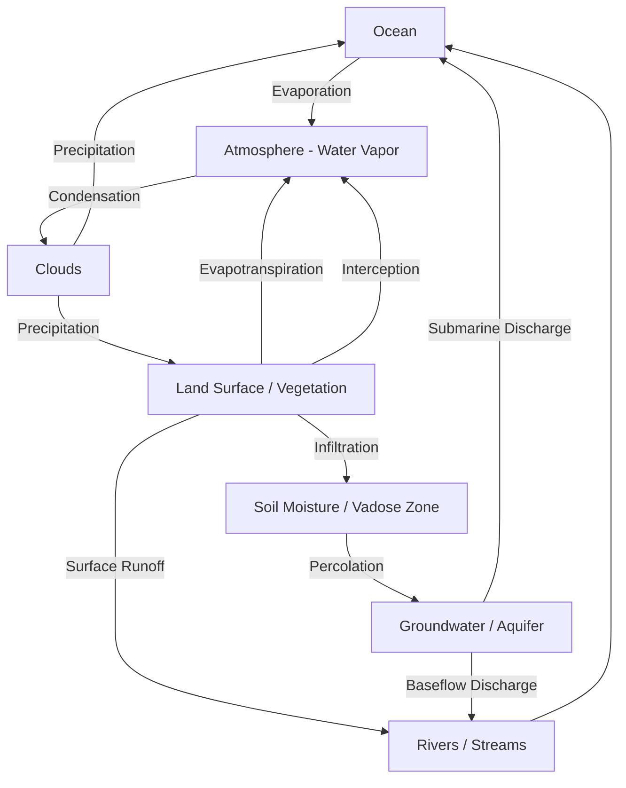

## The Hydrological Cycle


### Overview

The hydrological cycle (water cycle) describes the continuous circulation of water through the Earth's atmosphere, land surface, subsurface, and oceans, driven primarily by solar radiation and gravity. It is a closed system at the global scale—total water mass is conserved—but exhibits complex, spatially and temporally variable fluxes and storages at regional and local scales. Understanding this cycle underpins water resource management, flood and drought prediction, ecosystem modeling, and climate science.

### Core Processes and Fluxes

**Evaporation**

The phase transition of liquid water to vapor from open water surfaces (oceans, lakes, rivers), soil, and other wet surfaces, driven by solar energy input and controlled by vapor pressure deficit, wind speed, and surface temperature. Oceanic evaporation accounts for the majority of global water vapor flux into the atmosphere.

**Transpiration**

Water vapor release from plant stomata as part of photosynthetic gas exchange. Combined with evaporation, this is commonly aggregated as **evapotranspiration (ET)**, the dominant water flux from terrestrial land surfaces.

**Condensation**

The phase transition of water vapor to liquid droplets (or deposition to ice) as air parcels cool below their dew point, typically through adiabatic cooling during uplift, forming clouds and fog.

**Precipitation**

The return of atmospheric water to the surface as rain, snow, sleet, or hail, occurring when cloud droplets or ice crystals grow large enough to overcome updraft support and fall under gravity (via collision-coalescence or the Bergeron-Findeisen process).

**Interception**

Precipitation captured by vegetation canopy or surface structures before reaching the ground, a portion of which evaporates directly back to the atmosphere without contributing to soil infiltration or runoff.

**Infiltration**

The entry of surface water into soil, governed by soil texture, structure, antecedent moisture, and surface conditions. Infiltration rate typically decreases over time during a rainfall event as the soil profile saturates, commonly described by models such as the Green-Ampt or Horton equations.

**Percolation**

The downward movement of infiltrated water through the unsaturated (vadose) zone toward the water table, eventually recharging groundwater aquifers.

**Runoff**

Surface water flow occurring when precipitation intensity exceeds infiltration capacity (infiltration-excess or Hortonian runoff) or when soil becomes fully saturated (saturation-excess runoff), collecting in channels and contributing to streamflow.

**Groundwater Flow**

Subsurface water movement through saturated porous or fractured media, governed by Darcy's Law, eventually discharging to streams, springs, wetlands, or directly to oceans (submarine groundwater discharge).

**Sublimation and Deposition**

Direct phase transitions between ice/snow and water vapor without an intermediate liquid phase, relevant in snowpack ablation and polar/high-altitude environments.



### Governing Equation: The Water Balance

The hydrological cycle at any defined control volume (a catchment, a soil column, a global reservoir) is governed by the principle of mass conservation, expressed as the water balance equation:

$$P = ET + Q + \Delta S$$

where $P$ is precipitation, $ET$ is evapotranspiration, $Q$ is runoff (surface plus subsurface outflow), and $\Delta S$ is the change in water storage (soil moisture, groundwater, snowpack, surface water) over the accounting period. At the global annual scale, $\Delta S \approx 0$, so long-term global precipitation approximately equals global evapotranspiration.

For a more detailed catchment-scale accounting, storage change can be expanded as:

$$\Delta S = \Delta S_{soil} + \Delta S_{snow} + \Delta S_{groundwater} + \Delta S_{surface}$$

### Global Water Reservoirs and Residence Times

Water is distributed unevenly across reservoirs, each characterized by a distinct mean residence time—the average duration a water molecule remains in that reservoir before moving to another.

| Reservoir | Approximate Share of Global Water | Typical Residence Time |
| --- | --- | --- |
| Oceans | ~96.5% | ~3,000–4,000 years |
| Ice caps, glaciers, permanent snow | ~1.7% | 20–100+ years (up to millennia for ice sheets) |
| Groundwater | ~1.7% | Days to >10,000 years (deep aquifers) |
| Lakes | <0.01% | ~10–100 years |
| Soil moisture | <0.001% | Weeks to months |
| Atmosphere | <0.001% | ~8–10 days |
| Rivers | <0.0001% | Days to weeks |
| Biosphere | <0.0001% | Hours to days |

[Unverified] Exact percentage figures vary slightly between sources depending on methodology and measurement era; these values represent commonly cited order-of-magnitude estimates from standard hydrology references and should be cross-checked against current USGS or UNESCO water resources assessments for precise figures.

The atmosphere's short residence time (~8–10 days) explains why atmospheric water vapor content responds rapidly to surface flux changes, while deep groundwater and ice sheet reservoirs integrate change over much longer timescales, creating important lags in the climate system's overall response to forcing.

### Energy Balance Coupling

The hydrological cycle is tightly coupled to the surface energy balance because evaporation consumes latent heat:

$$R_n = LE + H + G$$

where $R_n$ is net radiation, $LE$ is latent heat flux (energy consumed by evapotranspiration, $L$ being the latent heat of vaporization, $E$ being evaporation rate), $H$ is sensible heat flux, and $G$ is ground heat flux. This partitioning—the **Bowen ratio** ($\beta = H/LE$)—determines whether available energy at a surface predominantly drives evaporation (low Bowen ratio, e.g., wet surfaces, oceans) or direct heating of the atmosphere (high Bowen ratio, e.g., arid land).

### Quantitative Estimation Methods

**Potential Evapotranspiration (PET)**

The atmospheric demand for water assuming unlimited water availability, commonly estimated using the **Penman-Monteith equation**, the FAO-56 standard method:

$$ET_0 = \frac{0.408\Delta(R_n - G) + \gamma\frac{900}{T+273}u_2(e_s - e_a)}{\Delta + \gamma(1 + 0.34u_2)}$$

where $\Delta$ is the slope of the saturation vapor pressure curve, $\gamma$ is the psychrometric constant, $T$ is mean air temperature, $u_2$ is wind speed at 2m, and $(e_s - e_a)$ is the vapor pressure deficit.

**Infiltration Modeling**

The Green-Ampt model provides a physically based approximation of infiltration rate:

$$f(t) = K_s\left(1 + \frac{(\theta_s - \theta_i)\psi_f}{F(t)}\right)$$

where $K_s$ is saturated hydraulic conductivity, $\theta_s$ and $\theta_i$ are saturated and initial soil moisture content, $\psi_f$ is the wetting front suction head, and $F(t)$ is cumulative infiltration.

**Groundwater Flow (Darcy's Law)**

$$q = -K\frac{dh}{dl}$$

where $q$ is specific discharge (Darcy flux), $K$ is hydraulic conductivity, and $dh/dl$ is the hydraulic gradient.

### Example Calculation: Simple Catchment Water Balance

```python
def annual_water_balance(precipitation_mm, evapotranspiration_mm, runoff_mm):
    """
    Compute storage change for a catchment over an annual period.
    Units: mm of water depth over the catchment area.
    """
    delta_storage = precipitation_mm - evapotranspiration_mm - runoff_mm
    return delta_storage

# Example catchment (illustrative values, e.g., temperate humid basin)
P = 1200    # mm/year precipitation
ET = 650    # mm/year evapotranspiration
Q = 500     # mm/year streamflow (surface + baseflow)

dS = annual_water_balance(P, ET, Q)
print(f"Annual storage change: {dS} mm")

if abs(dS) < 50:
    print("Catchment approximately in long-term equilibrium (steady state)")
else:
    print("Significant net storage change detected (aquifer depletion/recharge, or measurement error)")
```

**Output**:



```
Annual storage change: 50 mm
Significant net storage change detected (aquifer depletion/recharge, or measurement error)
```

This illustrates how residual storage change in a water balance calculation is often used diagnostically—a persistent nonzero residual over many years may indicate groundwater depletion, reservoir filling, or systematic measurement/estimation error in one of the flux terms, since precipitation, ET, and runoff are each independently measured or modeled with their own uncertainty.

### The Cycle at Different Spatial Scales

**Global Scale**: Closed system; total precipitation equals total evaporation over long-term averages, with net moisture transport between ocean and land basins balanced by river discharge back to oceans.

**Continental/Regional Scale**: Involves moisture recycling, where a fraction of precipitation over land originates from upwind terrestrial evapotranspiration rather than oceanic sources. This fraction, the **precipitation recycling ratio**, is significant in continental interiors (e.g., the Amazon Basin, where estimates suggest a substantial share of basin rainfall derives from recycled forest transpiration). [Inference] The magnitude of this recycling effect is sensitive to land cover change, meaning large-scale deforestation is generally understood to reduce regional precipitation through weakened moisture recycling, though the precise quantitative relationship varies across modeling studies.

**Catchment/Watershed Scale**: The primary operational scale for water resource management, where the water balance equation is applied to quantify usable water yield, flood risk, and drought vulnerability for a defined drainage basin.

**Local/Plot Scale**: Governs soil-plant-atmosphere continuum processes relevant to agricultural water management and ecohydrology.

### Human Modifications to the Natural Cycle

- **Land use change**: Deforestation, urbanization, and agricultural conversion alter infiltration capacity, evapotranspiration rates, and runoff generation (e.g., impervious surfaces in urban areas sharply increase surface runoff and reduce infiltration/baseflow).
- **Water abstraction**: Groundwater pumping and surface water withdrawal for irrigation, industry, and municipal supply directly remove water from natural flow paths, in many regions exceeding natural recharge rates and causing long-term aquifer depletion.
- **Dams and reservoirs**: Alter the timing and magnitude of downstream flow, increase evaporative losses from impoundment surfaces, and trap sediment.
- **Irrigation**: Redistributes water spatially and can increase local atmospheric moisture and evapotranspiration beyond natural rates, sometimes enhancing downwind precipitation (an anthropogenic moisture recycling effect).
- **Climate change feedbacks**: Rising temperatures increase atmospheric water-holding capacity (per the Clausius-Clapeyron relation, roughly 7% per °C), intensifying the hydrological cycle overall—generally understood to produce more intense precipitation events alongside longer dry spells in many regions, though specific regional outcomes depend on circulation pattern shifts that vary by location.

### Diagram: Catchment Water Balance Components (svg_diagram)

<svg xmlns="http://www.w3.org/2000/svg" viewBox="0 0 760 440">
<text x="380" y="28" font-size="18" font-weight="bold" text-anchor="middle" fill="#1a1a1a">Catchment Water Balance Components (svg_diagram)</text>
<line x1="40" y1="380" x2="720" y2="380" stroke="#8b5e3c" stroke-width="4" />
<rect x="40" y="380" width="680" height="40" fill="#d2b48c" />
<text x="380" y="405" font-size="12" text-anchor="middle" fill="#3f2a14">Soil / Subsurface Profile</text>
<line x1="150" y1="70" x2="150" y2="200" stroke="#2563eb" stroke-width="3" marker-end="url(#arrowb)" />
<text x="150" y="60" font-size="13" text-anchor="middle" fill="#1e3a8a" font-weight="bold">Precipitation (P)</text>
<path d="M150,200 Q160,230 175,250" stroke="#2563eb" stroke-width="2.5" fill="none" marker-end="url(#arrowb)" />
<text x="200" y="235" font-size="11" fill="#1e3a8a">Infiltration</text>
<path d="M150,200 Q220,210 300,215" stroke="#059669" stroke-width="2.5" fill="none" marker-end="url(#arrowg)" />
<text x="230" y="205" font-size="11" fill="#065f46">Surface Runoff</text>
<line x1="300" y1="215" x2="450" y2="215" stroke="#059669" stroke-width="2.5" marker-end="url(#arrowg)" />
<text x="500" y="210" font-size="12" fill="#065f46" font-weight="bold">Streamflow (Q)</text>
<path d="M600,120 Q620,160 620,200" stroke="#dc2626" stroke-width="3" fill="none" marker-end="url(#arrowr)" />
<text x="620" y="110" font-size="13" text-anchor="middle" fill="#7f1d1d" font-weight="bold">Evapotranspiration (ET)</text>
<line x1="620" y1="380" x2="620" y2="220" stroke="#dc2626" stroke-width="2" stroke-dasharray="4,3" />
<circle cx="175" cy="255" r="6" fill="#2563eb" />
<line x1="175" y1="260" x2="175" y2="330" stroke="#2563eb" stroke-width="2" stroke-dasharray="3,2" marker-end="url(#arrowb)" />
<text x="220" y="300" font-size="11" fill="#1e3a8a">Percolation</text>
<rect x="130" y="330" width="120" height="40" rx="6" fill="#bfdbfe" stroke="#1e40af" />
<text x="190" y="354" font-size="11" text-anchor="middle" fill="#1e3a8a">Groundwater (ΔS)</text>
<path d="M250,350 Q350,365 450,220" stroke="#0891b2" stroke-width="2" fill="none" stroke-dasharray="3,2" marker-end="url(#arrowc)" />
<text x="330" y="370" font-size="11" fill="#155e75">Baseflow</text>
</svg>

### Measurement and Monitoring Techniques

- **Precipitation**: Rain gauges (point measurement), weather radar (spatial estimation via reflectivity-rainfall relationships), and satellite platforms (e.g., GPM—Global Precipitation Measurement mission).
- **Evapotranspiration**: Eddy covariance towers (direct flux measurement), lysimeters (mass balance), and remote sensing-based energy balance models (e.g., SEBAL, METRIC).
- **Streamflow**: Stream gauges measuring stage height converted to discharge via rating curves.
- **Soil moisture**: In situ sensors (time-domain reflectometry, capacitance probes) and satellite microwave remote sensing (e.g., SMAP, SMOS missions).
- **Groundwater**: Monitoring wells (piezometers) and satellite gravimetry (GRACE/GRACE-FO missions, detecting total water storage change via gravity field anomalies).
- **Snow**: Snow pillows, SNOTEL networks, and satellite-based snow cover/water equivalent products.

### Common Pitfalls and Misconceptions

- **Treating the cycle as spatially uniform**: Flux magnitudes and dominant pathways vary dramatically by climate zone (e.g., infiltration-dominated humid temperate catchments versus runoff-dominated arid regions with hydrophobic or crusted soils).
- **Ignoring residence time differences**: Assuming all water reservoirs respond to perturbation on similar timescales leads to incorrect expectations about aquifer recovery (which can take decades to millennia) versus atmospheric moisture response (days).
- **Confusing "water cycle intensification" with uniform wetting**: A more energetic cycle under warming generally redistributes water more unevenly (wet regions/seasons wetter, dry regions/seasons drier) rather than simply increasing precipitation everywhere.
- **Neglecting human-modified pathways**: Natural water balance equations require adjustment terms for abstraction, return flows, and inter-basin transfers in heavily managed catchments.

**Related Topics**

- Watershed and Catchment Delineation
- Surface Runoff Modeling and Rainfall-Runoff Relationships
- Groundwater Hydrology and Aquifer Systems
- Evapotranspiration Estimation Methods
- Flood Frequency Analysis
- Drought Indices and Monitoring
- Remote Sensing for Hydrological Applications
- Water Resource Management and Allocation
- Snowpack Dynamics and Hydrology