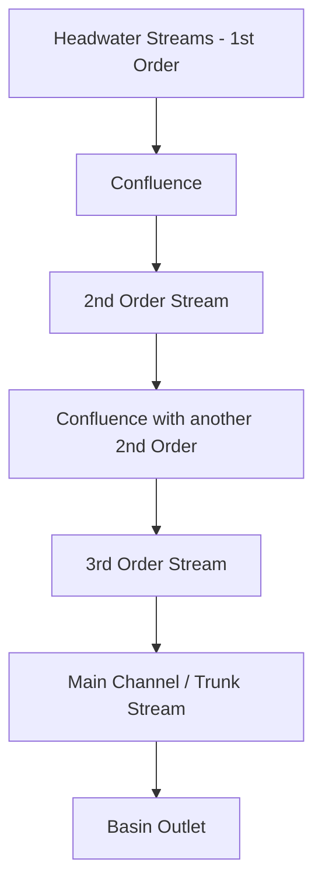
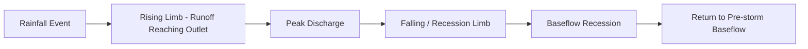

## Surface Water Systems


### Overview

Surface water systems encompass all water resources present on the Earth's land surface—rivers, streams, lakes, reservoirs, wetlands, and glaciers—that convey, store, and exchange water as part of the terrestrial branch of the hydrological cycle. These systems are characterized by their drainage networks, flow dynamics, storage capacity, and interaction with groundwater, and form the primary focus of water resource engineering, flood management, and freshwater ecology.

### Drainage Basin Fundamentals

**Watershed / Catchment Definition**

A drainage basin (watershed or catchment) is the land area that collects and channels precipitation and snowmelt to a common outlet, defined topographically by drainage divides—ridgelines separating adjacent basins. Basins are hierarchically nested: a large river basin (e.g., the Mississippi) contains numerous sub-basins and tributary watersheds.

**Stream Order (Strahler Classification)**

A hierarchical numbering system describing branching complexity within a drainage network:

- First-order streams: headwater channels with no tributaries
- Second-order streams: formed by the confluence of two first-order streams
- Higher orders: formed only when two streams of equal order merge (a lower-order tributary joining a higher-order stream does not increase the order)

**Drainage Density**

$$D_d = \frac{\sum L}{A}$$

where $\sum L$ is total channel length within the basin and $A$ is basin area. High drainage density indicates rapid runoff response (typical of impermeable or steep terrain); low density indicates greater infiltration capacity and subdued relief.

**Drainage Patterns**

Basin morphology produces characteristic network patterns: dendritic (tree-like, uniform substrate), trellis (parallel main channels with right-angle tributaries, structurally controlled by folded/tilted strata), radial (diverging from a central high point, e.g., volcanic cones), and rectangular (right-angle bends controlled by jointing/faulting).



### River Hydraulics and Flow Dynamics

**Open Channel Flow**

Surface water flow in rivers and streams is governed by open channel hydraulics, most fundamentally described by the continuity equation:

$$Q = A \cdot v$$

where $Q$ is discharge (volumetric flow rate, typically m³/s), $A$ is cross-sectional flow area, and $v$ is mean flow velocity.

**Manning's Equation**

The most widely used empirical formula for estimating mean velocity in open channel flow under steady, uniform conditions:

$$v = \frac{1}{n}R_h^{2/3}S^{1/2}$$

where $n$ is Manning's roughness coefficient (dependent on channel bed/bank material and vegetation), $R_h$ is hydraulic radius (cross-sectional area divided by wetted perimeter), and $S$ is channel slope (energy gradient).

**Flow Regimes**

- **Laminar vs. turbulent flow**: Characterized by the Reynolds number $Re = \frac{\rho v R_h}{\mu}$; natural channel flow is almost always turbulent.
- **Subcritical vs. supercritical flow**: Characterized by the Froude number $Fr = \frac{v}{\sqrt{gD}}$, where $D$ is hydraulic depth. $Fr < 1$ indicates subcritical (tranquil) flow typical of lowland rivers; $Fr > 1$ indicates supercritical (rapid) flow typical of steep mountain streams and spillways.

**Stage-Discharge Relationships**

Streamflow gauging stations measure water surface elevation (stage) continuously, converted to discharge via a site-specific rating curve developed from periodic direct discharge measurements, typically fit as:

$$Q = a(h - h_0)^b$$

where $h$ is stage, $h_0$ is stage at zero flow, and $a$, $b$ are empirically calibrated constants.

### Fluvial Geomorphology

**Channel Patterns**

- **Straight channels**: Rare in nature except where structurally controlled; typically unstable and transitional.
- **Meandering channels**: Sinuous single-thread channels developing through alternating erosion (outer bank, cut bank) and deposition (inner bank, point bar), characteristic of lower-gradient, fine-sediment rivers.
- **Braided channels**: Multiple interweaving channels separated by temporary bars, typical of high sediment supply and variable discharge (e.g., glacial outwash streams).
- **Anastomosing channels**: Multiple stable, vegetated channels separated by semi-permanent islands, typical of low-gradient, cohesive-bank systems.

**Sediment Transport**

Rivers transport sediment as bedload (rolling/sliding/saltating along the channel bed) and suspended load (carried within the water column by turbulence), with total sediment transport capacity generally increasing with the cube or higher power of flow velocity. The **competence** of a stream (maximum particle size it can move) and **capacity** (total sediment volume it can carry) both scale strongly with discharge, meaning most geomorphic work occurs during high-flow events.

**Channel Equilibrium (Graded Stream Concept)**

A graded stream achieves a dynamic equilibrium profile balancing sediment supply against transport capacity; alteration of any control (base level change, dam construction, land use change) triggers channel adjustment (incision, aggradation, or planform change) toward a new equilibrium.

### Lakes and Reservoirs

**Lake Water Balance**

Analogous to the general water balance, applied to a lake system:

$$\Delta S = P + Q_{in} + GW_{in} - E - Q_{out} - GW_{out}$$

where $Q_{in}/Q_{out}$ are surface inflow/outflow and $GW_{in}/GW_{out}$ represent groundwater exchange.

**Thermal Stratification**

Lakes in temperate climates typically develop seasonal thermal layering:

- **Epilimnion**: Warm, well-mixed surface layer
- **Thermocline (metalimnion)**: Zone of rapid temperature decline with depth
- **Hypolimnion**: Cold, dense bottom layer, often isolated from atmospheric oxygen exchange during stratification

This stratification breaks down during **turnover** events (typically spring and fall in dimictic lakes) when surface and bottom water temperatures converge near 4°C (water's density maximum), allowing full water column mixing.

**Reservoir Operations**

Constructed impoundments are managed according to a **rule curve** balancing flood control storage, water supply reliability, hydropower generation, and downstream ecological flow requirements, typically requiring reservation of flood pool capacity during wet seasons and conservation pool storage during dry seasons.

### Wetlands

Wetlands (marshes, swamps, bogs, fens) occupy the transitional zone between permanently aquatic and terrestrial systems, characterized by hydric soils, water-saturated conditions for significant portions of the growing season, and hydrophytic vegetation adaptation. They provide critical hydrological functions including:

- Flood attenuation (temporary storage reducing downstream peak discharge)
- Water quality improvement (sediment trapping, nutrient uptake/transformation)
- Groundwater recharge or discharge, depending on hydrogeological setting
- Baseflow maintenance during dry periods

### Flood Hydrology

**Hydrograph Analysis**

A discharge hydrograph plots streamflow against time in response to a precipitation event, comprising:

- **Rising limb**: Increasing discharge as runoff reaches the outlet
- **Peak discharge**: Maximum flow rate
- **Recession/falling limb**: Declining discharge as surface runoff contribution diminishes
- **Baseflow**: Sustained groundwater-derived discharge underlying the direct runoff response

**Unit Hydrograph Method**

A classical approach representing the direct runoff response of a catchment to one unit of effective rainfall occurring uniformly over a specified duration, used (via linear superposition and convolution) to synthesize hydrographs for design storms of arbitrary magnitude:

$$Q(t) = \sum_{i=1}^{n} P_i \cdot UH(t - i + 1)$$

where $P_i$ is effective rainfall in period $i$ and $UH$ is the unit hydrograph ordinate.

**Flood Frequency Analysis**

Statistical estimation of flood magnitude-probability relationships, commonly fitting annual maximum discharge series to distributions such as the Log-Pearson Type III (the standard method recommended in USGS Bulletin 17C) or Generalized Extreme Value (GEV) distribution, to estimate return period floods (e.g., the 100-year flood, $Q_{100}$).



### Example Calculation: Manning's Equation Application

```python
def manning_velocity(n, hydraulic_radius, slope):
    """
    Compute mean flow velocity using Manning's equation.
    n: Manning's roughness coefficient (dimensionless)
    hydraulic_radius: cross-sectional area / wetted perimeter (m)
    slope: channel bed/energy slope (m/m, dimensionless)
    Returns velocity in m/s (SI form of Manning's equation)
    """
    return (1 / n) * (hydraulic_radius ** (2/3)) * (slope ** 0.5)

def discharge(velocity, area):
    """Compute discharge Q = A * v"""
    return velocity * area

# Example: trapezoidal channel, natural earth with some vegetation
n = 0.035          # Manning's roughness for natural channel with stones/weeds
R_h = 1.2          # hydraulic radius (m)
S = 0.002          # channel slope (m/m)
A = 8.5            # cross-sectional flow area (m^2)

v = manning_velocity(n, R_h, S)
Q = discharge(v, A)

print(f"Mean velocity: {v:.3f} m/s")
print(f"Discharge: {Q:.2f} m^3/s")

fr_depth = 1.0  # approximate hydraulic depth for Froude check
froude = v / (9.81 * fr_depth) ** 0.5
flow_type = "Subcritical" if froude < 1 else "Supercritical"
print(f"Froude number: {froude:.3f} ({flow_type} flow)")
```

**Output**:



```
Mean velocity: 0.913 m/s
Discharge: 7.76 m^3/s
Froude number: 0.292 (Subcritical flow)
```

This example demonstrates the standard workflow for estimating streamflow from surveyed channel geometry and slope when direct gauge measurement is unavailable—a common technique in ungauged basin analysis, though Manning's $n$ selection introduces significant estimation uncertainty and is typically calibrated against known flow observations where possible.

### Water Quality in Surface Systems

Surface water quality is governed by both point sources (discrete discharges, e.g., wastewater outfalls) and non-point sources (diffuse inputs, e.g., agricultural runoff, urban stormwater). Key parameters include:

- **Dissolved oxygen (DO)**: Critical for aquatic life; depleted by organic pollution loading via microbial decomposition (biochemical oxygen demand, BOD)
- **Nutrient loading**: Excess nitrogen and phosphorus driving eutrophication and algal blooms
- **Turbidity and suspended sediment**: Affecting light penetration, aquatic habitat, and reservoir sedimentation
- **Temperature**: Governing dissolved oxygen solubility and aquatic species thermal tolerance, sensitive to riparian vegetation loss and thermal pollution (e.g., power plant cooling discharge)

The **Streeter-Phelps model** is a classical analytical approach describing the dissolved oxygen "sag curve" downstream of an organic pollution source, balancing deoxygenation (BOD decay) against reaeration.

### Human Modification and Management

**Channelization and Levees**: Engineering modifications straightening or confining channels for flood control or navigation, which typically increase flow velocity and downstream flood peaks while disconnecting the channel from its natural floodplain.

**Dam Construction**: Alters natural flow regime (magnitude, timing, frequency, duration, and rate of change of flow—the components of the **natural flow regime paradigm**), traps sediment upstream, and can cause downstream channel incision from sediment-starved "hungry water" release.

**Interbasin Water Transfer**: Engineered diversion of water between basins to address regional supply imbalances, carrying ecological risks including invasive species transfer and donor-basin flow depletion.

**Stormwater Management**: Urban development increases impervious surface coverage, elevating peak discharge and reducing time-to-peak; modern approaches emphasize green infrastructure (bioswales, permeable pavement, detention basins) to mitigate these effects and approximate pre-development hydrology.

### Diagram: River Channel Cross-Section and Flow Zones (svg_diagram)

<svg xmlns="http://www.w3.org/2000/svg" viewBox="0 0 740 380">
<text x="370" y="28" font-size="18" font-weight="bold" text-anchor="middle" fill="#1a1a1a">River Channel Cross-Section and Flow Zones (svg_diagram)</text>
<path d="M60,320 L60,260 Q200,180 370,175 Q540,180 680,260 L680,320 Z" fill="#93c5fd" stroke="#1e40af" stroke-width="2" />
<text x="370" y="230" font-size="12" text-anchor="middle" fill="#1e3a8a" font-weight="bold">Main Channel Flow (thalweg near center-deep zone)</text>
<path d="M370,175 Q380,200 370,225" stroke="#1e3a8a" stroke-width="1" fill="none" stroke-dasharray="2,2" />
<circle cx="370" cy="200" r="4" fill="#1e3a8a" />
<text x="420" y="205" font-size="11" fill="#1e3a8a">Thalweg (deepest flow line)</text>
<rect x="60" y="320" width="620" height="20" fill="#d2b48c" />
<text x="370" y="335" font-size="11" text-anchor="middle" fill="#3f2a14">Streambed / Substrate</text>
<path d="M60,260 Q100,240 150,235" fill="#fde68a" stroke="#92400e" stroke-width="1.5" />
<text x="90" y="260" font-size="10" fill="#78350f">Point Bar</text>
<rect x="60" y="150" width="620" height="15" fill="#bbf7d0" opacity="0.6" />
<text x="370" y="145" font-size="11" text-anchor="middle" fill="#166534">Floodplain (inundated during overbank flow)</text>
<line x1="60" y1="165" x2="60" y2="260" stroke="#166534" stroke-width="1" stroke-dasharray="4,3" />
<line x1="680" y1="165" x2="680" y2="260" stroke="#166534" stroke-width="1" stroke-dasharray="4,3" />
<line x1="200" y1="60" x2="200" y2="175" stroke="#dc2626" stroke-width="2" marker-end="url(#arrd)" />
<text x="200" y="50" font-size="11" text-anchor="middle" fill="#7f1d1d">Erosion (Cut Bank)</text>
<line x1="540" y1="60" x2="540" y2="180" stroke="#059669" stroke-width="2" marker-end="url(#arrd)" />
<text x="540" y="50" font-size="11" text-anchor="middle" fill="#065f46">Deposition Zone</text>
</svg>

### Monitoring and Data Infrastructure

- **Stream gauging networks**: National agencies (e.g., USGS in the United States, Environment Agency in the UK) maintain networks of continuous-record gauging stations measuring stage, converted to discharge via rating curves.
- **Remote sensing**: Satellite altimetry (e.g., SWOT—Surface Water and Ocean Topography mission) enables measurement of river and lake surface elevation and extent globally, including in ungauged basins.
- **Hydrologic models**: Physically based (e.g., SWAT, HEC-HMS) and conceptual/lumped models (e.g., HBV, GR4J) used for streamflow simulation, forecasting, and scenario analysis.
- **GIS-based watershed delineation**: Digital elevation models (DEMs) processed through flow direction and flow accumulation algorithms (e.g., D8, D-infinity) to automatically derive drainage networks and basin boundaries.

### Common Pitfalls and Misconceptions

- **Assuming stationary rating curves**: Channel geometry can shift after major flood events (scour/deposition), requiring periodic rating curve recalibration; applying an outdated curve introduces systematic discharge error.
- **Treating Manning's n as a fixed constant**: Roughness coefficients vary with stage (submerged vegetation behaves differently at low versus high flow), seasonally (vegetation growth cycles), and are a major source of discharge estimation uncertainty.
- **Ignoring floodplain connectivity**: Levee and channelization projects that disconnect rivers from floodplains often transfer flood risk downstream rather than eliminating it, since floodplain storage capacity is lost.
- **Overlooking groundwater-surface water connectivity**: Many streams are not purely "gaining" (groundwater-fed) or "losing" (recharging groundwater) uniformly along their length; connectivity can shift seasonally and spatially within the same channel.

**Related Topics**

- Groundwater Hydrology and Aquifer Systems
- Flood Frequency Analysis and Risk Assessment
- Fluvial Geomorphology and River Restoration
- Watershed Modeling (SWAT, HEC-HMS)
- Water Quality Modeling and Eutrophication
- Dam Operations and Environmental Flow Management
- Remote Sensing of Surface Water (SWOT, Landsat)
- Urban Stormwater Management and Green Infrastructure
- Wetland Hydrology and Ecosystem Services