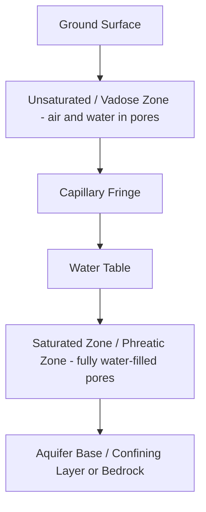
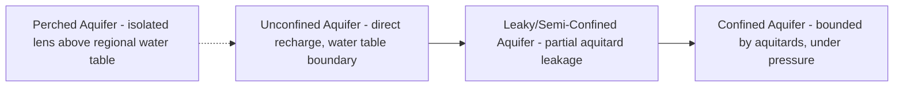

## Groundwater Hydrology


### Overview

Groundwater hydrology is the study of water occurring beneath the Earth's surface within saturated soil and rock formations, encompassing its occurrence, movement, storage, extraction, and interaction with surface water systems. Groundwater constitutes the largest accessible freshwater reservoir on Earth (excluding ice caps and glaciers) and serves as a critical water supply source for drinking water, irrigation, and industrial use, while also sustaining baseflow to rivers, wetlands, and springs during dry periods.

### Subsurface Water Zones

**Unsaturated (Vadose) Zone**

The region extending from the ground surface to the water table, where pore spaces contain a mixture of air and water held by capillary and adsorptive forces against gravity. Water content here is described by the soil moisture characteristic curve, relating matric potential to volumetric water content.

**Water Table**

The upper surface of the saturated zone, defined as the level at which pore water pressure equals atmospheric pressure. It is not static—it fluctuates seasonally and in response to recharge events, pumping, and drought.

**Saturated (Phreatic) Zone**

The region below the water table where all pore spaces are completely filled with water, the domain of groundwater flow and the zone from which wells extract water.

**Capillary Fringe**

A thin transitional zone immediately above the water table where water is drawn upward by capillary action, remaining saturated or near-saturated despite being technically above the water table.



### Aquifer Types and Classification

**Unconfined (Water Table) Aquifer**

An aquifer whose upper boundary is the water table itself, in direct hydraulic connection with the atmosphere via the unsaturated zone above. Recharge occurs relatively directly from surface infiltration, and the water table rises and falls in direct response to recharge/discharge.

**Confined (Artesian) Aquifer**

An aquifer bounded above (and typically below) by relatively impermeable confining layers (aquitards or aquicludes), under pressure greater than atmospheric. Water in a well penetrating a confined aquifer rises above the top of the aquifer to a level defined by the **potentiometric surface**; if this surface lies above ground level, the well flows without pumping (a flowing artesian well).

**Perched Aquifer**

A localized, discontinuous saturated zone situated above the regional water table, held up by a limited-extent low-permeability lens within the unsaturated zone.

**Leaky (Semi-Confined) Aquifer**

An aquifer bounded by aquitards that allow some vertical leakage of water, representing an intermediate case between fully confined and unconfined conditions.



### Aquifer Material Properties

**Porosity**

$$n = \frac{V_v}{V_t}$$

where $V_v$ is void volume and $V_t$ is total volume. Distinguishes between **primary porosity** (intergranular pore spaces, e.g., sand/gravel) and **secondary porosity** (fractures, solution cavities, e.g., karst limestone, fractured bedrock).

**Specific Yield and Specific Retention**

$$n = S_y + S_r$$

where $S_y$ (specific yield) is the volumetric fraction of water that drains freely under gravity from an unconfined aquifer, and $S_r$ (specific retention) is the fraction retained against gravity by molecular and surface tension forces.

**Hydraulic Conductivity ($K$)**

A measure of a material's ability to transmit water, dependent on both the porous medium's intrinsic permeability and the fluid's properties (density, viscosity):

$$K = \frac{k \rho g}{\mu}$$

where $k$ is intrinsic permeability (medium property alone, units of length²), $\rho$ is fluid density, $g$ is gravitational acceleration, and $\mu$ is dynamic viscosity. Hydraulic conductivity spans roughly 13 orders of magnitude across natural materials, from clean gravel ($K$ up to ~$10^{-1}$ m/s) to unfractured clay/shale ($K$ down to ~$10^{-13}$ m/s).

**Transmissivity**

$$T = K \cdot b$$

where $b$ is aquifer saturated thickness; transmissivity represents the rate of flow through the full vertical thickness of the aquifer per unit hydraulic gradient.

**Storativity (Storage Coefficient)**

For confined aquifers, storativity $S$ represents the volume of water released from storage per unit surface area per unit decline in hydraulic head, arising from the combined compressibility of water and the aquifer matrix (typically $10^{-5}$ to $10^{-3}$, much smaller than specific yield in unconfined aquifers, which typically ranges 0.01–0.35).

### Governing Flow Equation: Darcy's Law

The fundamental empirical law governing groundwater flow, established by Henry Darcy in 1856 through experiments on flow through sand columns:

$$Q = -KA\frac{dh}{dl}$$

or expressed as specific discharge (Darcy flux, $q$):

$$q = \frac{Q}{A} = -K\frac{dh}{dl}$$

where $Q$ is volumetric flow rate, $K$ is hydraulic conductivity, $A$ is cross-sectional flow area, and $dh/dl$ is the hydraulic gradient. The negative sign indicates flow occurs in the direction of decreasing hydraulic head. It is important to note that $q$ is a *specific discharge* (Darcy velocity), representing flow per unit total cross-sectional area, not the actual (seepage) velocity of water through pore spaces, which is higher and given by:

$$v_{seepage} = \frac{q}{n_e}$$

where $n_e$ is effective (interconnected) porosity.

Darcy's Law is valid only under laminar flow conditions, generally applicable across most natural granular aquifer materials but breaking down in highly permeable media (coarse gravel, karst conduits) where flow becomes turbulent and non-Darcian.

**Governing Partial Differential Equation**

Combining Darcy's Law with the continuity equation yields the general groundwater flow equation. For a confined, homogeneous, isotropic aquifer under transient conditions:

$$S\frac{\partial h}{\partial t} = T\left(\frac{\partial^2 h}{\partial x^2} + \frac{\partial^2 h}{\partial y^2}\right) + Q_s$$

where $Q_s$ represents source/sink terms (pumping, recharge). This diffusion-type partial differential equation forms the basis for both analytical solutions (e.g., the Theis equation) and numerical groundwater models.

### Well Hydraulics and Aquifer Testing

**Steady-State Radial Flow: Thiem Equation**

For steady-state flow to a fully penetrating well in a confined aquifer, describing drawdown as a function of distance:

$$s_1 - s_2 = \frac{Q}{2\pi T}\ln\left(\frac{r_2}{r_1}\right)$$

where $s_1, s_2$ are drawdowns at radial distances $r_1, r_2$ from the pumping well.

**Transient Flow: Theis Equation**

The classical analytical solution for transient drawdown in a confined aquifer under constant pumping rate, based on the analogy to heat conduction:

$$s(r,t) = \frac{Q}{4\pi T}W(u)$$

where $W(u)$ is the Theis well function (an exponential integral) and:

$$u = \frac{r^2 S}{4Tt}$$

Aquifer pumping tests fit observed drawdown-time data against the Theis type curve (or simplified approximations such as the Cooper-Jacob straight-line method) to estimate transmissivity and storativity—standard field methods for characterizing aquifer hydraulic properties.

**Cooper-Jacob Approximation**

For sufficiently large values of time and small $u$, the Theis equation simplifies to a straight-line relationship on a semi-log plot of drawdown versus log(time), enabling graphical estimation of $T$ and $S$ from pumping test data without needing type-curve matching.

### Example Calculation: Theis Drawdown Estimation

```python
import numpy as np
from scipy.special import exp1  # exponential integral, equivalent to Theis well function W(u)

def theis_drawdown(Q, T, S, r, t):
    """
    Compute drawdown using the Theis equation for confined aquifer transient flow.
    Q: pumping rate (m^3/day)
    T: transmissivity (m^2/day)
    S: storativity (dimensionless)
    r: radial distance from pumping well (m)
    t: time since pumping began (days)
    Returns drawdown in meters.
    """
    u = (r**2 * S) / (4 * T * t)
    W_u = exp1(u)  # Theis well function W(u) = E1(u)
    s = (Q / (4 * np.pi * T)) * W_u
    return s, u

# Example aquifer test parameters
Q = 1200      # m^3/day pumping rate
T = 500       # m^2/day transmissivity
S = 2.5e-4    # storativity (typical confined aquifer)
r = 50        # meters from pumping well
t = 1.0       # 1 day since pumping start

drawdown, u_val = theis_drawdown(Q, T, S, r, t)
print(f"u parameter: {u_val:.6f}")
print(f"Drawdown at r={r}m, t={t} day: {drawdown:.3f} m")

# Evaluate at multiple times to show drawdown propagation
for t_test in [0.1, 0.5, 1.0, 5.0, 10.0]:
    s, _ = theis_drawdown(Q, T, S, r, t_test)
    print(f"  t={t_test:>5} days -> drawdown = {s:.3f} m")
```

**Output**:



```
u parameter: 0.000313
Drawdown at r=50m, t=1.0 day: 1.148 m
  t=  0.1 days -> drawdown = 0.858 m
  t=  0.5 days -> drawdown = 1.056 m
  t=  1.0 days -> drawdown = 1.148 m
  t=  5.0 days -> drawdown = 1.339 m
  t= 10.0 days -> drawdown = 1.402 m
```

This demonstrates the characteristic logarithmic-time drawdown propagation pattern typical of confined aquifer response to pumping—rapid initial drawdown followed by progressively slower decline as the cone of depression expands, forming the basis for pumping test interpretation.

### Recharge and Discharge Mechanisms

**Natural Recharge**

- **Diffuse recharge**: Direct infiltration of precipitation through the unsaturated zone across broad areas, dependent on soil permeability, vegetation, and climate.
- **Focused recharge**: Concentrated infiltration through preferential pathways such as losing stream reaches, sinkholes (in karst terrain), and topographic depressions.
- **Mountain-front recharge**: Significant infiltration occurring at the interface between mountain bedrock and adjacent alluvial basins, an important recharge mechanism in many arid basin-and-range hydrogeological settings.

**Artificial Recharge**

Managed aquifer recharge (MAR) techniques deliberately enhance groundwater replenishment, including infiltration basins, recharge wells, and aquifer storage and recovery (ASR) systems that inject treated water during periods of surplus for later extraction.

**Natural Discharge**

Groundwater discharges naturally via springs (where the water table intersects the ground surface), seepage to streams/lakes/wetlands (baseflow contribution), evapotranspiration from shallow water tables (phreatophyte vegetation), and submarine groundwater discharge to coastal oceans.

### Groundwater-Surface Water Interaction

Streams interact with underlying aquifers in three principal modes:

- **Gaining streams**: Groundwater discharges into the channel, sustaining baseflow (water table slopes toward the stream)
- **Losing streams**: Stream water infiltrates to recharge the aquifer (water table slopes away from the stream), which can become disconnected from the water table entirely under significant drawdown, forming an unsaturated zone beneath the channel
- **Flow-through/variable systems**: A stream may gain in some reaches or seasons and lose in others, particularly common in systems with strong seasonal water table fluctuation

This interaction is quantitatively significant for water resource management, since groundwater pumping near streams can reduce baseflow through **streamflow depletion**, an effect that may lag pumping by months to years depending on aquifer diffusivity and well-to-stream distance.

### Contaminant Transport in Groundwater

**Advection-Dispersion Equation**

Describes the movement and spreading of a dissolved contaminant (solute) plume through a saturated porous medium:

$$\frac{\partial C}{\partial t} = D\frac{\partial^2 C}{\partial x^2} - v_{seepage}\frac{\partial C}{\partial x} - \lambda C$$

where $C$ is solute concentration, $D$ is the hydrodynamic dispersion coefficient (combining mechanical dispersion and molecular diffusion), $v_{seepage}$ is average linear (seepage) velocity, and $\lambda$ is a first-order decay rate constant (relevant for reactive or biodegradable contaminants).

**Retardation**

Sorption of contaminants onto aquifer solid material slows apparent transport velocity relative to the groundwater flow velocity itself, quantified by the retardation factor $R_f$, dependent on the solid-water partition coefficient and bulk density/porosity of the medium.

**Common Contamination Sources**: Agricultural nitrate and pesticide leaching, septic system effluent, underground storage tank leaks (petroleum hydrocarbons), landfill leachate, saltwater intrusion in coastal aquifers from over-pumping, and industrial solvent plumes (e.g., chlorinated volatile organic compounds).

### Land Subsidence and Aquifer Compaction

Excessive groundwater extraction from unconsolidated aquifer systems, particularly those containing fine-grained clay/silt interbeds, can cause irreversible aquifer compaction and land surface subsidence as effective stress increases with declining pore pressure (per Terzaghi's effective stress principle), permanently reducing aquifer storage capacity in affected fine-grained layers. [Inference] This mechanism is generally understood to be the primary driver in globally documented severe subsidence cases (e.g., portions of California's Central Valley, Mexico City, and parts of Jakarta), though the specific magnitude at any given location depends on local sediment compressibility and historical pumping stress.

### Diagram: Cone of Depression Around a Pumping Well (svg_diagram)

<svg xmlns="http://www.w3.org/2000/svg" viewBox="0 0 740 380">
<text x="370" y="28" font-size="18" font-weight="bold" text-anchor="middle" fill="#1a1a1a">Cone of Depression Around a Pumping Well (svg_diagram)</text>
<rect x="40" y="280" width="660" height="70" fill="#d2b48c" />
<text x="370" y="325" font-size="11" text-anchor="middle" fill="#3f2a14">Aquifer Material (saturated zone)</text>
<line x1="60" y1="140" x2="680" y2="140" stroke="#2563eb" stroke-width="2" stroke-dasharray="5,3" />
<text x="100" y="130" font-size="11" fill="#1e3a8a">Original Water Table</text>

<path d="M60,140 Q200,145 300,175 Q350,220 370,270 Q390,220 440,175 Q540,145 680,140" fill="none" stroke="`#dc2626`" stroke-width="2.5" />

<text x="500" y="165" font-size="11" fill="`#7f1d1d`" font-weight="bold">Cone of Depression</text>

<rect x="360" y="60" width="20" height="215" fill="#6b7280" />
<text x="370" y="50" font-size="12" text-anchor="middle" fill="#1a1a1a" font-weight="bold">Pumping Well</text>
<line x1="380" y1="130" x2="480" y2="130" stroke="#1e3a8a" stroke-width="1.5" marker-end="url(#arrdd)" />
<text x="530" y="126" font-size="10" fill="#1e3a8a">Radius of Influence →</text>
<path d="M150,275 Q250,230 355,272" fill="none" stroke="#059669" stroke-width="1.5" stroke-dasharray="3,2" marker-end="url(#arrdd)" />
<text x="200" y="255" font-size="10" fill="#065f46">Flow toward well</text>
</svg>

### Numerical Groundwater Modeling

Complex aquifer systems with irregular geometry, heterogeneous properties, and multiple stresses are typically simulated using numerical models that discretize the governing flow equation over a spatial grid:

- **MODFLOW**: The USGS-developed modular finite-difference groundwater flow model, the de facto industry standard for regional and site-scale groundwater simulation, supporting extensions for solute transport (MT3DMS), variable density flow (SEAWAT), and surface water-groundwater coupling (SFR, LAK packages).
- **FEFLOW, HYDRUS**: Finite-element based alternatives, with HYDRUS specifically oriented toward variably saturated (vadose zone) flow and transport modeling.
- **Calibration**: Numerical models are calibrated by adjusting hydraulic conductivity, storativity, and boundary condition parameters until simulated heads and fluxes match observed monitoring well data, often using automated parameter estimation tools (e.g., PEST).

### Common Pitfalls and Misconceptions

- **Assuming groundwater exists in underground "rivers" or open caverns**: Except in karst/volcanic terrain with solution conduits or lava tubes, groundwater occupies interconnected pore spaces and fractures within otherwise solid rock or sediment, not open channels.
- **Confusing specific yield with total porosity**: A significant fraction of total porosity (specific retention) does not drain freely under gravity, meaning usable water yield from an unconfined aquifer is substantially less than total pore volume.
- **Treating aquifers as infinite, non-interacting reservoirs**: Groundwater pumping is hydraulically connected to surface water systems and to neighboring wells; sustained overdraft eventually manifests as streamflow depletion, spring drying, or well interference regardless of aquifer size.
- **Ignoring the time lag in aquifer response**: Confined aquifer storage release is nearly instantaneous (elastic expansion), but unconfined aquifer response involves slower gravity drainage, and full aquifer system equilibration to a new pumping stress can take years to decades in large regional systems.
- **Assuming land subsidence is fully reversible**: Compaction of fine-grained aquitard layers due to groundwater overdraft is largely permanent/inelastic once a critical pre-consolidation stress threshold is exceeded, unlike the largely elastic (recoverable) compaction of coarser aquifer materials.

**Related Topics**

- Aquifer Pumping Test Design and Analysis
- Contaminant Transport and Remediation
- Karst Hydrogeology
- Managed Aquifer Recharge (MAR) Systems
- Groundwater-Surface Water Interaction Modeling
- Land Subsidence Monitoring (InSAR, GRACE)
- Numerical Groundwater Modeling (MODFLOW)
- Saltwater Intrusion in Coastal Aquifers
- Water Resource Sustainability and Aquifer Depletion