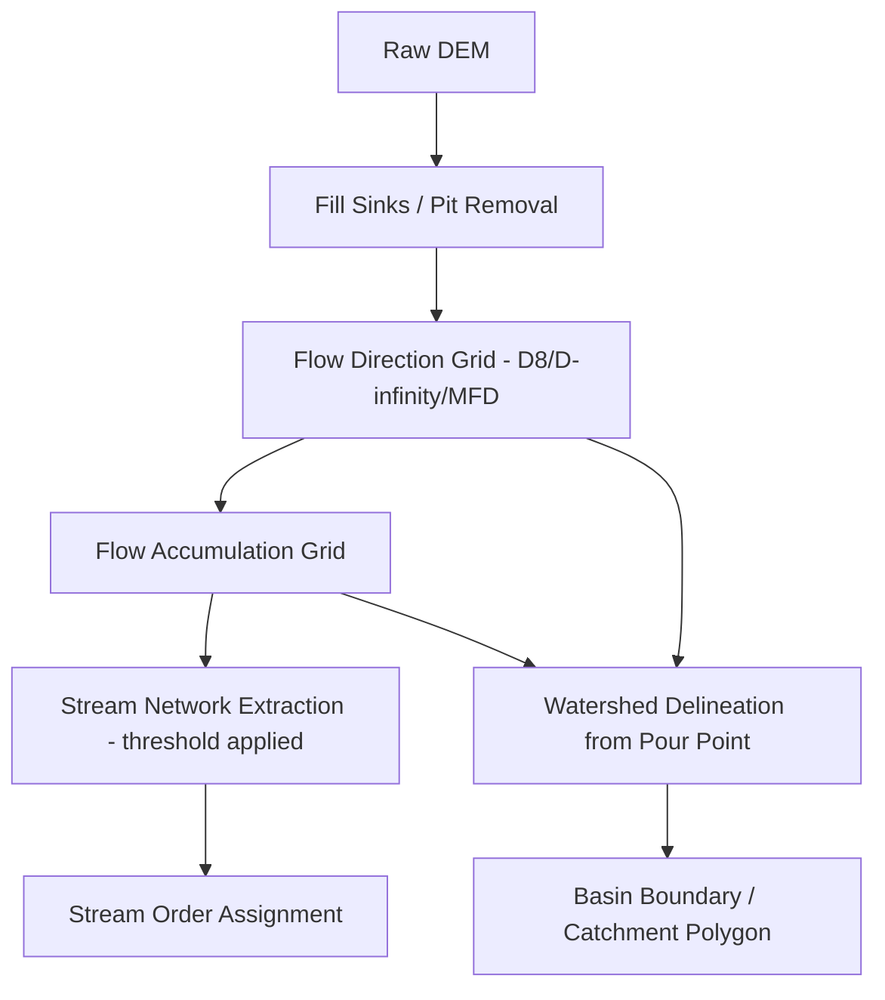

## Watershed and Drainage Basin Analysis


### Overview

Watershed and drainage basin analysis is the systematic characterization of a catchment's physical, topographic, and hydrological properties to understand and predict its runoff response, sediment yield, and water resource behavior. This analysis integrates geomorphometric measurement, GIS-based terrain processing, and statistical/empirical relationships to support flood forecasting, water resource planning, land use management, and ecological assessment. Modern practice relies heavily on digital elevation models (DEMs) and automated GIS workflows, supplemented by field-based ground-truthing.

### Watershed Delineation

**Manual (Topographic) Delineation**

Traditionally performed by tracing drainage divides on contour maps, following ridgelines that separate flow directed toward different outlets—identified by locating points where contour lines indicate flow diverging away from the basin of interest.

**Digital Elevation Model (DEM) Based Delineation**

The modern standard approach, using raster GIS processing on gridded elevation data:

1. **DEM preprocessing (pit filling)**: Removing spurious depressions (artifacts of DEM interpolation or genuine closed basins) that would otherwise trap simulated flow and prevent continuous drainage network extraction.
2. **Flow direction computation**: Assigning each cell a direction of steepest descent toward one or more downslope neighbors.
3. **Flow accumulation**: Computing the number of upstream cells draining through each cell, used to identify likely channel locations (cells exceeding a threshold accumulation value).
4. **Stream network extraction**: Applying a threshold to the flow accumulation grid to delineate the drainage network.
5. **Basin/watershed delineation**: Tracing all cells that drain to a specified pour point (outlet), typically using a watershed or basin GIS function seeded from the flow direction grid.

**Flow Direction Algorithms**

- **D8 (Deterministic 8-direction)**: The simplest and most widely implemented algorithm, assigning all flow from a cell to the single steepest downslope neighbor among the 8 surrounding cells. Computationally efficient but can produce artificial parallel flow lines on divergent terrain (e.g., ridges, fans).
- **D-infinity (D∞)**: Allows flow direction as a continuous angle rather than restricting to 8 discrete directions, apportioning flow between two neighboring cells; better represents divergent and convergent flow on complex terrain.
- **Multiple Flow Direction (MFD/FD8)**: Distributes flow to multiple downslope neighbors proportional to slope, better representing sheet flow and flow divergence, though it can overestimate dispersion in convergent channel zones.



### Basin Morphometric Parameters

**Basin Area and Perimeter**

The fundamental scale metrics of a watershed, directly measured from the delineated basin polygon, controlling total water and sediment yield potential.

**Basin Length and Shape**

- **Basin length ($L_b$)**: Distance from the outlet to the most distant point on the basin divide (often measured along the main channel or as a straight-line distance).
- **Form factor**: $R_f = A / L_b^2$, describing basin shape; lower values indicate elongated basins (attenuated, delayed peak flow), higher values indicate more circular basins (flashier, higher peak flow response).
- **Circularity ratio**: $R_c = 4\pi A / P^2$, comparing basin area to the area of a circle with equal perimeter $P$; values approaching 1 indicate a highly circular (compact) basin.
- **Elongation ratio**: $R_e = \frac{2}{L_b}\sqrt{A/\pi}$, comparing basin diameter to basin length.

**Relief Parameters**

- **Basin relief ($H$)**: Elevation difference between the highest point on the basin divide and the outlet.
- **Relief ratio**: $R_h = H / L_b$, indicating overall basin steepness and erosional/runoff energy potential.
- **Hypsometric curve and integral**: A plot of relative elevation against relative basin area, with the hypsometric integral ($HI$) summarizing the curve's shape as a single value, commonly interpreted as an indicator of basin geomorphic maturity/erosional stage (higher $HI$ suggesting a youthful, less-eroded landscape; lower $HI$ suggesting a mature or degraded landscape). [Inference] This interpretation originates from the Davisian geomorphic cycle framework and remains a useful heuristic, though modern geomorphology recognizes that hypsometry is also strongly influenced by lithology, tectonic activity, and climate rather than erosional stage alone.

**Drainage Network Parameters**

- **Stream order** (Strahler system, as previously defined): Hierarchical classification of channel segments by branching position.
- **Bifurcation ratio**: $R_b = N_u / N_{u+1}$, the ratio of the number of streams of a given order to the number of the next higher order; typically ranges 3–5 in natural drainage networks, with values outside this range suggesting structural or lithological control.
- **Drainage density**: $D_d = \sum L / A$ (total channel length divided by basin area), an index of landscape dissection and runoff efficiency.
- **Stream frequency**: $F_s = N / A$, the number of stream segments per unit basin area.
- **Length of overland flow**: $L_o \approx 1/(2D_d)$, an approximation of the average distance water travels as sheet flow before reaching a defined channel.

### Time-of-Concentration and Lag Time

**Time of Concentration ($t_c$)**

The time required for runoff to travel from the hydraulically most distant point in the watershed to the outlet, a critical parameter for peak discharge estimation. Common empirical formulas include:

**Kirpich Equation**:

$$t_c = 0.0195 \cdot L^{0.77} \cdot S^{-0.385}$$

where $t_c$ is in minutes, $L$ is the longest flow path length in meters, and $S$ is the average watershed slope (m/m).

**NRCS (SCS) Lag Method**:

$$t_l = \frac{L^{0.8}(S_r + 1)^{0.7}}{1900\sqrt{Y}}$$

where $t_l$ is lag time in hours, $L$ is hydraulic length in feet, $S_r$ relates to the NRCS curve number ($S_r = 1000/CN - 10$), and $Y$ is average watershed slope in percent.

The time of concentration is generally taken as approximately $t_c \approx 1.67 \cdot t_l$ in many standard applications, though this relationship and the various empirical formulas carry substantial uncertainty and should be validated against local observed data where available.

### Empirical Rainfall-Runoff Methods

**Rational Method**

A simple, widely used approach for peak discharge estimation on small urban/suburban catchments (typically under ~200 hectares):

$$Q_p = C \cdot i \cdot A$$

where $Q_p$ is peak discharge, $C$ is a dimensionless runoff coefficient (dependent on land cover, soil type, and slope), $i$ is rainfall intensity (matched to a duration equal to the time of concentration) at the design return period, and $A$ is drainage area.

**NRCS Curve Number Method**

Estimates direct runoff depth from storm rainfall based on antecedent soil moisture, land use, and hydrologic soil group, using tabulated curve number (CN) values (ranging roughly 30 for permeable, well-vegetated soils to near 100 for impervious surfaces):

$$Q = \frac{(P - 0.2S)^2}{P + 0.8S}, \quad S = \frac{25400}{CN} - 254 \text{ (mm)}$$

where $Q$ is runoff depth, $P$ is storm rainfall depth, and $S$ is a potential maximum retention parameter derived from the curve number.

### Example Calculation: Basin Morphometric Analysis

```python
import math

def basin_morphometrics(area_km2, perimeter_km, basin_length_km, 
                          total_stream_length_km, relief_m):
    """
    Compute standard morphometric parameters for a delineated drainage basin.
    """
    form_factor = area_km2 / (basin_length_km ** 2)
    circularity_ratio = (4 * math.pi * area_km2) / (perimeter_km ** 2)
    elongation_ratio = (2 / basin_length_km) * math.sqrt(area_km2 / math.pi)
    drainage_density = total_stream_length_km / area_km2
    relief_ratio = relief_m / (basin_length_km * 1000)  # convert L to meters
    length_overland_flow = 1 / (2 * drainage_density)
    
    return {
        "Form Factor": round(form_factor, 3),
        "Circularity Ratio": round(circularity_ratio, 3),
        "Elongation Ratio": round(elongation_ratio, 3),
        "Drainage Density (km/km^2)": round(drainage_density, 3),
        "Relief Ratio": round(relief_ratio, 5),
        "Length of Overland Flow (km)": round(length_overland_flow, 3)
    }

# Example basin (illustrative mid-sized temperate catchment)
results = basin_morphometrics(
    area_km2=185.0,
    perimeter_km=68.0,
    basin_length_km=22.0,
    total_stream_length_km=310.0,
    relief_m=420.0
)

for param, value in results.items():
    print(f"{param}: {value}")

# Basin shape interpretation
if results["Form Factor"] < 0.36:
    print("\nInterpretation: Elongated basin -> attenuated, delayed hydrograph peak")
else:
    print("\nInterpretation: More circular basin -> flashier, higher peak response")
```

**Output**:



```
Form Factor: 0.382
Circularity Ratio: 0.503
Elongation Ratio: 0.698
Drainage Density (km/km^2): 1.676
Relief Ratio: 0.00191
Length of Overland Flow (km): 0.298

Interpretation: More circular basin -> flashier, higher peak response
```

This illustrates the standard morphometric screening workflow used in preliminary watershed assessment—these dimensionless and normalized indices allow comparison between basins of different absolute size and enable rapid qualitative inference about flood response character before detailed hydraulic modeling is undertaken.

### Diagram: Watershed Delineation Workflow with Sub-basins (svg_diagram)

<svg xmlns="http://www.w3.org/2000/svg" viewBox="0 0 740 420">
<text x="370" y="28" font-size="18" font-weight="bold" text-anchor="middle" fill="#1a1a1a">Watershed Delineation with Nested Sub-basins (svg_diagram)</text>

<path d="M100,80 Q250,50 400,70 Q550,60 650,120 Q680,220 600,320 Q450,380 300,360 Q150,340 100,250 Q80,160 100,80 Z" fill="`#dbeafe`" stroke="`#1e3a8a`" stroke-width="3" />

<text x="150" y="100" font-size="12" fill="`#1e3a8a`" font-weight="bold">Main Basin Divide</text>

<path d="M150,150 Q220,130 280,160 Q290,200 250,230 Q190,225 160,190 Z" fill="`#bbf7d0`" stroke="`#166534`" stroke-width="2" />

<text x="195" y="185" font-size="10" text-anchor="middle" fill="`#14532d`">Sub-basin A</text>

<path d="M350,110 Q420,100 470,140 Q470,190 420,200 Q370,180 350,150 Z" fill="`#fde68a`" stroke="`#92400e`" stroke-width="2" />

<text x="410" y="150" font-size="10" text-anchor="middle" fill="`#78350f`">Sub-basin B</text>

<path d="M300,250 Q380,240 440,270 Q430,310 370,320 Q320,300 300,270 Z" fill="`#fecaca`" stroke="`#7f1d1d`" stroke-width="2" />

<text x="365" y="285" font-size="10" text-anchor="middle" fill="`#7f1d1d`">Sub-basin C</text>

<path d="M220,190 Q280,220 320,270 Q350,300 380,320" stroke="#2563eb" stroke-width="2" fill="none" />
<path d="M420,180 Q400,220 385,260" stroke="#2563eb" stroke-width="2" fill="none" />
<path d="M380,320 Q400,340 450,345" stroke="#2563eb" stroke-width="3" fill="none" />
<circle cx="450" cy="345" r="6" fill="#dc2626" />
<text x="480" y="350" font-size="11" fill="#7f1d1d" font-weight="bold">Outlet / Pour Point</text>
</svg>

### Land Cover and Soil Data Integration

Watershed analysis routinely integrates ancillary spatial datasets to characterize hydrological response controls:

- **Land use/land cover (LULC)**: Derived from classified satellite imagery (e.g., Landsat, Sentinel-2), informing runoff coefficient and curve number selection, and enabling change detection analysis (e.g., urbanization impact assessment over time).
- **Hydrologic soil groups**: Classification (commonly A–D in the NRCS system) based on infiltration capacity, ranging from A (high infiltration, sandy soils) to D (low infiltration, clay-rich or shallow-to-bedrock soils).
- **Soil surveys**: National/regional soil databases (e.g., SSURGO in the United States) provide spatially explicit soil property data for distributed hydrological modeling.
- **Impervious surface mapping**: Increasingly derived from high-resolution imagery or LiDAR, critical for urban hydrology given the strong nonlinear relationship between impervious cover and runoff volume/peak flow.

### Distributed and Semi-Distributed Watershed Models

**Lumped Models**: Treat the entire basin as a single homogeneous unit with basin-averaged parameters (e.g., simple unit hydrograph approaches), computationally efficient but unable to represent internal spatial heterogeneity.

**Semi-Distributed Models**: Subdivide the basin into sub-basins or hydrologic response units (HRUs) with internally uniform properties, routing flow between units (e.g., **SWAT**—Soil and Water Assessment Tool, **HEC-HMS** with sub-basin discretization).

**Fully Distributed Models**: Solve the governing flow equations on a fine spatial grid across the entire domain (e.g., physically based models representing spatially variable infiltration, evapotranspiration, and overland/channel routing at each grid cell), offering the highest spatial resolution at substantially greater computational and data requirements.

### Applications of Watershed Analysis

- **Flood risk mapping**: Combining delineated basins with hydraulic modeling to define floodplain extents and design flood elevations.
- **Water supply planning**: Estimating sustainable yield and reservoir sizing based on basin-contributing area and long-term runoff statistics.
- **Total Maximum Daily Load (TMDL) assessment**: Regulatory water quality frameworks requiring basin-scale pollutant loading estimation.
- **Erosion and sediment yield prediction**: Linking morphometric and land cover parameters to sediment delivery ratio and reservoir sedimentation forecasting.
- **Land use planning and stormwater regulation**: Assessing cumulative hydrological impacts of proposed development within a watershed context.
- **Ecological flow assessment**: Characterizing natural flow regime components to inform environmental flow requirements for aquatic ecosystem protection.

### Common Pitfalls and Misconceptions

- **Using unrefined DEM-derived stream networks without validation**: Automated stream extraction from coarse-resolution or poorly conditioned DEMs can produce inaccurate channel networks, particularly in flat terrain or areas with significant hydrological modification (culverts, agricultural tile drainage) not represented in bare-earth elevation data; field verification or high-resolution LiDAR-derived DEMs substantially improve accuracy.
- **Applying the Rational Method to large or non-uniform basins**: This method's assumptions (uniform rainfall intensity over the full time of concentration, constant runoff coefficient) become increasingly invalid for larger, heterogeneous watersheds, where more sophisticated hydrograph methods are appropriate.
- **Neglecting basin boundary modification by human infrastructure**: Storm sewers, diversion channels, and interbasin transfers can redirect flow across natural topographic divides, meaning purely topographic delineation may not reflect actual contributing area in urbanized or heavily engineered watersheds.
- **Over-interpreting single morphometric indices in isolation**: Parameters such as form factor or bifurcation ratio provide useful screening-level insight but should be interpreted collectively and supplemented with process-based hydrological modeling for actual design or management decisions.
- **Assuming stationarity of basin parameters over time**: Land use change, wildfire, and channel modification can alter curve numbers, drainage density (through gully formation), and time of concentration within a basin's operational planning horizon, requiring periodic reassessment rather than treating morphometric analysis as a one-time characterization.

**Related Topics**

- Digital Elevation Models and Terrain Analysis (GIS)
- Flood Frequency Analysis and Hydraulic Modeling
- Rainfall-Runoff Modeling (SWAT, HEC-HMS)
- Fluvial Geomorphology and Sediment Yield
- Land Use Change Impact on Hydrology
- NRCS Curve Number and Soil Classification Systems
- Remote Sensing for Watershed Characterization
- Environmental Flow Assessment
- Stormwater Management and Urban Hydrology