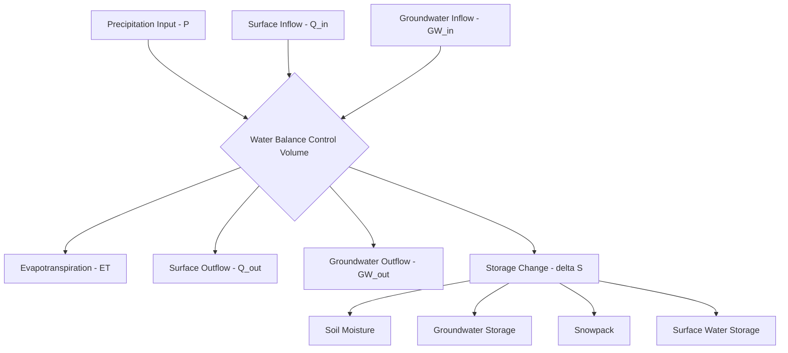

## Water Budget and Balance Modeling


### Overview

Water budget and balance modeling is the quantitative accounting of water inflows, outflows, and storage changes within a defined hydrological system boundary—applicable at scales ranging from a single soil column to a continental river basin. Grounded in the conservation of mass principle, these models provide the fundamental framework for water resource assessment, drought and flood forecasting, irrigation scheduling, reservoir operations, and climate change impact analysis. Water balance modeling ranges from simple empirical bookkeeping approaches to fully coupled, physically based, spatially distributed simulation systems.

### Fundamental Water Balance Equation

The generalized water balance for any control volume over a defined time period is expressed as:

$$\text{Inflow} - \text{Outflow} = \Delta \text{Storage}$$

Applied to a terrestrial hydrological system, this expands to:

$$P + Q_{in} + GW_{in} = ET + Q_{out} + GW_{out} + \Delta S$$

where $P$ is precipitation, $Q_{in}/Q_{out}$ are surface water inflow/outflow, $GW_{in}/GW_{out}$ are groundwater inflow/outflow across the boundary, $ET$ is evapotranspiration, and $\Delta S$ is net storage change (soil moisture, groundwater, snowpack, surface water bodies).

For a closed terrestrial catchment with no external surface or groundwater inflow (a common simplifying assumption for gauged basins with a well-defined outlet), this reduces to the standard catchment water balance:

$$P = ET + Q + \Delta S$$

At sufficiently long time averages (multi-year to decadal), $\Delta S \to 0$ for most catchments not undergoing systematic aquifer depletion or reservoir filling, yielding the simplified long-term balance:

$$\bar{P} \approx \bar{ET} + \bar{Q}$$

### Spatial and Temporal Scales of Application

**Global Scale**: Used in climate science to verify closure of the planetary water cycle, where long-term global precipitation is balanced by global evapotranspiration (since global runoff ultimately returns to oceans, closing the loop with oceanic evaporation).

**Basin/Catchment Scale**: The most common operational scale, applied to gauged or ungauged watersheds for water resource assessment, informing sustainable yield estimates and environmental flow requirements.

**Field/Plot Scale (Soil Water Balance)**: Used in agricultural and irrigation management, tracking root-zone soil moisture to schedule irrigation and estimate crop water stress.

**Reservoir/Lake Scale**: Tracking storage change in a single water body for operational management, flood control, and water supply reliability assessment.

**Temporal Resolution**: Water balances may be computed at daily, monthly, seasonal, or annual timesteps depending on application; shorter timesteps require more detailed process representation (e.g., explicit snowmelt timing, storm-event infiltration dynamics), while longer timesteps allow simpler empirical approaches since higher-frequency variability averages out.



### Soil Moisture Accounting (Bucket Model) Approach

The simplest physically motivated water balance model treats the soil root zone as a "bucket" with finite storage capacity, tracking moisture through a daily or monthly accounting procedure:

$$S_t = S_{t-1} + P_t - ET_t - Q_t - Perc_t$$

where $S_t$ is soil moisture storage at time $t$, constrained between a minimum (wilting point) and maximum (field capacity) storage threshold. When storage would exceed field capacity, the surplus is allocated to runoff and/or deep percolation according to model-specific rules.

**Thornthwaite-Mather Method**

A widely used classical monthly water balance procedure that:

1. Computes potential evapotranspiration (PET) from temperature-based empirical formulas (the original Thornthwaite method)
2. Compares PET against precipitation to determine whether the period is a moisture surplus or deficit month
3. During deficit months, draws down soil moisture storage using an exponential withdrawal function based on accumulated potential water loss (APWL)
4. Computes actual evapotranspiration (AET) as limited by available soil moisture when PET exceeds precipitation
5. Generates surplus (available for runoff/recharge) when storage is at capacity and precipitation exceeds PET

This method remains widely used for its simplicity and modest data requirements (precipitation and temperature only), making it applicable in data-sparse regions, though its temperature-based PET estimation is less physically robust than energy-balance methods such as Penman-Monteith.

### Potential vs. Actual Evapotranspiration

**Potential Evapotranspiration (PET)**: The atmospheric evaporative demand assuming unlimited water availability, a function of net radiation, temperature, humidity, and wind—not actual water loss.

**Actual Evapotranspiration (AET)**: The water actually lost to the atmosphere, constrained by available soil moisture; AET equals PET only when soil moisture is non-limiting (at or near field capacity).

A common empirical relationship linking AET to available soil water is:

$$\frac{AET}{PET} = f(S/S_{max})$$

where the function $f$ is typically linear or curvilinear, approaching 1 near field capacity and declining toward 0 as soil moisture approaches the wilting point—reflecting increasing plant water stress and reduced stomatal conductance under drying conditions.

### Budyko Framework

The Budyko curve provides an elegant empirical/semi-theoretical framework relating the long-term partitioning of precipitation into evapotranspiration versus runoff to the aridity index (the ratio of PET to precipitation):

$$\frac{ET}{P} = f\left(\frac{PET}{P}\right)$$

The most widely used functional form, the Fu equation (also called the Choudhury-Yang or Budyko-Fu equation):

$$\frac{ET}{P} = 1 + \frac{PET}{P} - \left[1 + \left(\frac{PET}{P}\right)^\omega\right]^{1/\omega}$$

where $\omega$ is a catchment-specific parameter (typically ranging roughly 1.5–5) reflecting the influence of vegetation, soil, and topographic characteristics on the actual water-energy partitioning beyond what aridity alone predicts. This framework is widely applied for long-term (multi-year to decadal average) mean annual water balance estimation and for attributing observed runoff changes to climate versus catchment (land use/vegetation) factors.

### Example Calculation: Annual Water Balance with Budyko Partitioning

```python
def budyko_fu(PET, P, omega=2.5):
    """
    Estimate long-term mean annual ET/P ratio using the Budyko-Fu equation.
    PET: potential evapotranspiration (mm/year)
    P: precipitation (mm/year)
    omega: catchment parameter (dimensionless, typically 1.5-5)
    """
    aridity_index = PET / P
    et_p_ratio = 1 + aridity_index - (1 + aridity_index ** omega) ** (1 / omega)
    return et_p_ratio, aridity_index

def water_balance_summary(P, PET, omega=2.5):
    et_p_ratio, aridity_index = budyko_fu(PET, P, omega)
    ET = et_p_ratio * P
    Q = P - ET  # long-term runoff (delta S assumed ~0 at annual/multi-year scale)
    runoff_ratio = Q / P
    return {
        "Aridity Index (PET/P)": round(aridity_index, 3),
        "ET/P ratio": round(et_p_ratio, 3),
        "Estimated ET (mm/yr)": round(ET, 1),
        "Estimated Runoff (mm/yr)": round(Q, 1),
        "Runoff Ratio (Q/P)": round(runoff_ratio, 3)
    }

# Example: humid temperate catchment
humid_basin = water_balance_summary(P=1100, PET=750, omega=2.6)
print("Humid Temperate Catchment:")
for k, v in humid_basin.items():
    print(f"  {k}: {v}")

# Example: semi-arid catchment
arid_basin = water_balance_summary(P=450, PET=1300, omega=2.2)
print("\nSemi-Arid Catchment:")
for k, v in arid_basin.items():
    print(f"  {k}: {v}")
```

**Output**:



```
Humid Temperate Catchment:
  Aridity Index (PET/P): 0.682
  ET/P ratio: 0.643
  Estimated ET (mm/yr): 707.3
  Estimated Runoff (mm/yr): 392.7
  Runoff Ratio (Q/P): 0.357

Semi-Arid Catchment:
  Aridity Index (PET/P): 2.889
  ET/P ratio: 0.925
  Estimated ET (mm/yr): 416.3
  Estimated Runoff (mm/yr): 33.7
  Runoff Ratio (Q/P): 0.075
```

This demonstrates the characteristic Budyko behavior: as aridity increases (PET/P rises), an increasingly large fraction of precipitation is consumed by evapotranspiration, leaving a sharply diminishing runoff ratio—a pattern consistently observed across catchments worldwide and useful for sanity-checking basin water balance estimates against expected climatic behavior.

### Diagram: Budyko Curve Concept (svg_diagram)

<svg xmlns="http://www.w3.org/2000/svg" viewBox="0 0 700 420">
<text x="350" y="28" font-size="18" font-weight="bold" text-anchor="middle" fill="#1a1a1a">Budyko Curve: Water-Energy Limits (svg_diagram)</text>
<line x1="80" y1="360" x2="640" y2="360" stroke="#333" stroke-width="1.5" />
<line x1="80" y1="360" x2="80" y2="60" stroke="#333" stroke-width="1.5" />
<text x="360" y="395" font-size="12" text-anchor="middle" fill="#1a1a1a">Aridity Index (PET/P)</text>
<text x="35" y="210" font-size="12" text-anchor="middle" fill="#1a1a1a" transform="rotate(-90,35,210)">ET/P</text>
<line x1="80" y1="360" x2="360" y2="80" stroke="#059669" stroke-width="2" stroke-dasharray="5,3" />
<text x="200" y="180" font-size="10" fill="#065f46">Energy Limit (ET/P = PET/P)</text>
<line x1="80" y1="80" x2="640" y2="80" stroke="#dc2626" stroke-width="2" stroke-dasharray="5,3" />
<text x="480" y="70" font-size="10" fill="#7f1d1d">Water Limit (ET/P = 1)</text>
<path d="M80,360 Q200,280 320,150 Q450,90 640,82" fill="none" stroke="#1e40af" stroke-width="3" />
<text x="420" y="180" font-size="12" fill="#1e3a8a" font-weight="bold">Budyko Curve</text>
<circle cx="200" cy="260" r="6" fill="#059669" />
<text x="215" y="255" font-size="10" fill="#065f46">Humid Basin</text>
<circle cx="480" cy="100" r="6" fill="#92400e" />
<text x="495" y="95" font-size="10" fill="#78350f">Arid Basin</text>

<text x="90" y="355" font-size="10" fill="#333">0</text>

<text x="620" y="355" font-size="10" fill="#333">High</text>

</svg>

### Snow-Dominated Water Balance

In snow-influenced catchments, the water balance must explicitly separate solid and liquid precipitation phases and account for temporary storage in the snowpack:

$$SWE_t = SWE_{t-1} + P_{snow,t} - M_t - Subl_t$$

where $SWE$ is snow water equivalent, $P_{snow}$ is snowfall input, $M$ is snowmelt, and $Subl$ is sublimation loss. Snowmelt is commonly estimated using either:

**Temperature-index (degree-day) method**:

$$M = DDF \cdot (T_a - T_{base})$$

where $DDF$ is a degree-day factor (mm/°C/day, empirically calibrated), $T_a$ is air temperature, and $T_{base}$ is a threshold melt temperature (typically 0°C).

**Energy balance method**: A physically based approach solving the full surface energy balance (net radiation, sensible/latent heat exchange, and conductive heat flux) to compute melt rate directly, more accurate but substantially more data-intensive than the temperature-index approach.

### Groundwater Storage Change in Regional Water Budgets

At regional to continental scales, groundwater storage change can be a significant and difficult-to-observe water balance component. Modern approaches increasingly leverage:

**GRACE/GRACE-FO Satellite Gravimetry**: Measures total terrestrial water storage change (combining soil moisture, groundwater, snow, and surface water) via detection of minute gravity field anomalies, enabling large-scale water budget closure assessment and groundwater depletion detection in data-sparse regions where ground-based monitoring networks are limited.

**Water Budget Residual Method**: When groundwater storage change cannot be directly measured, it is sometimes estimated as the residual term required to balance an otherwise independently measured water budget, though this approach propagates and accumulates all measurement/estimation errors from the other terms into the groundwater estimate.

### Distributed and Integrated Water Balance Models

Modern operational and research water balance modeling increasingly employs spatially distributed, physically based frameworks that solve coupled surface-subsurface water and energy balance equations at each grid cell:

- **Variable Infiltration Capacity (VIC) model**: A widely used macroscale hydrological model representing spatial heterogeneity in soil infiltration capacity and sub-grid variability, common in continental-scale water resource and climate impact studies.
- **Noah-MP, CLM (Community Land Model)**: Land surface models coupling water and energy balance, often embedded within climate and numerical weather prediction models as the land component.
- **SWAT (Soil and Water Assessment Tool)**: A semi-distributed, process-based model widely used for basin-scale water balance and water quality assessment, operating on hydrologic response units (HRUs).
- **Integrated hydrologic models (e.g., ParFlow, MODFLOW with UZF)**: Fully coupled surface-subsurface flow models resolving the interaction between unsaturated zone, groundwater, and surface water within a unified numerical framework.

### Water Balance Applications

- **Drought monitoring**: Tracking cumulative precipitation deficits relative to PET/ET demand underlies many standardized drought indices (e.g., the Standardized Precipitation Evapotranspiration Index, SPEI, which explicitly incorporates the water balance concept unlike precipitation-only indices).
- **Irrigation scheduling**: Field-scale soil water balance accounting determines irrigation timing and volume to maintain root-zone moisture within a target range, minimizing water waste while avoiding crop stress.
- **Reservoir yield analysis**: Long-term water balance simulation (often using historical or synthetic streamflow sequences) determines the reliable yield a reservoir can supply at an acceptable failure probability.
- **Climate change impact assessment**: Water balance models driven by downscaled climate projections quantify anticipated shifts in runoff, recharge, and water availability under future scenarios.
- **Water rights and allocation accounting**: Legal and administrative water management frameworks often require formal water balance accounting to verify compliance with allocation limits and environmental flow requirements.

### Common Pitfalls and Misconceptions

- **Assuming storage change is always negligible**: While often reasonable at multi-year averages for unmanaged catchments, this assumption fails for systems undergoing groundwater depletion, reservoir filling/draining, or significant land use change altering long-term storage dynamics; ignoring $\Delta S$ inappropriately can produce systematically biased ET or runoff estimates.
- **Confusing potential and actual evapotranspiration**: Using PET directly in a water balance without accounting for soil moisture limitation overestimates actual water loss, particularly during dry periods or in water-limited (as opposed to energy-limited) climates.
- **Treating the water balance residual as error-free "closure"**: When one term (commonly ET or $\Delta S$) is calculated as a residual to force balance closure, that term absorbs all accumulated measurement and modeling errors from the other components, and should not be interpreted as an independently verified quantity.
- **Applying Thornthwaite-type temperature-based PET in climates or seasons where it performs poorly**: Temperature-based PET methods can be less reliable in situations with strong radiation-temperature decoupling (e.g., high-altitude, coastal, or strongly advective environments) compared to energy balance-based methods such as Penman-Monteith.
- **Ignoring spatial heterogeneity in basin-averaged models**: Lumped water balance models can mask important internal variability (e.g., elevation-dependent snow accumulation, land cover mosaics), which may need semi-distributed or fully distributed approaches to adequately represent for management-relevant questions.

**Related Topics**

- The Hydrological Cycle
- Evapotranspiration Estimation Methods (Penman-Monteith, Thornthwaite)
- Drought Indices and Monitoring (SPI, SPEI, PDSI)
- Snowpack Dynamics and Snowmelt Modeling
- Groundwater Hydrology and Aquifer Systems
- Distributed Hydrological Modeling (SWAT, VIC)
- Reservoir Operations and Yield Analysis
- Remote Sensing for Water Balance Closure (GRACE)
- Climate Change Impacts on Water Resources