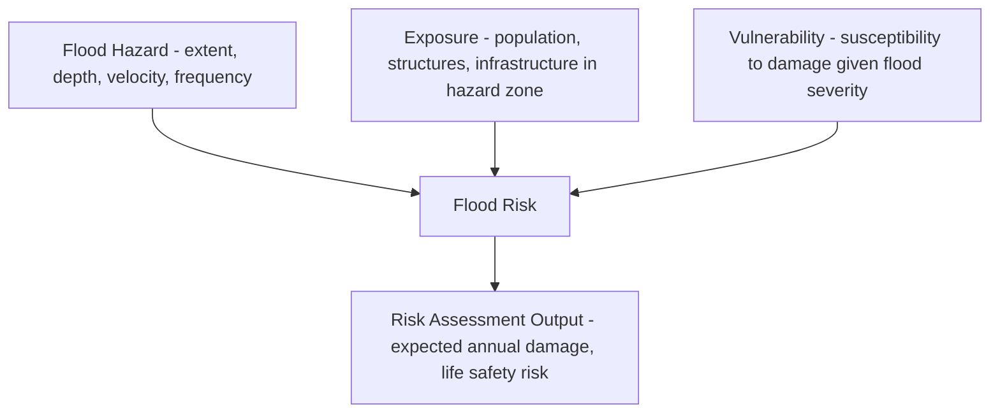
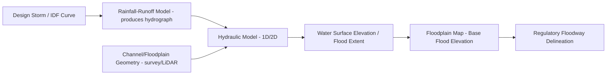

## Floodplain and Flood Risk Analysis


### Overview

Floodplain and flood risk analysis is the multidisciplinary practice of characterizing flood hazard extent, magnitude, and probability, and combining this hazard information with exposure and vulnerability data to quantify risk to people, property, and infrastructure. It integrates hydrologic analysis (how much water), hydraulic modeling (where the water goes and how deep), statistical frequency analysis (how often), and risk/consequence assessment (what is affected), forming the technical basis for floodplain mapping, building codes, insurance rate-setting, and flood mitigation planning.

### Fundamental Concepts

**Floodplain Definition**

The floodplain is the area of land adjacent to a river, stream, or coastline that is subject to inundation during flood events, encompassing both the geomorphically active **floodway** (the channel and adjacent area required to convey flood discharge without significantly increasing flood elevations) and the **flood fringe** (the outer floodplain area where water is shallower and slower-moving, contributing primarily to flood storage rather than conveyance).

**Flood Hazard vs. Flood Risk**

- **Flood hazard**: The physical characteristics of potential flooding (extent, depth, velocity, duration, frequency) independent of what is exposed to it.
- **Flood exposure**: The people, structures, and assets located within the hazard zone.
- **Flood vulnerability**: The susceptibility of exposed elements to damage or loss given a flood of a certain severity (e.g., a building's first-floor elevation, construction type, and contents determine its vulnerability to a given flood depth).
- **Flood risk**: The combination of hazard, exposure, and vulnerability, often conceptually expressed as:

$$\text{Risk} = \text{Hazard} \times \text{Exposure} \times \text{Vulnerability}$$

This framework clarifies that risk can be reduced by addressing any of the three components—not only through hazard reduction (e.g., levees, detention) but also through exposure reduction (land use zoning, relocation) or vulnerability reduction (elevated construction, floodproofing).



### Flood Frequency Analysis

**Annual Maximum Series and Return Period**

Flood frequency analysis statistically characterizes the relationship between flood magnitude and exceedance probability, typically using an annual maximum series (the single largest flood discharge recorded each year) fitted to a probability distribution. The **return period** ($T$) relates to the annual exceedance probability ($AEP$):

$$T = \frac{1}{AEP}$$

A flood with a 1% annual exceedance probability corresponds to a 100-year return period ($Q_{100}$)—commonly (and often misleadingly to the public) termed the "100-year flood," which does not mean such a flood occurs exactly once every 100 years, but rather that it has a 1% probability of being equaled or exceeded in any given year.

**Probability of Occurrence Over a Design Life**

The probability that a flood of a given return period is equaled or exceeded at least once over $n$ years:

$$P(\geq 1 \text{ occurrence}) = 1 - \left(1 - \frac{1}{T}\right)^n$$

For example, a structure with a 30-year design life located in a 100-year floodplain has approximately a 26% chance of experiencing at least one flood exceeding that magnitude during its lifetime—a calculation frequently used to communicate flood risk to property owners in terms more intuitive than annual probability alone.

**Statistical Distributions**

- **Log-Pearson Type III**: The distribution recommended as the standard method in the United States (per USGS Bulletin 17C guidelines), fitting the logarithms of annual peak flows to a Pearson Type III distribution characterized by mean, standard deviation, and skew of the log-transformed data.
- **Generalized Extreme Value (GEV)**: Widely used internationally, grounded in extreme value theory, encompassing three sub-types (Gumbel, Fréchet, Weibull) depending on the shape parameter.
- **Gumbel (Extreme Value Type I)**: A simpler two-parameter distribution, historically common though generally superseded by GEV or Log-Pearson III in current practice for its more limited flexibility in tail behavior.

**Regional Flood Frequency Analysis**

For ungauged basins lacking sufficient streamflow records, regional regression equations relate flood quantiles to basin physical characteristics (drainage area, slope, precipitation) derived from statistical analysis of gauged basins within a hydrologically similar region, or use index-flood methods that transfer a standardized frequency curve shape from gauged to ungauged sites.

### Example Calculation: Flood Frequency and Design-Life Risk

```python
import numpy as np
from scipy import stats

def log_pearson3_quantile(annual_peaks, return_period):
    """
    Estimate flood quantile using Log-Pearson Type III fitting.
    annual_peaks: array of annual maximum discharge values
    return_period: desired return period in years
    """
    log_q = np.log10(annual_peaks)
    mean_log = np.mean(log_q)
    std_log = np.std(log_q, ddof=1)
    skew = stats.skew(log_q)
    
    # Frequency factor K from Pearson Type III (approximation via Wilson-Hilferty)
    p_exceed = 1 / return_period
    z = stats.norm.ppf(1 - p_exceed)
    K = z + (z**2 - 1) * (skew / 6) + (1/3) * (z**3 - 6*z) * (skew/6)**2 \
        - (z**2 - 1) * (skew/6)**3 + z * (skew/6)**4 + (1/3) * (skew/6)**5
    
    log_Q = mean_log + K * std_log
    return 10 ** log_Q

def design_life_risk(return_period, design_life_years):
    """Probability of at least one exceedance during the design life."""
    return 1 - (1 - 1/return_period) ** design_life_years

# Example: 25 years of annual peak discharge records (illustrative, m^3/s)
annual_peaks = np.array([210, 340, 180, 520, 290, 410, 260, 610, 195, 370,
                          450, 230, 380, 290, 700, 310, 250, 440, 320, 390,
                          280, 510, 200, 460, 330])

for T in [10, 25, 50, 100, 500]:
    Q_T = log_pearson3_quantile(annual_peaks, T)
    print(f"Q{T}: {Q_T:.1f} m^3/s")

print()
design_life = 30
for T in [50, 100, 500]:
    risk = design_life_risk(T, design_life)
    print(f"Probability of exceeding Q{T} at least once in {design_life} years: {risk*100:.1f}%")
```

**Output** (representative; exact values depend on the input series and Wilson-Hilferty approximation used):



```
Q10: 486.3 m^3/s
Q25: 583.7 m^3/s
Q50: 649.2 m^3/s
Q100: 710.8 m^3/s
Q500: 843.1 m^3/s

Probability of exceeding Q50 at least once in 30 years: 45.2%
Probability of exceeding Q100 at least once in 30 years: 26.0%
Probability of exceeding Q500 at least once in 30 years: 5.8%
```

This demonstrates how return period translates to markedly different cumulative exposure probabilities over a typical structure lifetime—a key communication tool for illustrating that even "low probability" events (in any single year) carry non-trivial cumulative risk over multi-decade planning horizons.

### Hydraulic Modeling for Floodplain Mapping

**One-Dimensional (1D) Modeling**

Represents the river channel and floodplain as a series of cross-sections, solving the energy or momentum equation between sections (standard step backwater method) to compute water surface profiles for a given discharge. Widely implemented in software such as HEC-RAS (Hydrologic Engineering Center's River Analysis System), the dominant tool historically used for regulatory floodplain mapping. 1D models are computationally efficient and well-suited to relatively simple, channel-confined flow but cannot represent complex two-dimensional flow patterns (e.g., flow splits, backwater from tributary confluences, urban flow around buildings).

**Two-Dimensional (2D) Modeling**

Solves the depth-averaged shallow water equations (a simplified form of the Navier-Stokes equations appropriate for flows where horizontal length scales greatly exceed depth) across a full 2D mesh or grid, capturing complex flow patterns including floodplain flow splits, backwater effects, and urban flooding around structures. Increasingly the standard approach for complex floodplains, supported by tools such as HEC-RAS 2D, TUFLOW, and MIKE 21, though at substantially greater computational cost than 1D approaches.

**Governing Shallow Water Equations (simplified 2D form)**:

$$\frac{\partial h}{\partial t} + \frac{\partial(hu)}{\partial x} + \frac{\partial(hv)}{\partial y} = 0$$

(continuity, depth-averaged), coupled with momentum equations incorporating gravity, bed friction (typically via Manning's equation), and advective terms.

**Design Storm Selection**

Hydraulic models require an inflow hydrograph, typically derived by applying a design storm (a synthetic rainfall event of specified return period and duration, e.g., NRCS design storms or locally derived intensity-duration-frequency, IDF, curves) through a rainfall-runoff model, or by directly using a statistically derived design flood hydrograph.



### Regulatory Floodplain Concepts

**Base Flood Elevation (BFE)**

The computed water surface elevation associated with the base flood (typically the 1% annual exceedance probability / 100-year flood in United States regulatory practice), used as the reference elevation for setting minimum floor elevation requirements in flood-prone construction.

**Special Flood Hazard Area (SFHA)**

The area subject to inundation by the base flood, mapped on official flood insurance rate maps (FIRMs in the U.S. context) and typically subdivided into flood zones reflecting different hazard characteristics (e.g., Zone A for approximate riverine studies, Zone AE for detailed studies with computed BFEs, Zone V for coastal high-velocity wave-action zones).

**Regulatory Floodway**

The channel and adjacent floodplain area reserved to convey the base flood discharge without cumulatively increasing the base flood elevation beyond a specified threshold (commonly one foot in U.S. practice), typically subject to the most restrictive development regulations since floodway obstruction directly increases flood elevations both locally and upstream.

**Freeboard**

An additional safety margin (vertical distance) added above the computed base flood elevation when setting minimum construction elevations, compensating for uncertainty in flood elevation estimates, wave action, debris, and future watershed changes.

### Diagram: Floodplain Cross-Section with Regulatory Zones (svg_diagram)

<svg xmlns="http://www.w3.org/2000/svg" viewBox="0 0 760 400">
<text x="380" y="28" font-size="18" font-weight="bold" text-anchor="middle" fill="#1a1a1a">Floodplain Cross-Section with Regulatory Zones (svg_diagram)</text>

<path d="M40,320 L120,280 L200,260 L280,255 L480,255 L560,260 L640,280 L720,320 L720,340 L40,340 Z" fill="`#d2b48c`" stroke="`#8b5e3c`" stroke-width="1.5" />

<rect x="280" y="200" width="200" height="55" fill="#60a5fa" stroke="#1e40af" stroke-width="1.5" />
<text x="380" y="232" font-size="11" text-anchor="middle" fill="#1e3a8a" font-weight="bold">Channel</text>
<line x1="200" y1="180" x2="200" y2="260" stroke="#1e3a8a" stroke-width="1" stroke-dasharray="4,3" />
<line x1="560" y1="180" x2="560" y2="260" stroke="#1e3a8a" stroke-width="1" stroke-dasharray="4,3" />
<line x1="200" y1="180" x2="560" y2="180" stroke="#dc2626" stroke-width="2" />
<text x="380" y="170" font-size="12" text-anchor="middle" fill="#7f1d1d" font-weight="bold">Base Flood Elevation (BFE) - 1% Annual Chance</text>
<rect x="150" y="180" width="460" height="80" fill="#93c5fd" opacity="0.35" />
<text x="380" y="200" font-size="11" text-anchor="middle" fill="#1e3a8a">Floodway (conveyance zone - most restrictive)</text>
<rect x="80" y="180" width="70" height="80" fill="#bfdbfe" opacity="0.3" />
<rect x="610" y="180" width="70" height="80" fill="#bfdbfe" opacity="0.3" />
<text x="115" y="220" font-size="9" text-anchor="middle" fill="#1e3a8a">Flood Fringe</text>
<text x="645" y="220" font-size="9" text-anchor="middle" fill="#1e3a8a">Flood Fringe</text>
<line x1="40" y1="150" x2="720" y2="150" stroke="#059669" stroke-width="1.5" stroke-dasharray="6,3" />
<text x="400" y="142" font-size="11" fill="#065f46">BFE + Freeboard (regulatory min. construction elevation)</text>
<line x1="120" y1="280" x2="120" y2="150" stroke="#333" stroke-width="1" stroke-dasharray="2,2" />
<text x="70" y="295" font-size="10" fill="#333">SFHA boundary</text>
</svg>

### Climate Change and Non-Stationarity in Flood Frequency

Traditional flood frequency analysis assumes **stationarity**—that the statistical properties (mean, variance) of the flood record are constant over time. This assumption is increasingly challenged by observed and projected changes in precipitation intensity, land use, and channel conditions. [Inference] Given that a warmer atmosphere holds more moisture and many regions are projected to experience more intense extreme precipitation events, historical flood frequency estimates derived purely from past gauge records are generally understood to risk underestimating future flood hazard in a non-stationary climate, though the magnitude and even direction of change varies significantly by region and is an active area of hydroclimatic research. Approaches to address non-stationarity include time-varying frequency analysis (allowing distribution parameters to trend over time), incorporation of climate model-derived precipitation projections into design storm updates, and regionalization/pooling approaches that borrow strength across multiple sites.

### Flood Damage and Risk Quantification

**Depth-Damage Functions**

Empirically or synthetically derived curves relating flood inundation depth at a structure to expected percentage or dollar damage, differentiated by structure type (residential, commercial), construction characteristics (foundation type, number of stories), and sometimes by flood velocity and duration in more advanced formulations.

**Expected Annual Damage (EAD)**

A standard risk metric integrating damage across the full range of flood probabilities rather than relying on a single design event:

$$EAD = \int_0^1 D(p) \, dp$$

where $D(p)$ is the damage associated with a flood of annual exceedance probability $p$, typically computed numerically by evaluating damage at several return periods and integrating (e.g., via trapezoidal approximation) across the probability-damage curve.

**Cost-Benefit Analysis for Mitigation**

Flood mitigation investment decisions (levees, buyouts, detention basins, floodproofing) are commonly evaluated by comparing capital and maintenance costs against the reduction in expected annual damage achieved, often expressed as a benefit-cost ratio, forming the basis for many public flood risk management funding decisions (e.g., FEMA's Benefit-Cost Analysis requirements for federally funded U.S. mitigation projects).

### Non-Structural and Structural Mitigation Approaches

**Structural Measures**: Levees and floodwalls, detention/retention basins, channel modifications, diversion structures—directly reduce hazard (flood extent/depth/velocity) but can create residual risk (levee overtopping/failure) and may transfer flood risk downstream or across the channel.

**Non-Structural Measures**: Floodplain zoning and land use restriction, building elevation and floodproofing requirements, early warning and evacuation systems, flood insurance programs, and voluntary buyout/relocation of repetitively flooded properties—address exposure and vulnerability rather than hazard directly, and are increasingly emphasized in modern floodplain management given the residual risk and long-term maintenance burden associated with purely structural approaches.

**Nature-Based/Green Infrastructure Approaches**: Floodplain reconnection and restoration, wetland preservation, and upstream detention through natural or constructed green infrastructure, providing flood storage and attenuation benefits alongside ecological co-benefits, increasingly incorporated into integrated flood risk management strategies.

### Common Pitfalls and Misconceptions

- **Misinterpreting "100-year flood" as a fixed 100-year interval**: As demonstrated by the design-life probability calculation above, a 1% annual probability event can occur multiple times within a short period or not at all within a much longer period; the terminology refers to probability, not a scheduling interval.
- **Treating floodplain maps as static and permanently accurate**: Flood maps reflect the hydrologic, hydraulic, and land use conditions at the time of study; subsequent watershed development, channel changes, or updated climate/precipitation data can render existing maps outdated, and floodplain boundaries should be periodically reassessed.
- **Assuming areas outside the mapped 1% floodplain are flood-free**: Mapped floodplains typically represent a specific statistical event; areas outside this boundary remain subject to lower-probability but potentially still damaging floods (e.g., the 0.2% annual chance/500-year floodplain), and mapping itself carries inherent model and data uncertainty.
- **Relying solely on structural mitigation without addressing residual risk**: Levees and floodwalls provide protection up to a design standard but create a false sense of complete safety; failure or overtopping beyond the design event can produce catastrophic consequences precisely because development has concentrated in the "protected" area (the so-called "levee effect").
- **Ignoring non-stationarity in long-term planning**: Design standards based purely on historical statistical analysis may not adequately represent future risk under a changing climate and evolving land use, particularly for critical infrastructure with long design lives.

**Related Topics**

- Watershed and Drainage Basin Analysis
- Surface Water Systems and River Hydraulics
- Hydraulic Modeling (HEC-RAS, 2D Shallow Water Models)
- Climate Change Impacts on Extreme Precipitation
- Coastal Flooding and Storm Surge Modeling
- Flood Insurance and Risk Transfer Mechanisms
- Nature-Based Flood Mitigation and Floodplain Restoration
- Urban Stormwater Management
- Emergency Management and Flood Early Warning Systems