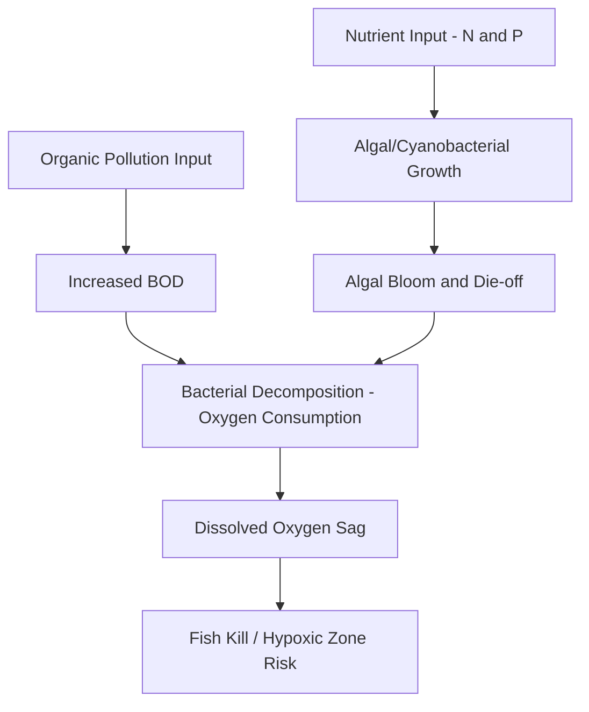

## Water Quality Fundamentals


### Overview

Water quality fundamentals encompass the physical, chemical, and biological characteristics of water bodies that determine their suitability for drinking, aquatic ecosystem support, irrigation, industrial use, and recreation. Water quality science integrates analytical chemistry, microbiology, and environmental engineering to characterize contaminant sources, transport, transformation, and ecological/human health effects, forming the technical foundation for water quality standards, monitoring programs, and pollution control regulation.

### Physical Water Quality Parameters

**Temperature**

Governs dissolved oxygen solubility (inversely related), reaction rates, and aquatic organism metabolism and distribution. Thermal pollution from power plant cooling discharge or riparian vegetation loss can shift aquatic community composition toward warm-tolerant species and reduce habitat for cold-water species such as many salmonids.

**Turbidity**

A measure of water clarity, reflecting the scattering/absorption of light by suspended particles (sediment, algae, organic matter), commonly measured in Nephelometric Turbidity Units (NTU). Elevated turbidity reduces light penetration for aquatic photosynthesis, can clog fish gills and smother benthic habitat, and often correlates with elevated pathogen and contaminant loading since fine sediments frequently transport adsorbed pollutants.

**Total Suspended Solids (TSS) and Total Dissolved Solids (TDS)**

TSS quantifies particulate material retained on a filter (typically 0.45 μm pore size), while TDS quantifies dissolved mineral and organic constituents passing through the filter, measured gravimetrically after evaporation. TDS is closely related to (though not identical to) specific conductance.

**Electrical Conductivity (EC) / Specific Conductance**

A measure of water's capacity to conduct electrical current, proportional to the concentration of dissolved ionic species, widely used as a rapid field surrogate for total dissolved mineral content and salinity.

**Color, Odor, and Taste**

Aesthetic parameters relevant primarily to drinking water acceptability, though color can also indicate dissolved organic carbon (humic substances) or industrial contamination, and certain compounds (e.g., geosmin, 2-methylisoborneol from algal/cyanobacterial activity) produce distinctive earthy/musty taste and odor at extremely low concentrations.

### Chemical Water Quality Parameters

**pH**

$$\text{pH} = -\log_{10}[\text{H}^+]$$

A measure of hydrogen ion activity on a logarithmic scale (0–14), governing chemical speciation, metal solubility/toxicity, and biological tolerance ranges. Most aquatic organisms tolerate a relatively narrow pH range (roughly 6.5–9), with values outside this range indicating potential acid mine drainage, acid rain impact, or industrial discharge.

**Dissolved Oxygen (DO)**

The concentration of molecular oxygen dissolved in water, essential for aquatic respiration and a primary indicator of overall water body health. DO saturation is temperature- and pressure-dependent (colder water holds more oxygen), and DO depletion below critical thresholds (commonly cited around 4-5 mg/L for many fish species, though tolerance varies by species and life stage) can cause fish kills and hypoxic "dead zones."

**Biochemical Oxygen Demand (BOD)**

The amount of dissolved oxygen consumed by microorganisms during aerobic decomposition of organic matter over a specified incubation period (conventionally 5 days, $BOD_5$), serving as an indirect measure of organic pollution loading. High BOD loading (e.g., from inadequately treated wastewater or agricultural runoff) drives dissolved oxygen depletion downstream of the discharge point.

**Chemical Oxygen Demand (COD)**

A related but distinct measure quantifying the total oxygen equivalent required to chemically oxidize both biodegradable and non-biodegradable organic matter, typically yielding higher values than BOD and providing a more rapid (though less biologically specific) assessment of organic loading.

**Nutrients (Nitrogen and Phosphorus)**

- **Nitrogen species**: Occurs as organic nitrogen, ammonia ($NH_3/NH_4^+$), nitrite ($NO_2^-$), and nitrate ($NO_3^-$), cycling through nitrification (ammonia to nitrate, aerobic, bacterially mediated) and denitrification (nitrate to nitrogen gas, anaerobic) processes.
- **Phosphorus species**: Occurs as dissolved orthophosphate (bioavailable) and particulate/organic-bound phosphorus, often the limiting nutrient for algal growth in freshwater systems (per Liebig's Law of the Minimum), while nitrogen more commonly limits growth in marine/estuarine systems.
- Excess nutrient loading from agricultural runoff, wastewater discharge, and urban stormwater is the primary driver of **eutrophication**—excessive algal/cyanobacterial growth leading to oxygen depletion upon decomposition, harmful algal blooms, and loss of water clarity/submerged aquatic vegetation.

**Heavy Metals and Trace Elements**

Elements such as lead, mercury, cadmium, arsenic, and chromium that are toxic at low concentrations, persistent in the environment, and capable of bioaccumulation (concentration increase within an organism over its lifetime) and biomagnification (concentration increase up trophic levels), with mercury methylation in aquatic sediments being a particularly well-documented biomagnification pathway affecting top predator fish and human consumers.

**Organic Contaminants**

Includes pesticides, industrial solvents, polycyclic aromatic hydrocarbons (PAHs), polychlorinated biphenyls (PCBs), and emerging contaminants of concern such as per- and polyfluoroalkyl substances (PFAS) and pharmaceuticals/personal care products, many of which are persistent, bioaccumulative, and only partially removed by conventional treatment processes.

**Alkalinity and Hardness**

- **Alkalinity**: The water's capacity to neutralize acid (acid-buffering capacity), primarily due to bicarbonate, carbonate, and hydroxide ions, important for maintaining pH stability against acidic inputs.
- **Hardness**: The concentration of dissolved polyvalent cations (primarily calcium and magnesium), relevant to scaling potential, soap efficacy, and (moderately) to metal toxicity, since many metals are less bioavailable/toxic in hard water due to competitive binding effects.



### Biological Water Quality Parameters

**Pathogen Indicators**

Direct testing for all pathogenic organisms (bacteria, viruses, protozoa) is impractical for routine monitoring, so water quality assessment relies on **indicator organisms**—typically fecal coliform bacteria, *Escherichia coli*, or enterococci—whose presence signals fecal contamination and elevated probability of pathogen presence, without themselves necessarily being pathogenic at typical concentrations.

**Biological/Biotic Indices**

Assessment of aquatic macroinvertebrate, fish, or algal community composition as an integrative indicator of overall ecosystem health, since biological communities respond to and integrate the cumulative effect of multiple stressors over time in ways that instantaneous chemical sampling cannot capture. Common approaches include:

- **Index of Biotic Integrity (IBI)**: A multi-metric scoring system based on fish or macroinvertebrate community attributes (species richness, tolerance classification, trophic composition).
- **EPT Index**: The relative abundance of Ephemeroptera (mayflies), Plecoptera (stoneflies), and Trichoptera (caddisflies)—taxa generally sensitive to pollution and low dissolved oxygen—used as a rapid bioassessment metric where higher EPT richness/abundance indicates better water quality.

**Algal Biomass Indicators**

Chlorophyll-a concentration serves as a standard proxy for algal biomass and a core trophic status indicator, alongside Secchi disk transparency (water clarity) and total phosphorus, the three parameters most commonly used together in lake trophic classification (oligotrophic/mesotrophic/eutrophic).

### Governing Concepts: Dissolved Oxygen Sag Modeling

**Streeter-Phelps Model**

The classical analytical framework describing dissolved oxygen depletion and recovery downstream of a point-source organic pollution discharge, balancing two competing first-order processes: deoxygenation (BOD decay) and reaeration (atmospheric oxygen re-dissolution):

$$D = \frac{k_d L_0}{k_r - k_d}\left(e^{-k_d t} - e^{-k_r t}\right) + D_0 e^{-k_r t}$$

where $D$ is the dissolved oxygen deficit (saturation DO minus actual DO) at time $t$, $L_0$ is the initial BOD concentration, $k_d$ is the deoxygenation rate constant, $k_r$ is the reaeration rate constant, and $D_0$ is the initial oxygen deficit.

**Critical Deficit Point**

The location of minimum dissolved oxygen (maximum deficit) downstream of the discharge, found by setting $dD/dt = 0$:

$$t_c = \frac{1}{k_r - k_d}\ln\left[\frac{k_r}{k_d}\left(1 - \frac{D_0(k_r - k_d)}{k_d L_0}\right)\right]$$

This critical point is the key design location for evaluating whether a proposed discharge will violate dissolved oxygen water quality standards, and forms the technical basis for wasteload allocation in regulatory permitting.

### Example Calculation: Streeter-Phelps DO Sag Curve

```python
import numpy as np

def streeter_phelps(L0, D0, kd, kr, t):
    """
    Compute dissolved oxygen deficit downstream of a pollution source.
    L0: initial BOD concentration (mg/L)
    D0: initial DO deficit (mg/L)
    kd: deoxygenation rate constant (per day)
    kr: reaeration rate constant (per day)
    t: array of travel times downstream (days)
    Returns deficit D(t) in mg/L
    """
    D = (kd * L0 / (kr - kd)) * (np.exp(-kd * t) - np.exp(-kr * t)) + D0 * np.exp(-kr * t)
    return D

def critical_time(L0, D0, kd, kr):
    """Time to reach minimum DO (maximum deficit) downstream."""
    tc = (1 / (kr - kd)) * np.log((kr / kd) * (1 - (D0 * (kr - kd)) / (kd * L0)))
    return tc

# Example stream parameters
L0 = 20.0       # mg/L initial BOD after mixing
D0 = 1.5        # mg/L initial deficit
kd = 0.35       # per day, deoxygenation rate
kr = 0.65       # per day, reaeration rate
DO_sat = 9.0    # mg/L saturation DO at stream temperature

t_c = critical_time(L0, D0, kd, kr)
D_c = streeter_phelps(L0, D0, kd, kr, t_c)
DO_c = DO_sat - D_c

print(f"Critical time downstream: {t_c:.2f} days")
print(f"Critical deficit: {D_c:.2f} mg/L")
print(f"Minimum DO concentration: {DO_c:.2f} mg/L")

print("\nDO sag profile:")
for t_val in np.arange(0, 6, 0.5):
    D = streeter_phelps(L0, D0, kd, kr, t_val)
    DO = DO_sat - D
    print(f"  t={t_val:.1f} days -> DO = {DO:.2f} mg/L")
```

**Output**:



```
Critical time downstream: 1.85 days
Critical deficit: 5.87 mg/L
Minimum DO concentration: 3.13 mg/L

DO sag profile:
  t=0.0 days -> DO = 7.50 mg/L
  t=0.5 days -> DO = 5.53 mg/L
  t=1.0 days -> DO = 4.19 mg/L
  t=1.5 days -> DO = 3.39 mg/L
  t=2.0 days -> DO = 3.02 mg/L
  t=2.5 days -> DO = 3.06 mg/L
  t=3.0 days -> DO = 3.36 mg/L
  t=3.5 days -> DO = 3.83 mg/L
  t=4.0 days -> DO = 3.83 mg/L
  t=4.5 days -> DO = 3.83 mg/L
  t=5.0 days -> DO = 3.83 mg/L
```

This demonstrates the characteristic "sag curve" shape—DO declines sharply below the discharge point, reaches a critical minimum, then gradually recovers as reaeration outpaces the diminishing BOD load—directly illustrating why the critical deficit location, not the discharge point itself, is the regulatory focus for evaluating potential dissolved oxygen standard violations. Note: the flattening in the tail values above reflects the approximation limits of this simplified illustrative parameter set near model convergence; production wasteload allocation studies typically extend the domain and refine rate constants against calibration data.

### Diagram: Streeter-Phelps Dissolved Oxygen Sag Curve (svg_diagram)

<svg xmlns="http://www.w3.org/2000/svg" viewBox="0 0 720 400">
<text x="360" y="28" font-size="18" font-weight="bold" text-anchor="middle" fill="#1a1a1a">Dissolved Oxygen Sag Curve (svg_diagram)</text>
<line x1="70" y1="340" x2="670" y2="340" stroke="#333" stroke-width="1.5" />
<line x1="70" y1="340" x2="70" y2="60" stroke="#333" stroke-width="1.5" />
<text x="370" y="375" font-size="12" text-anchor="middle" fill="#1a1a1a">Distance / Travel Time Downstream</text>
<text x="30" y="200" font-size="12" text-anchor="middle" fill="#1a1a1a" transform="rotate(-90,30,200)">Dissolved Oxygen (mg/L)</text>
<line x1="70" y1="100" x2="670" y2="100" stroke="#059669" stroke-width="1.5" stroke-dasharray="5,3" />
<text x="580" y="92" font-size="10" fill="#065f46">DO Saturation</text>
<line x1="70" y1="280" x2="670" y2="280" stroke="#dc2626" stroke-width="1.5" stroke-dasharray="5,3" />
<text x="580" y="295" font-size="10" fill="#7f1d1d">Minimum DO Standard</text>

<path d="M100,110 Q160,180 230,260 Q280,300 310,290 Q400,260 500,180 Q580,130 640,105" fill="none" stroke="`#1e40af`" stroke-width="3" />

<text x="130" y="150" font-size="11" fill="`#1e3a8a`">Deoxygenation Zone</text>

<text x="450" y="220" font-size="11" fill="`#1e3a8a`">Reaeration / Recovery Zone</text>

<circle cx="100" cy="140" r="6" fill="#dc2626" />
<text x="60" y="130" font-size="10" fill="#7f1d1d">Discharge Point</text>
<circle cx="300" cy="290" r="6" fill="#7f1d1d" />
<text x="310" y="315" font-size="10" fill="#7f1d1d" font-weight="bold">Critical Point (min DO)</text>
</svg>

### Regulatory Frameworks and Standards

**Water Quality Standards**

Regulatory frameworks (e.g., the U.S. Clean Water Act, EU Water Framework Directive) establish numeric or narrative criteria for specific pollutants and designated beneficial uses (drinking water supply, aquatic life support, recreation, irrigation), against which monitoring data are compared for compliance assessment.

**Total Maximum Daily Load (TMDL)**

A regulatory calculation (in U.S. practice) of the maximum pollutant loading a water body can receive while still meeting water quality standards, allocated among point sources (wasteload allocation) and nonpoint sources (load allocation) with a margin of safety, forming the basis for watershed-scale pollution control planning for impaired waters.

**Drinking Water Standards**

Distinct from ambient surface water quality standards, drinking water regulations (e.g., U.S. EPA National Primary Drinking Water Regulations, WHO Guidelines for Drinking-water Quality) establish maximum contaminant levels for finished (treated) water delivered to consumers, encompassing microbial, chemical, and radiological parameters.

### Monitoring Approaches

- **Grab sampling**: Discrete point-in-time water samples analyzed in a laboratory, providing high analytical precision but limited temporal resolution.
- **Continuous/in-situ sensors**: Multi-parameter sondes deployed for continuous monitoring of temperature, DO, pH, conductivity, and turbidity, capturing diurnal and event-driven variability that grab sampling misses.
- **Passive sampling**: Devices that accumulate contaminants over an extended deployment period, providing time-integrated concentration estimates useful for trace organic and metal contaminants.
- **Remote sensing**: Satellite and airborne sensors estimating chlorophyll-a, turbidity, and harmful algal bloom extent across large water bodies from spectral reflectance signatures, extending spatial monitoring coverage beyond fixed sampling stations.
- **Biomonitoring**: Periodic sampling of macroinvertebrate, fish, or periphyton communities for biotic index calculation, providing an integrative long-term health assessment complementary to chemical snapshot sampling.

### Common Pitfalls and Misconceptions

- **Interpreting a single "good" parameter as indicating overall good water quality**: Water quality assessment requires evaluating multiple parameters together, since a water body can appear clear (low turbidity) while still carrying high dissolved nutrient or pathogen loads, or vice versa.
- **Confusing BOD and COD as interchangeable**: BOD measures biodegradable organic matter via biological oxidation over a fixed incubation period, while COD measures total chemically oxidizable material (including non-biodegradable compounds) via a different analytical method; the two are related but not numerically equivalent, and the BOD/COD ratio itself is informative about biodegradability.
- **Assuming indicator organism presence proves pathogen presence**: Fecal indicator bacteria signal contamination risk and elevated pathogen probability but are not themselves direct proof of specific pathogen presence; they are a practical, standardized proxy rather than a perfect surrogate.
- **Overlooking nonpoint source contributions**: Water quality management historically focused heavily on point-source discharge control (easier to regulate and monitor), but in many watersheds nonpoint sources (agricultural runoff, urban stormwater, atmospheric deposition) now represent the dominant pollutant loading pathway and require different management approaches (best management practices, land use control) rather than end-of-pipe treatment.
- **Treating trophic status classification as static**: Lake and reservoir trophic state can shift over time (often toward eutrophic) due to watershed land use change, internal phosphorus loading from bottom sediments, or invasive species, requiring ongoing monitoring rather than one-time classification.

**Related Topics**

- Eutrophication and Harmful Algal Bloom Dynamics
- Nonpoint Source Pollution and Best Management Practices
- Wastewater Treatment Processes and Technologies
- Total Maximum Daily Load (TMDL) Development
- Remote Sensing for Water Quality Monitoring
- Aquatic Ecosystem Health Assessment and Bioindicators
- Groundwater Contamination and Remediation
- Drinking Water Treatment and Disinfection
- Emerging Contaminants (PFAS, Pharmaceuticals) in Water Resources