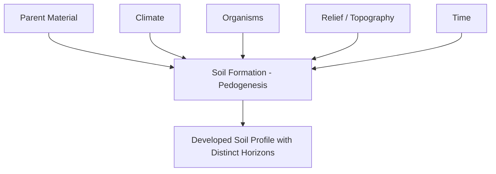
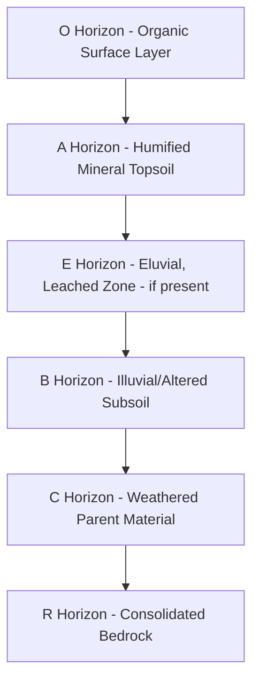

## Soil Formation and Classification


### Overview

Soil formation (pedogenesis) is the process by which unconsolidated mineral and organic material at the Earth's surface transforms into structured, biologically active soil through the combined action of physical, chemical, and biological weathering over time. Soil classification systematizes the resulting diversity of soil bodies into hierarchical taxonomic frameworks based on measurable, diagnostic properties, enabling consistent communication, mapping, and land-use interpretation across disciplines including agriculture, engineering, hydrology, and ecology.

### The Five Soil-Forming Factors

Pedogenesis is classically conceptualized through the **CLORPT** framework (Jenny, 1941), expressing soil properties as a function of five independent state factors:

$$S = f(cl, o, r, p, t)$$

where $S$ is soil, and the factors are:

**Climate (cl)**

Precipitation and temperature regimes control weathering intensity, leaching rate, organic matter decomposition/accumulation balance, and biological activity. Warm, humid climates drive rapid chemical weathering and leaching (producing deeply weathered, often nutrient-poor tropical soils), while cold or arid climates slow weathering and favor accumulation of less-weathered material or salts.

**Organisms (o)**

Vegetation, soil fauna, and microorganisms influence organic matter input and cycling, structure development, nutrient cycling, and horizon differentiation. Forest vegetation typically produces surface organic (O) horizon accumulation and acidifying leaf litter effects, while grassland vegetation, through extensive fine root systems, builds deep, organic-rich mineral topsoil (a defining feature of Mollisols).

**Relief/Topography (r)**

Slope, aspect, and landscape position govern drainage, erosion/deposition balance, and microclimate. Upper slope (shoulder) positions tend toward erosion and thinner soils; lower slope and depression (footslope, toeslope) positions tend toward deposition, greater soil depth, and often poorer drainage; aspect affects solar exposure and associated temperature/moisture regimes, particularly significant in mid-to-high latitude mountainous terrain.

**Parent Material (p)**

The initial geological or organic material from which soil develops—residual bedrock weathering products, or transported material (alluvium, colluvium, glacial till, loess, volcanic ash)—strongly influences initial mineralogy, texture, and chemical composition, with effects that can persist or diminish depending on formation duration and intensity of other factors.

**Time (t)**

The duration over which the other four factors have acted, governing the degree of horizon development and weathering advancement. Soil development is generally non-linear, with rapid initial change followed by progressively slower transformation as a soil approaches a quasi-equilibrium state with its environment (though this equilibrium is itself dynamic and shifts with any change in the other four factors).



### Pedogenic Processes

Soil formation proceeds through several fundamental process categories acting simultaneously and cumulatively:

**Additions**: Organic matter input (litterfall, root turnover), atmospheric deposition (dust, aerosols, precipitation-borne solutes), and colluvial/alluvial material addition.

**Losses**: Erosion (surface material removal), leaching (dissolved constituent removal in percolating water), and gaseous losses (denitrification, decomposition byproducts).

**Translocations**: Movement of material within the soil profile without leaving the system, including:

- **Eluviation/illuviation**: Removal of fine particles or dissolved/suspended material from an upper horizon (eluviation) and their redeposition in a lower horizon (illuviation), the process responsible for classic clay-enriched subsoil (argillic) horizon development.
- **Leaching of bases**: Downward movement of soluble cations (Ca²⁺, Mg²⁺, K⁺, Na⁺), progressively acidifying the profile in humid climates.
- **Podzolization**: Intense acidic leaching mobilizing iron, aluminum, and organic complexes from an upper horizon and depositing them in a lower horizon, characteristic of cool, humid, coniferous forest environments and diagnostic of Spodosols.

**Transformations**: In-place chemical and physical alteration of material, including:

- **Weathering**: Physical disintegration (frost action, thermal expansion/contraction, root wedging) and chemical decomposition (hydrolysis, oxidation, dissolution, hydration) of primary minerals into secondary clay minerals and soluble constituents.
- **Humification**: Microbial transformation of fresh organic matter into stable, complex humic substances.
- **Structure formation**: Aggregation of primary soil particles into secondary structural units (peds) through biological, chemical, and physical processes.

### Soil Horizon Development

Vertical differentiation into distinguishable layers (horizons) is the visible signature of pedogenesis, described using a standardized master horizon nomenclature:

- **O horizon**: Organic surface layer, dominated by partially to fully decomposed plant/animal material.
- **A horizon**: Mineral surface horizon with accumulated humified organic matter, typically darker than underlying horizons and often the primary zone of biological activity and root concentration.
- **E horizon**: Eluvial horizon, light-colored due to loss of clay, iron, and aluminum oxides through eluviation, most prominently developed in Spodosols and some Alfisols.
- **B horizon**: Subsurface horizon of illuviation and/or in-situ alteration, commonly exhibiting clay accumulation (argillic), iron/aluminum oxide accumulation (spodic), structural development, or color change from weathering; the primary horizon used for diagnostic subsurface classification.
- **C horizon**: Weathered parent material, minimally altered by pedogenic processes, retaining recognizable characteristics of the original geological or depositional material.
- **R horizon**: Consolidated bedrock underlying the soil profile.

Subordinate lowercase suffixes (e.g., Bt for clay-enriched, Bw for weathered/structural, Bh for humus-enriched, Bs for iron/aluminum-enriched) further specify the dominant pedogenic process expressed in a given horizon.



### Soil Texture and the Textural Triangle

Soil texture describes the relative proportions of sand (0.05–2 mm), silt (0.002–0.05 mm), and clay (<0.002 mm) mineral particles, determined by particle size analysis (sieving for sand fractions, sedimentation-based methods such as the hydrometer or pipette method for silt/clay). Texture is a foundational physical property governing water retention, drainage, aeration, nutrient-holding capacity (cation exchange capacity generally increases with clay content), and workability, and is classified using the standardized USDA (or equivalent international) textural triangle, defining twelve textural classes (e.g., sandy loam, silty clay loam, clay) based on the three particle size percentages.

### Soil Chemical Properties

**Cation Exchange Capacity (CEC)**

The total quantity of exchangeable cations a soil can retain on negatively charged clay and organic matter surfaces, expressed in centimoles of charge per kilogram (cmol$_c$/kg), a key indicator of soil fertility and nutrient-buffering capacity. CEC is strongly influenced by clay mineralogy (e.g., 2:1 clays such as smectite exhibit substantially higher CEC than 1:1 clays such as kaolinite) and organic matter content.

**Base Saturation**

$$\%BS = \frac{\text{Sum of exchangeable base cations (Ca, Mg, K, Na)}}{\text{CEC}} \times 100$$

A measure of the proportion of exchange sites occupied by base cations versus acidic cations (H⁺, Al³⁺), closely related to soil pH and used as a key diagnostic criterion distinguishing several soil orders (e.g., the base-rich Mollisols and Alfisols from the base-poor Ultisols).

**Soil pH and Buffering**

Soil pH reflects the balance of acidifying processes (organic acid production, base leaching, nitrification, acid deposition) against buffering capacity (carbonate content, cation exchange, organic matter), with well-buffered soils (high CEC, carbonate-rich) resisting pH change more strongly than poorly buffered sandy, low-CEC soils.

### Soil Classification Systems

**USDA Soil Taxonomy**

The hierarchical classification system developed by the United States Department of Agriculture, structured across six categorical levels of increasing specificity: **Order → Suborder → Great Group → Subgroup → Family → Series**. Classification at the Order level (twelve orders total) is based on diagnostic horizons and soil-forming regimes:

| Order | Key Characteristic | Typical Environment |
| --- | --- | --- |
| Entisols | Minimal profile development | Recently deposited/disturbed material |
| Inceptisols | Weak horizon development | Young soils, various climates |
| Andisols | Volcanic ash-derived, high allophane content | Volcanic regions |
| Gelisols | Permafrost within shallow depth | Arctic/subarctic |
| Histosols | Organic soils (peat/muck), >20-30% organic matter | Wetlands, bogs |
| Aridisols | Low organic matter, often calcic/gypsic horizons | Arid/desert climates |
| Vertisols | High shrink-swell clay (smectite), self-mixing | Seasonally wet-dry clay-rich regions |
| Mollisols | Deep, dark, base-rich, organic-enriched surface horizon | Grasslands/prairies |
| Alfisols | Clay-enriched (argillic) subsoil, moderate-high base saturation | Temperate forests |
| Ultisols | Clay-enriched subsoil, low base saturation (highly weathered) | Warm humid climates |
| Spodosols | Iron/aluminum/organic-enriched subsoil (spodic horizon) | Cool humid, coniferous forest, sandy parent material |
| Oxisols | Deeply/intensely weathered, iron/aluminum oxide dominated | Tropical regions, old stable landscapes |

**World Reference Base for Soil Resources (WRB)**

The international soil classification standard developed under FAO/IUSS auspices, using a two-tier structure of Reference Soil Groups combined with descriptive qualifiers (prefix and suffix), designed for global harmonization and correlation with national classification systems including USDA Soil Taxonomy.

**Diagnostic Horizons**

Both major classification systems rely on precisely defined diagnostic surface horizons (epipedons in USDA Taxonomy, e.g., mollic, umbric, ochric) and diagnostic subsurface horizons (e.g., argillic, spodic, oxic, calcic) with quantitative criteria (minimum thickness, color value/chroma limits, clay content thresholds, organic carbon percentages) rather than purely qualitative or genetic descriptions, enabling reproducible classification independent of interpretive judgment about formation history.

### Example: Textural Classification and CEC Estimation

```python
def classify_texture_simplified(sand_pct, silt_pct, clay_pct):
    """
    Simplified textural classification (illustrative subset of the USDA
    textural triangle logic; full implementation requires the complete
    boundary polygon set).
    """
    if clay_pct >= 40:
        return "Clay"
    elif clay_pct >= 27 and sand_pct < 45:
        return "Clay Loam" if silt_pct < 40 else "Silty Clay Loam"
    elif sand_pct >= 70 and clay_pct < 15:
        return "Sandy Loam" if silt_pct > 10 else "Sand/Loamy Sand"
    elif silt_pct >= 50 and clay_pct < 27:
        return "Silt Loam" if silt_pct < 80 else "Silt"
    else:
        return "Loam"

def estimate_cec(clay_pct, om_pct, clay_cec_factor=0.6, om_cec_factor=2.0):
    """
    Rough additive CEC estimation (cmol_c/kg) from clay and organic matter
    content, using illustrative unit contribution factors. Actual CEC
    depends strongly on clay mineralogy, not just clay percentage.
    """
    return (clay_pct * clay_cec_factor) + (om_pct * om_cec_factor)

# Example soil sample
sand, silt, clay = 25, 35, 40
om = 3.5  # percent organic matter

texture = classify_texture_simplified(sand, silt, clay)
cec_est = estimate_cec(clay, om)

print(f"Texture: sand={sand}%, silt={silt}%, clay={clay}%")
print(f"Classified as: {texture}")
print(f"Estimated CEC: {cec_est:.1f} cmol_c/kg")
```

**Output**:



```
Texture: sand=25%, silt=35%, clay=40%
Classified as: Clay
Estimated CEC: 31.0 cmol_c/kg
```

[Unverified] The textural classification logic above is a deliberately simplified illustrative subset; the full USDA textural triangle involves an irregular twelve-class polygon boundary system that cannot be fully captured by simple threshold rules, and production soil classification workflows should reference the complete USDA-NRCS textural triangle algorithm or lookup table rather than this simplified approximation.

### Diagram: USDA Textural Triangle Concept (svg_diagram)

<svg xmlns="http://www.w3.org/2000/svg" viewBox="0 0 620 560">
<text x="310" y="28" font-size="18" font-weight="bold" text-anchor="middle" fill="#1a1a1a">USDA Soil Textural Triangle - Concept (svg_diagram)</text>
<polygon points="310,70 90,470 530,470" fill="#fef9e7" stroke="#333" stroke-width="2" />

<text x="310" y="55" font-size="12" text-anchor="middle" fill="`#1a1a1a`" font-weight="bold">% Clay</text>

<text x="70" y="495" font-size="12" text-anchor="middle" fill="`#1a1a1a`" font-weight="bold">% Sand</text>

<text x="550" y="495" font-size="12" text-anchor="middle" fill="`#1a1a1a`" font-weight="bold">% Silt</text>

<polygon points="310,70 230,215 390,215" fill="#d97706" opacity="0.5" stroke="#92400e" />
<text x="310" y="160" font-size="11" text-anchor="middle" fill="#78350f">Clay</text>
<polygon points="230,215 390,215 440,300 260,300" fill="#84cc16" opacity="0.4" stroke="#4d7c0f" />
<text x="310" y="260" font-size="11" text-anchor="middle" fill="#3f6212">Clay Loam</text>
<polygon points="260,300 440,300 480,380 220,380" fill="#22c55e" opacity="0.4" stroke="#15803d" />
<text x="310" y="345" font-size="11" text-anchor="middle" fill="#14532d">Loam</text>
<polygon points="220,380 480,380 530,470 90,470" fill="#f59e0b" opacity="0.35" stroke="#92400e" />
<text x="310" y="435" font-size="11" text-anchor="middle" fill="#78350f">Sandy Loam / Loamy Sand / Sand</text>
<polygon points="390,215 440,300 530,470" fill="#38bdf8" opacity="0.3" stroke="#075985" />
<text x="460" y="330" font-size="10" text-anchor="middle" fill="#075985">Silt Loam / Silt</text>
</svg>

### Soil Mapping and Survey

Traditional soil surveys map soil series and their spatial distribution through field observation, auger/pit sampling, and expert interpretation of landscape-soil relationships, compiled into soil survey reports and maps (e.g., the USDA-NRCS Web Soil Survey/SSURGO database in the United States). Modern approaches increasingly incorporate **digital soil mapping**, using statistical and machine learning models relating soil observations to environmental covariates (terrain derivatives from DEMs, remote sensing spectral indices, climate data, parent material geology) under the **SCORPAN** framework—an extension of Jenny's CLORPT model incorporating spatial position and existing soil information as explicit predictive covariates, enabling continuous spatial prediction rather than discrete polygon mapping.

### Applications of Soil Classification

- **Agricultural suitability assessment**: Matching crop requirements to soil taxonomic and physical/chemical properties for land capability classification and precision agriculture management zone delineation.
- **Engineering interpretation**: Soil classification (both pedological taxonomy and engineering systems such as the Unified Soil Classification System, USCS) informs foundation design, septic system suitability, and construction material assessment.
- **Environmental and hydrological modeling**: Soil hydraulic properties (infiltration capacity, water holding capacity) derived from texture and structure feed directly into hydrological and water quality models (e.g., NRCS curve number hydrologic soil groups).
- **Carbon accounting and climate mitigation**: Soil organic carbon stock estimation, closely tied to soil classification and horizon characteristics, is central to soil carbon sequestration assessment and greenhouse gas inventory reporting.
- **Land degradation and erosion risk assessment**: Soil taxonomic and physical properties inform erodibility factors (e.g., the K-factor in the Universal Soil Loss Equation) used in erosion prediction and conservation planning.

### Common Pitfalls and Misconceptions

- **Treating soil formation as a linear, one-directional process**: Real soil development can be interrupted or reversed by erosion, deposition, land use change, or climate shift, producing polygenetic soils bearing evidence of multiple formation regimes rather than a single continuous developmental trajectory.
- **Confusing soil texture with soil structure**: Texture (relative sand/silt/clay proportions) is an inherent, largely fixed physical property of the mineral fraction, while structure (the arrangement of particles into aggregates/peds) is a dynamic property strongly influenced by management, organic matter, and biological activity, and can be altered relatively rapidly through tillage or compaction unlike texture.
- **Assuming higher clay content always means higher fertility**: While clay content generally correlates with higher CEC and nutrient-holding capacity, clay mineralogy matters substantially—kaolinite-dominated clays (common in highly weathered tropical soils) exhibit far lower CEC than smectite-dominated clays despite similar textural clay percentages.
- **Misapplying diagnostic horizon criteria loosely**: USDA Soil Taxonomy and WRB diagnostic horizons have precise quantitative thresholds (specific color, thickness, and chemical criteria); informal field impressions of "clayey" or "dark" horizons do not substitute for the standardized diagnostic criteria required for formal classification.
- **Ignoring time-scale differences in soil formation rates**: Different pedogenic processes and soil orders form over vastly different timescales (loess-derived Mollisols can develop meaningful horizonation within centuries to a few millennia, while deeply weathered Oxisols often reflect hundreds of thousands to millions of years of landscape stability), and comparing soil development directly across regions of very different landscape age can lead to incorrect process inferences.

**Related Topics**

- Weathering Processes and Regolith Formation
- Soil Erosion Processes and the Universal Soil Loss Equation
- Digital Soil Mapping and Pedometrics
- Soil Organic Carbon and Carbon Sequestration
- Land Capability Classification and Land Use Planning
- Geomorphic Landscape Evolution and Landform Analysis
- Hydric Soils and Wetland Delineation
- Soil-Landscape Relationships and Catena Concepts
- Engineering Soil Classification (USCS)