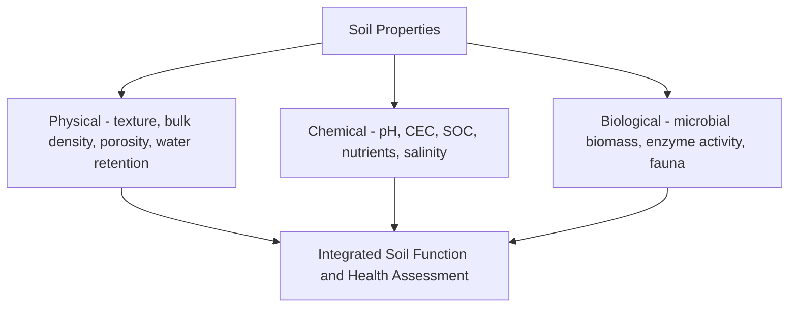
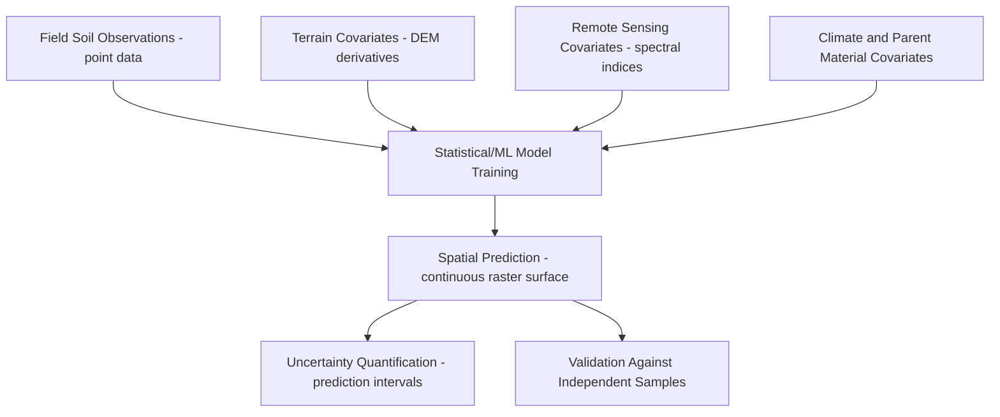

## Soil Properties and Digital Soil Mapping


### Overview

Soil properties encompass the measurable physical, chemical, and biological characteristics that determine a soil's behavior, function, and suitability for agricultural, engineering, hydrological, and ecological purposes. Digital soil mapping (DSM) is the modern quantitative methodology for predicting the spatial distribution of these properties across landscapes using statistical and machine learning models linking sparse field observations to continuous environmental covariate layers, largely superseding traditional polygon-based soil survey mapping for many applications requiring continuous, uncertainty-quantified spatial predictions.

### Core Physical Soil Properties

**Bulk Density**

$$\rho_b = \frac{M_s}{V_t}$$

where $M_s$ is the oven-dry mass of soil solids and $V_t$ is the total soil volume (solids plus pore space). Bulk density typically ranges 1.0-1.6 g/cm³ for mineral soils (lower in organic-rich or well-aggregated soils, higher in compacted or sandy soils), and is inversely related to porosity, directly influencing root penetration, water infiltration, and compaction susceptibility.

**Porosity**

$$n = 1 - \frac{\rho_b}{\rho_s}$$

where $\rho_s$ is particle density (typically assumed ~2.65 g/cm³ for mineral soils dominated by quartz and common silicate minerals). Total porosity is further divided into macropores (rapid drainage, aeration) and micropores (water retention against gravity).

**Soil Water Retention**

The relationship between soil matric potential and volumetric water content, characterized by the soil water characteristic curve (SWCC), commonly parameterized using the **van Genuchten equation**:

$$\theta(\psi) = \theta_r + \frac{\theta_s - \theta_r}{[1 + (\alpha|\psi|)^n]^m}$$

where $\theta_r$ and $\theta_s$ are residual and saturated water content, $\psi$ is matric potential, and $\alpha$, $n$, $m$ are empirical fitting parameters (with $m$ commonly related to $n$ as $m = 1 - 1/n$). Key reference points on this curve include **field capacity** (water content after gravitational drainage ceases, roughly -33 kPa in many texture classes) and **permanent wilting point** (water content at which plants can no longer extract water, roughly -1500 kPa), with the difference defining **plant-available water capacity**.

**Saturated Hydraulic Conductivity ($K_{sat}$)**

The rate of water movement through saturated soil under a unit hydraulic gradient (governed by Darcy's Law, as in groundwater flow), strongly dependent on texture, structure, and macropore continuity, spanning several orders of magnitude from well-structured sandy soils (high $K_{sat}$) to compacted or clay-dominated soils (low $K_{sat}$).

### Core Chemical Soil Properties

**Soil Organic Carbon (SOC) and Organic Matter**

Organic carbon content, typically measured via dry combustion (elemental analysis) or wet oxidation (Walkley-Black method), governs nutrient cycling, aggregate stability, water retention, and serves as a key indicator for soil carbon stock assessment and sequestration accounting. Soil organic matter is conventionally estimated as approximately:

$$\%SOM \approx \%SOC \times 1.724$$

though this conversion (the "van Bemmelen factor") is a historical approximation with documented regional and soil-type variability, and modern practice increasingly reports SOC directly rather than relying on this conversion factor.

**Cation Exchange Capacity and Base Saturation**

As previously established, CEC and base saturation govern nutrient-holding capacity and buffering behavior, varying strongly with clay mineralogy and organic matter content.

**Available Nutrient Status**

Extractable/plant-available nutrient concentrations (commonly nitrogen, phosphorus, potassium, and secondary/micronutrients), assessed through standardized extraction methods (e.g., Mehlich-3, Olsen-P for phosphorus in neutral-to-alkaline soils, Bray-P1 for acidic soils), forming the basis for fertility recommendations and precision agriculture nutrient management.

**Electrical Conductivity (Salinity) and Sodicity**

- **Soil EC**: Measured on a saturated paste extract or diluted soil-water suspension, indicating total soluble salt concentration; elevated EC (salinity) impairs plant water uptake through increased osmotic potential.
- **Sodium Adsorption Ratio (SAR)**: $SAR = \frac{[Na^+]}{\sqrt{([Ca^{2+}] + [Mg^{2+}])/2}}$, indicating the proportion of exchangeable sodium relative to calcium and magnesium; high SAR promotes clay dispersion, structural collapse, and reduced infiltration (sodicity), a distinct degradation pathway from salinity that specifically damages soil physical structure.

### Soil Biological Properties

**Microbial Biomass and Activity**

Soil microbial biomass carbon and respiration rate (CO₂ evolution) serve as indicators of biological activity and organic matter turnover potential, responsive to management practices (tillage, organic amendment) on shorter timescales than bulk SOC content, making microbial indicators useful "early warning" metrics for soil health monitoring.

**Soil Enzyme Activity**

Extracellular enzyme assays (e.g., dehydrogenase, phosphatase, urease activity) indicate the functional capacity of the soil microbial community to catalyze specific nutrient transformation processes, increasingly incorporated into comprehensive soil health assessment frameworks.

**Soil Fauna**

Earthworms, nematodes, arthropods, and other soil macro/mesofauna contribute to organic matter fragmentation, bioturbation (structural mixing), and pore network formation, with community composition and abundance serving as additional biological indicators of soil ecosystem function.



### Digital Soil Mapping: The SCORPAN Framework

Digital soil mapping formalizes the prediction of soil properties as a function of spatially explicit environmental covariates, extending Jenny's classical CLORPT state-factor model into a predictive, quantitative framework known as **SCORPAN**:

$$S = f(s, c, o, r, p, a, n) + e$$

where:

- $s$ = other **s**oil properties at the prediction location (when available)
- $c$ = **c**limate covariates (precipitation, temperature surfaces)
- $o$ = **o**rganisms (vegetation indices, land cover classification)
- $r$ = **r**elief (terrain attributes derived from digital elevation models)
- $p$ = **p**arent material (geological maps, gamma radiometrics)
- $a$ = **a**ge/time (when known, e.g., surface age from geomorphic mapping)
- $n$ = spatial **n**eighborhood/position (geographic coordinates, distance-based covariates)
- $e$ = spatially correlated residual error

This framework treats soil property prediction as a spatial statistical/machine learning problem rather than a purely qualitative field-mapping exercise, enabling continuous raster prediction surfaces rather than discrete polygon boundaries.

### Environmental Covariates for DSM

**Terrain Derivatives (from Digital Elevation Models)**

- **Elevation**: Direct proxy for climate gradients and drainage base level.
- **Slope**: Influences erosion/deposition balance and drainage.
  </br>
- **Aspect**: Governs solar radiation exposure and associated microclimate/moisture regime.
- **Topographic Wetness Index (TWI)**: $TWI = \ln\left(\frac{a}{\tan\beta}\right)$, where $a$ is specific upslope contributing area and $\beta$ is local slope, quantifying the propensity for water accumulation at a given landscape position—high TWI values correspond to convergent, low-gradient areas prone to saturation.
- **Curvature (plan and profile)**: Describes surface convexity/concavity, relating to flow convergence/divergence and erosion/deposition tendency.
- **Multiresolution Valley Bottom Flatness (MRVBF) and similar landform classification indices**: Automated terrain classification into geomorphic units (ridges, slopes, valley bottoms) at multiple spatial scales.

**Remote Sensing Covariates**

- **Spectral indices**: Vegetation indices (NDVI and related indices) as proxies for productivity and organic matter input; bare-soil spectral reflectance directly correlating with surface texture, organic matter, and iron oxide content where vegetation cover permits soil surface observation.
- **Multitemporal composites**: Cloud-free bare-soil composites synthesized from time-series satellite imagery (e.g., using median or minimum-NDVI compositing across a multi-year archive), substantially expanding usable bare-soil spectral coverage compared to single-date imagery.
- **Gamma-ray spectrometry**: Airborne or satellite-derived radiometric data (potassium, thorium, uranium concentrations) serving as indirect indicators of parent material mineralogy and weathering status where available.

**Climate Covariates**

Interpolated or reanalysis-derived precipitation and temperature surfaces, and derived bioclimatic variables (e.g., aridity index, growing degree days), typically obtained from gridded climate data products.



### Statistical and Machine Learning Methods in DSM

**Geostatistical Methods**

- **Ordinary Kriging**: Interpolates soil property values based purely on spatial autocorrelation structure (the variogram), without incorporating auxiliary environmental covariates, most effective when sample density is high relative to the spatial variability scale.
- **Regression Kriging / Kriging with External Drift**: Combines a deterministic regression component (relating the property to environmental covariates) with kriging interpolation of the spatially correlated residuals, generally outperforming pure geostatistical or pure regression approaches by capturing both covariate-driven trend and residual spatial structure.

**Machine Learning Methods**

- **Random Forests**: Widely adopted in DSM applications for their ability to handle nonlinear relationships, variable interactions, and mixed covariate types without extensive preprocessing, while providing variable importance measures for covariate interpretation.
- **Gradient Boosting Machines (e.g., XGBoost)**: Increasingly used for DSM prediction, often achieving strong predictive performance, though requiring more careful hyperparameter tuning than random forests to avoid overfitting.
- **Cubist and regression trees**: Historically significant in DSM literature for producing interpretable rule-based prediction models.
- **Deep learning approaches**: Convolutional neural networks applied to gridded covariate stacks are an active area of DSM research, particularly for capturing spatial context beyond point-based covariate extraction. [Speculation] The degree to which deep learning approaches will displace tree-based ensemble methods as the DSM community standard remains uncertain, as tree-based methods currently offer competitive accuracy with lower data and computational requirements for the point-sample, moderate-covariate-dimensionality datasets typical of most DSM projects.

### Example: Simplified Regression Kriging Workflow

```python
import numpy as np
from sklearn.ensemble import RandomForestRegressor
from sklearn.model_selection import train_test_split
from sklearn.metrics import mean_squared_error, r2_score

def simulate_dsm_workflow(n_samples=200, n_covariates=5, random_state=42):
    """
    Illustrative digital soil mapping workflow: train a model relating
    soil organic carbon (target) to environmental covariates (terrain,
    climate, remote sensing proxies), then evaluate predictive performance.
    """
    rng = np.random.RandomState(random_state)
    
    # Simulated covariates: elevation, slope, TWI, NDVI, precipitation
    elevation = rng.uniform(100, 1200, n_samples)
    slope = rng.uniform(0, 35, n_samples)
    twi = rng.uniform(3, 15, n_samples)
    ndvi = rng.uniform(0.2, 0.85, n_samples)
    precip = rng.uniform(400, 1600, n_samples)
    
    X = np.column_stack([elevation, slope, twi, ndvi, precip])
    
    # Simulated SOC target with realistic covariate relationships + noise
    soc = (0.015 * precip + 8 * ndvi - 0.05 * slope + 0.3 * twi
           + 0.002 * elevation + rng.normal(0, 1.5, n_samples))
    soc = np.clip(soc, 0.2, None)  # SOC cannot be negative
    
    return X, soc

X, y = simulate_dsm_workflow()
X_train, X_test, y_train, y_test = train_test_split(X, y, test_size=0.25, random_state=42)

model = RandomForestRegressor(n_estimators=300, max_depth=10, random_state=42)
model.fit(X_train, y_train)
y_pred = model.predict(X_test)

rmse = np.sqrt(mean_squared_error(y_test, y_pred))
r2 = r2_score(y_test, y_pred)

covariate_names = ["Elevation", "Slope", "TWI", "NDVI", "Precipitation"]
importances = model.feature_importances_

print(f"Validation RMSE: {rmse:.3f} g/kg SOC")
print(f"Validation R^2: {r2:.3f}")
print("\nCovariate importance:")
for name, imp in sorted(zip(covariate_names, importances), key=lambda x: -x[1]):
    print(f"  {name}: {imp:.3f}")
```

**Output** (representative; exact values vary with the random seed and simulated relationships):



```
Validation RMSE: 1.612 g/kg SOC
Validation R^2: 0.871

Covariate importance:
  Precipitation: 0.412
  NDVI: 0.308
  TWI: 0.148
  Elevation: 0.089
  Slope: 0.043
```

This illustrates the standard DSM validation workflow: partitioning observations into training and independent test sets, fitting a machine learning model relating the target soil property to environmental covariates, and evaluating performance via RMSE and R² on held-out data, alongside covariate importance ranking to interpret which environmental drivers most strongly control the spatial pattern of the target property.

### Diagram: Digital Soil Mapping Prediction Pipeline (svg_diagram)

<svg xmlns="http://www.w3.org/2000/svg" viewBox="0 0 740 400">
<text x="370" y="28" font-size="18" font-weight="bold" text-anchor="middle" fill="#1a1a1a">Digital Soil Mapping Pipeline (svg_diagram)</text>
<rect x="40" y="60" width="150" height="55" rx="6" fill="#dbeafe" stroke="#1e40af" stroke-width="1.5" />
<text x="115" y="92" font-size="11" text-anchor="middle" fill="#1e3a8a">Field Soil Samples</text>
<rect x="40" y="140" width="150" height="55" rx="6" fill="#dcfce7" stroke="#166534" stroke-width="1.5" />
<text x="115" y="172" font-size="11" text-anchor="middle" fill="#14532d">Terrain / RS / Climate Covariates</text>
<rect x="280" y="100" width="170" height="55" rx="6" fill="#fef3c7" stroke="#92400e" stroke-width="1.5" />
<text x="365" y="132" font-size="11" text-anchor="middle" fill="#78350f">ML/Geostatistical Model Fitting</text>
<line x1="190" y1="87" x2="280" y2="120" stroke="#333" stroke-width="1.5" marker-end="url(#arrdsm)" />
<line x1="190" y1="167" x2="280" y2="135" stroke="#333" stroke-width="1.5" marker-end="url(#arrdsm)" />
<rect x="530" y="60" width="170" height="55" rx="6" fill="#fee2e2" stroke="#991b1b" stroke-width="1.5" />
<text x="615" y="92" font-size="11" text-anchor="middle" fill="#7f1d1d">Spatial Prediction Raster</text>
<line x1="450" y1="115" x2="530" y2="90" stroke="#333" stroke-width="1.5" marker-end="url(#arrdsm)" />
<rect x="530" y="150" width="170" height="55" rx="6" fill="#e0e7ff" stroke="#3730a3" stroke-width="1.5" />
<text x="615" y="182" font-size="11" text-anchor="middle" fill="#312e81">Uncertainty Map</text>
<line x1="450" y1="145" x2="530" y2="175" stroke="#333" stroke-width="1.5" marker-end="url(#arrdsm)" />
<rect x="280" y="240" width="170" height="55" rx="6" fill="#f3e8ff" stroke="#6b21a8" stroke-width="1.5" />
<text x="365" y="272" font-size="11" text-anchor="middle" fill="#581c87">Independent Validation</text>
<line x1="365" y1="155" x2="365" y2="240" stroke="#333" stroke-width="1.5" stroke-dasharray="4,3" marker-end="url(#arrdsm)" />
</svg>

### Uncertainty Quantification in DSM

Robust digital soil mapping outputs include not only point predictions but explicit uncertainty estimates, communicated through:

- **Prediction intervals**: Quantile regression forests or kriging variance provide pixel-level uncertainty bounds around each predicted value.
- **Cross-validation statistics**: k-fold or spatial (block) cross-validation assessing model generalization, with spatial cross-validation specifically addressing the risk of overoptimistic accuracy estimates from spatially autocorrelated training/test splits.
- **Area of applicability**: Techniques identifying regions where the covariate space of prediction locations falls outside the range represented in training data, flagging areas of extrapolation where model predictions carry substantially higher uncertainty.

### Soil Spectroscopy for Rapid Property Prediction

Visible-near infrared (Vis-NIR) and mid-infrared (MIR) diffuse reflectance spectroscopy enables rapid, low-cost estimation of multiple soil properties (SOC, texture, CEC, and others) simultaneously from a single spectral scan, calibrated against a reference library of samples with conventional laboratory-measured properties using multivariate calibration methods (e.g., partial least squares regression, or machine learning approaches applied to spectral data). Large national and global spectral libraries (e.g., efforts coordinated under international soil spectroscopy initiatives) increasingly support this rapid characterization approach as a complement to traditional wet-chemistry analysis, particularly valuable for large-scale soil monitoring programs where analytical cost and turnaround time are limiting factors.

### Applications of Digital Soil Mapping

- **Precision agriculture**: Fine-resolution property maps (nutrient status, texture, water-holding capacity) supporting variable-rate input application and management zone delineation.
- **Global and national soil information systems**: Large-scale gridded soil property products (e.g., international harmonized soil grids) supporting global modeling applications in climate, hydrology, and food security assessment.
- **Soil carbon monitoring and verification**: Spatially explicit SOC prediction and change detection supporting carbon credit verification and national greenhouse gas inventory reporting.
- **Land degradation and salinity monitoring**: Continuous property surfaces enabling detection and monitoring of degradation processes across broad areas not feasible with traditional point-based survey alone.
- **Digital soil-landscape modeling for engineering and planning**: Providing continuous property estimates for infrastructure siting, septic suitability, and erosion risk assessment beyond the resolution of traditional soil survey polygon boundaries.

### Common Pitfalls and Misconceptions

- **Ignoring spatial autocorrelation in validation**: Standard random k-fold cross-validation on spatially clustered soil sample data can produce overly optimistic accuracy estimates because nearby training and test points are not independent; spatial (block or buffered) cross-validation strategies are needed for a realistic assessment of prediction performance at new, more distant locations.
- **Extrapolating predictions beyond the training covariate space**: Machine learning models trained on samples from a limited environmental range can produce unreliable predictions (often silently, without obvious warning) when applied to locations with covariate combinations outside that training range; area-of-applicability assessment should accompany any DSM product used for decision-making.
- **Treating digital soil maps as replacing all need for field verification**: DSM products are statistical predictions with associated uncertainty, not direct observations; critical land-use decisions (e.g., septic system siting, foundation engineering) generally still require field-verified, site-specific soil data rather than relying solely on gridded prediction products.
- **Overlooking covariate collinearity and interpretability trade-offs**: Highly flexible machine learning models can achieve strong predictive accuracy while relying on covariate relationships that are difficult to interpret mechanistically, which can be acceptable for pure prediction tasks but problematic when the goal includes understanding underlying pedogenic drivers.
- **Assuming uniform sample density supports uniform prediction confidence everywhere**: Soil sampling programs are rarely perfectly spatially balanced; prediction confidence typically varies substantially across a mapped area depending on local sample density and representativeness, a nuance lost if only a single aggregate accuracy statistic is reported for the entire map.

**Related Topics**

- Soil Formation and Classification
- Geostatistics and Spatial Interpolation Methods
- Soil Spectroscopy and Proximal Sensing
- Remote Sensing for Land Surface Characterization
- Precision Agriculture and Variable-Rate Management
- Soil Carbon Monitoring and Climate Mitigation
- Terrain Analysis and DEM-Derived Covariates
- Machine Learning for Environmental Spatial Prediction
- Soil Health Indicators and Assessment Frameworks