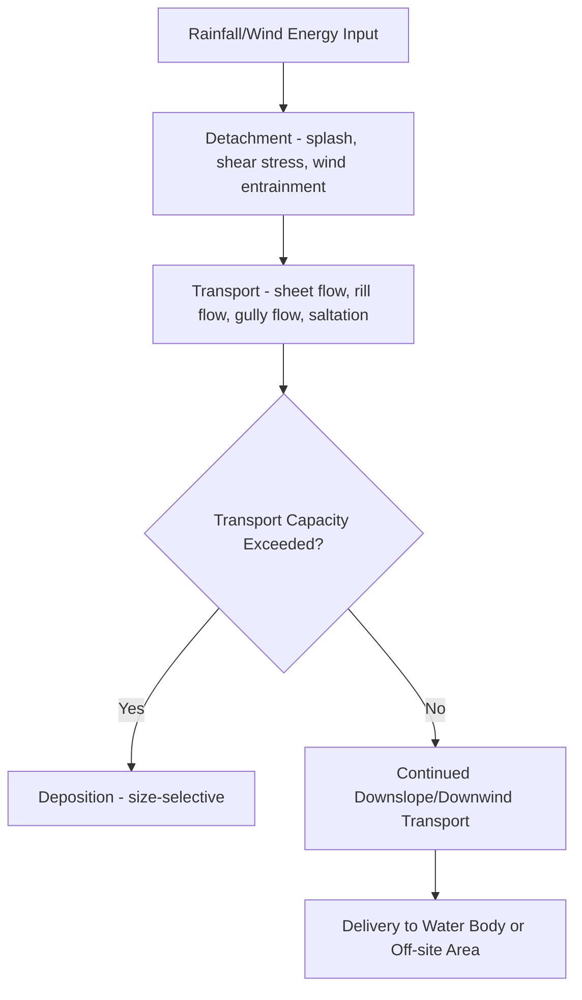

## Erosion Processes and Modeling


### Overview

Soil erosion is the process by which soil particles are detached, transported, and deposited by erosive agents—primarily water and wind, with lesser contributions from tillage, gravity, and ice. Erosion is a natural geomorphic process operating over geological timescales, but anthropogenic land use change (agriculture, deforestation, construction, overgrazing) can accelerate erosion rates by orders of magnitude beyond natural (geologic) baseline rates, driving soil degradation, reduced agricultural productivity, sedimentation of downstream water bodies, and water quality impairment. Erosion modeling provides the quantitative tools to predict erosion rates, identify vulnerable areas, and evaluate the effectiveness of conservation practices.

### Erosion Process Mechanics

**Detachment**

The initial dislodgement of soil particles from the parent soil mass, occurring through:

- **Raindrop impact (splash erosion)**: Kinetic energy from raindrop impact breaks down soil aggregates and dislodges particles, often the dominant detachment mechanism on bare or sparsely vegetated soil surfaces, with splash erosion capable of moving particles both vertically and laterally (net downslope on sloped terrain).
- **Overland flow shear stress**: Once surface runoff is generated, flowing water exerts shear stress on the soil surface, detaching particles when this stress exceeds the soil's critical shear resistance (dependent on aggregate stability, root binding, and surface crusting).
- **Freeze-thaw and wetting-drying cycles**: Physical weathering processes that weaken aggregate structure and increase erodibility independent of direct erosive transport.

**Transport**

Once detached, particles are transported by:

- **Sheet flow**: Thin, relatively uniform overland flow transporting fine particles across the land surface before concentrating into defined channels.
- **Rill flow**: Concentrated flow in small, ephemeral channels (rills) that can be obliterated by subsequent tillage, transporting substantially more sediment per unit area than sheet flow due to higher flow depth and velocity.
- **Gully flow**: Larger, more permanent channelized erosion features that cannot be removed by normal tillage, representing a more advanced and often less reversible erosion stage.
- **Wind entrainment**: Saltation (particle bouncing), suspension (fine particle lofting), and surface creep (rolling/sliding of larger particles) constitute the three principal wind erosion transport modes.

**Deposition**

Occurs when transport capacity falls below the sediment load being carried (due to reduced slope, flow velocity, or vegetative obstruction), depositing coarser material first and finer material at greater distances/lower energy conditions—a size-selective process with implications for both on-site soil quality loss (preferential removal of fine, nutrient-rich particles) and off-site sediment/pollutant delivery.



### Water Erosion Processes

**Sheet and Interrill Erosion**

Relatively uniform soil loss across a slope from combined raindrop splash and shallow, unconcentrated overland flow, generally the least visually dramatic but often the most areally extensive erosion form on agricultural land.

**Rill Erosion**

Formation of small, well-defined channels (typically a few centimeters deep) as overland flow concentrates along microtopographic low points, capable of being removed by tillage but recurring in subsequent events if underlying conditions persist.

**Gully Erosion**

Development of larger, permanent channels (too large for normal tillage to remove) through headward-eroding channel incision, often initiated at a knickpoint where concentrated flow encounters a sudden grade change or erodible subsoil layer, and capable of advancing rapidly through headcut retreat.

**Ephemeral Gully Erosion**

An intermediate erosion form occurring in predictable landscape positions (concentrated flow paths, swales) that can be temporarily filled by tillage but reforms in the same location during subsequent erosive events, often under-recognized in field-level erosion assessment despite contributing substantially to total sediment yield in many agricultural landscapes.

**Streambank Erosion**

Lateral erosion of channel banks through fluvial hydraulic processes (as discussed in fluvial geomorphology) and mass wasting (bank collapse), often a dominant sediment source in watershed sediment budgets, particularly in incised or actively adjusting channel systems.

### Wind Erosion Processes

Wind erosion is governed by the interaction of wind shear stress with soil surface properties, most significant on flat, dry, sparsely vegetated, fine-textured (or loose sandy) surfaces with insufficient surface roughness or vegetative cover to reduce near-surface wind velocity below the threshold required for particle entrainment. Key controlling factors include soil erodibility (texture, aggregate stability, organic matter), surface roughness, vegetative cover fraction, unsheltered field width (fetch distance), and climatic erosivity (wind speed distribution and soil moisture).

### The Universal Soil Loss Equation (USLE) and Revisions

**USLE Structure**

The most widely applied empirical erosion prediction model, developed originally for cropland sheet and rill erosion estimation in the United States, expressing average annual soil loss as the product of six factors:

$$A = R \times K \times LS \times C \times P$$

where:

- $A$ = computed average annual soil loss (typically tons/acre/year or Mg/ha/year)
- $R$ = rainfall-runoff erosivity factor, derived from long-term rainfall intensity and energy characteristics
- $K$ = soil erodibility factor, reflecting inherent soil susceptibility to erosion based on texture, organic matter, structure, and permeability
- $LS$ = slope length and steepness factor, capturing the combined effect of slope gradient and length on erosive energy and transport capacity
- $C$ = cover-management factor, reflecting the protective effect of vegetation, crop residue, and management practices relative to bare, continuously tilled fallow (the reference condition)
- $P$ = support practice factor, reflecting the erosion-reducing effect of practices such as contouring, strip-cropping, and terracing relative to up-and-down-slope farming

**Revised Universal Soil Loss Equation (RUSLE) and RUSLE2**

Updated versions incorporating improved process understanding, refined sub-factor algorithms (particularly for the C-factor, now computed from a more mechanistic sub-factor approach incorporating prior land use, canopy cover, surface cover, surface roughness, and soil moisture), and expanded applicability to rangeland and disturbed land conditions beyond the original cropland focus. RUSLE2 further incorporates daily process computation and improved deposition routing rather than the purely empirical annual computation of the original USLE.

### The LS-Factor: Slope Length and Steepness

The LS-factor is commonly computed as:

$$LS = \left(\frac{\lambda}{22.13}\right)^m \times (65.41\sin^2\theta + 4.56\sin\theta + 0.065)$$

where $\lambda$ is slope length (meters), $\theta$ is slope angle, and $m$ is a slope-length exponent that varies with slope steepness (ranging roughly 0.2 for slopes under 1% to 0.5 for slopes exceeding 5%, reflecting the disproportionately greater erosive contribution of length on steeper terrain). In GIS-based applications, slope length is commonly derived from upslope contributing area (flow accumulation) rather than a simple planar length measurement, better representing complex, convergent/divergent terrain.

### Example Calculation: RUSLE Soil Loss Estimation

```python
import math

def calculate_ls_factor(slope_length_m, slope_pct):
    """
    Compute LS factor using a standard RUSLE formulation.
    slope_length_m: slope length in meters
    slope_pct: slope steepness in percent
    """
    theta = math.atan(slope_pct / 100)  # slope angle in radians
    
    # Slope length exponent m varies with slope steepness
    if slope_pct < 1:
        m = 0.2
    elif slope_pct < 3:
        m = 0.3
    elif slope_pct < 5:
        m = 0.4
    else:
        m = 0.5
    
    ls = ((slope_length_m / 22.13) ** m) * \
         (65.41 * math.sin(theta)**2 + 4.56 * math.sin(theta) + 0.065)
    return ls

def rusle_soil_loss(R, K, LS, C, P):
    """
    Compute average annual soil loss using RUSLE.
    R: rainfall erosivity (MJ*mm/(ha*hr*yr))
    K: soil erodibility (Mg*ha*hr/(ha*MJ*mm))
    LS: slope length-steepness factor (dimensionless)
    C: cover-management factor (dimensionless, 0-1)
    P: support practice factor (dimensionless, 0-1)
    Returns soil loss in Mg/ha/yr (metric tons per hectare per year)
    """
    return R * K * LS * C * P

# Example: agricultural field, moderate slope, conventional tillage
R = 3500       # rainfall erosivity, temperate agricultural region
K = 0.35       # moderate erodibility silt loam soil
slope_length = 90  # meters
slope_pct = 6      # 6% slope
LS = calculate_ls_factor(slope_length, slope_pct)
C_conventional = 0.35  # conventional tillage, row crop
C_notill = 0.08        # no-till with residue cover
P_contour = 0.5        # contour farming support practice
P_none = 1.0           # no support practice (up-and-down slope)

A_conventional = rusle_soil_loss(R, K, LS, C_conventional, P_none)
A_conservation = rusle_soil_loss(R, K, LS, C_notill, P_contour)

print(f"LS Factor: {LS:.3f}")
print(f"Conventional tillage, no support practice: {A_conventional:.2f} Mg/ha/yr")
print(f"No-till with contouring: {A_conservation:.2f} Mg/ha/yr")
print(f"Soil loss reduction: {(1 - A_conservation/A_conventional)*100:.1f}%")

# Common soil loss tolerance (T-value) comparison
T_value = 11.2  # Mg/ha/yr, a commonly cited tolerable soil loss threshold
print(f"\nConventional exceeds T-value ({T_value} Mg/ha/yr)? {A_conventional > T_value}")
print(f"Conservation practice exceeds T-value? {A_conservation > T_value}")
```

**Output**:



```
LS Factor: 1.868
Conventional tillage, no support practice: 428.75 Mg/ha/yr
No-till with contouring: 48.99 Mg/ha/yr
Soil loss reduction: 88.6%

Conventional exceeds T-value (11.2 Mg/ha/yr)? True
Conservation practice exceeds T-value? True
```

[Unverified] The absolute soil loss values above are illustrative outputs of the formula given the example input parameters and should not be treated as representative of any specific real field condition; actual R, K, C, and P factor values require site-specific determination from official RUSLE2 reference tables or regional erosivity/erodibility databases. This example nonetheless correctly illustrates the substantial soil-loss reduction achievable through combined cover-management and support-practice changes, and demonstrates the standard practice of comparing computed soil loss against a tolerable soil loss threshold (T-value) to evaluate whether a given management scenario is sustainable.

### Diagram: RUSLE Factor Interaction and Conservation Impact (svg_diagram)

<svg xmlns="http://www.w3.org/2000/svg" viewBox="0 0 740 420">
<text x="370" y="28" font-size="18" font-weight="bold" text-anchor="middle" fill="#1a1a1a">RUSLE Factors and Conservation Practice Impact (svg_diagram)</text>
<rect x="40" y="70" width="100" height="60" rx="6" fill="#dbeafe" stroke="#1e40af" />
<text x="90" y="105" font-size="12" text-anchor="middle" fill="#1e3a8a" font-weight="bold">R</text>
<text x="90" y="60" font-size="10" text-anchor="middle" fill="#1e3a8a">Rainfall Erosivity</text>
<rect x="160" y="70" width="100" height="60" rx="6" fill="#dcfce7" stroke="#166534" />
<text x="210" y="105" font-size="12" text-anchor="middle" fill="#14532d" font-weight="bold">K</text>
<text x="210" y="60" font-size="10" text-anchor="middle" fill="#14532d">Soil Erodibility</text>
<rect x="280" y="70" width="100" height="60" rx="6" fill="#fef3c7" stroke="#92400e" />
<text x="330" y="105" font-size="12" text-anchor="middle" fill="#78350f" font-weight="bold">LS</text>
<text x="330" y="60" font-size="10" text-anchor="middle" fill="#78350f">Slope Length/Steepness</text>
<rect x="400" y="70" width="100" height="60" rx="6" fill="#fee2e2" stroke="#991b1b" />
<text x="450" y="105" font-size="12" text-anchor="middle" fill="#7f1d1d" font-weight="bold">C</text>
<text x="450" y="60" font-size="10" text-anchor="middle" fill="#7f1d1d">Cover Management</text>
<rect x="520" y="70" width="100" height="60" rx="6" fill="#e0e7ff" stroke="#3730a3" />
<text x="570" y="105" font-size="12" text-anchor="middle" fill="#312e81" font-weight="bold">P</text>
<text x="570" y="60" font-size="10" text-anchor="middle" fill="#312e81">Support Practice</text>

<text x="330" y="165" font-size="16" text-anchor="middle" fill="`#1a1a1a`">× × × × =</text>

<rect x="230" y="200" width="220" height="55" rx="6" fill="#fecaca" stroke="#7f1d1d" stroke-width="2" />
<text x="340" y="232" font-size="13" text-anchor="middle" fill="#7f1d1d" font-weight="bold">A = Soil Loss (Mg/ha/yr)</text>
<path d="M340,255 Q340,280 250,300" stroke="#333" stroke-width="1.5" fill="none" />
<path d="M340,255 Q340,280 430,300" stroke="#333" stroke-width="1.5" fill="none" />
<rect x="100" y="300" width="160" height="60" rx="6" fill="#fca5a5" opacity="0.6" stroke="#7f1d1d" />
<text x="180" y="325" font-size="11" text-anchor="middle" fill="#7f1d1d">High C, No P</text>
<text x="180" y="342" font-size="10" text-anchor="middle" fill="#7f1d1d">Conventional Tillage</text>
<rect x="380" y="300" width="200" height="60" rx="6" fill="#86efac" opacity="0.6" stroke="#14532d" />
<text x="480" y="325" font-size="11" text-anchor="middle" fill="#14532d">Low C, Contour P</text>
<text x="480" y="342" font-size="10" text-anchor="middle" fill="#14532d">No-till + Conservation</text>
</svg>

### Water Erosion Prediction Project (WEPP) and Process-Based Models

**WEPP**

A process-based (as opposed to empirical) erosion simulation model developed by the USDA, explicitly simulating infiltration, runoff generation, plant growth, residue decomposition, and hillslope/channel erosion processes on a continuous daily timestep, enabling representation of individual storm events, spatial variability within a hillslope profile, and complex management sequences (crop rotations, tillage timing) with greater process fidelity than the empirical USLE/RUSLE framework, at the cost of substantially greater input data and parameterization requirements.

**Distributed and Watershed-Scale Erosion Models**

- **SWAT**: Incorporates a modified USLE (MUSLE) approach for sediment yield estimation within its broader semi-distributed hydrological modeling framework, using peak runoff rate rather than rainfall energy as the erosive driver (better representing event-based sediment delivery).
- **AGNPS/AnnAGNPS**: Distributed agricultural pollutant loading models integrating erosion, sediment transport, and associated nutrient/pesticide loading at the watershed scale.
- **CAESAR-Lisflood and similar landscape evolution models**: Coupled hydraulic-geomorphic models simulating longer-term (decadal to millennial) landscape evolution through the combined action of fluvial erosion, sediment transport, and deposition across an evolving terrain surface.

### Wind Erosion Modeling

**Wind Erosion Equation (WEQ) and Revised Wind Erosion Equation (RWEQ)**

Empirical frameworks analogous in structure to USLE/RUSLE, relating average annual wind erosion soil loss to climatic erosivity, soil erodibility, surface roughness, field width (unsheltered distance), and vegetative cover factors.

**Wind Erosion Prediction System (WEPS)**

A USDA-developed process-based model simulating wind erosion on a sub-daily timestep, explicitly representing the physics of saltation, suspension, and surface creep transport modes in response to simulated weather, soil, and management conditions, analogous in philosophy to WEPP's process-based approach for water erosion.

### Sediment Delivery and Watershed-Scale Considerations

**Sediment Delivery Ratio (SDR)**

The fraction of gross hillslope erosion that actually reaches a specified downstream point (e.g., a watershed outlet or reservoir), recognizing that substantial eroded material is redeposited within the landscape (on lower slopes, in floodplains, in constructed sediment traps) before reaching the outlet:

$$SDR = \frac{\text{Sediment Yield at Outlet}}{\text{Gross Erosion in Contributing Area}}$$

SDR generally decreases with increasing watershed area (larger watersheds provide more opportunity for in-transit deposition) and is influenced by relief, channel density, and land cover, though quantifying SDR accurately for a specific watershed remains one of the more empirically uncertain aspects of watershed sediment budget development.

**Reservoir Sedimentation**

Accumulated sediment delivery to impoundments progressively reduces reservoir storage capacity, a critical long-term water resource management concern requiring periodic bathymetric resurvey and, in severe cases, sediment removal or reservoir decommissioning planning.

### Erosion Control and Conservation Practices

- **Conservation tillage/no-till**: Maintaining crop residue cover reduces raindrop impact energy at the soil surface and increases surface roughness/infiltration, among the most effective and widely adopted single practices for reducing the C-factor.
- **Contour farming and strip-cropping**: Orienting field operations along contour lines (rather than up-and-down slope) disrupts continuous downslope flow paths, reducing the effective P-factor.
- **Terracing**: Physically reduces effective slope length and steepness on individual terrace benches, directly reducing the LS-factor, though at significant construction cost and with land-use tradeoffs.
- **Cover cropping**: Maintains vegetative cover during otherwise bare fallow periods, substantially reducing both splash detachment and providing root-binding soil structural benefits.
- **Grassed waterways and buffer strips**: Vegetated features positioned in concentrated flow paths or between erosive land uses and water bodies, reducing flow velocity, trapping sediment, and reducing effective transport capacity before delivery to receiving waters.
- **Windbreaks and shelterbelts**: Rows of trees or shrubs reducing wind velocity and fetch distance for wind erosion control.

### Common Pitfalls and Misconceptions

- **Treating USLE/RUSLE as applicable to gully or streambank erosion**: These models were developed specifically for sheet and rill erosion on relatively uniform hillslopes; they systematically fail to represent gully, ephemeral gully, and streambank erosion processes, which can dominate total sediment yield in many watersheds despite being outside the model's designed scope.
- **Confusing gross erosion with sediment yield**: A substantial fraction of eroded material is redeposited before reaching a watershed outlet (reflected in the sediment delivery ratio); reporting USLE/RUSLE output directly as "sediment reaching the stream" without SDR adjustment overestimates actual downstream sediment loading.
- **Assuming erosion control practices eliminate rather than redistribute risk**: Some practices (e.g., terracing, diversion structures) manage erosion by redirecting concentrated flow, which can create new erosion risk at the point of concentrated discharge if outlet protection is inadequate.
- **Applying tolerable soil loss (T-value) thresholds without considering irreversibility**: T-values represent a soil-loss rate presumed sustainable relative to natural soil formation rates, but soil formation is extremely slow (commonly cited on the order of centuries per centimeter, with significant regional variability), meaning even "tolerable" long-term chronic erosion is not a truly renewable process on human planning timescales.
- **Underestimating wind erosion in humid-climate assessments**: Wind erosion risk assessment is sometimes neglected in regions perceived as generally humid, overlooking that dry periods, sandy soil textures, and specific land uses (e.g., exposed sandy cropland after harvest) can produce locally significant wind erosion events even outside classically arid regions.

**Related Topics**

- Soil Formation and Classification
- Sediment Transport and Fluvial Geomorphology
- Watershed Sediment Budget Analysis
- Conservation Agriculture and Best Management Practices
- Reservoir Sedimentation and Bathymetric Monitoring
- Landscape Evolution Modeling
- Land Degradation and Desertification Assessment
- GIS-Based Erosion Risk Mapping
- Water Quality Impacts of Sediment Loading