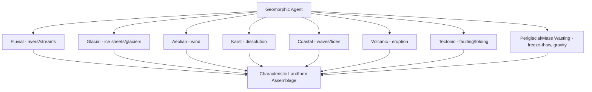

## Landform Classification


### Overview

Landform classification is the systematic categorization of Earth's surface morphology into discrete, recognizable terrain units based on shape, genesis (formative process), and position within the broader landscape. It provides the conceptual and analytical framework for geomorphology, soil-landscape relationship studies, hazard assessment, and increasingly, automated terrain analysis using digital elevation models (DEMs). Classification systems range from purely descriptive/morphometric schemes to genetic classifications rooted in the specific erosional, depositional, or tectonic processes that produced a given landform.

### Genetic Classification Framework

Landforms are commonly organized by their primary formative (genetic) process, reflecting the geomorphic agent responsible for their creation:

**Fluvial Landforms**

Produced by river and stream action, including floodplains, terraces (former floodplain surfaces abandoned as a river incises to a lower elevation), alluvial fans (cone-shaped deposits where a stream exits confined terrain onto a broader plain, losing transport capacity), deltas (sediment deposits at a river's mouth where it enters a standing body of water), meander scars and oxbow lakes, and incised valleys.

**Glacial Landforms**

Produced by ice sheet and glacier erosion and deposition, including:

- **Erosional forms**: Cirques (bowl-shaped basins at glacier heads), arêtes (sharp ridges between adjacent cirques), horns (pyramidal peaks formed by multiple cirque erosion, e.g., the Matterhorn), U-shaped glacial valleys (distinct from V-shaped fluvial valleys), and roche moutonnée (asymmetric bedrock knobs with a smoothed up-ice side and plucked, steeper down-ice side).
- **Depositional forms**: Moraines (unsorted glacial till deposits, classified by position as terminal, lateral, medial, or ground moraine), drumlins (streamlined, elongated hills of glacial till aligned with ice flow direction), eskers (sinuous ridges of stratified sediment deposited by subglacial or englacial meltwater channels), and kettle lakes (depressions formed by the melting of buried, isolated ice blocks).

**Aeolian (Wind-Formed) Landforms**

Produced by wind erosion and deposition, including dunes (multiple morphological types—barchan, transverse, longitudinal, parabolic—reflecting different sediment supply and wind regime conditions), loess deposits (extensive blankets of wind-transported silt, often derived from glacial outwash or periglacial sources), and deflation basins/blowouts (depressions formed by wind removal of unconsolidated material).

**Karst Landforms**

Produced by the dissolution of soluble bedrock (predominantly limestone, dolomite, and gypsum) by chemically aggressive water, including sinkholes (dolines), caves and cave systems, karst towers/mogotes, disappearing streams, and springs fed by conduit flow—collectively defining karst terrain, which presents distinctive hydrological behavior (rapid, poorly filtered groundwater flow through solution conduits) with significant implications for water resource vulnerability and geotechnical hazard.

**Coastal Landforms**

Produced by wave, tidal, and current action at the land-ocean interface, including beaches, barrier islands, spits, tombolos, sea cliffs, wave-cut platforms, and estuaries—shaped by the interaction of sediment supply, wave energy, sea-level position, and coastal geology.

**Volcanic Landforms**

Produced by volcanic eruption and associated processes, including shield volcanoes (broad, gently sloping, built by low-viscosity lava flows), stratovolcanoes/composite cones (steep-sided, built by alternating lava and pyroclastic material), calderas (large collapse depressions following major eruptions or magma chamber evacuation), lava plateaus, and cinder cones.

**Structural/Tectonic Landforms**

Produced by tectonic deformation (faulting, folding) directly expressed in surface topography, including fault scarps, horsts and grabens, fold mountains, and fault-block mountain ranges—landforms whose morphology is fundamentally controlled by underlying geological structure rather than surface erosional/depositional processes alone (though subsequently modified by such processes).

**Periglacial and Mass Wasting Landforms**

Periglacial forms (patterned ground, pingos, solifluction lobes) develop in cold, non-glaciated environments dominated by freeze-thaw processes and, where present, permafrost dynamics. Mass wasting landforms (landslide scarps and deposits, talus/scree slopes, debris flow fans) result from gravity-driven downslope movement of regolith and rock material.



### Landscape Position and Catena Concepts

**Hillslope Position Classification**

Within a single hillslope profile, landform position is commonly subdivided into a standard sequence reflecting characteristic geomorphic process regimes:

- **Summit**: Relatively flat, uppermost landscape position, generally stable with minimal erosion or deposition.
- **Shoulder (Backslope convex)**: Upper, convex slope segment, typically the zone of maximum erosion due to increasing overland flow velocity.
- **Backslope**: The steepest, generally linear portion of the slope profile, dominated by transport-limited erosion.
- **Footslope**: Concave lower slope segment where transport capacity begins to decline, transitional between erosional backslope and depositional toeslope.
- **Toeslope**: Gently sloping to flat lowest position, generally a zone of net deposition and, frequently, higher soil moisture.

**Catena Concept**

The systematic variation of soil properties along a hillslope toposequence, reflecting the combined influence of differential erosion/deposition, lateral water movement, and drainage variation at each landscape position, despite uniform climate, parent material, and time across the sequence—illustrating how relief (as one of the five soil-forming factors) alone can generate substantial soil property variation over short lateral distances.


### Morphometric (Quantitative) Landform Classification

Modern digital terrain analysis increasingly classifies landforms objectively from DEM-derived metrics rather than relying solely on qualitative genetic interpretation:

**Slope and Curvature-Based Classification**

- **Slope gradient**: The primary terrain attribute, computed as the maximum rate of elevation change between a cell and its neighbors.
- **Profile curvature**: Curvature in the direction of maximum slope, indicating whether a surface is accelerating (convex, positive) or decelerating (concave, negative) flow—directly relevant to erosion/deposition tendency along the flow path.
- **Plan curvature**: Curvature perpendicular to the slope direction, indicating flow convergence (concave, negative, water-focusing) or divergence (convex, positive, water-dispersing) across the slope.

**Topographic Position Index (TPI)**

$$TPI = z_0 - \bar{z}_{neighborhood}$$

where $z_0$ is the elevation at a given cell and $\bar{z}_{neighborhood}$ is the mean elevation within a specified surrounding neighborhood radius. Positive TPI values indicate locations higher than their surroundings (ridges, hilltops); negative values indicate locations lower than their surroundings (valleys, depressions); values near zero indicate flat areas or areas of constant slope. Computing TPI at multiple neighborhood scales and combining the results (e.g., the Weiss landform classification approach) enables automated classification into standard landform classes (canyons, valleys, plains, open slopes, upper slopes, ridges) without manual interpretation.

**Terrain Ruggedness Index (TRI)**

Quantifies local elevation heterogeneity by summing the absolute elevation differences between a central cell and its immediate neighbors, providing a measure of surface roughness/dissection useful for distinguishing smooth plains from rugged, dissected terrain independent of absolute slope or elevation.

**Multiresolution Valley Bottom Flatness (MRVBF) and Ruggedness (MRRTF) Indices**

Purpose-built algorithms for automated identification of valley bottoms and ridgetops across multiple analysis scales, specifically designed to correctly classify these landforms across a wide range of absolute landscape scale (from small drainage swales to major river valleys) within a single consistent analytical framework.

### Example: Automated Landform Classification from Terrain Metrics

```python
import numpy as np

def classify_landform_tpi(tpi_small, tpi_large, slope_deg):
    """
    Simplified landform classification combining small- and large-scale
    Topographic Position Index with slope, following the general logic
    of the Weiss (2001) multi-scale TPI landform classification approach.
    """
    if tpi_small > 1 and tpi_large > 1:
        return "Ridge / Hilltop"
    elif tpi_small < -1 and tpi_large < -1:
        return "Valley Bottom / Canyon"
    elif tpi_small > 1 and abs(tpi_large) <= 1:
        return "Upper Slope / Local Ridge"
    elif tpi_small < -1 and abs(tpi_large) <= 1:
        return "Lower Slope / Local Drainage"
    elif abs(tpi_small) <= 1 and abs(tpi_large) <= 1:
        if slope_deg < 2:
            return "Flat Plain"
        else:
            return "Open Slope (mid-slope)"
    else:
        return "Transitional Slope"

# Example grid of terrain points with pre-computed TPI values
sample_points = [
    {"id": 1, "tpi_small": 2.4, "tpi_large": 3.1, "slope": 8.2},
    {"id": 2, "tpi_small": -3.2, "tpi_large": -4.5, "slope": 3.1},
    {"id": 3, "tpi_small": 0.3, "tpi_large": 0.1, "slope": 1.2},
    {"id": 4, "tpi_small": 0.2, "tpi_large": 0.4, "slope": 12.5},
    {"id": 5, "tpi_small": 1.8, "tpi_large": -0.5, "slope": 15.0},
]

print(f"{'Point':<8}{'TPI(small)':<12}{'TPI(large)':<12}{'Slope':<8}{'Landform Class'}")
for pt in sample_points:
    landform = classify_landform_tpi(pt["tpi_small"], pt["tpi_large"], pt["slope"])
    print(f"{pt['id']:<8}{pt['tpi_small']:<12}{pt['tpi_large']:<12}{pt['slope']:<8}{landform}")
```

**Output**:



```
Point   TPI(small)  TPI(large)  Slope   Landform Class
1       2.4         3.1         8.2     Ridge / Hilltop
2       -3.2        -4.5        3.1     Valley Bottom / Canyon
3       0.3         0.1         1.2     Flat Plain
4       0.2         0.4         12.5    Open Slope (mid-slope)
5       1.8         -0.5        15.0    Upper Slope / Local Ridge
```

[Unverified] This simplified threshold logic illustrates the general multi-scale TPI classification concept; production implementations (e.g., the widely used ArcGIS/QGIS Land Facet Corridor Designer or similar tools implementing the Weiss approach) use more refined threshold combinations and additional slope-based subdivisions to generate the full standard ten-class landform typology.

### Diagram: Multi-Scale TPI Landform Classification Concept (svg_diagram)

<svg xmlns="http://www.w3.org/2000/svg" viewBox="0 0 740 380">
<text x="370" y="28" font-size="18" font-weight="bold" text-anchor="middle" fill="#1a1a1a">Topographic Position Index Landform Logic (svg_diagram)</text>

<path d="M40,300 Q120,320 200,280 Q280,180 360,100 Q420,60 480,90 Q560,140 620,240 Q660,290 700,300" fill="none" stroke="`#6b7280`" stroke-width="3" />

<rect x="40" y="300" width="660" height="30" fill="`#d2b48c`" />

<circle cx="380" cy="95" r="7" fill="#dc2626" />
<text x="380" y="75" font-size="11" text-anchor="middle" fill="#7f1d1d" font-weight="bold">Ridge (TPI++ at both scales)</text>
<circle cx="200" cy="280" r="7" fill="#2563eb" />
<text x="150" y="270" font-size="11" text-anchor="middle" fill="#1e3a8a" font-weight="bold">Valley (TPI-- at both scales)</text>
<circle cx="290" cy="195" r="7" fill="#059669" />
<text x="290" y="180" font-size="11" text-anchor="middle" fill="#065f46">Upper Slope</text>
<circle cx="500" cy="130" r="7" fill="#92400e" />
<text x="540" y="120" font-size="11" text-anchor="middle" fill="#78350f">Mid-Slope (near-zero TPI)</text>
<circle cx="580" cy="220" r="7" fill="#7c3aed" />
<text x="600" y="210" font-size="11" text-anchor="middle" fill="#5b21b6">Lower Slope</text>
<line x1="40" y1="330" x2="700" y2="330" stroke="#333" stroke-width="1" />
<text x="370" y="360" font-size="11" text-anchor="middle" fill="#333">Terrain Profile Cross-Section</text>
</svg>

### Landform Classification Standards and Systems

**Hammond's Landform Classification**

A classical quantitative approach classifying terrain into broad categories (plains, tablelands, plains with hills/mountains, open/hill and mountain country, mountains) based on slope percentage, local relief, and the proportion of gently sloping land within a moving analysis window, historically significant as an early systematic quantitative landform classification framework applied at continental scale.

**Land Systems / Land Facet Mapping**

A hierarchical landscape classification tradition (particularly influential in Australian and international land resource survey practice) organizing landscape into nested units—land system (broad recurring landform-soil-vegetation pattern), land unit/facet (internally relatively homogeneous terrain component), and land element (finest practical mapping unit)—integrating geomorphology directly with soil and vegetation survey for land capability assessment.

**Geomorphon Classification**

A more recent pattern-recognition approach classifying each terrain cell into one of ten landform archetypes (flat, peak, ridge, shoulder, spur, slope, hollow, footslope, valley, pit) based on the visibility pattern of surrounding terrain along multiple compass directions (the "line-of-sight" concept borrowed from computer vision), offering computational efficiency and scale-adaptability advantages over traditional curvature-based classification for large-area or global-scale terrain analysis.

### Applications of Landform Classification

- **Soil-landscape modeling**: Landform position is a primary covariate in digital soil mapping (as part of the relief component of SCORPAN), since soil properties systematically vary with hillslope position via the catena relationship.
- **Natural hazard assessment**: Landform classification identifies terrain prone to specific hazards—steep, dissected terrain for landslide susceptibility; karst terrain for sinkhole risk; floodplain/terrace classification for flood hazard zoning.
- **Habitat and ecological modeling**: Landform units correlate strongly with microclimate, drainage, and soil conditions that in turn structure vegetation community distribution, making landform classification a common predictive covariate in species distribution and habitat suitability modeling.
- **Geomorphic hazard and infrastructure siting**: Identification of active or potentially active landforms (fault scarps, unstable slopes, actively migrating dunes or channels) informs infrastructure siting and engineering geology assessment.
- **Landscape evolution and paleoenvironmental reconstruction**: Relict landforms (e.g., glacial features in currently non-glaciated regions, fluvial terraces recording former base-level conditions) provide direct physical evidence for reconstructing past environmental and climatic conditions.

### Common Pitfalls and Misconceptions

- **Conflating landform classification with soil classification**: While closely related through the catena concept and shared use in the SCORPAN framework, landform units and soil taxonomic units are classified according to different criteria (morphology/genesis versus profile properties) and do not map one-to-one; the same landform position can host different soils depending on parent material or climate, and vice versa.
- **Applying a single-scale TPI analysis universally**: Landform features exist across a wide range of absolute spatial scales (a "valley" at a 1 km analysis radius may itself contain ridges and valleys at a 30 m analysis radius); single-scale automated classification can misclassify features that are only correctly identified through multi-scale analysis, as in the Weiss and MRVBF approaches.
- **Treating genetic landform classification as mutually exclusive categories**: Many landscapes reflect polygenetic histories (e.g., a glacially carved valley subsequently modified by fluvial and periglacial processes), and rigid single-category assignment can obscure this layered process history relevant to accurate interpretation.
- **Assuming automated DEM-derived classification eliminates the need for genetic interpretation**: Purely morphometric classification (slope, curvature, TPI) identifies terrain shape but does not, by itself, establish the geomorphic process or history responsible for that shape; a convex, elevated landform could be a volcanic dome, a residual erosional remnant, a moraine, or a fault-block ridge, requiring additional geological/genetic evidence to distinguish.
- **Using coarse-resolution DEMs for fine-scale landform analysis**: Landform classification accuracy is fundamentally limited by input DEM resolution and vertical accuracy; subtle features (e.g., small gully heads, low-relief karst features) can be entirely missed or artificially smoothed in coarse-resolution (e.g., 30 m or coarser) elevation data, requiring higher-resolution LiDAR-derived DEMs for detailed local-scale work.

**Related Topics**

- Digital Elevation Models and Terrain Analysis
- Soil Formation and Classification (Catena Relationships)
- Fluvial Geomorphology and Sediment Transport
- Karst Hydrogeology and Sinkhole Hazard Assessment
- Landslide and Mass Wasting Hazard Assessment
- Glacial Geomorphology and Paleoclimate Reconstruction
- Coastal Geomorphology and Shoreline Change
- LiDAR and 3D Geospatial Data
- Geomorphon and Automated Terrain Classification Algorithms