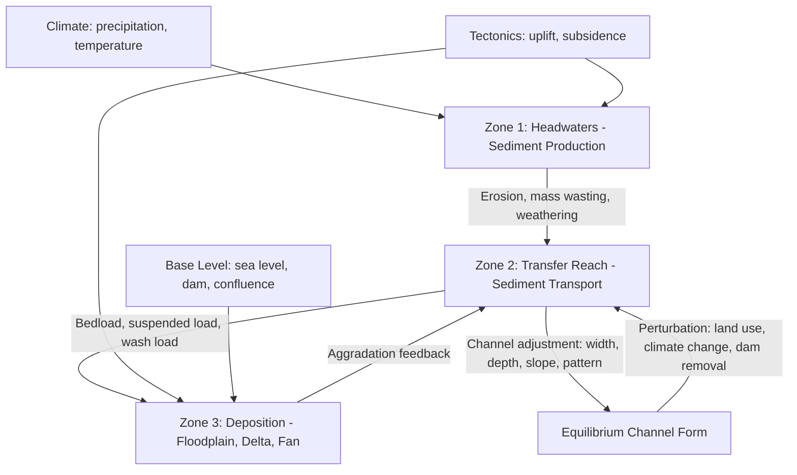

## Fluvial Geomorphology

### Definition and Scope

Fluvial geomorphology is the scientific study of the processes and landforms produced by rivers and streams, and the interactions between flowing water and Earth's surface materials. It integrates hydrology, sediment transport mechanics, and landscape evolution to explain channel form, floodplain development, and drainage network organization over timescales ranging from single flood events to millions of years.

The discipline sits at the intersection of physical geography, hydraulic engineering, and Earth-surface process science, and underpins applied work in river restoration, flood-risk assessment, and watershed management.

### Core Concepts

**Fluvial System Framework**

Rivers are conventionally divided into three longitudinal zones, following the Schumm (1977) sediment-cascade model:

- **Zone 1 (Production/Headwaters)**: Sediment and water generation dominate; steep gradients, erosional processes prevail.
- **Zone 2 (Transfer/Transport)**: Sediment moves through the system with approximate balance between erosion and deposition; the channel adjusts to convey both water and sediment load.
- **Zone 3 (Deposition)**: Lower-gradient reaches where sediment accumulates, forming floodplains, deltas, and alluvial fans.

This is a conceptual simplification; real rivers exhibit local zones of erosion and deposition within all three regions. [Inference]

**Discharge and the Hydraulic Geometry**

Channel form scales with discharge $Q$ through empirical power-law relationships (Leopold and Maddock, 1953):

$$w = aQ^b$$

$$d = cQ^f$$

$$v = kQ^m$$

where $w$ is width, $d$ is mean depth, $v$ is mean velocity, and $a$, $c$, $k$ are coefficients with exponents satisfying $b + f + m = 1$ (from continuity, $Q = wdv$). Typical downstream hydraulic geometry exponents are approximately $b \approx 0.5$, $f \approx 0.4$, $m \approx 0.1$, though these vary regionally and by bed material. [Inference: exact exponents are site- and dataset-dependent]

**Stream Power**

Stream power $\Omega$ describes the rate of potential energy expenditure per unit channel length and is central to predicting erosion, sediment transport capacity, and channel change:

$$\Omega = \rho g Q S$$

where $\rho$ is fluid density, $g$ is gravitational acceleration, $Q$ is discharge, and $S$ is channel slope. Specific stream power (per unit channel width $w$) is often more useful for comparing erosive capacity across reaches:

$$\omega = \frac{\Omega}{w} = \frac{\rho g Q S}{w}$$

**Shields Criterion for Sediment Entrainment**

The threshold for initiation of sediment motion is described by the dimensionless Shields parameter:

$$\tau^* = \frac{\tau_0}{(\rho_s - \rho)g D}$$

where $\tau_0$ is boundary shear stress, $\rho_s$ is sediment density, $\rho$ is fluid density, and $D$ is grain diameter. Entrainment begins when $\tau^*$ exceeds a critical value $\tau_c^*$, empirically found to be approximately 0.03–0.06 for well-sorted gravel beds, though this varies with grain protrusion, packing, and relative roughness. [Unverified: precise critical value depends on bed conditions and measurement method]

Boundary shear stress in a wide channel is commonly approximated as:

$$\tau_0 = \rho g d S$$

### Channel Patterns and Classification

**Channel Pattern Types**

- **Straight**: Rare in natural systems except where structurally controlled; sinuosity < 1.05.
- **Meandering**: Single-thread, sinuous channel (sinuosity > 1.5) with alternating pools and riffles, point bars on inner bends, and cut banks on outer bends.
- **Braided**: Multiple interconnected, actively shifting channels separated by bars; typically associated with high sediment supply, steep slopes, and erodible banks.
- **Anastomosing**: Multiple stable channels separated by vegetated, semi-permanent islands, generally with low gradient and cohesive banks.
- **Wandering**: Transitional pattern between meandering and braided, with locally braided reaches interspersed with single-thread sections.

**Controls on Channel Pattern**

Channel pattern is broadly predicted by the relationship between slope and discharge, following the Leopold-Wolman (1957) threshold:

$$S = 0.06 \, Q_{bf}^{-0.44}$$

where $Q_{bf}$ is bankfull discharge. Channels plotting above this threshold tend toward braided patterns; those below tend toward meandering. This is an empirical regional relationship and should be treated as a general heuristic rather than a universal law. [Inference]

Other key controls include bank erodibility/cohesion (vegetation and fine sediment content), sediment caliber and supply, and valley confinement.

### Meandering River Mechanics

**Pool-Riffle Sequences**

Alternating deep pools and shallow riffles occur at a characteristic spacing of approximately 5–7 channel widths, a pattern remarkably consistent across scales from small streams to large rivers. This spacing is thought to result from the interaction of secondary (helical) flow with alternating bar topography. [Inference: underlying causal mechanism remains an active research topic]

**Helical Flow**

At bends, secondary circulation (helical flow) develops due to the imbalance between the centrifugal force of flow around the curve and the pressure gradient from superelevation of the water surface. Surface water moves toward the outer bank while near-bed flow moves toward the inner bank, driving erosion at the cut bank and deposition (point bar formation) at the inner bank.

**Meander Migration and Cutoffs**

Meander bends migrate laterally and downstream via bank erosion at the outer bend coupled with point-bar accretion at the inner bend. When migration causes a meander neck to narrow sufficiently, a **neck cutoff** can occur during a flood, abandoning the meander loop as an **oxbow lake**. **Chute cutoffs** occur when high flows carve a new, shorter channel across a point bar.

**Meander Wavelength**

Meander wavelength $\lambda$ scales with channel width $w$ approximately as:

$$\lambda \approx 10.9 \, w^{1.01}$$

giving a general rule of thumb that meander wavelength is roughly 10–14 times bankfull channel width. [Inference: coefficient varies by dataset]

### Braided River Mechanics

Braiding develops where sediment supply exceeds transport capacity or where banks are weakly cohesive, causing the channel to divide around mid-channel bars. Key processes include:

- **Bar formation**: Longitudinal and transverse bars nucleate from local flow deceleration and sediment deposition, often around a nucleus of coarse material or obstruction.
- **Channel avulsion**: Rapid relocation of flow into a new channel, often triggered by local aggradation, blockage (e.g., log jams, ice), or bank failure.
- **High width-to-depth ratio**: Braided channels typically exhibit $w/d$ ratios greater than 40–50, reflecting weak bank cohesion and high sediment loads. [Inference: threshold values vary by classification scheme]

### Sediment Transport

**Modes of Transport**

- **Bedload**: Coarser sediment moving by rolling, sliding, and saltation along the bed.
- **Suspended load**: Finer sediment held in suspension by turbulence, following an approximately Rouse-profile concentration distribution with height.
- **Wash load**: Very fine sediment (typically silt and clay) that is supply-limited rather than capacity-limited, generally not represented in the bed material.
- **Dissolved load**: Solutes transported in true solution, derived from chemical weathering.

**Competence vs. Capacity**

- **Competence** refers to the largest particle size a flow can entrain, generally scaling with a power of velocity (traditionally cited as approximately the sixth power for particle weight, though this classic relationship is now understood to be an oversimplification of a more complex threshold process). [Unverified: exact exponent debated in modern sediment transport literature]
- **Capacity** refers to the total sediment mass a flow can transport, which depends on both hydraulic conditions and available sediment supply.

**Sediment Transport Formulas**

Common bedload transport equations include:

- **Meyer-Peter and Müller (1948)**: An empirical formula relating dimensionless bedload transport rate to excess Shields stress above threshold.
- **Einstein (1950)**: A probabilistic approach based on the likelihood of particle entrainment.
- **Wilcock and Crowe (2003)**: A surface-based mixed-grain-size formula widely used for gravel-bed rivers with heterogeneous sediment.

Selection of an appropriate formula is highly site-dependent, and predicted transport rates from different formulas commonly diverge by an order of magnitude for the same input conditions. [Inference: consistent with documented equifinality problems in sediment transport modeling]

### Floodplain and Terrace Formation

**Floodplain Construction**

Floodplains form through two dominant processes:

1. **Lateral accretion**: Point-bar deposition as meanders migrate, building fining-upward sequences.
2. **Vertical accretion**: Overbank deposition of fine sediment during flood events, forming natural levees near the channel and finer, thinner deposits with distance from the channel.

**Fluvial Terraces**

Terraces are abandoned floodplains left elevated above the modern channel following incision, typically triggered by:

- Base-level fall (e.g., sea-level drop, tectonic uplift)
- Climate change altering discharge/sediment supply ratios
- Upstream capture or avulsion altering sediment delivery

Terraces are classified as:

- **Paired terraces**: Correlate in elevation across the valley, indicating episodic, valley-wide incision events.
- **Unpaired (strath) terraces**: Form during continuous lateral migration combined with gradual incision, producing terraces at varying elevations on either side of the valley.

### Channel Cross-Section and Planform Diagram (svg_diagram)

<svg xmlns="http://www.w3.org/2000/svg" viewBox="0 0 800 420">
<text x="400" y="25" font-size="16" font-weight="bold" text-anchor="middle" fill="#1a1a1a">Meandering Channel Planform: Pool-Riffle and Point Bar Geometry (svg_diagram)</text>

<path d="M 50 200 C 150 100, 250 300, 350 200 S 550 100, 650 200 S 750 250, 780 200" fill="none" stroke="`#2b6cb0`" stroke-width="24" stroke-linecap="round" />

<path d="M 50 200 C 150 100, 250 300, 350 200 S 550 100, 650 200 S 750 250, 780 200" fill="none" stroke="`#63b3ed`" stroke-width="18" stroke-linecap="round" />

<ellipse cx="180" cy="145" rx="35" ry="22" fill="#ecc94b" opacity="0.85" transform="rotate(-30 180 145)" />
<ellipse cx="480" cy="145" rx="35" ry="22" fill="#ecc94b" opacity="0.85" transform="rotate(30 480 145)" />
<ellipse cx="330" cy="255" rx="30" ry="18" fill="#ecc94b" opacity="0.85" transform="rotate(30 330 255)" />
<ellipse cx="610" cy="255" rx="28" ry="16" fill="#ecc94b" opacity="0.85" transform="rotate(-30 610 255)" />

<text x="250" y="90" font-size="12" fill="`#c53030`" text-anchor="middle">Cut Bank (erosion)</text>

<text x="180" y="185" font-size="11" fill="`#744210`" text-anchor="middle">Point Bar</text>

<text x="450" y="90" font-size="12" fill="`#c53030`" text-anchor="middle">Cut Bank</text>

<circle cx="250" cy="240" r="6" fill="#1a365d" />
<text x="250" y="270" font-size="11" fill="#1a365d" text-anchor="middle">Pool</text>
<circle cx="400" cy="200" r="6" fill="#38a169" />
<text x="400" y="185" font-size="11" fill="#22543d" text-anchor="middle">Riffle</text>
<circle cx="550" cy="240" r="6" fill="#1a365d" />
<text x="550" y="270" font-size="11" fill="#1a365d" text-anchor="middle">Pool</text>

<path d="M 60 310 L 100 310" stroke="#1a1a1a" stroke-width="2" marker-end="url(#arrow)" />
<text x="130" y="315" font-size="12" fill="#1a1a1a">Flow direction</text>
<rect x="50" y="340" width="700" height="60" fill="none" stroke="#a0aec0" stroke-width="1" stroke-dasharray="4" />
<text x="400" y="355" font-size="12" font-weight="bold" text-anchor="middle" fill="#1a1a1a">Asymmetric Cross-Section at Bend</text>
<path d="M 90 395 L 90 380 Q 250 360 420 375 Q 500 380 520 395" fill="#bee3f8" stroke="#2b6cb0" stroke-width="1.5" />
<text x="100" y="375" font-size="10" fill="#c53030">Cut bank (deep)</text>
<text x="480" y="375" font-size="10" fill="#744210">Point bar (shallow)</text>
</svg>

### Sediment Cascade and Landscape Evolution Diagram

### Human Impacts on Fluvial Systems

- **Dam construction**: Traps sediment upstream, causing downstream channel incision ("hungry water" effect) and coarsening of bed material; alters flow regime and reduces peak flood magnitudes.
- **Channelization**: Straightening and hardening of channels reduces sinuosity, increases slope and stream power locally, and often triggers headward incision (channel degradation propagating upstream).
- **Urbanization**: Increases impervious surface area, elevating peak discharge and flashiness ("urban stream syndrome"), often causing channel enlargement and bank erosion.
- **Land-use change**: Deforestation and agriculture increase sediment supply and can shift channels from meandering toward braided/wandering patterns.
- **Levee construction**: Disconnects channels from floodplains, concentrating flood energy and often increasing downstream flood peaks.

### Applied Fluvial Geomorphology

**River Restoration**

Modern restoration practice increasingly favors process-based approaches (reconnecting floodplains, removing dams/levees, allowing natural channel migration) over historically common form-based approaches (e.g., rigid application of the Rosgen classification to impose a target channel shape). Process-based restoration is generally considered more durable because it addresses the underlying sediment and hydrologic regime rather than fixing a static form. [Inference: reflects current disciplinary consensus, though practice varies by jurisdiction and project constraints]

**Rosgen Classification System**

A widely used (and widely debated) stream classification scheme categorizing channels (types A through G) based on entrenchment ratio, width/depth ratio, sinuosity, and dominant slope. Criticized in the geomorphology literature for over-simplifying process linkages and being applied prescriptively in restoration design without adequate site-specific process analysis. [Unverified: degree of criticism vs. continued adoption varies by region and practitioner community]

**Remote Sensing and Monitoring Tools**

- **LiDAR-derived DEMs**: Used for channel morphology extraction, floodplain mapping, and terrace identification.
- **Satellite imagery time series** (e.g., Landsat, Sentinel-2): Used to quantify channel migration rates and planform change over decadal timescales.
- **Structure-from-Motion (SfM) photogrammetry**: Drone-based topographic surveys for high-resolution monitoring of bar and bank change.
- **Digital Elevation Model of Difference (DoD)**: Repeat-survey differencing to quantify erosion/deposition volumes between time steps.

### Worked Example

**Problem**: Estimate the specific stream power for a reach with discharge $Q = 150 \, \text{m}^3/\text{s}$, channel slope $S = 0.002$, and channel width $w = 25 \, \text{m}$. Assume $\rho = 1000 \, \text{kg/m}^3$ and $g = 9.81 \, \text{m/s}^2$.

**Solution**:

$$\Omega = \rho g Q S = 1000 \times 9.81 \times 150 \times 0.002 = 2943 \, \text{W/m}$$

$$\omega = \frac{\Omega}{w} = \frac{2943}{25} \approx 117.7 \, \text{W/m}^2$$

This specific stream power value (~118 W/m²) falls within a range commonly associated with active channel adjustment and moderate-to-high sediment transport capacity in gravel-bed rivers, though thresholds for specific geomorphic responses (e.g., channel widening, avulsion) are river-specific and require local calibration. [Inference]

### Key Points

- Fluvial geomorphology explains channel form as an adjustment to the imposed discharge and sediment supply regime, following the sediment cascade concept.
- Channel pattern (straight, meandering, braided, anastomosing) is controlled primarily by the interplay of slope, discharge, sediment supply, and bank cohesion.
- Stream power and Shields stress are the primary quantitative tools for predicting erosion, sediment entrainment, and channel change.
- Floodplains and terraces record the history of lateral migration, vertical accretion, and incision driven by base-level, climate, and tectonic forcing.
- Human modifications (dams, channelization, urbanization) are now dominant drivers of channel change in most populated watersheds, motivating a shift toward process-based river management.

**Related Topics**

- Drainage basin morphometry and stream ordering (Strahler/Horton systems)
- Hydraulic geometry and at-a-station vs. downstream scaling
- Sediment transport modeling (1D/2D hydraulic-morphodynamic models, e.g., HEC-RAS sediment, Delft3D)
- Watershed hydrology and the rainfall-runoff response
- Alluvial fan and delta morphodynamics
- River restoration design and dam removal case studies
- Remote sensing methods for channel change detection
- Paleohydrology and terrace chronosequences
- Floodplain connectivity and ecohydrology
- Climate change impacts on flow regime and sediment yield