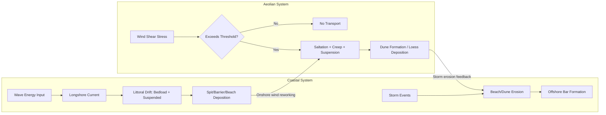

## Coastal and Aeolian Geomorphology

### Definition and Scope

Coastal and aeolian geomorphology is the study of landform development driven by the interaction of water and wind with unconsolidated or erodible surface materials, at the land-ocean interface (coastal) and in wind-dominated terrestrial environments (aeolian). Coastal geomorphology addresses wave, tide, and current-driven processes shaping shorelines, beaches, and estuaries. Aeolian geomorphology addresses wind erosion, sediment transport, and deposition, dominant in arid, semi-arid, and unvegetated sandy environments including coastal dune fields.

### Part I: Coastal Geomorphology

**Wave Mechanics**

Waves are generated by wind stress on the water surface and characterized by wavelength $L$, height $H$, period $T$, and speed $C$. In deep water, wave speed follows the dispersion relation:

$$C = \frac{gT}{2\pi}$$

As waves approach shore and enter shallow water (depth $d < L/20$), they undergo **shoaling**: wavelength decreases, height increases, and speed slows following:

$$C = \sqrt{gd}$$

**Wave breaking** occurs when the height-to-depth ratio reaches a critical value, commonly approximated as:

$$\frac{H_b}{d_b} \approx 0.78$$

though this ratio varies with beach slope and wave steepness. [Inference: 0.78 is a widely cited average; actual breaking index ranges roughly 0.6–1.2 depending on conditions]

**Wave Refraction and Diffraction**

- **Refraction**: Waves bend as they approach shore at an angle, because the portion of the wave in shallower water slows relative to the portion in deeper water, causing wave crests to align increasingly parallel to shore.
- **Diffraction**: Wave energy spreads laterally into the sheltered zone behind an obstacle (headland, breakwater, island), redistributing energy along the shoreline.

**Longshore Drift**

Waves approaching at an oblique angle generate a net longshore current and associated sediment transport parallel to shore, known as longshore drift or littoral drift. The longshore sediment transport rate is commonly estimated using the CERC (Coastal Engineering Research Center) formula, which relates transport rate to the longshore component of wave energy flux at the breaker line. Sediment moves in a net direction determined by the dominant wave approach angle, though this direction can reverse seasonally in response to shifting wind and wave climate. [Inference: seasonal reversal is site-specific]

**Coastal Landform Types**

- **Beaches**: Depositional wave-built features composed of sand, gravel, or shell material, exhibiting characteristic berm-and-bar morphology.
- **Spits**: Elongated depositional features extending from the shoreline, built by longshore drift, often terminating in a recurved hook where wave refraction redirects transport.
- **Barrier islands**: Shore-parallel sand ridges separated from the mainland by a lagoon, formed through a combination of processes including sea-level rise drowning coastal ridges, spit breaching, and offshore bar emergence, with formation mechanism varying by regional setting. [Unverified: barrier island genesis remains debated in specific settings]
- **Tombolos**: Sediment bridges connecting an island to the mainland or to another island, formed by wave refraction/diffraction around the island creating a zone of convergent deposition.
- **Sea cliffs and wave-cut platforms**: Erosional features formed by wave undercutting of coastal bedrock, producing a retreating cliff face and a gently sloping abrasion platform at its base.
- **Estuaries**: Semi-enclosed coastal water bodies with free connection to the sea, subject to tidal mixing of fresh and saline water; classified by formation mechanism (drowned river valley, bar-built, tectonic, fjord).

**Coastal Erosion and Sediment Budget**

The coastal sediment budget framework tracks sediment inputs (river discharge, cliff erosion, aeolian input, offshore sources) against outputs (longshore transport out of the cell, offshore loss, burial) within a defined **littoral cell**. A negative budget (inputs < outputs) results in net erosion/shoreline retreat; a positive budget results in accretion.

$$\Delta V = (Q_{in} - Q_{out}) + (S_{in} - S_{out})$$

where $Q$ terms represent longshore transport at cell boundaries and $S$ terms represent other sources/sinks.

**Sea-Level Rise Response**

The **Bruun Rule** is a classical model predicting shoreline retreat in response to sea-level rise, based on the assumption that the nearshore profile maintains equilibrium shape by eroding the upper beach/dune and depositing the material offshore:

$$R = \frac{L^*}{h^* + B} \times S$$

where $R$ is shoreline retreat, $S$ is sea-level rise, $L^*$ is the cross-shore distance to closure depth, $h^*$ is closure depth, and $B$ is berm/dune height. The Bruun Rule has been widely applied but is also widely critiqued for oversimplifying sediment budget dynamics and ignoring alongshore sediment exchange; modern coastal management increasingly supplements or replaces it with process-based numerical models. [Inference: reflects ongoing debate in coastal science literature]

**Tidal Processes and Landforms**

- **Tidal flats**: Low-gradient depositional surfaces exposed and submerged by the tidal cycle, typically muddy in low-energy settings.
- **Salt marshes and mangroves**: Vegetated intertidal ecosystems that trap fine sediment and build elevation through organic and mineral accretion, providing significant coastal protection function.
- **Tidal inlets and deltas**: Channels connecting a lagoon/estuary to the open ocean, flanked by flood-tidal and ebb-tidal deltas formed by sediment deposition where tidal jet flow decelerates.

### Part II: Aeolian Geomorphology

**Wind Erosion Mechanics**

Wind entrains and transports sediment through three modes, directly analogous to fluvial transport modes:

- **Suspension**: Fine particles (typically < 0.06–0.07 mm, silt/clay) lifted into the airflow and transported over long distances, sometimes intercontinentally.
- **Saltation**: The dominant mode for sand-sized particles (approximately 0.06–2 mm); grains bounce along the surface in a series of hops, each impact ejecting additional grains ("splash" process).
- **Creep (surface/reptation)**: Coarser grains (too heavy for saltation) rolled or pushed along the surface by the impact of saltating grains, typically accounting for roughly 20–25% of total transport. [Inference: proportion varies with grain size distribution]

**Threshold Shear Velocity**

The minimum wind shear velocity $u_*$ required to initiate particle motion is described by the Bagnold threshold relationship:

$$u_{*t} = A \sqrt{\frac{(\rho_s - \rho_a)}{\rho_a} g D}$$

where $A$ is an empirical coefficient (approximately 0.1 for dry, loose sand), $\rho_s$ is particle density, $\rho_a$ is air density, $g$ is gravitational acceleration, and $D$ is grain diameter. Threshold velocity increases with surface moisture, crusting, and vegetation cover, all of which bind particles and increase the effective roughness length.

**Aeolian Sediment Transport Rate**

Bagnold's original sand transport equation relates mass transport rate $q$ to the cube of shear velocity:

$$q = C \sqrt{\frac{D}{D_{50}}} \frac{\rho_a}{g} u_*^3$$

where $C$ is an empirical coefficient dependent on grain size sorting. Later formulations (e.g., Lettau and Lettau, Kawamura) modify this relationship using $(u_* - u_{*t})$ terms to better represent transport near threshold conditions. [Inference: multiple competing formulas exist; predictive accuracy varies by field setting]

**Dune Types and Morphology**

Dune morphology reflects the interaction of sediment supply, vegetation cover, and wind regime (unidirectional vs. multidirectional):

- **Barchan dunes**: Crescent-shaped dunes with horns pointing downwind, forming under unidirectional wind and limited sediment supply; migrate as coherent bedforms.
- **Transverse dunes**: Wave-like ridges oriented perpendicular to a dominant unidirectional wind, forming under abundant sediment supply.
- **Linear (seif) dunes**: Long, straight ridges aligned parallel to the resultant wind direction, typically forming under bidirectional wind regimes.
- **Star dunes**: Pyramidal dunes with multiple radiating arms, forming under complex, multidirectional wind regimes; among the tallest dune types.
- **Parabolic dunes**: U-shaped dunes with arms pointing upwind (opposite orientation to barchans), typically anchored and shaped by vegetation, common in coastal and semi-arid settings.
- **Coastal foredunes**: Vegetated dune ridges immediately landward of the beach, built by onshore winds trapping sand in vegetation, forming a primary line of coastal protection.

**Dune Migration**

Dune migration rate is inversely related to dune height, following approximately:

$$C_d = \frac{Q_s}{\rho_s (1 - \epsilon) H}$$

where $C_d$ is dune migration celerity, $Q_s$ is sand flux over the crest, $\rho_s$ is sediment density, $\epsilon$ is porosity, and $H$ is dune height. This produces the well-documented pattern of smaller dunes migrating faster than larger ones within the same wind regime.

**Loess Formation**

Loess is a wind-deposited, poorly sorted silt accumulation, typically sourced from glacial outwash plains, desert margins, or river floodplains during periods of sparse vegetation cover (notably glacial periods). Loess deposits form some of the most fertile agricultural soils globally (e.g., the Loess Plateau, China; the Mississippi Valley loess belt) due to their fine texture, high mineral content, and good drainage.

**Deflation and Desert Pavement**

- **Deflation**: Removal of fine material by wind, lowering the land surface and leaving a residual lag of coarser particles.
- **Desert pavement**: A tightly packed surface layer of gravel/pebbles formed through deflation of fines and/or upward migration of clasts through repeated wetting-drying and freeze-thaw cycles; classical deflation-only models have been increasingly supplemented by evidence for vertical clast sorting mechanisms. [Unverified: relative contribution of each mechanism debated and likely varies regionally]
- **Yardangs**: Streamlined, wind-abraded bedrock or indurated sediment ridges aligned parallel to the dominant wind direction.

### Coupled Coastal-Aeolian Interaction

Coastal dune systems represent a direct coupling of both process domains: beach sediment supplied by wave/longshore processes is reworked by onshore winds into foredunes, which in turn provide a sediment reservoir buffering the beach during storm erosion. This beach-dune sediment exchange is a key control on shoreline resilience to storms and sea-level rise. [Inference: general principle, magnitude varies by site-specific sediment budget]

### Coastal Profile and Dune Type Diagram (svg_diagram)

<svg xmlns="http://www.w3.org/2000/svg" viewBox="0 0 800 460">
<text x="400" y="25" font-size="16" font-weight="bold" text-anchor="middle" fill="#1a1a1a">Coastal Profile and Aeolian Dune Morphotypes (svg_diagram)</text>

<text x="400" y="50" font-size="13" font-weight="bold" text-anchor="middle" fill="`#1a1a1a`">A. Coastal Zone Cross-Section</text>

<path d="M 50 180 Q 200 160 300 150 L 400 120 L 450 90 L 500 130 L 780 140" fill="none" stroke="`#1a1a1a`" stroke-width="2" />

<rect x="50" y="180" width="730" height="50" fill="`#63b3ed`" opacity="0.6" />

<text x="150" y="215" font-size="11" fill="`#1a365d`">Nearshore / Surf Zone</text>

<rect x="300" y="150" width="100" height="30" fill="`#f6e05e`" opacity="0.8" />

<text x="350" y="200" font-size="11" fill="`#744210`" text-anchor="middle">Beach</text>

<ellipse cx="450" cy="100" rx="55" ry="25" fill="`#d69e2e`" />

<text x="450" y="105" font-size="11" fill="white" text-anchor="middle">Foredune</text>

<rect x="550" y="130" width="200" height="15" fill="`#9ae6b4`" />

<text x="650" y="128" font-size="11" fill="`#22543d`" text-anchor="middle">Backdune / Vegetated Terrain</text>

<text x="220" y="140" font-size="10" fill="`#2c5282`">Breaker Zone</text>

<text x="400" y="270" font-size="13" font-weight="bold" text-anchor="middle" fill="`#1a1a1a`">B. Aeolian Dune Types (plan view, wind from left)</text>

<path d="M 90 320 Q 130 300 150 320 Q 130 340 110 360 Q 100 340 90 320 Z" fill="#ecc94b" />
<text x="120" y="380" font-size="10" text-anchor="middle">Barchan</text>

<path d="M 200 310 Q 230 300 260 310 Q 230 320 200 310" fill="#ecc94b" />
<path d="M 200 330 Q 230 320 260 330 Q 230 340 200 330" fill="#ecc94b" />
<path d="M 200 350 Q 230 340 260 350 Q 230 360 200 350" fill="#ecc94b" />
<text x="230" y="380" font-size="10" text-anchor="middle">Transverse</text>

<rect x="320" y="300" width="8" height="65" fill="#ecc94b" transform="rotate(15 324 332)" />
<rect x="345" y="300" width="8" height="65" fill="#ecc94b" transform="rotate(15 349 332)" />
<text x="345" y="380" font-size="10" text-anchor="middle">Linear (Seif)</text>

<path d="M 450 332 L 470 310 L 460 332 L 480 335 L 460 340 L 470 360 L 450 340 L 430 360 L 442 338 L 420 335 L 442 328 L 430 310 Z" fill="#ecc94b" />
<text x="450" y="380" font-size="10" text-anchor="middle">Star</text>

<path d="M 560 300 Q 540 340 560 365 Q 590 350 590 330 Q 590 350 620 365 Q 640 340 620 300 Q 600 320 590 320 Q 580 320 560 300 Z" fill="#ecc94b" />
<text x="590" y="385" font-size="10" text-anchor="middle">Parabolic</text>

<path d="M 700 310 L 750 310" stroke="#1a1a1a" stroke-width="2" marker-end="url(#arrow2)" />
<text x="725" y="300" font-size="10" text-anchor="middle">Wind</text>
<text x="400" y="420" font-size="10" fill="`#4a5568`" text-anchor="middle">Dune form reflects sediment supply, vegetation cover, and wind directional variability</text>

</svg>

### Sediment Transport Process Comparison Diagram

### Applied Contexts

- **Coastal protection engineering**: Groins, jetties, breakwaters, and beach nourishment programs are designed using littoral cell sediment budgets and wave climate analysis; hard structures often interrupt longshore drift, causing downdrift erosion.
- **Dune stabilization**: Vegetation planting (e.g., marram grass, sea oats) and sand fencing are used to trap aeolian sediment and rebuild protective foredunes after storm damage.
- **Desertification monitoring**: Remote sensing (MODIS, Sentinel) and dust transport modeling are used to track aeolian erosion and land degradation in arid/semi-arid regions.
- **Sea-level rise adaptation planning**: Combines Bruun-Rule-type estimates with process-based numerical models (e.g., XBeach, CoSMoS) to project shoreline change under future climate scenarios.

### Key Points

- Coastal geomorphology is driven primarily by wave energy, tidal processes, and longshore sediment transport operating within defined littoral cells.
- Aeolian geomorphology is governed by wind shear velocity exceeding a grain-size-dependent threshold, producing saltation-dominated sediment transport and a wide diversity of dune forms controlled by wind directionality and sediment supply.
- Both systems exhibit strong sediment budget dependency: erosion and accretion patterns reflect the balance of sediment inputs and outputs across a defined cell or system boundary.
- Coastal dunes represent a direct physical coupling between wave-driven beach processes and wind-driven aeolian processes.
- Human infrastructure (jetties, seawalls, dams reducing fluvial sediment supply) frequently disrupts natural sediment budgets, exacerbating coastal erosion.

**Related Topics**

- Wave climate analysis and nearshore hydrodynamic modeling
- Estuarine and lagoonal sedimentation processes
- Desert landform systems and arid geomorphology
- Coastal hazard mapping and storm surge modeling
- Beach nourishment design and littoral cell management
- Loess stratigraphy and paleoclimate reconstruction
- Remote sensing for shoreline change detection (DSAS, satellite-derived shorelines)
- Sea-level rise projection models and coastal vulnerability indices
- Sediment provenance and mineralogy in coastal/aeolian systems
- Dune ecology and vegetation-landform feedback