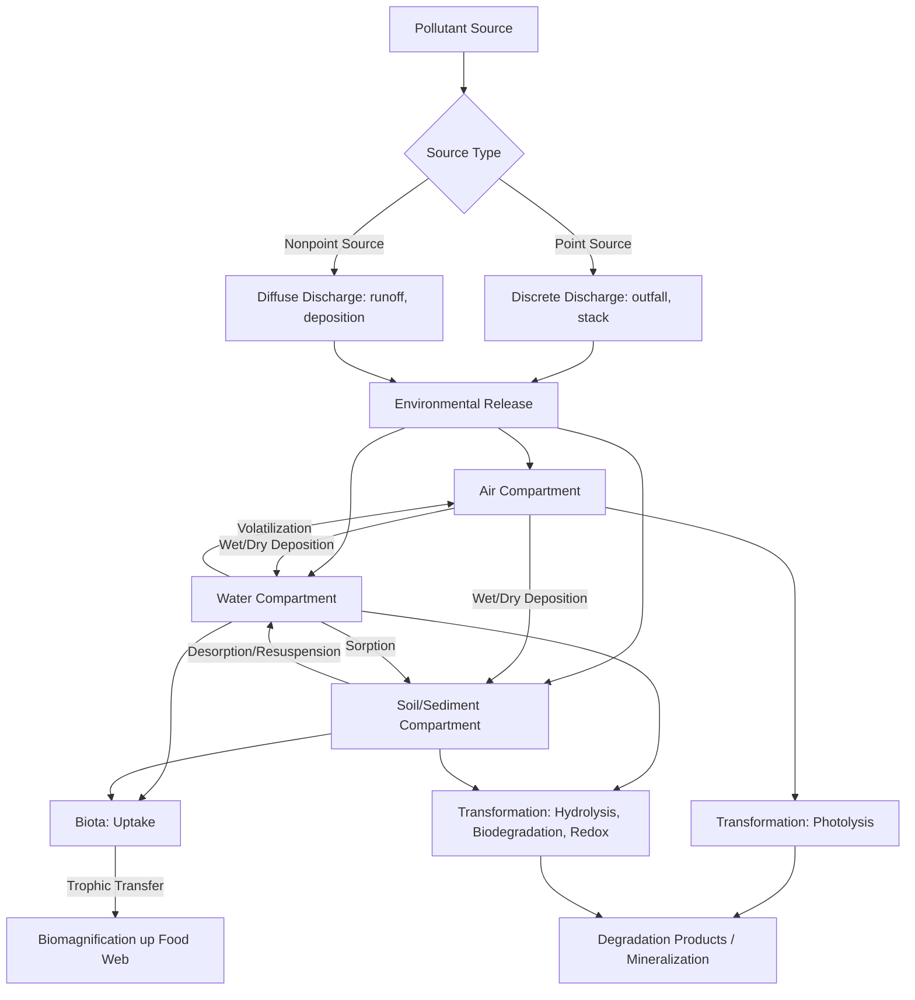

## Sources and Fate of Pollutants

### Definition and Scope

The study of pollutant sources and fate examines where contaminants originate, how they move through environmental compartments (air, water, soil, biota), and the physical, chemical, and biological transformations they undergo over time. This framework—commonly termed "fate and transport"—underpins environmental risk assessment, remediation design, and regulatory exposure modeling.

### Classification of Pollution Sources

**Point Sources**

Discrete, identifiable discharge locations, such as industrial outfalls, wastewater treatment plant effluent pipes, and smokestacks. Point sources are generally easier to regulate and monitor due to their discrete, quantifiable discharge, and are the primary focus of permitting systems such as the U.S. National Pollutant Discharge Elimination System (NPDES).

**Nonpoint Sources**

Diffuse sources without a single identifiable discharge point, including agricultural runoff, urban stormwater, atmospheric deposition, and failing septic systems. Nonpoint source pollution is generally more difficult to regulate and control because it originates across a distributed landscape rather than a discrete outfall, making it a dominant contributor to water quality impairment in many watersheds. [Inference: relative contribution varies substantially by region and land use]

**Primary vs. Secondary Pollutants**

- **Primary pollutants**: Emitted directly into the environment from a source (e.g., $\text{SO}_2$ from combustion, particulate matter from industrial processes).
- **Secondary pollutants**: Formed through chemical reactions in the environment (e.g., ground-level ozone formed from $\text{NOx}$ and VOC photochemistry, secondary organic aerosols).

### Environmental Compartments and the Multimedia Framework

Pollutants distribute across environmental compartments—air, surface water, groundwater, soil/sediment, and biota—governed by their physicochemical properties. The **fugacity approach** (Mackay-type multimedia models) provides a standardized framework for predicting equilibrium partitioning across compartments based on fugacity capacity ($Z$ values) for each medium, widely used in regulatory-scale environmental fate modeling. [Inference: fugacity models provide equilibrium estimates; actual field partitioning may lag due to kinetic constraints]

**Key Partitioning Properties**

| Property | Symbol | Governs |
| --- | --- | --- |
| Water solubility | $S_w$ | Aqueous mobility |
| Vapor pressure | $P_v$ | Volatility |
| Henry's Law constant | $K_H$ | Air-water exchange |
| Octanol-water partition coefficient | $K_{ow}$ | Bioaccumulation potential, sorption tendency |
| Organic carbon partition coefficient | $K_{oc}$ | Soil/sediment sorption |
| Bioconcentration factor | $BCF$ | Uptake into aquatic organisms |

### Transport Mechanisms

**Advection**

Bulk transport of a pollutant with the moving fluid (air or water), described by the advective flux:

$$J_{adv} = vC$$

where $v$ is fluid velocity and $C$ is concentration. Advection dominates transport in flowing surface water, groundwater under a hydraulic gradient, and wind-driven atmospheric transport.

**Dispersion and Diffusion**

Spreading of a contaminant plume due to molecular diffusion (concentration-gradient-driven) and mechanical/turbulent dispersion (velocity heterogeneity). Combined, these processes are described by the advection-dispersion equation:

$$\frac{\partial C}{\partial t} = D \frac{\partial^2 C}{\partial x^2} - v \frac{\partial C}{\partial x} - \lambda C$$

where $D$ is the dispersion coefficient and $\lambda$ represents a first-order decay/reaction term. This equation forms the mathematical foundation of most groundwater and surface water contaminant transport models.

**Atmospheric Transport and Deposition**

Pollutants released to the atmosphere disperse according to meteorological conditions (wind speed/direction, atmospheric stability, mixing height) and are removed via:

- **Dry deposition**: Direct settling or surface uptake of particles and gases without precipitation involvement.
- **Wet deposition**: Scavenging of pollutants by precipitation (rainout within clouds, washout below clouds), a dominant removal mechanism for many soluble and particle-bound pollutants, and the primary mechanism behind acid rain formation.

Long-range atmospheric transport allows persistent, semi-volatile compounds to undergo repeated cycles of volatilization and deposition, progressively fractionating toward colder regions—a phenomenon known as the **"grasshopper effect,"** which explains the presence of persistent organic pollutants (POPs) in polar regions far from their emission sources.

### Fate Processes: Transformation and Degradation

**Abiotic Transformation**

- **Hydrolysis**: Reaction with water, breaking chemical bonds (e.g., ester or amide hydrolysis), often pH-dependent.
- **Photolysis**: Direct or indirect light-driven degradation (see environmental chemistry fundamentals for mechanism detail).
- **Oxidation-reduction reactions**: Transformation driven by reaction with environmental oxidants (e.g., $\text{O}_2$, $\text{MnO}_2$) or reductants (e.g., $\text{Fe}^{2+}$, sulfide).

**Biotic Transformation (Biodegradation)**

Microbially mediated breakdown of organic contaminants, occurring under aerobic or anaerobic conditions depending on redox environment and electron acceptor availability:

- **Aerobic biodegradation**: Uses $\text{O}_2$ as the terminal electron acceptor; generally faster and often more complete (mineralization to $\text{CO}_2$ and $\text{H}_2\text{O}$) for many organic compound classes.
- **Anaerobic biodegradation**: Uses alternative electron acceptors ($\text{NO}_3^-$, $\text{Fe}^{3+}$, $\text{SO}_4^{2-}$, $\text{CO}_2$); can be the dominant pathway in subsurface, saturated, or sediment environments, and is essential for degrading some compounds resistant to aerobic attack (e.g., highly chlorinated solvents via reductive dechlorination).

**Recalcitrance and Persistence**

Some compounds resist degradation due to structural features (e.g., halogenation, aromatic ring stability, branching) that limit microbial enzyme accessibility or make the molecule thermodynamically unfavorable to break down. These compounds are termed **persistent organic pollutants (POPs)** when they combine persistence, bioaccumulation potential, and long-range transport capability, as codified in the Stockholm Convention.

### Bioaccumulation and Biomagnification

**Bioaccumulation**: The net accumulation of a substance in an organism from all exposure routes (water, food, sediment contact), typically quantified by the bioaccumulation factor:

$$BAF = \frac{C_{organism}}{C_{environment}}$$

**Biomagnification**: The increase in tissue concentration of a substance at successive trophic levels, occurring when uptake rate exceeds elimination rate and the substance is preferentially retained (typically lipophilic, poorly metabolized compounds). Quantified via the biomagnification factor:

$$BMF = \frac{C_{predator}}{C_{prey}}$$

Classic examples include DDT/DDE and methylmercury, both of which biomagnify substantially through aquatic and terrestrial food webs, producing top-predator concentrations orders of magnitude above ambient environmental levels. [Inference: magnitude varies by ecosystem, food web length, and compound-specific metabolism]

### Major Pollutant Classes and Characteristic Fate Behavior

**Heavy Metals**

Metals do not degrade; their environmental fate is governed entirely by speciation, complexation, sorption/desorption, and precipitation/dissolution reactions rather than destruction. Bioavailability and toxicity depend strongly on chemical species (e.g., $\text{Cr}^{3+}$ vs. $\text{Cr}^{6+}$; inorganic mercury vs. methylmercury) rather than total concentration alone.

**Persistent Organic Pollutants (POPs)**

Characterized by high $\log K_{ow}$ (lipophilicity), low water solubility, resistance to degradation, and semi-volatility enabling atmospheric transport. Includes legacy pesticides (DDT, chlordane), industrial chemicals (PCBs), and unintentional combustion byproducts (dioxins, furans).

**Nutrients (Nitrogen and Phosphorus)**

Highly mobile in dissolved form; fate is governed by biological uptake, microbial transformation (nitrification/denitrification), and sediment burial. Excess nutrient loading drives eutrophication, algal blooms, and hypoxia in receiving waters.

**Emerging Contaminants**

A growing category including pharmaceuticals, personal care products, and per- and polyfluoroalkyl substances (PFAS). PFAS are notable for extreme environmental persistence due to the strength of the carbon-fluorine bond, high water solubility for many short-chain variants (enabling long-distance aqueous transport), and resistance to standard treatment processes, prompting the informal designation "forever chemicals." [Inference: reflects current mainstream characterization; specific regulatory thresholds remain an active area of policy development]

### Pollutant Fate Pathway Diagram

### Worked Example

**Problem**: A PCB congener has $\log K_{ow} = 6.0$. Estimate its qualitative fate behavior and identify the dominant environmental compartment it would partition to.

**Solution**:

A $\log K_{ow}$ of 6.0 indicates strong hydrophobicity (high lipophilicity). Applying the general relationship $\log K_{oc} \approx \log K_{ow} - 0.5$ to $1$ (compound-class dependent), this suggests a $\log K_{oc}$ in the range of approximately 5.0–5.5, indicating strong sorption to organic carbon in soil and sediment. [Inference: regression coefficient used is illustrative and compound-class-dependent]

Combined with typically low water solubility and moderate-to-low volatility for higher-chlorinated PCB congeners, the compound would be expected to:

1. Partition predominantly to sediment and soil organic matter rather than remaining in the dissolved aqueous phase.
2. Exhibit strong bioaccumulation potential due to high lipophilicity, favoring biomagnification through lipid-rich tissues in the food web.
3. Resist biodegradation due to structural stability, contributing to long-term persistence in depositional sediment environments.

This qualitative assessment is consistent with the well-documented environmental behavior of higher-chlorinated PCB congeners. [Inference: specific congener behavior varies with exact chlorination pattern]

### Applied Contexts

- **Environmental risk assessment**: Fate and transport properties feed directly into exposure modeling for human health and ecological risk assessment frameworks (e.g., EPA's risk assessment guidance).
- **Site remediation**: Understanding dominant fate processes (sorption vs. degradation vs. volatilization) determines appropriate remediation technology selection (pump-and-treat, in-situ bioremediation, soil vapor extraction).
- **Regulatory chemical assessment**: $\log K_{ow}$, persistence, and bioaccumulation criteria are core screening parameters in chemical regulatory frameworks (e.g., REACH, TSCA, Stockholm Convention POP listing criteria).
- **Watershed management**: Point vs. nonpoint source distinction shapes regulatory strategy, with nonpoint sources typically addressed through best management practices (BMPs) rather than direct permitting.
- **Food web contamination monitoring**: Biomagnification modeling informs fish consumption advisories and wildlife health monitoring programs.

### Key Points

- Pollutant sources are classified as point (discrete, regulable) or nonpoint (diffuse, harder to control), and pollutants as primary (directly emitted) or secondary (formed via environmental reactions).
- Fate is governed by the interplay of transport processes (advection, dispersion, atmospheric deposition) and transformation processes (abiotic and biotic degradation).
- Physicochemical properties ($K_{ow}$, $K_{oc}$, $K_H$, water solubility) predict which environmental compartment a pollutant will preferentially occupy.
- Persistent, lipophilic compounds are prone to bioaccumulation and biomagnification, producing disproportionate exposure at higher trophic levels.
- Metals do not degrade and are governed entirely by speciation and phase-partitioning reactions, in contrast to organic pollutants, which can undergo true chemical/biological destruction.

**Related Topics**

- Multimedia fugacity modeling (Mackay Level I/II/III/IV models)
- Groundwater contaminant transport modeling (advection-dispersion-reaction)
- Persistent organic pollutants and the Stockholm Convention
- PFAS chemistry, treatment, and regulation
- Ecological risk assessment and exposure pathway analysis
- Nonpoint source pollution management and best management practices
- Bioaccumulation and biomagnification modeling in food webs
- Site remediation technology selection
- Atmospheric long-range transport and the grasshopper effect
- Heavy metal speciation and bioavailability assessment