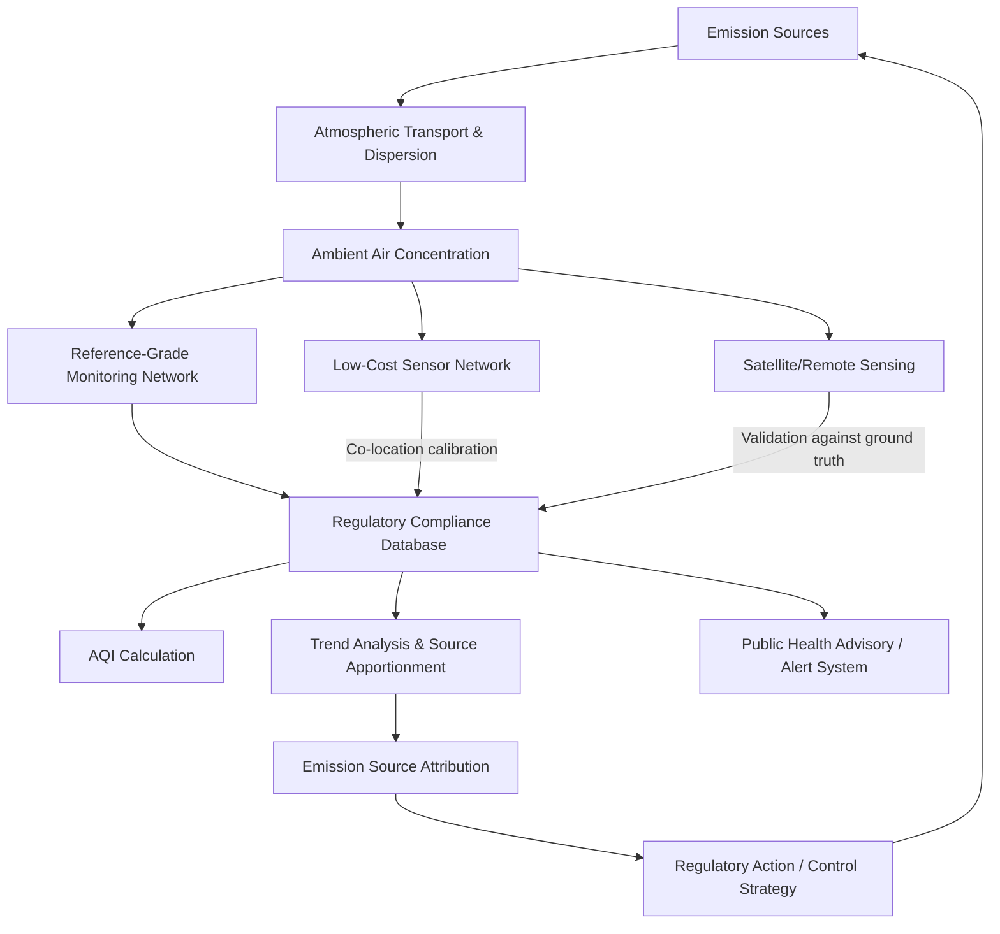

## Air Contamination and Monitoring

### Definition and Scope

Air contamination and monitoring encompasses the characterization of atmospheric pollutant sources, their chemical and physical behavior, and the measurement technologies and regulatory frameworks used to quantify air quality. This field integrates atmospheric chemistry, instrumentation science, and public health exposure assessment to support pollution control and regulatory compliance.

### Major Air Pollutant Classes

**Criteria Air Pollutants**

The U.S. EPA (and analogous bodies internationally) regulate a set of "criteria pollutants" based on well-documented health and environmental effects:

- **Particulate Matter (PM)**: Classified by aerodynamic diameter—$PM_{10}$ (≤10 µm) and $PM_{2.5}$ (≤2.5 µm, "fine" particulates). $PM_{2.5}$ penetrates deep into the respiratory tract and is associated with cardiovascular and respiratory morbidity/mortality in the epidemiological literature.
- **Ground-level Ozone ($O_3$)**: A secondary pollutant formed photochemically from $\text{NOx}$ and VOC precursors (see environmental chemistry fundamentals).
- **Nitrogen Dioxide ($\text{NO}_2$)**: Emitted primarily from combustion sources (vehicles, power plants); also a precursor to ozone and secondary particulate formation.
- **Sulfur Dioxide ($\text{SO}_2$)**: Primarily from fossil fuel combustion (especially high-sulfur coal) and industrial processes; precursor to acid deposition and sulfate aerosol.
- **Carbon Monoxide (CO)**: Product of incomplete combustion; binds hemoglobin with much higher affinity than oxygen, causing acute toxicity at elevated concentrations.
- **Lead (Pb)**: Historically dominant from leaded gasoline (now phased out in most jurisdictions); current sources include industrial emissions and legacy contaminated soil/dust.

**Hazardous Air Pollutants (HAPs) / Air Toxics**

A broader category (188 compounds under the U.S. Clean Air Act) including known or suspected carcinogens and other compounds with serious health effects at lower concentrations, such as benzene, formaldehyde, and various metals (arsenic, cadmium, mercury).

**Greenhouse Gases**

While not classified as criteria pollutants, greenhouse gases ($\text{CO}_2$, $\text{CH}_4$, $\text{N}_2\text{O}$, fluorinated gases) are increasingly monitored and regulated through separate climate-focused frameworks.

### Particulate Matter: Formation and Properties

**Primary vs. Secondary Particulates**

- **Primary PM**: Directly emitted particles (combustion soot, dust, sea spray, construction emissions).
- **Secondary PM**: Formed via atmospheric chemical reactions from gaseous precursors ($\text{SO}_2$, $\text{NOx}$, $\text{NH}_3$, VOCs), producing sulfate, nitrate, ammonium, and secondary organic aerosol (SOA).

**Size Fraction and Health Relevance**

Particle size directly governs the depth of respiratory penetration:

| Size Fraction | Deposition Zone | Primary Health Concern |
| --- | --- | --- |
| $PM_{10}$ (coarse, 2.5–10 µm) | Upper respiratory tract | Irritation, aggravation of asthma |
| $PM_{2.5}$ (fine) | Deep lung (alveolar region) | Cardiovascular/respiratory disease, mortality |
| $PM_{0.1}$ (ultrafine) | Alveolar region, potential systemic translocation | Emerging area of research; systemic inflammatory effects |

Ultrafine particle health effects and translocation mechanisms remain an active research area with evolving evidence. [Unverified: mechanistic pathways and dose-response relationships still being characterized]

**Aerosol Optical and Chemical Characterization**

Aerosol composition is commonly resolved into components: sulfate, nitrate, ammonium, organic carbon (OC), elemental/black carbon (EC), and crustal/mineral dust, each with distinct source signatures used in source apportionment studies.

### Atmospheric Dispersion Modeling

**Gaussian Plume Model**

The foundational analytical model for estimating downwind pollutant concentration from a point source, based on the assumption of Gaussian (normal) distribution of concentration in the crosswind and vertical directions:

$$C(x,y,z) = \frac{Q}{2\pi u \sigma_y \sigma_z} \exp\left(-\frac{y^2}{2\sigma_y^2}\right) \left[\exp\left(-\frac{(z-H)^2}{2\sigma_z^2}\right) + \exp\left(-\frac{(z+H)^2}{2\sigma_z^2}\right)\right]$$

where $Q$ is emission rate, $u$ is wind speed, $\sigma_y$ and $\sigma_z$ are horizontal and vertical dispersion coefficients (functions of downwind distance and atmospheric stability class), and $H$ is effective stack height. The reflection term (second exponential) accounts for ground-level reflection assuming no surface deposition.

**Atmospheric Stability Classes**

Dispersion coefficients depend on atmospheric stability, commonly classified using the **Pasquill-Gifford stability classes** (A through F, from most unstable/turbulent to most stable), determined by wind speed, solar insolation, and cloud cover. Unstable conditions (strong daytime heating, low wind) promote rapid vertical mixing and dilution; stable conditions (nighttime, temperature inversions) suppress mixing and can lead to pollutant accumulation near the surface.

**Temperature Inversions**

A temperature inversion occurs when temperature increases with altitude (contrary to the normal decreasing lapse rate), trapping a stable air layer beneath and suppressing vertical mixing. Inversions are strongly associated with severe urban smog episodes, as pollutants accumulate within the confined near-surface layer rather than dispersing upward. [Inference: well-documented association; severity also depends on local topography and emission rates]

### Air Quality Monitoring Technologies

**Reference-Grade (Regulatory) Monitoring**

- **Federal Reference Method (FRM) / Federal Equivalent Method (FEM) samplers**: Gravimetric filter-based $PM_{2.5}$/$PM_{10}$ samplers providing the regulatory benchmark for compliance monitoring; high accuracy but low temporal resolution (typically 24-hour integrated samples).
- **Chemiluminescence analyzers**: Standard method for $\text{NOx}$/$\text{NO}_2$ measurement, based on the light emission from the reaction of NO with ozone.
- **UV photometry**: Standard method for ozone measurement, based on UV light absorption proportional to ozone concentration (Beer-Lambert law).
- **Pulsed fluorescence**: Standard method for $\text{SO}_2$ measurement, based on UV-induced fluorescence emission proportional to $\text{SO}_2$ concentration.
- **Non-dispersive infrared (NDIR)**: Standard method for CO measurement, based on infrared absorption at CO-specific wavelengths.

**Low-Cost Sensor Networks**

Increasingly deployed for high-spatial-density monitoring, typically using:

- **Optical particle counters/nephelometers**: Estimate PM mass concentration from light scattering, generally less accurate than gravimetric FRM methods and sensitive to humidity and particle composition artifacts.
- **Electrochemical gas sensors**: Low-cost sensors for gases (CO, $\text{NO}_2$, $\text{O}_3$), generally exhibiting greater cross-sensitivity and drift compared to reference instruments.

Low-cost sensor networks generally trade absolute accuracy for spatial density and temporal resolution, and are increasingly used to supplement (not replace) regulatory-grade networks, often requiring co-location calibration against reference monitors to correct for known biases. [Inference: calibration requirements and accuracy trade-offs are active areas of ongoing sensor research and standardization]

**Remote Sensing Approaches**

- **Satellite-based monitoring**: Instruments such as TROPOMI (Sentinel-5P), OMI, and MODIS provide column-integrated measurements of $\text{NO}_2$, $\text{SO}_2$, aerosol optical depth (AOD), and other species at regional to global scale, useful for trend analysis and identifying major emission sources but with coarser spatial/temporal resolution than ground monitors for most applications.
- **DOAS (Differential Optical Absorption Spectroscopy)**: Ground-based or satellite technique measuring trace gas concentrations via characteristic absorption spectra along an optical path.
- **LIDAR**: Laser-based remote sensing used to profile aerosol vertical distribution and boundary layer height.

### Air Quality Indices and Standards

**Air Quality Index (AQI)**

A standardized, publicly communicated index converting measured pollutant concentrations into a common 0–500 scale with associated health category labels (Good, Moderate, Unhealthy for Sensitive Groups, Unhealthy, Very Unhealthy, Hazardous), calculated using pollutant-specific breakpoint concentration tables. AQI calculation methodology and specific breakpoints vary by country/regulatory jurisdiction. [Unverified: specific breakpoint values require reference to current regulatory tables, which are periodically revised]

**National Ambient Air Quality Standards (NAAQS)**

U.S. regulatory framework establishing maximum allowable concentrations for criteria pollutants, divided into:

- **Primary standards**: Protect public health, including sensitive populations.
- **Secondary standards**: Protect public welfare (visibility, crops, materials, ecosystems).

Analogous frameworks exist internationally (e.g., EU Ambient Air Quality Directives, WHO Air Quality Guidelines), with WHO guideline values generally more stringent than many national regulatory standards. [Inference: reflects general pattern; specific comparisons require checking current published values]

### Air Quality Monitoring System Architecture

### Worked Example

**Problem**: A point source emits $\text{SO}_2$ at $Q = 50 \, \text{g/s}$, with wind speed $u = 4 \, \text{m/s}$. At a downwind ground-level receptor directly on the plume centerline ($y=0$, $z=0$), with effective stack height $H = 50 \, \text{m}$, and at this distance $\sigma_y = 100 \, \text{m}$, $\sigma_z = 80 \, \text{m}$. Estimate ground-level concentration.

**Solution**:

At $y=0$, $z=0$, the Gaussian plume equation simplifies to:

$$C = \frac{Q}{\pi u \sigma_y \sigma_z} \exp\left(-\frac{H^2}{2\sigma_z^2}\right)$$

$$C = \frac{50}{\pi \times 4 \times 100 \times 80} \exp\left(-\frac{50^2}{2 \times 80^2}\right)$$

$$C = \frac{50}{100530.9} \times \exp(-0.1953)$$

$$C \approx 4.973 \times 10^{-4} \times 0.8226 \approx 4.09 \times 10^{-4} \, \text{g/m}^3 = 409 \, \mu\text{g/m}^3$$

This idealized calculation assumes steady-state meteorological conditions, flat terrain, and no chemical transformation or deposition losses; actual field concentrations will vary with real-time atmospheric turbulence, terrain effects, and building wake effects not captured in the basic Gaussian model. [Inference]

### Applied Contexts

- **Regulatory compliance monitoring**: Reference-grade networks generate the legally binding data used for NAAQS attainment determination and enforcement actions.
- **Environmental justice assessment**: Spatial air quality data (including low-cost sensor networks) is increasingly used to characterize disproportionate pollution burden in marginalized communities.
- **Industrial permitting**: Dispersion modeling (e.g., EPA's AERMOD) is required for new/modified source permitting to demonstrate compliance with ambient standards.
- **Public health alert systems**: Real-time AQI reporting drives public health advisories for sensitive populations during high-pollution episodes.
- **Climate-air quality co-benefit analysis**: Many air pollutant sources overlap with greenhouse gas sources, informing integrated climate and air quality policy design.

### Key Points

- Criteria air pollutants ($PM$, $O_3$, $NO_2$, $SO_2$, $CO$, $Pb$) form the core regulatory framework for ambient air quality management, supplemented by a broader list of hazardous air pollutants.
- Particulate matter health impact scales with decreasing particle size due to deeper respiratory penetration, with $PM_{2.5}$ as the primary regulatory focus.
- Atmospheric dispersion (Gaussian plume modeling) and stability class determine ground-level pollutant concentrations from a given emission rate.
- Air quality monitoring spans a spectrum from high-accuracy, low-spatial-density reference instruments to high-spatial-density, lower-accuracy low-cost sensors and satellite remote sensing.
- The Air Quality Index translates raw pollutant concentrations into a standardized public health communication tool.

**Related Topics**

- Photochemical smog formation and tropospheric ozone chemistry
- Source apportionment methods (chemical mass balance, positive matrix factorization)
- Indoor air quality and infiltration modeling
- Climate co-pollutant policy (short-lived climate pollutants)
- Environmental justice and air pollution exposure disparities
- Emission inventory development and reporting (e.g., National Emissions Inventory)
- Sensor calibration and low-cost network data quality assurance
- Stack testing and continuous emissions monitoring systems (CEMS)
- Health impact assessment and epidemiological exposure-response modeling
- Vehicle emissions standards and mobile source control technology