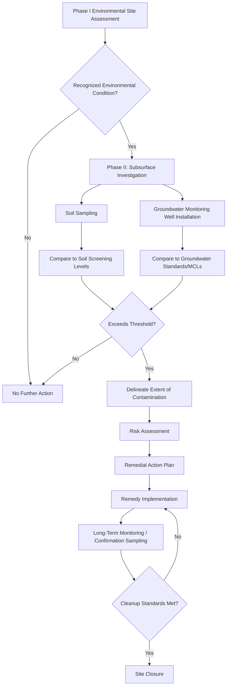

## Water and Soil Contamination

### Definition and Scope

Water and soil contamination encompasses the introduction of substances into aquatic systems (surface water, groundwater) and terrestrial systems (soil, sediment) at concentrations that impair beneficial use, ecological function, or human health. This domain integrates hydrogeology, soil chemistry, and contaminant fate science to characterize contamination sources, migration pathways, and remediation strategies.

### Water Contamination

**Major Water Contaminant Categories**

- **Pathogens**: Bacteria (e.g., *E. coli*, *Salmonella*), viruses, and protozoa (*Giardia*, *Cryptosporidium*) from fecal contamination, sewage discharge, or agricultural runoff; the dominant global cause of acute waterborne disease burden.
- **Nutrients**: Nitrogen (nitrate, ammonium) and phosphorus from agricultural fertilizer runoff, livestock waste, and wastewater discharge; primary drivers of eutrophication.
- **Heavy Metals**: Lead, arsenic, cadmium, mercury, chromium from industrial discharge, mining activity, and natural geologic sources (e.g., arsenic in certain aquifer sediments).
- **Organic Contaminants**: Petroleum hydrocarbons, chlorinated solvents (TCE, PCE), pesticides, and pharmaceuticals/personal care products (PPCPs).
- **Per- and Polyfluoroalkyl Substances (PFAS)**: Highly persistent synthetic compounds from firefighting foam, industrial manufacturing, and consumer products, characterized by extreme environmental persistence and resistance to conventional treatment.
- **Salinity**: Elevated total dissolved solids from seawater intrusion, road salt application, or irrigation return flow.

**Groundwater Contamination and Aquifer Vulnerability**

Groundwater contamination follows the hydraulic gradient of the aquifer, forming a **contaminant plume** that migrates from the source zone. Plume behavior depends on:

- **Hydraulic conductivity** ($K$): Governs groundwater flow velocity via Darcy's Law:

$$q = -K\frac{dh}{dl}$$

where $q$ is specific discharge (Darcy flux), and $dh/dl$ is the hydraulic gradient.

- **Retardation factor** ($R$): Describes the relative velocity of a sorbing contaminant compared to groundwater flow:

$$R = 1 + \frac{\rho_b K_d}{n}$$

where $\rho_b$ is bulk density, $K_d$ is the distribution coefficient, and $n$ is porosity. Non-sorbing (conservative) tracers move at $R=1$ (groundwater velocity); strongly sorbing contaminants exhibit $R \gg 1$, moving substantially slower than the groundwater itself.

**Dense and Light Non-Aqueous Phase Liquids (DNAPLs/LNAPLs)**

- **LNAPLs** (e.g., petroleum products): Less dense than water, float on the water table, forming a distinct floating layer that requires specialized recovery techniques.
- **DNAPLs** (e.g., chlorinated solvents): Denser than water, sink through the saturated zone until encountering a low-permeability layer, potentially pooling and forming long-term source zones that are notoriously difficult to remediate due to their tendency to migrate into small fractures and low-permeability zones inaccessible to conventional pump-and-treat systems. [Inference: remediation difficulty is well-documented in the environmental engineering literature, though site-specific outcomes vary]

**Eutrophication Process**

Excess nutrient loading (particularly phosphorus in freshwater, nitrogen in coastal/marine systems) drives excessive algal and cyanobacterial growth, followed by:

1. Algal bloom proliferation, often dominated by cyanobacteria capable of producing toxins (e.g., microcystin).
2. Algal die-off and sinking of organic matter to the sediment/bottom water.
3. Microbial decomposition consuming dissolved oxygen, producing **hypoxic** (low oxygen) or **anoxic** (no oxygen) conditions.
4. Fish kills and loss of benthic habitat, sometimes forming persistent seasonal "dead zones" (e.g., the Gulf of Mexico hypoxic zone).

### Soil Contamination

**Sources of Soil Contamination**

- **Industrial activity**: Manufacturing, smelting, and chemical processing releasing metals and organic contaminants to surface soil.
- **Mining and mineral processing**: Tailings and waste rock generating acid mine drainage and metal-enriched soils/sediments.
- **Agricultural practices**: Pesticide residues, excess fertilizer application, and land application of biosolids.
- **Underground storage tank (UST) leaks**: A leading cause of petroleum hydrocarbon soil/groundwater contamination at commercial fueling sites.
- **Waste disposal**: Landfill leachate and illegal dumping.
- **Atmospheric deposition**: Airborne particulate and gaseous pollutants settling onto soil surfaces over time.

**Soil Contaminant Behavior**

Soil acts as both a sink (via sorption) and a potential secondary source (via desorption, leaching, or volatilization) for contaminants. Key controlling factors include:

- **Cation Exchange Capacity (CEC)**: Governs the soil's capacity to retain cationic contaminants (many heavy metals) via electrostatic attraction to negatively charged clay and organic matter surfaces.
- **Soil organic matter content**: Strongly controls sorption of hydrophobic organic contaminants (see $K_{oc}$ partitioning in environmental chemistry fundamentals).
- **pH**: Governs metal speciation and solubility; most metals become more soluble/mobile under acidic conditions, though some (e.g., arsenate) show more complex pH-dependent behavior.
- **Redox conditions**: Control the oxidation state and mobility of redox-sensitive elements (e.g., arsenic, chromium, iron, manganese).

**Acid Mine Drainage (AMD)**

A significant global soil and water contamination issue arising from the oxidation of sulfide minerals (notably pyrite, $\text{FeS}_2$) exposed to air and water during mining activity:

$$\text{FeS}_2 + \frac{7}{2}\text{O}_2 + \text{H}_2\text{O} \rightarrow \text{Fe}^{2+} + 2\text{SO}_4^{2-} + 2\text{H}^+$$

The generated acidity mobilizes metals from surrounding rock and soil, producing highly acidic, metal-laden drainage that can persist for decades to centuries after mining ceases without active treatment. [Inference: persistence timescale is well-documented at numerous legacy mine sites but varies with local geology and treatment intervention]

### Contaminant Migration and Plume Diagram

<svg xmlns="http://www.w3.org/2000/svg" viewBox="0 0 800 420">
<text x="400" y="25" font-size="16" font-weight="bold" text-anchor="middle" fill="#1a1a1a">Groundwater Contaminant Plume and NAPL Behavior (svg_diagram)</text>

<rect x="40" y="60" width="720" height="20" fill="#9ae6b4" />
<text x="60" y="55" font-size="11" fill="#22543d">Ground Surface</text>

<rect x="40" y="80" width="720" height="70" fill="#faf089" opacity="0.5" />
<text x="60" y="100" font-size="10" fill="#744210">Unsaturated (Vadose) Zone</text>

<line x1="40" y1="150" x2="760" y2="150" stroke="#2b6cb0" stroke-width="2" stroke-dasharray="6,3" />
<text x="600" y="145" font-size="10" fill="#2b6cb0">Water Table</text>

<rect x="40" y="150" width="720" height="200" fill="#bee3f8" opacity="0.5" />
<text x="60" y="170" font-size="10" fill="#1a365d">Saturated Zone (Aquifer)</text>

<rect x="40" y="350" width="720" height="30" fill="#a0aec0" />
<text x="60" y="370" font-size="10" fill="#1a1a1a">Low-Permeability Layer (Clay/Bedrock)</text>

<rect x="150" y="80" width="30" height="70" fill="#e53e3e" opacity="0.7" />
<text x="165" y="76" font-size="9" text-anchor="middle" fill="#742a2a">Source</text>

<ellipse cx="165" cy="150" rx="40" ry="6" fill="#d69e2e" />
<text x="165" y="165" font-size="9" text-anchor="middle" fill="#744210">LNAPL (floats)</text>

<path d="M 165 150 L 175 250 L 200 340 L 230 350" fill="none" stroke="#742a2a" stroke-width="3" stroke-dasharray="3,2" />
<ellipse cx="220" cy="345" rx="35" ry="8" fill="#742a2a" opacity="0.8" />
<text x="220" y="365" font-size="9" text-anchor="middle" fill="white">DNAPL Pool</text>

<path d="M 180 200 Q 350 210 550 230 Q 650 240 720 245 L 720 290 Q 600 280 450 270 Q 300 260 180 250 Z" fill="#f56565" opacity="0.35" />
<text x="450" y="220" font-size="11" fill="#742a2a" text-anchor="middle">Dissolved Contaminant Plume</text>
<text x="450" y="300" font-size="10" fill="#742a2a" text-anchor="middle">(migrates with groundwater flow direction)</text>

<path d="M 600 190 L 700 190" stroke="#1a365d" stroke-width="2" marker-end="url(#arrow3)" />
<text x="650" y="180" font-size="10" fill="#1a365d">GW Flow</text>
</svg>

### Remediation Technologies

**Water Remediation**

- **Pump-and-treat**: Extraction of contaminated groundwater followed by ex-situ treatment (air stripping, activated carbon, chemical oxidation); effective for dissolved plumes but often slow to address sorbed or NAPL source zones.
- **Permeable Reactive Barriers (PRBs)**: In-situ walls of reactive material (e.g., zero-valent iron) installed across the plume flow path to passively treat contaminants as groundwater flows through.
- **In-situ chemical oxidation (ISCO)**: Injection of oxidants (permanganate, persulfate, hydrogen peroxide/Fenton's reagent) to chemically destroy organic contaminants in place.
- **Enhanced bioremediation**: Injection of electron donors/acceptors or specialized microbial cultures to stimulate biodegradation, notably reductive dechlorination for chlorinated solvent plumes.
- **Monitored Natural Attenuation (MNA)**: Reliance on natural physical, chemical, and biological processes to reduce contaminant mass/concentration over time, paired with long-term monitoring to confirm attenuation is occurring at a protective rate.

**Soil Remediation**

- **Excavation and disposal**: Physical removal of contaminated soil to an approved disposal facility; effective but costly and disruptive for large volumes.
- **Soil vapor extraction (SVE)**: Applying vacuum to extract volatile contaminants from the unsaturated zone.
- **Solidification/stabilization**: Chemical treatment (e.g., cement, lime) to immobilize contaminants (especially metals) within a solid matrix, reducing leachability without removing the contaminant mass.
- **Phytoremediation**: Use of plants to extract, stabilize, or degrade contaminants; generally slower than engineered methods but lower cost and less disruptive, with applicability dependent on contaminant type, concentration, and site conditions. [Inference: effectiveness is contaminant- and site-specific, an active area of applied research]
- **Bioremediation (soil)**: Land farming, composting, or bioventing to stimulate microbial degradation of organic contaminants in place.

### Monitoring and Site Assessment Framework

### Worked Example

**Problem**: Groundwater flows at a seepage velocity of 0.5 m/day. A contaminant has a distribution coefficient $K_d = 1.2$ mL/g, bulk density $\rho_b = 1.7$ g/cm³, and effective porosity $n = 0.3$. Calculate the retardation factor and the contaminant's effective transport velocity.

**Solution**:

$$R = 1 + \frac{\rho_b K_d}{n} = 1 + \frac{1.7 \times 1.2}{0.3} = 1 + \frac{2.04}{0.3} = 1 + 6.8 = 7.8$$

$$v_{contaminant} = \frac{v_{groundwater}}{R} = \frac{0.5}{7.8} \approx 0.064 \, \text{m/day}$$

This indicates the contaminant migrates approximately 7.8 times slower than the groundwater itself due to sorption onto the aquifer matrix, a substantial retardation effect with direct implications for plume length and remediation timeframe estimation. [Inference: calculation assumes linear, equilibrium sorption; actual field retardation may deviate due to rate-limited or nonlinear sorption processes]

### Applied Contexts

- **Drinking water regulation**: Maximum Contaminant Levels (MCLs) under frameworks such as the U.S. Safe Drinking Water Act establish enforceable limits for regulated contaminants in public water supplies.
- **Brownfield redevelopment**: Site assessment and remediation frameworks enable reuse of contaminated industrial/commercial properties under regulatory oversight programs.
- **Agricultural best management practices**: Buffer strips, cover crops, and nutrient management plans reduce nonpoint nutrient and sediment loading to surface water.
- **Mine reclamation**: Acid mine drainage treatment (active chemical treatment or passive treatment wetlands) and tailings management are central to modern mine closure planning.
- **PFAS site investigation**: A rapidly evolving regulatory area combining novel analytical methods, emerging treatment technologies (e.g., granular activated carbon, ion exchange resins, and destructive technologies under active development), and evolving state/federal cleanup standards. [Inference: regulatory and technical landscape for PFAS is actively evolving and should be verified against current guidance]

### Key Points

- Water contamination spans pathogens, nutrients, metals, and persistent organics, with groundwater plume migration governed by hydraulic gradient, sorption (retardation), and degradation.
- DNAPLs and LNAPLs behave distinctly in the subsurface due to density relative to water, with DNAPLs posing particularly persistent remediation challenges.
- Soil contamination behavior is controlled by CEC, organic matter content, pH, and redox conditions, which together govern contaminant mobility and bioavailability.
- Remediation technology selection depends on contaminant phase, subsurface geology, and whether the goal is removal, destruction, or immobilization.
- Site assessment follows a standardized phased framework (Phase I/II ESA) from initial screening through delineation, remediation, and monitored closure.

**Related Topics**

- Hydrogeology and aquifer characterization
- Drinking water treatment processes
- PFAS chemistry, detection, and treatment technologies
- Acid mine drainage treatment and passive treatment wetlands
- Brownfield redevelopment and regulatory frameworks
- Eutrophication modeling and nutrient management
- Soil chemistry and cation exchange processes
- Risk-based corrective action and cleanup standard derivation
- Contaminant transport modeling (MODFLOW, MT3D)
- Environmental forensics and contaminant source identification