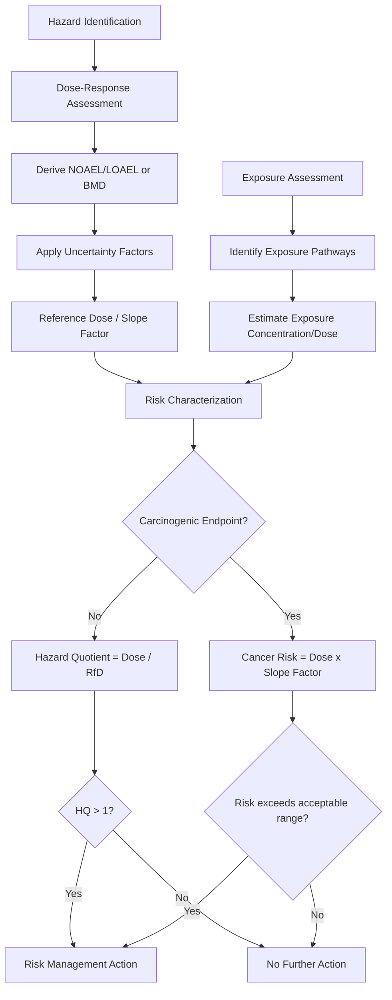

## Environmental Toxicology Basics

### Definition and Scope

Environmental toxicology is the study of the adverse effects of chemical, physical, and biological agents on living organisms, with particular emphasis on populations and ecosystems exposed via environmental media (air, water, soil, food). It bridges classical toxicology, ecology, and risk assessment to quantify the relationship between exposure and harmful biological effects, forming the scientific basis for chemical regulation and environmental health protection.

### Core Toxicological Concepts

**The Dose-Response Relationship**

The foundational principle of toxicology, often summarized by the Paracelsus maxim that the dose makes the poison, is that toxic effects generally increase in magnitude or probability with increasing exposure. This relationship is typically visualized as a **dose-response curve**, plotting response (mortality, effect incidence, or effect magnitude) against a log-transformed dose axis, commonly yielding a sigmoidal curve.

**Key Dose-Response Metrics**

- **$LD_{50}$ (Lethal Dose, 50%)**: The dose that causes mortality in 50% of a test population, a standard acute toxicity benchmark for a specific exposure route (oral, dermal) and species.
- **$LC_{50}$ (Lethal Concentration, 50%)**: The analogous metric for exposure via air or water concentration rather than administered dose, standard in aquatic and inhalation toxicology.
- **$EC_{50}$ (Effective Concentration, 50%)**: The concentration producing a specified non-lethal effect (e.g., immobilization, reproductive impairment) in 50% of test organisms.
- **NOAEL (No Observed Adverse Effect Level)**: The highest tested dose/concentration at which no statistically significant adverse effect is observed relative to controls.
- **LOAEL (Lowest Observed Adverse Effect Level)**: The lowest tested dose/concentration at which a statistically significant adverse effect is observed.

**Threshold vs. Non-Threshold Models**

- **Threshold model**: Assumes a dose below which no adverse effect occurs, applicable to most non-carcinogenic endpoints; regulatory reference doses are typically derived using this model.
- **Non-threshold (linear) model**: Assumes any dose above zero carries some finite probability of effect, conventionally applied to genotoxic carcinogens under the linear no-threshold (LNT) assumption for regulatory risk assessment purposes. The LNT model for low-dose carcinogen risk remains a subject of ongoing scientific debate regarding its accuracy at very low exposure levels, though it continues to be used as a conservative default in most regulatory frameworks. [Unverified: scientific consensus on low-dose extrapolation validity is not fully settled]

### Deriving Regulatory Toxicity Values

**Reference Dose (RfD) / Reference Concentration (RfC)**

An estimate of daily human exposure unlikely to cause appreciable adverse effects over a lifetime, derived from NOAEL/LOAEL (or benchmark dose) data divided by uncertainty factors:

$$RfD = \frac{NOAEL}{UF_1 \times UF_2 \times \ldots \times UF_n}$$

Common uncertainty factors (typically 1, 3, or 10 each) account for: interspecies extrapolation (animal to human), intraspecies variability (sensitive human subpopulations), subchronic-to-chronic extrapolation, LOAEL-to-NOAEL extrapolation, and database incompleteness. Combined uncertainty factors commonly range from 10 to 3000+ depending on data quality and the number of extrapolations required. [Inference: exact factor values and combinations are case-specific and governed by agency-specific guidance]

**Benchmark Dose (BMD) Approach**

An increasingly preferred alternative to the NOAEL/LOAEL approach, using statistical modeling of the full dose-response dataset to estimate a dose associated with a predefined response level (e.g., $BMD_{10}$, the dose producing a 10% response rate), generally considered more statistically robust because it uses the entire dataset rather than relying on the specific tested doses. [Inference: reflects current regulatory-science consensus regarding methodological preference]

### Toxicokinetics (ADME)

The processes governing the concentration and persistence of a substance within an organism over time:

- **Absorption**: Uptake into the organism via ingestion, inhalation, or dermal contact.
- **Distribution**: Movement throughout the body via circulation, governed by tissue partitioning (e.g., lipophilic compounds distributing to adipose tissue).
- **Metabolism (Biotransformation)**: Enzymatic transformation, typically classified as:
  - **Phase I reactions**: Oxidation, reduction, hydrolysis (often via cytochrome P450 enzymes), generally increasing polarity.
  - **Phase II reactions**: Conjugation (glucuronidation, sulfation, glutathione conjugation) further increasing water solubility to facilitate excretion.
- **Excretion**: Elimination via urine, feces, exhalation, or other routes.

Some compounds undergo **bioactivation**, where metabolism converts a relatively inert parent compound into a more toxic or reactive metabolite (e.g., certain polycyclic aromatic hydrocarbons activated to reactive epoxides), an important consideration distinguishing parent compound toxicity from metabolite-mediated toxicity.

### Toxicodynamics and Mechanisms of Toxicity

**Modes of Toxic Action**

- **Narcosis (baseline toxicity)**: Non-specific membrane disruption, the default mode of action for many organic compounds lacking a more specific mechanism.
- **Receptor-mediated toxicity**: Binding to specific biological receptors (e.g., endocrine disruptors binding estrogen or androgen receptors).
- **Enzyme inhibition**: Interference with essential enzymatic function (e.g., organophosphate pesticides inhibiting acetylcholinesterase).
- **Genotoxicity**: Direct damage to DNA structure, potentially leading to mutation and carcinogenesis.
- **Oxidative stress**: Generation of reactive oxygen species overwhelming cellular antioxidant defenses, damaging lipids, proteins, and DNA.

**Endocrine Disruption**

A significant subcategory of toxic mechanism in which a chemical interferes with hormone synthesis, transport, receptor binding, or metabolism. Endocrine-disrupting chemicals (EDCs) are notable for potentially exhibiting non-monotonic dose-response relationships (where effect does not increase uniformly with dose), a pattern that challenges traditional toxicological assumptions and has been observed for some EDCs in specific experimental contexts, though the generalizability and regulatory implications of non-monotonicity remain actively debated in the toxicological literature. [Unverified: scientific and regulatory consensus on non-monotonic dose-response is not fully settled]

### Ecotoxicology: Population and Ecosystem-Level Effects

**Levels of Biological Organization in Ecotoxicological Assessment**

Ecotoxicology extends beyond individual-organism effects to examine impacts at the population, community, and ecosystem level:

- **Individual level**: Mortality, growth, reproduction, behavior (standard laboratory endpoints).
- **Population level**: Changes in abundance, age structure, or growth rate resulting from individual-level effects aggregated across a population.
- **Community/ecosystem level**: Altered species composition, trophic structure, and ecosystem function (nutrient cycling, productivity).

**Standard Ecotoxicological Test Organisms**

Regulatory ecotoxicology relies on standardized test species representing different trophic levels and exposure routes, such as *Daphnia magna* (aquatic invertebrate), fathead minnow or rainbow trout (fish), algae (*Selenastrum*/*Raphidocelis*), and earthworms (*Eisenia fetida*, soil toxicity).

**Species Sensitivity Distribution (SSD)**

A statistical approach modeling the variation in sensitivity to a given toxicant across multiple species, used to derive a **Hazardous Concentration for 5% of species (HC5)**—the concentration protective of 95% of tested species—commonly used to derive water quality criteria.

### Exposure Assessment and Risk Characterization

**Exposure Pathway Components**

A complete exposure pathway requires: a contaminant source, a release mechanism, a transport/exposure medium, an exposure point, and a receptor (human or ecological) with a viable exposure route (ingestion, inhalation, dermal contact).

**Human Health Risk Characterization**

For non-carcinogenic effects, risk is expressed as a **Hazard Quotient (HQ)**:

$$HQ = \frac{\text{Exposure Concentration/Dose}}{RfD \text{ or } RfC}$$

$HQ < 1$ suggests adverse effects are unlikely; $HQ > 1$ indicates potential concern warranting further evaluation. For multiple co-occurring chemicals, a **Hazard Index (HI)** sums individual HQs, conventionally assuming dose additivity for chemicals affecting the same target organ/system. [Inference: additivity assumption is a standard simplification; actual chemical mixture interactions can be synergistic, antagonistic, or additive depending on the specific compounds]

For carcinogenic effects, risk is estimated as:

$$\text{Excess Lifetime Cancer Risk} = \text{Exposure Dose} \times \text{Slope Factor (SF)}$$

Regulatory agencies commonly target cumulative excess cancer risk within a range of $10^{-6}$ to $10^{-4}$ as acceptable for risk management purposes, though specific target levels vary by jurisdiction and program. [Unverified: exact acceptable risk range and applicable framework varies by specific regulatory program and jurisdiction]

### Dose-Response and Risk Assessment Framework Diagram

### Worked Example

**Problem**: A chemical has an oral NOAEL of 10 mg/kg-day from an animal study. Applying an interspecies uncertainty factor (10), an intraspecies uncertainty factor (10), and a subchronic-to-chronic factor (3), calculate the RfD. Then, given an estimated human exposure dose of 0.02 mg/kg-day, calculate the Hazard Quotient.

**Solution**:

$$RfD = \frac{10}{10 \times 10 \times 3} = \frac{10}{300} \approx 0.033 \, \text{mg/kg-day}$$

$$HQ = \frac{0.02}{0.033} \approx 0.61$$

Since $HQ < 1$, this suggests the estimated exposure is unlikely to result in adverse non-cancer health effects, based on the applied uncertainty factors and the available toxicological dataset. [Inference: conclusion is contingent on the quality/relevance of the underlying animal study and the appropriateness of the selected uncertainty factors for this specific chemical and exposure scenario]

### Applied Contexts

- **Chemical regulation**: RfDs, slope factors, and RfCs derived through this framework directly inform regulatory limits under frameworks such as TSCA, REACH, and pesticide registration review.
- **Site-specific risk assessment**: Contaminated site cleanup levels are frequently back-calculated from acceptable risk levels using site-specific exposure assumptions.
- **Water quality criteria derivation**: SSD-based HC5 values underpin aquatic life criteria for regulated contaminants in surface water.
- **Chemical mixture assessment**: Hazard Index approaches address the reality that environmental exposures typically involve multiple co-occurring contaminants rather than single chemicals in isolation.
- **Emerging contaminant evaluation**: Toxicological frameworks are actively being adapted to assess novel classes of concern (e.g., PFAS, microplastics, nanomaterials) where traditional testing paradigms may require modification. [Inference: reflects an active and evolving area of toxicological science]

### Key Points

- Dose-response relationships, characterized by metrics such as $LD_{50}$, NOAEL, and LOAEL, form the quantitative foundation of toxicological assessment.
- Toxicokinetics (ADME) and toxicodynamics together determine both the internal exposure concentration an organism experiences and the biological mechanism of resulting harm.
- Regulatory toxicity values (RfD, RfC, slope factors) are derived by applying structured uncertainty factors to animal or epidemiological dose-response data.
- Ecotoxicology extends risk assessment beyond individual organisms to populations, communities, and ecosystems, using tools such as species sensitivity distributions.
- Risk characterization combines dose-response and exposure assessment into standardized metrics (Hazard Quotient, cancer risk) used directly in regulatory decision-making.

**Related Topics**

- Endocrine disruption mechanisms and regulatory testing frameworks
- Ecological risk assessment methodology
- Bioaccumulation, biomagnification, and food web toxicology
- Chemical mixture toxicity and cumulative risk assessment
- Carcinogen classification systems (IARC, EPA)
- PFAS and emerging contaminant toxicology
- Species sensitivity distributions and water quality criteria derivation
- Human health risk assessment site-specific application
- Regulatory toxicology frameworks (TSCA, REACH, FIFRA)
- Nanotoxicology and novel material risk assessment