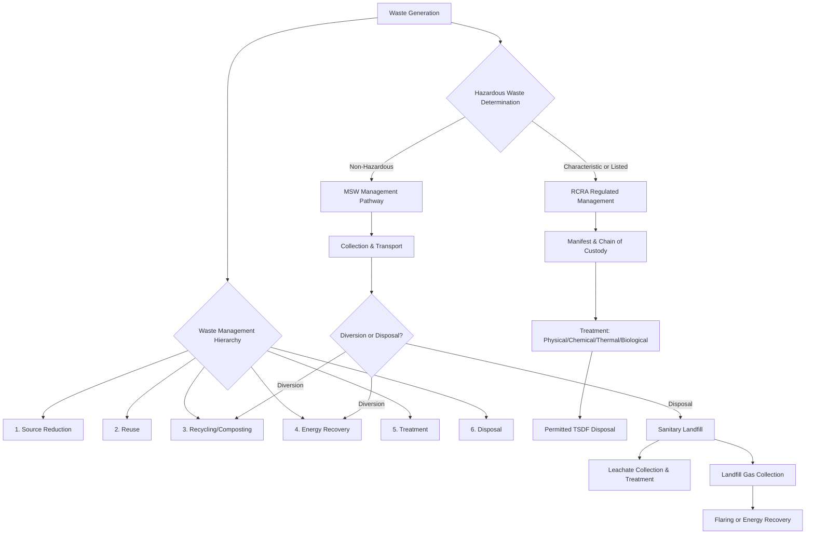

## Solid and Hazardous Waste Management

### Definition and Scope

Solid and hazardous waste management encompasses the systematic collection, transport, processing, treatment, and disposal of waste materials, with particular regulatory and technical focus on wastes that pose substantial risk to human health or the environment. This field integrates environmental engineering, chemistry, and regulatory policy to minimize waste generation, ensure safe handling, and manage legacy contamination from historical waste practices.

### Waste Classification

**Municipal Solid Waste (MSW)**

Non-hazardous waste generated by households, commercial establishments, and institutions, typically composed of organics (food waste, yard waste), paper/cardboard, plastics, metals, glass, and other materials. Composition varies substantially by region, income level, and season. [Inference: general pattern well-documented; exact percentages are jurisdiction-specific]

**Hazardous Waste**

Waste exhibiting one or more characteristics that pose substantial risk, formally defined under regulatory frameworks such as the U.S. Resource Conservation and Recovery Act (RCRA). RCRA defines hazardous waste through two primary listing mechanisms:

- **Characteristic wastes**: Waste exhibiting one of four defined characteristics:
  - **Ignitability**: Flash point below a regulatory threshold (typically 60°C/140°F), or capable of causing fire under standard conditions.
  - **Corrosivity**: pH ≤ 2 or ≥ 12.5, or capable of corroding steel at a specified rate.
  - **Reactivity**: Unstable, reacts violently with water, generates toxic gases, or is capable of detonation.
  - **Toxicity**: Determined via the Toxicity Characteristic Leaching Procedure (TCLP), which simulates leaching under landfill conditions and compares leachate concentrations of specified contaminants to regulatory thresholds.
- **Listed wastes**: Specific wastes or waste streams identified by regulatory agencies based on known hazard characteristics, generally organized into source-specific (F-list, K-list) and discarded commercial chemical product (P-list acutely hazardous, U-list) categories under the U.S. system.

**Special Waste Categories**

- **Electronic waste (e-waste)**: Discarded electronics containing valuable recoverable metals alongside hazardous constituents (lead, mercury, brominated flame retardants), presenting both a recycling opportunity and a contamination risk if improperly processed.
- **Medical/biohazardous waste**: Waste generated by healthcare activities, requiring specialized handling due to infectious or pathological risk (sharps, pathological waste, contaminated materials).
- **Radioactive waste**: Governed by separate regulatory frameworks due to ionizing radiation hazard, classified by activity level (low-level, intermediate-level, high-level/spent fuel).
- **Construction and demolition (C&D) debris**: Waste from building activities, often managed under separate regulatory tracks with significant recycling potential (concrete, metal, wood).

### Waste Management Hierarchy

The internationally recognized waste management hierarchy prioritizes strategies from most to least environmentally preferable:

1. **Source reduction/prevention**: Minimizing waste generation at the point of origin (product design, process efficiency).
2. **Reuse**: Extending product life through direct reuse without reprocessing.
3. **Recycling/composting**: Reprocessing materials into new products or organic waste into soil amendment.
4. **Energy recovery**: Extracting energy value from waste through combustion (waste-to-energy) or anaerobic digestion (biogas).
5. **Treatment**: Chemical, physical, or biological processes to reduce volume, toxicity, or mobility prior to disposal.
6. **Disposal**: Landfilling or other final placement, representing the least preferred option in the hierarchy.

### Landfill Design and Engineering

**Modern Sanitary Landfill Components**

- **Composite liner system**: Typically combines a geomembrane (high-density polyethylene, HDPE) with a compacted clay layer, designed to prevent leachate migration into underlying soil and groundwater.
- **Leachate collection system**: A network of perforated pipes above the liner directing leachate (liquid generated from waste decomposition and infiltrating precipitation) to a collection sump for treatment or disposal.
- **Landfill gas collection system**: Wells and piping network to capture gas generated by anaerobic decomposition (primarily methane and carbon dioxide), either flared or utilized for energy recovery.
- **Final cover system**: A multi-layer cap (typically including a low-permeability layer and vegetated soil layer) installed upon landfill closure to minimize infiltration and control gas emissions.

**Leachate Characteristics and Treatment**

Leachate composition evolves through landfill aging, generally following a progression from high-strength, low-pH conditions dominated by volatile fatty acids in the early (acid) phase to lower-strength, more stable conditions in the later (methanogenic) phase, though exact timing and composition trajectory vary substantially with waste composition and moisture conditions. [Inference: general pattern documented in landfill engineering literature; site-specific trajectories vary]

**Landfill Gas (LFG) Generation**

Anaerobic decomposition of organic waste produces landfill gas, approximately 45-60% methane and 40-55% carbon dioxide by volume, with trace amounts of other compounds including volatile organic compounds and hydrogen sulfide. [Inference: typical composition ranges cited in landfill engineering references; site-specific values vary with waste composition and landfill age] Given methane's significant global warming potential relative to $\text{CO}_2$, landfill gas capture (for flaring or energy recovery) is an important component of both regulatory compliance and greenhouse gas mitigation strategy.

### Hazardous Waste Treatment Technologies

**Physical/Chemical Treatment**

- **Neutralization**: Acid-base reaction to adjust pH of corrosive wastes to a manageable range prior to further treatment or disposal.
- **Precipitation**: Chemical addition to convert dissolved metals into insoluble solid forms (e.g., hydroxide precipitation) for subsequent solid-liquid separation.
- **Stabilization/Solidification (S/S)**: Chemical treatment (commonly with cement, lime, or proprietary reagents) to physically encapsulate waste and/or chemically reduce contaminant leachability, widely used for treating metal-bearing hazardous waste prior to landfill disposal.
- **Activated carbon adsorption**: Removal of organic contaminants from liquid or gas waste streams via sorption onto high-surface-area carbon media.

**Thermal Treatment**

- **Incineration**: High-temperature combustion (typically 850-1200°C depending on waste type) achieving significant volume reduction and destruction of organic contaminants; requires air pollution control equipment (scrubbers, baghouses, selective catalytic reduction) to manage combustion byproducts including particulate matter, acid gases, and in some cases dioxins/furans from incomplete combustion of chlorinated wastes.
- **Waste-to-Energy (WtE)**: Municipal solid waste combustion coupled with energy recovery (steam/electricity generation), reducing waste volume substantially (typically cited as 85-90% by volume) while recovering energy value. [Inference: volume reduction figure is a commonly cited industry approximation, varies with waste composition]
- **Pyrolysis/Gasification**: Thermal decomposition in low-oxygen or oxygen-free environments, producing syngas or pyrolysis oil as an alternative to direct combustion, an area of active technology development for both waste-to-energy and plastic waste conversion applications. [Inference: technology maturity and commercial-scale performance vary by specific process and feedstock]

**Biological Treatment**

- **Composting**: Aerobic microbial decomposition of organic waste into stabilized humus-like material, suitable for yard waste, food waste, and some biosolids.
- **Anaerobic digestion**: Microbial decomposition in the absence of oxygen, producing biogas (methane-rich) suitable for energy recovery, along with a digestate byproduct usable as soil amendment.

### Regulatory Framework: Cradle-to-Grave Management

**RCRA Hazardous Waste Tracking**

The U.S. regulatory model (and analogous international frameworks) implements "cradle-to-grave" tracking of hazardous waste from generation through final disposal, requiring:

- **Generator classification**: Categorized by waste generation quantity (large quantity generator, small quantity generator, conditionally exempt generator), with corresponding regulatory obligations.
- **Manifest system**: A tracking document accompanying hazardous waste shipments from generator through transporter to the treatment/storage/disposal facility (TSDF), creating an auditable chain of custody.
- **Permitting requirements**: Treatment, storage, and disposal facilities require specific regulatory permits demonstrating compliance with design, operating, and closure standards.

**Legacy Contamination Frameworks**

Historical improper waste disposal has driven the development of retroactive liability and cleanup frameworks, such as the U.S. Comprehensive Environmental Response, Compensation, and Liability Act (CERCLA/Superfund), which establishes joint and several liability for potentially responsible parties and funds cleanup of abandoned or orphaned hazardous waste sites where no viable responsible party can be identified.

### Waste Management Hierarchy and Treatment Pathway Diagram

### Landfill Cross-Section Diagram (svg_diagram)

<svg xmlns="http://www.w3.org/2000/svg" viewBox="0 0 800 380">
<text x="400" y="25" font-size="16" font-weight="bold" text-anchor="middle" fill="#1a1a1a">Modern Sanitary Landfill Cross-Section (svg_diagram)</text>

<path d="M 60 100 Q 400 60 740 100 L 740 120 Q 400 80 60 120 Z" fill="#9ae6b4" />
<text x="400" y="70" font-size="11" text-anchor="middle" fill="#22543d">Vegetated Final Cover</text>

<path d="M 60 120 Q 400 80 740 120 L 740 135 Q 400 95 60 135 Z" fill="#a0aec0" />
<text x="400" y="150" font-size="10" text-anchor="middle" fill="#1a1a1a">Low-Permeability Cap</text>

<path d="M 60 135 Q 400 95 740 135 L 740 260 L 60 260 Z" fill="#d6bcfa" opacity="0.5" />
<text x="400" y="200" font-size="12" text-anchor="middle" fill="#44337a">Waste Mass</text>

<line x1="200" y1="140" x2="200" y2="255" stroke="#805ad5" stroke-width="4" />
<line x1="400" y1="120" x2="400" y2="255" stroke="#805ad5" stroke-width="4" />
<line x1="600" y1="140" x2="600" y2="255" stroke="#805ad5" stroke-width="4" />
<text x="400" y="275" font-size="9" text-anchor="middle" fill="#553c9a">LFG Extraction Wells</text>

<rect x="60" y="260" width="680" height="15" fill="#68d391" />
<text x="400" y="290" font-size="10" text-anchor="middle" fill="#22543d">Leachate Collection Layer (drainage gravel + perforated pipe)</text>

<rect x="60" y="295" width="680" height="10" fill="#2d3748" />
<text x="400" y="318" font-size="9" text-anchor="middle" fill="#1a1a1a">HDPE Geomembrane Liner</text>
<rect x="60" y="307" width="680" height="15" fill="#c53030" opacity="0.5" />
<text x="400" y="335" font-size="9" text-anchor="middle" fill="#742a2a">Compacted Clay Liner</text>

<rect x="60" y="322" width="680" height="30" fill="#c4b998" />
<text x="400" y="345" font-size="9" text-anchor="middle" fill="#4a3f2a">Native Subgrade Soil</text>
</svg>

### Worked Example

**Problem**: A landfill receives 500,000 tonnes of MSW annually. If the waste has an average density of 800 kg/m³ after compaction, estimate the annual airspace consumption (volume) required.

**Solution**:

$$V = \frac{m}{\rho} = \frac{500{,}000{,}000 \, \text{kg}}{800 \, \text{kg/m}^3} = 625{,}000 \, \text{m}^3 \, \text{per year}$$

This calculation provides a first-order estimate of annual airspace consumption; actual landfill capacity planning requires additional factors including daily/intermediate cover soil volume (commonly adding 10-25% to waste volume), settlement over time, and variation in incoming waste density. [Inference: cover soil volume percentage is a commonly cited industry planning range, varies by facility operating practice]

### Applied Contexts

- **Extended Producer Responsibility (EPR)**: An increasingly adopted policy framework shifting waste management responsibility (and cost) to product manufacturers, incentivizing design-for-recyclability.
- **Circular economy initiatives**: Broader policy and industrial design movement aiming to minimize virgin resource extraction through material recovery, reuse, and closed-loop manufacturing.
- **Superfund site remediation**: Legacy hazardous waste sites undergo remedial investigation, feasibility study, and remedy implementation under CERCLA's structured process.
- **Landfill methane-to-energy projects**: Captured landfill gas increasingly used for electricity generation or pipeline-quality renewable natural gas production, providing both waste management and climate mitigation co-benefits.
- **Plastic waste management**: A rapidly evolving area combining mechanical recycling, emerging chemical recycling technologies, and policy interventions (bans, EPR programs) addressing the persistent challenge of plastic waste in the environment. [Inference: reflects an active and rapidly evolving policy and technology landscape]

### Key Points

- Waste is classified along a spectrum from non-hazardous municipal solid waste to regulated hazardous waste, the latter defined through characteristic (ignitability, corrosivity, reactivity, toxicity) or listed criteria.
- The waste management hierarchy prioritizes source reduction and reuse over recycling, energy recovery, treatment, and disposal, in that order of environmental preference.
- Modern sanitary landfills incorporate engineered liner, leachate collection, and gas collection systems to control environmental releases, representing a significant advancement over historical open dumping practices.
- Hazardous waste treatment spans physical/chemical, thermal, and biological technologies, selected based on waste characteristics and treatment/disposal objectives.
- Regulatory frameworks (RCRA for active management, CERCLA for legacy contamination) establish cradle-to-grave accountability and retroactive cleanup liability, respectively.

**Related Topics**

- Circular economy and extended producer responsibility policy
- Landfill gas-to-energy project development
- Hazardous waste site remediation under CERCLA/Superfund
- E-waste recycling and critical material recovery
- Plastic waste management and chemical recycling technologies
- Composting and anaerobic digestion system design
- Waste characterization and material flow analysis
- International hazardous waste transport regulation (Basel Convention)
- Life cycle assessment of waste management systems
- Environmental justice in waste facility siting